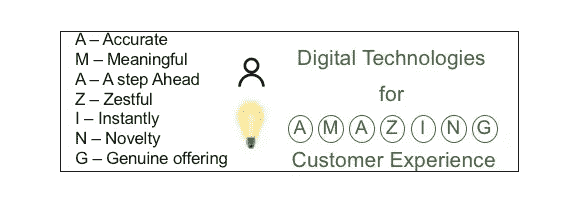
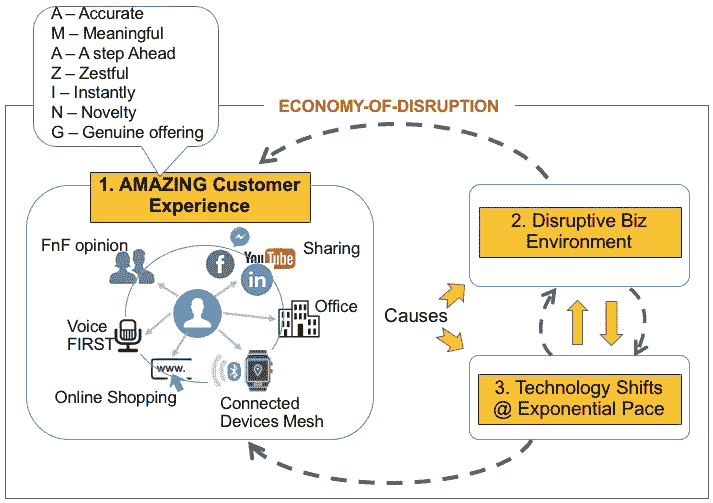
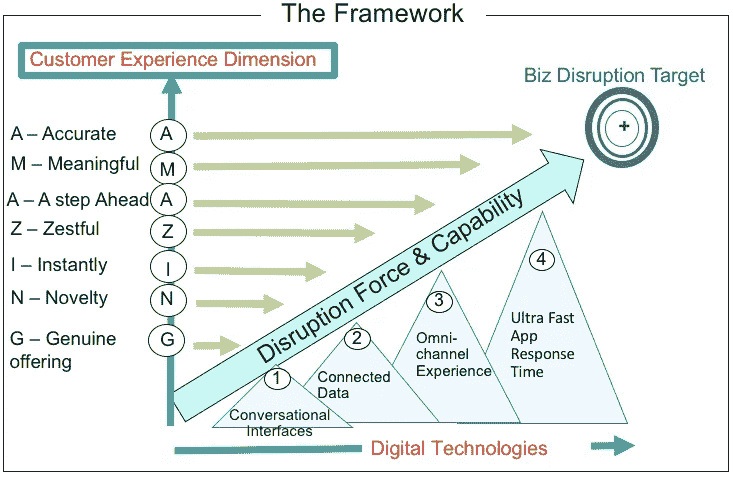
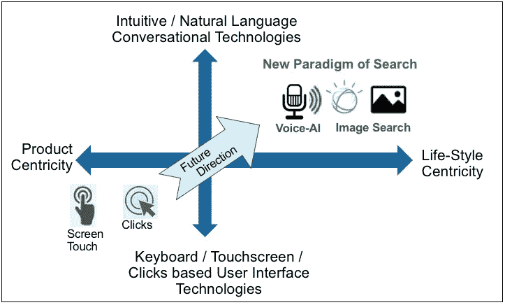
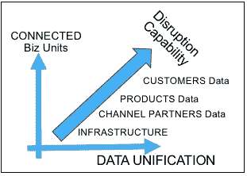
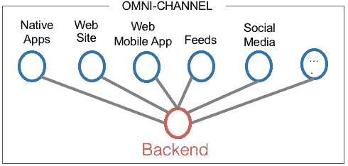

# 使用数字技术提供惊人客户体验的四个重点领域

> 原文：<https://medium.com/swlh/how-to-deliver-amazing-customer-experience-using-digital-technologies-21a26f66c283>

**业务背景:**

如今，企业在颠覆性的经济环境中运营，客户获得了惊人的体验。商业环境是破坏性的，竞争也来自行业之外。技术正以指数级的速度变化。所有这些都使得生态系统对任何企业来说都非常具有挑战性，如下图所示。

# 我们所说的“惊人”是什么意思:

“惊人的”是七(7) **客户体验维度，一个组织可以使用现代数字技术来提供这些维度，从而在市场中成为颠覆性的。**

## 1.“AMAZING”中的“A”代表“准确”:

无论通过何种渠道，客户都能获得准确的信息。

## 2.“AMAZING”中的“M”代表“有意义”:

个性化响应:与用户概况、需求、历史和背景相关。

## 3.“AMAZING”中的“A”代表“领先一步”:

使企业能够提出兼顾客户未来需求的建议。

## 4.“AMAZING”中的“Z”代表“Zestful”:

包括社交媒体在内的所有渠道的不间断服务。这是关于 24x7 访问和设备无关的访问。

如今，像“ [IBM 语音网关](https://www.youtube.com/watch?v=yz9bq3MnuxA)”这样的技术已经可以使用，这样客户就不用在呼叫中心排队了。他们的问题会在那里得到人工智能机器人的回答。

## 5.‘AMAZING’中的‘I’代表‘即刻’:

它是关于对客户查询、产品目录搜索等的即时响应。例如，Android 即时应用的技术允许用户在不下载移动应用的情况下访问移动应用。这对于知道潜在客户拒绝在他们的手机上下载任何额外应用的营销人员来说很重要。但是这些潜在客户愿意看看你的报价。

[Android Instant Apps 支持本地 Android 应用在启动 URL 时运行，无需安装](https://www.youtube.com/watch?v=ftFWOdwnD9Q&t=328s)。

## 6.“AMAZING”中的“N”代表“新奇”:

这是竞争对手的差异化产品。

## 7.“AMAZING”中的“G”代表“正版”:

这是关于向客户提供真正的产品。

# 四个重点领域:

**我们建议在以下四(4)个领域采用现代数字和新兴技术，以提供令人惊叹的客户体验，如下图所示:**

**第一个重点领域是“开发对话界面”:**

由于亚马逊、谷歌、IBM 等公司在人工智能方面的进步，消费者也将使用语音搜索互联网。人工智能将处理人类的声音。它会提取声音中的含义。基于触摸屏的用户界面将开始成为搜索应用中的次要部分。当前的用户界面/UX 模式以及由此产生的消费者习惯将会发生根本性的转变。需要养成新的习惯，专注于利用声音和其他直觉机制。在这种情况下，我喜欢优步的克里斯·梅西纳创造的术语“会话式商务”。他将其定义为:

…利用聊天、消息传递或其他自然语言界面(即语音)与人员、品牌或服务以及机器人进行交互，而这些在双向、异步消息传递环境中还没有真正的地位。最终结果是，在年底之前，你和我将通过 Facebook Messenger、WhatsApp、Telegram、Slack 和其他渠道与品牌和公司进行交流，并会发现这很正常。

*在他的 CBM 作品* [*中了解克里斯·梅西纳的 bot 开发的第一手资料，真是一个 Botastrophe！*](https://chatbotsmagazine.com/messinabot-office-hours-c578112bf7f)

关键的一点是，谁率先为消费者形成新习惯，谁就能扰乱市场。

虚拟现实(VR)在移动领域的使用将会增长。想要成为颠覆性的组织将使用 VR 来筛选一切，以确保与客户的沉浸式互动；提供 3D 观看体验。例如顾客，使用 VR，可以想象零售商的在线目录中的特定桌子在她家的用餐区将会是什么样子。它将推动“现在看，现在买”的趋势。

像 Angular，React 这样的前端技术正在被采用

数字后端是使用 Node.js 这样的非阻塞平台构建的

像卡夫卡这样的高性能信息系统。

GraphQL 是 REST 的替代产品，适用于在 Web 门户或移动应用程序中要求非常高的响应时间的用例。

**第二个重点领域是“关联数据”:**

它是关于连接有关客户档案、交易、社交媒体互动、关系的数据，以便有效的客户 360 度视图可用于实时使用案例，以获得更好的客户关怀或交叉销售/追加销售咨询功能。

早期的组织使用 RDBMS 数据库。但是现在，像 MongoDB、Cassandra、Neo4J 这样的 NoSQL 数据库正被用于跨企业及其合作伙伴生态系统的数据统一。Apache NiFi 正在成为构建跨多个数据中心的灵活数据流的流行选项。

**第三个重点领域是“提供全渠道体验”:**

大多数组织的产品都是为实体或分支机构设计的，而不是为数字世界设计的。

我建议银行采用 [**埃隆·马斯克**推广的**第一原则**](https://www.youtube.com/watch?v=NV3sBlRgzTI) 以创新的方式重新设计他们与客户打交道的方式。

Angular，React 用于前端，WAS Liberty 或 Node.js 用于后端平台。

像 Drupal 这样的无头内容管理系统就是为此目的而使用的。

**第四个重点领域应该是“提供超快的应用程序响应时间”:**

在响应客户方面提供超低延迟，尤其是在门户网站和移动应用程序上的实时 web 会话中。例如，渐进式 Web 应用程序(PWA)的技术为移动 Web 应用程序提供了即使在不稳定的网络条件下也能良好运行的能力。

微服务拱门风格沿着设计模式像 **CQRS** 和**事件源用于此目的。**

REDIS 支持高性能缓存

弹性搜索加快查询速度

*   **文件结尾***

## 这个故事发表在 [The Startup](https://medium.com/swlh) 上，这是 Medium 最大的企业家出版物，拥有 290，182+人。

## 在此订阅接收[我们的头条新闻](http://growthsupply.com/the-startup-newsletter/)。

