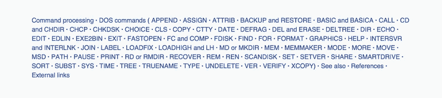
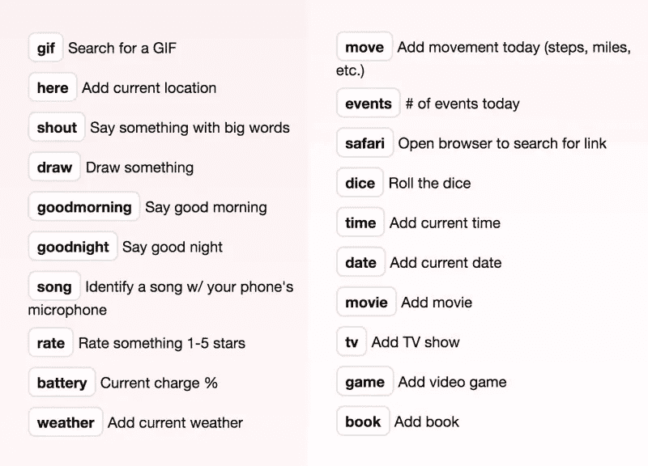
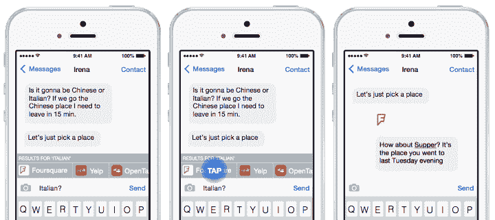
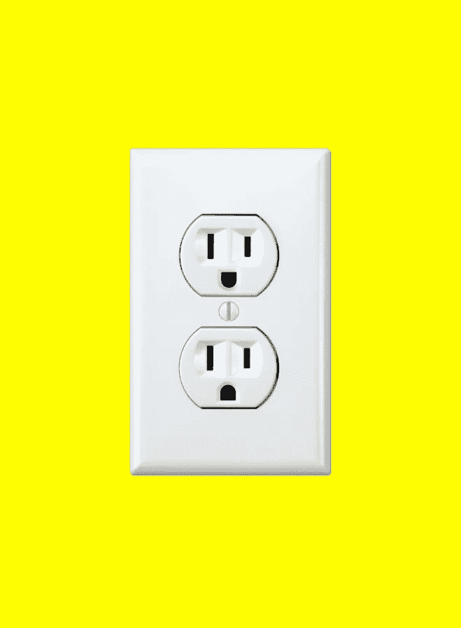

# 更智能的未来

> 原文：<https://medium.com/swlh/how-to-design-a-cui-59f1fb3f35fc>

对象已经从静态发展到动态，随着人类特征的采用，如自主性和主动性，变得“智能”。在这种背景下，形式不再仅仅是一个物体的物理属性，或者一种传统的交互体验，它已经扩展到采用人与机器之间的对话。

就目前而言，对于如何设计智能牙刷、虚拟现实体验或无人驾驶汽车，没有模式语言。当对话成为一种界面时，设计的一致性就变成了个性的一致性。

> 当对话成为一种界面时，设计的一致性就变成了个性的一致性。

研究表明，许多人在努力理解他们的智能物体时，倾向于将它们比作宠物或孩子。总的来说，人们渴望与他们的技术建立关系，他们通过为技术行为创造一个心智模型来实现这一点。

虽然我们的技术承诺连接(脸书的使命是“连接世界”)，但它也可以作为一个断开。我们将社交网络视为快乐的来源，但最近的数据显示，我们在这些平台上的大多数行为——被动消费他人的信息——被认为几乎毫无意义，并被证明会降低我们的情绪，而交流方面的负面影响实际上更少。

我们都见过情侣在约会时忽略对方，完全沉浸在他们的智能手机中，而世界在他们周围嗡嗡作响。

在这个技术飞速发展的时代，我们现在需要的是一套原则，以确保这些强大的、无所不包的物体保留其核心的人性元素。

## 你在读《人性化设计》

[*人性化设计*](http://designforhumanity.danieleckler.com) *是一篇探索拟人化设计的过去、现在和未来的互动散文。您目前正在阅读第 4 部分，共 7 部分。*

## 直观设计的原则

这 10 条原则绝非详尽无遗，甚至没有明确的定义。这是一个新的领域，新的想法刚刚开始出现。随着我们进入这个未知的未来，我们建议从这些原则开始，我们将在前进的道路上共同完善它们。

直觉设计代表但不模仿人类的形式。
随着机器人技术和人工智能开始采用历史上只有人类才拥有的特征，建立界限很重要。当采用肢体语言、语调或情绪反应时，夸大这些特征是很重要的，因为严格的模仿通常会导致令人不安的副作用，比如[恐怖谷](https://en.wikipedia.org/wiki/Uncanny_valley)。

直觉设计是发自内心的。
有如此多的材料可供我们使用，有无数种方法来排列它们，我们应该利用形状、纹理、气味、声音和灯光来创造尽可能有机的体验。

**直觉设计具有一贯的个性。** 当物体通过特定的行为表现出清晰的个性类型时，它让人们产生清晰的期望，并轻松地与智能物体产生关联。

直观的设计是友好的。透明、平易近人的个性有助于人们建立信任，并暗示聪明的对象会为他们的最佳利益而行动。

**直观的设计使其用例清晰明了。** 初次互动期间的清晰沟通有助于建立对智能物件使用方式的预期。利用人们的直觉鼓励特定的行为。

**直觉设计明确指出了它的局限性。**
在整个用户交互过程中，确定不引人注目的方式来限制选项。坦率地说出一个对象不能做什么。最重要的是，主动承担错误，以一种有创意的、有魅力的方式接受指责。

**直觉设计发展关系。** 分析用户行为以了解个人偏好，并开发一个可以学习和响应的智能对象，为每个用户创造个性化体验。

**直观的设计是顺从的。** 智能对象应该是中立的、有约束的，并且允许用户尽可能地进行控制。它应该养成适合用户偏好的习惯，以尽量减少它的出现。

**直观的设计需要最小的扩充。** 技术最好用，不要看。这对于可穿戴设备来说尤其如此，这些设备的目标是在不引人注意的情况下帮助用户。

直观的设计很有吸引力。一个漂亮的物体是一个有用的物体:它推动它的使用者自信地走向一个解决方案。

## 产品是超级人类

现在我们有了一套原则来帮助我们的产品注入个性，如果我们决定创造一些我们没有亲自体现的特征，会发生什么？

布拉德·皮特(Brad Pitt)的头发、乔治·克鲁尼(George Clooney)的自然魅力、埃隆·马斯克(Elon Musk)的头脑:如今的产品不仅正在成为我们渴望成为的人的集合，它们还正在成为一家公司常驻人员的模仿品。为了设计未来与智能物体的交互，我们需要的不仅仅是交互和视觉设计师。心理学家、社会学家、广告文案等等的才能将被用来完成一个全面的用户体验。

而且，随着数据分析变得更加强大，这个集合团队将扩展到包括产品用户、他们的反馈和他们的个人偏好。

> 为了设计未来与智能物体的交互，我们需要的不仅仅是交互和视觉设计师。

以网飞的第一部戏剧《纸牌屋》为例。当它在 2011 年推出时，它成为该网站图书馆中收视率最高的节目，这对不习惯只在网上播放的电视节目的普通公众来说是一个惊喜。然而，网飞大学的团队预感到这个项目会大获成功。当他们购买该系列(BBC 翻拍版)时，他们收集了订户数据，并意识到原版迷你剧的粉丝可能会观看涉及凯文·史派西和导演大卫·芬奇的电影。其余的，正如他们所说，都是历史了。

将一个才华横溢的多学科团队与用户数据相结合，不仅是创造当今电视节目的一种新颖方式，也将是未来智能物体产品设计的必要组成部分。我们可以期待的一件事是用户体验的快速提升:用户与他们使用的产品交流和互动越多，设计就会变得越定制和顺从。

## 直观的设计成为对话

现在我们已经建立了直觉设计的原则和它的潜在路径，让我们来探索这些原则是如何应用于今天的崔。

**直观设计明确其用例/直观设计明确其局限性**

还记得我们之前讨论的黑客屏幕吗？全黑的屏幕上潦草地写着不可读的代码，已经被 GUI 取代了？这是 DOS(磁盘操作系统)的一个版本，需要非常具体的指令才能操作。用户可以在命令行上键入他们想要的任何内容，只要计算机能够理解他们正在键入的内容。以下是 DOS 命令列表:

命令列表提出了一个具有挑战性的问题:如果你不确切地知道你能和不能交流什么，那就很难完成任何事情，这是我们在开始与 CUI 进行实验时再次遇到的问题。

扩展一下，当我们通过 GUI 在表单中输入个人信息时，有几个检查和平衡来确保用户的输入是正确的。表单中内置了问题和说明来指导用户。例如，如果检测到不正确的地址，表单将提供一个警告。在对话中，这个过程并不干净。用户可以自由地输入或说出他们想说的话，因此，如果用户的体验是轻松愉快的，那么用户的体验必须由精心设计的问题来引导，用户的回答必须尽可能高效地被消化和解释。

Slack 和 Peach 都预见到了这些困难，并开发了一系列书面命令，鼓励用户直接在他们的聊天窗口中使用富媒体。

当对话更加自由时，避免问开放式问题对产品来说很重要。如果用户想买一件商品，缩小他们的欲望。问他们一系列循序渐进的问题:物品、尺寸、颜色等。把几个问题混在一句话里只会混淆视听，让用户错过一个问题。重复所有有效答案以确认请求，然后继续:“红色？完美。你想要多大的？”

如果有错误，简单地解释错误并提供替代方案:“对不起，我们没有那个尺寸的存货。我们有一个 10 或 11。你想要那些尺寸吗？”

**直觉设计服从**

对话较少的版本可能会在正确的时间建议正确的命令。

您已经看到了 CUI + GUI 之间潜在联系的暗示。在这里，计算机理解你的意图(倾听)，但不会强加给你一个对话式的响应，它只是给你一个到适当 GUI 元素的链接。

Image Credit: [Jonathan Libov](http://whoo.ps/2015/02/23/futures-of-text)

**直觉设计发展关系**

总的来说，产品应该总是做两件事:把用户推到下一步，在时机合适的时候突出不太熟悉的功能。用户的第一次接触是解决这两个问题的好方法。产品应该把它的第一次反应作为一个机会，让用户知道它的能力是什么，并建议下一步实现用户目标的潜在步骤。

在用户进行了几次成功的交互并熟悉了产品的局限性之后，对话就可以缓和下来了。随着关系的发展，选项和提示应该根据用户历史显示。例如，用户可能知道某项服务可以安排会议，但不知道它可以为会议订餐:“嗨！你在下午 12 点有一个会议。要不要我点午餐？”

当一个产品增加了一个微妙的层次时，就像前面的例子一样，它更接近于成为一个朋友，而不是一个应用程序。事实上，有一些对话界面固有的特性非常适合友好的交互。

> 你可以在界面内“联系”、“添加”或“邀请”它与你聊天，而不是安装一个应用程序。

传统的应用程序不断地推动我们去执行对公司而不是用户有利的操作:“安装”、“下载”和“立即购买”是流行的按钮命令。由于崔的会话性质，这些直接、有力的命令是不必要的。你可以在界面内“联系”、“添加”或“邀请”它与你聊天，而不是安装应用程序。这导致了一种感觉不太像是与销售人员互动的体验，而更像是与朋友聊天。

由于这些和蔼可亲的品质，崔也非常适合通知。用户可能会厌倦购物应用程序的销售提醒，但在消息应用程序中，由你友好相处的机器人提供的相同优惠，可能会像朋友一样让你参与他们发现的模糊销售。

# 人性化设计

探索拟人化设计的过去、现在和未来的互动文章。**亦作** [**可作为说话的**](http://designforhumanity.danieleckler.com) **。**

.

.

## 1: [人性化设计](/swlh/the-future-of-design-is-emotional-5789ccde17aa#.7sqgnt32y)

## 2: [苹果，原始人类](/user-experience-design-1/the-design-secret-apple-stole-from-volkswagen-66a20d17a609#.usddbpwou)

## 3: [对话式用户界面](/life-learning/the-future-of-cui-isn-t-conversational-fa3d9458c2b5#.aat7yx6ei)

## 4:你来了！

## 5: [情感机器](/swlh/the-future-of-emoji-accced8e7108#.qt0io7nfl)

## 6: [电脑也会哭](/the-mission/siri-will-you-ever-understand-me-e5747ab73b08#.sv5wccxk0)

## 7: [你成为电子人的那一天](/@danieleckler/d7f5abf88be2)

.

.

# 感谢阅读

这是一篇互动+进化的作文。如果您对新内容、对当前内容的修改或其他任何事情有想法，请[联系](mailto:hi@danieleckler.com)！

> 如果你喜欢读这篇文章，请点击页脚的♥按钮，这样更多的人可以欣赏伟大的设计！

嗨，我是丹尼尔。我创办了一些公司，包括 Piccsy (acq。2014)和 EveryGuyed (acq。2011).我目前对新的职业和咨询机会持开放态度。通过[电子邮件](mailto:hi@danieleckler.com)联系。

本文由[肖恩·朗肯](http://www.shaunroncken.com/)合著。