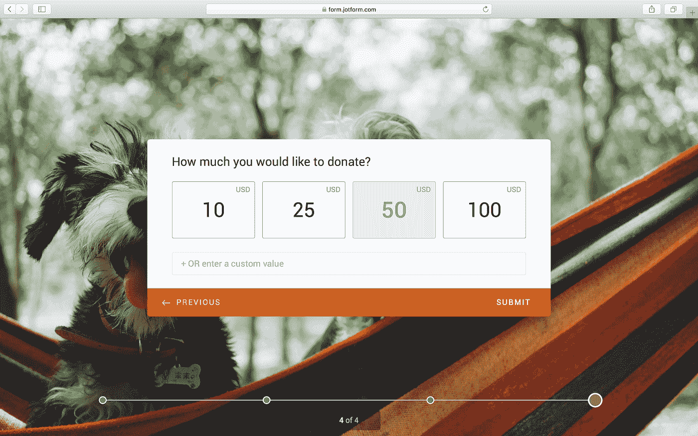

# 如何设计您的客户将实际完成的付款表格

> 原文：<https://medium.com/swlh/how-to-design-a-payment-form-your-customers-will-actually-complete-55a986fe3ada>

Originally published on [**JOTFORM.COM**](http://jotform.com)

> “70%的购物车都被废弃了。其中 28%的购物车因为冗长的结账流程而被废弃。”
> 
> — [来源](https://baymard.com/lists/cart-abandonment-rate)

企业希望人们花钱。

这意味着支付东西应该是整个体验中最容易的部分，但糟糕的支付系统继续导致企业损失数十亿美元。

一个 **成功的支付体验需要一个清晰的路径**让用户可以顺利导航。毕竟，支付形式是商店或餐馆中实体销售终端的数字等价物。因此，它们必须灵活、快速、高效:没有排队、没有障碍、没有错误。

创建一个支付表单曾经是一项令人头疼的乏味任务，尤其是对于初创公司和小型企业。

但是今天的工具使用户能够在几分钟内建立一个强大、漂亮的支付表单集成——没有一行代码。另外，您不必为交易支付额外的费用。

## 等等——什么是付款表格？

这是数字版的收银台。它授权在线支付，验证用户的详细信息，确保资金可用并支付给你。

## 你能利用支付集成做些什么？

选择(几乎)是无穷无尽的。首先，你可以销售产品或服务。你也可以对这些销售额进行复杂的计算，比如加税和运费或者减优惠券。

你可以给你的产品有用的描述，如图像，数量，颜色和尺寸选项。

## 当涉及到付款形式类型时，选项各不相同。

您可以为单个或多个产品创建订单，也可以为固定金额的收款创建订单。您也可以通过订阅服务使这些付款循环进行。

*Here is an example of a subscription form built using* [*JotForm Cards templates*](https://www.jotform.com/cards/)

付款表格也可以用来收集捐款。

*Donation Form — Card Form Layout*

## 如何设计更智能的支付形式？

这里有 5 种支付方式，我们发现对我工作的在线表单制作公司 JotForm 的 420 万用户很有帮助。

# 1.保持简单

许多研究已经得出结论，视觉上复杂的设计通常被认为是没有吸引力的。

从心理上来说，我们倾向于与更空的页面互动。

表格的长度也很重要。例如，JotForm 的[经典表单](https://www.jotform.com/form-templates/?classic)在一个页面上显示所有的问题，外加付款部分。这种设置非常适合我们的一些用户，尤其是对于较短的表单。

*JotForm — Classic Form*

但是，当需要大量的细节时，一页上的大量信息会让人感到不知所措。

这就是我们制作 [JotForm 卡](https://www.jotform.com/cards/)作为传统形式的替代物的原因之一。它采用每页一个问题的布局:除了问题和命令之外，页面上什么也不显示。

一旦用户完成了表单，他们就可以顺利地进行支付。

这两种类型的形式在不同的环境下闪闪发光。无论您选择哪种表单选项，都应该有足够的空白，并且没有不必要的字段。

# 2.提供多种支付方式

你有没有过吃完饭却被告知餐厅只收现金的经历？你不能消化你的食物，你不得不走到最近的自动提款机或向你的朋友贷款。烦人。

我们人类总是在寻找轻松和方便，尤其是在决定是否购买某样东西的时候。

选择——不管我们是否需要它——在潜意识里对我们很重要。人类重视为自己做决定的能力，这就是为什么灵活性是需要优先考虑的事情。

同样的逻辑也适用于在订单上为客户提供多种付款方式。

大多数在线表单生成器软件提供多种集成。在[jot form，我们提供 27 个以上的支付网关集成](https://apps.jotform.com/category/payment_processing)，涵盖多家公司和多种支付方式。

任何想付钱的人都应该有能力这样做。很简单，真的。

# 3.减少延误

支付形式有点像障碍课程。每一个(隐喻的)要跳过的环和要爬过的墙都会减慢使用者的速度，使他们不太可能完成。

有些障碍是可以避免的:比如任意的格式规则或密码要求。其中一些——比如错别字——不容易避免。

有了 JotForm 卡，我们试图减少这些意外的挫折。例如，它将恢复输入错误域名的用户的电子邮件地址**，例如 john@gnail.com 应该是 john@gmail.com**。

当出现一般性错误时——如遗漏字段或输入错误——它会用抖动的微型动画警告用户。

另一个可以避免的延误原因？用户必须破译意义。确保语言清晰明了，问题用有意义的方式表达。

用户越快到达终点线，他们越有可能通过完成支付来越过终点线。

> 更少的延迟=更快的形式。
> 
> 更快的形式=更多的转换。
> 
> 这是双赢。

# 4.少问信息

可选字段是转换的敌人。

Baymard Institute 分析了结账表单，发现过长的[结账过程](https://baymard.com/blog/checkout-flow-average-form-fields)是用户放弃购买的最重要原因之一，平均结账包含 15 个表单字段。

大量 [50%](https://www.jotform.com/blog/jotform-cards/) 的网站会两次询问相同的信息，这保证了注意力持续时间的减少和恼怒。

询问所有内容都以易于理解的形式展示的信息可能会有所帮助。

# 5.优先考虑安全性

我们想在掏出钱包的地方感到安全和有保障。所以，聪明的企业会竭尽全力让他们的顾客从进门的那一刻起就感到舒适。

支付形式也不例外。当用户需要输入信用卡信息等敏感信息时，他们对任何可疑的事情都非常敏感:

> 最近[的一项研究](https://www.pwc.es/es/publicaciones/retail-y-consumo/assets/total-retail-2016.pdf)显示，17%的购物者出于安全考虑没有付费就离开了页面。

清晰、高效、专业的支付形式让用户放心。任何看起来 DIY 的东西都会有相反的效果。

这就是为什么当你从头开始构建一个支付表单时要小心的原因——微小的错误或不一致会让用户变得格外小心，从而打消他们的兴趣。让用户格外小心。

它还有助于在表单上启用 SSL 来保护数据。访客知道所有的互动都是加密的，因此可以安心。

# 创建付款表单

如果您对使用 JotForm 构建支付表单感兴趣，您可以选择我们的一个模板中的[或者在这里](https://www.jotform.com/form-templates/?cards)从头开始创建一个新的支付表单[。](https://www.jotform.com)

我们提供两种表单布局:

## 1.经典形式:

[经典形式](https://www.jotform.com/form-templates/?classic)提供了一种更传统的布局，所有问题都在同一页上。

## 2.卡片形式:

[卡片形式](https://www.jotform.com/form-templates/?cards)提供类似网站的购物体验，让用户以每页一个问题的形式快速购买。

添加到卡片、地址、卡片信息和产品等步骤显示在单独的卡片中。购物者可以直观地看到和编辑他们的购物袋。

**下面是它的样子:**

## 1.购物者选择他们的产品。

*Product List and My Bag Button*

## 2.购物者在必要时删除或添加产品，然后继续。

*Editing Shopping Bag*

通过添加徽标和选择背景色或图像，您可以轻松地自定义表单以匹配您的品牌。

# 如何添加付款集成

**步骤 1:** 添加您的字段并选择您的支付网关。

**步骤 2:** 使用连接按钮输入集成凭证，或者直接输入。

**第三步:**添加商品图片，商品详情如数量、颜色、尺寸。

**第四步:**计算优惠券、税和运费。

您可以使用[采购订单集成](https://www.jotform.com/help/460-How-to-Create-Payment-Form-with-Purchase-Order)来检查创建通用支付字段的细节和选项(它不需要任何凭证，因为它不创建真实的交易)。

您可以查看 [Sofort integration guide](https://www.jotform.com/help/514-How-to-integrate-Sofort-with-your-form) 作为示例，了解整个支付流程。

**第五步:**写个人感谢信——自动回复邮件。

一切就绪。现在，借助我们的智能嵌入功能，您可以在网站、博客或社交媒体上轻松销售您的产品。

## 感谢阅读。如果你喜欢这篇文章，请随意点击那个按钮👏帮助其他人找到它。

*原载于*[*www.jotform.com*](https://www.jotform.com/blog/design-smart-payment-forms/)*。*