# 如何设计一个摊位甲板:经验丰富的创始人的教训

> 原文：<https://medium.com/swlh/how-to-design-a-pitch-deck-lessons-from-a-seasoned-founder-c816d1ae7272>

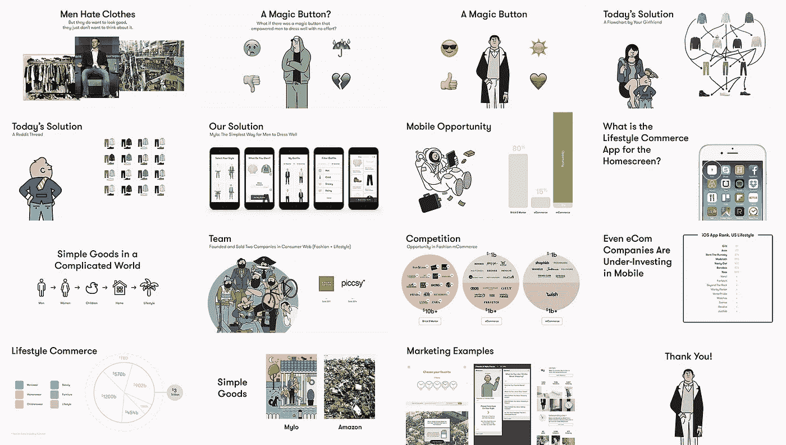

丹尼尔·埃克勒，Mylo 的创始人

成功的创业公司以其颠覆性的方法而闻名，所以看到如此多的创新公司在谈到他们的推介时惊人地保守(有时甚至草率)是很有趣的——考虑到他们可支配的设计和开发资源，这是一个奇怪的事实。

过去，我为我的公司 Piccsy 设计了一个球场平台，并取得了一些成功[——尽管我们没有必要为了设计一个高质量的平台而大费周章——但为栅栏而摇摆也无妨。](http://techcrunch.com/2012/05/28/death-to-powerpoint-piccsy-rethinks-the-pitchdeck-gets-tons-of-pageviews/)

请记住，一个设计良好的套牌没有你推销的产品重要，但它可以澄清和增强你的演示文稿。把它比作打着领带、扣着扣子去参加工作面试:这不会让你得到工作，但它会让你不必把自己从皱巴巴的 t 恤和工装裤会造成的洞里挖出来。

使用我的新公司 [Mylo](http://www.okmylo.com) 的推介作为案例研究，我将向你展示如何创建一个设计良好的套牌。

## **速射注意事项:Dos&not**

**不要:**

*   每张幻灯片超过 20 个单词。你得到一个标题短语，一个句子标题，就这样。幻灯片不是脚本，它们是观众的视觉向导。房间里的每个人在看幻灯片的时候都应该抓住它。

> 如果他们在阅读，你就有麻烦了，因为这意味着他们没有在听你说话。

**做:**

*   每张幻灯片最多使用一个短语(标题)。
*   最多用一句话(标题或副标题)来补充你的标题。
*   每张幻灯片最多使用一张图片(标题或题注的视觉表现)。
*   来源未经许可的图像。尤其是当你请不起设计师或摄影师的时候。请记住，这不是一个 TED 演讲。在大多数情况下，你将向几个人推销，而你的宣传资料只会在闭门造车时被人看到。(除了我们目前的情况:在我们打算写这篇文章之前，我们从我们最喜欢的插图画家之一[拉米·涅米](http://www.raminiemi.com/)那里借用并处理了一些图像。)

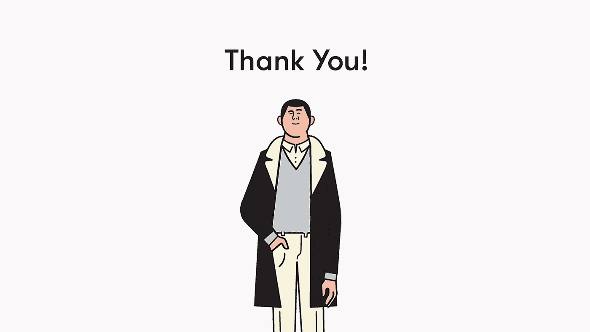

# **讲述一个引人入胜的故事**

许多“如何制作推介资料”概述将详细介绍您需要在资料中准备的 10 张幻灯片。虽然某些幻灯片很重要，但如果没有一个故事的框架，一个推介可能会失败。你需要同时迎合头脑和内心——投资者同时做出决策。

## 三分钟的故事

最好的方法是编织一个引人注目的 3 分钟故事，讲述这个世界出了什么问题，不可避免的解决方案是什么，你的产品如何恰好是那个解决方案，以及为什么你的公司会成功。

你的故事应该让你的产品成为你发现的任何问题的逻辑结论。只要它是引人注目的和简洁的，你就准备好了。将更传统的幻灯片作为补充材料，以便在演讲后的对话中有组织地提出问题时参考。

第一次会议的目标不是获得资助，而是确保第二次会议。你的 3 分钟推介的目标不是让投资者了解你的业务的每一个细节，而是让他们兴奋起来，参与到一场对话中，让你有机地完成你的故事和幻灯片的剩余部分。

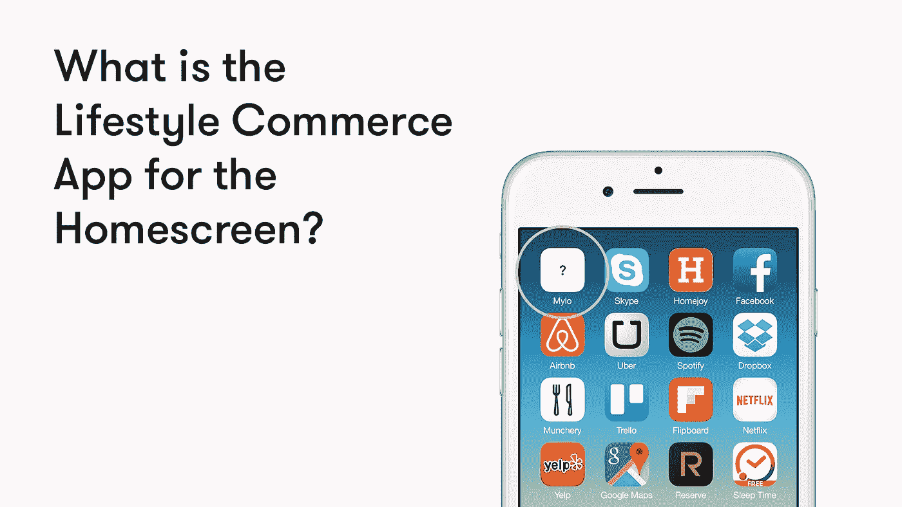

## **第一张幻灯片/第一印象**

你有没有在第一次约会时就决定你是喜欢还是不喜欢你将要坐下来的那个人？有些约会进行得非常顺利，以至于到最后你会幻想结婚。

投资者也不例外。理想情况下，你希望他们幻想你有能力让他们赚十亿美元。强劲的第一次下滑会让天平向那个方向倾斜。这张幻灯片应该能立即抓住他们，一个很好的方法是探索你的产品将要解决的问题。

## **问题/解决方案**

故事因紧张而繁荣。有史以来最糟糕的电影会让主角在演职员表中坠入爱河，我们不得不在 90 分钟的幸福时光中艰难前行。

50 次初次约会，500 天的夏天——这些标题暗示了一个漫长的过程，这个过程吸引着我们去积累紧张和释放决心。我们的推销正是这样做的:它慢慢地建立紧张感，在我们的第一张解决方案幻灯片之前引入两张问题幻灯片。在提出我们的下一个解决方案之前，我们接着又看了两张问题幻灯片。

重要的是要记住，你已经考虑你的产品好几个月了，现在问题和解决方案对你来说已经非常明显了。请记住:这对潜在投资者来说并不明显，而让它变得明显是你的任务。最好的方法是什么？重复。

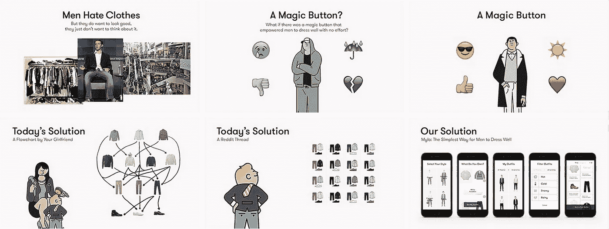

# 设计技巧

## **《好设计》**

大多数人认为好的设计与美直接相关。他们错了。好的设计是通过视觉传达来实现预期的结果。你注意到我们的第一张幻灯片有多难看了吗？这是故意的。

我们希望人们对这个问题有多糟糕和不舒服做出本能的反应。

我们还使用了一个标志性的、相关的图像来传达它。每个投资者都知道马克·扎克伯格是出了名的糟糕着装者，所以这个小小的视觉笑话除了阐明我们的产品将要解决的问题之外，还帮助我们建立了融洽的关系。

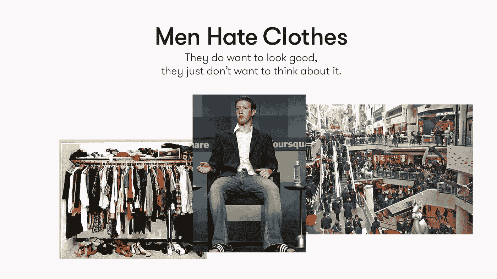

## **使用转场**

Powerpoint 褪色和擦拭不适用于此处。从这个意义上来说，过渡指的是统一的视觉提示，无论是一致的类型还是图像位置。

用一致放置的图片和文字来固定你的幻灯片总是明智的，但这也有助于获得创造性。一个很好的电影例子是 2001 年的标志性镜头:太空漫游。如果你还记得的话，在转换到旋转空间站的匹配镜头之前，它跟踪一根被扔向天空的骨头。

我们不太令人印象深刻的过渡以一对幻灯片为特色，提出了一个魔法按钮的效果(Mylo)。第一张幻灯片展示了一个皱着眉头、穿着寒酸的家伙，周围是痛苦的表情符号。

我们按下按钮(这模仿了我们的应用程序在几秒钟内给你穿好衣服的能力)，瞧！我们的魔法按钮将沮丧转化为快乐，将雨水转化为阳光，将一个曾经衣衫褴褛的人转化为一个衣着时髦的人:谁不想这样呢？

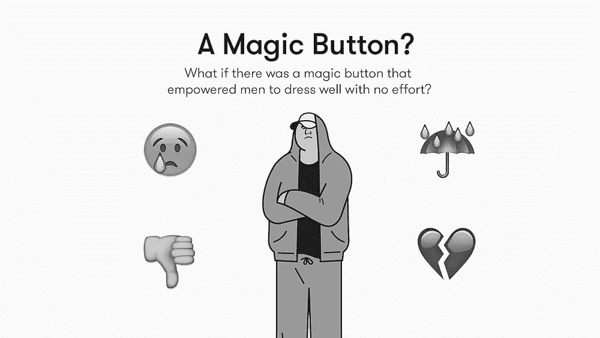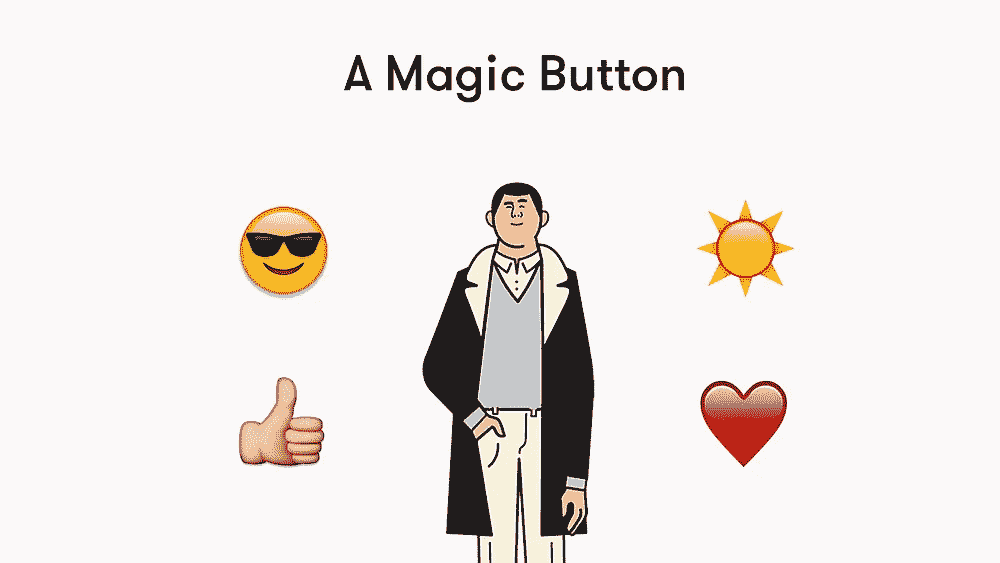

## 视觉化情绪

从其他人，最好是你的投资者的角度来构思你的推销。如何才能最好地联系到他们？我们在甲板上使用的插图不仅仅是因为它们的表面质量。

虽然它们确实帮助我们传达了 Mylo 有趣、古怪的一面，但我们也意识到它们有助于我们的观众在更深层次上参与我们的故事。

插图是强大的，因为它们能让观众在你创造的场景中[想象自己](https://laurenericksondotcom.files.wordpress.com/2011/09/understanding-comics1.png)；摄影缺少的东西。

我们很乐意承认，对于想要穿得漂亮的男人来说，有一个解决办法:他们的女朋友。除了这是低技术和混乱，还有另一个更微妙的内涵:它有点阉割。

我们从来不会在文案中，甚至在口头陈述中这样说，而是通过使用一个男人孩子的形象，注入一些幽默，更重要的是，微妙地表明今天的解决方案甚至可能有些尴尬。

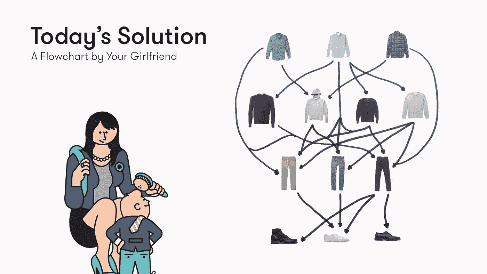

## **金钱出手**

不，不是真正的钱，因为你可能还没有赚到钱——我们在谈论你的产品。不管你决定讲什么样的故事，它几乎肯定会包括对你实际工作的解释。

您没有时间在 3 分钟的推介中组织完整的演示，因此您的目标是展示为什么您的解决方案比您迄今描述的所有替代方案至少好 10 倍。

在我们的案例中，我们将 Mylo 与同一事物的两个非常原始的版本进行了对比，并展示了我们的解决方案是如何更加广阔、美丽、个性化、用户友好和高科技的。

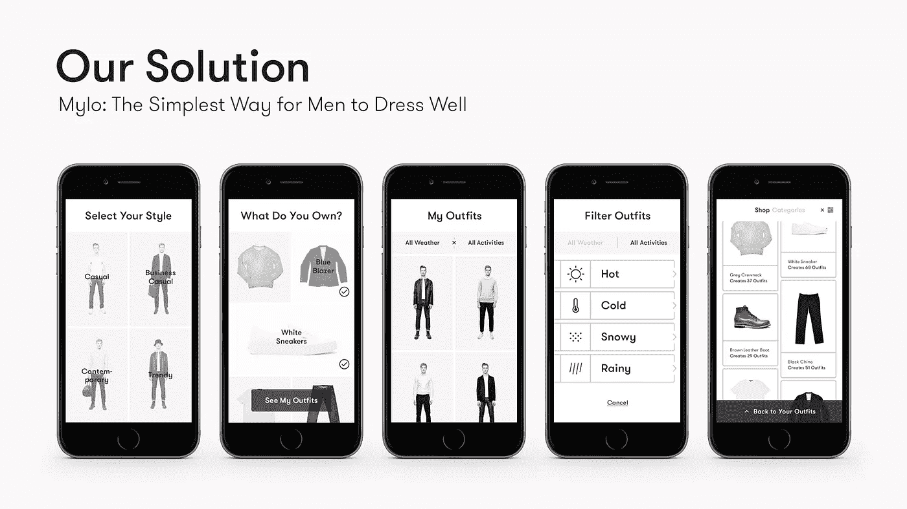

## **实际投钱**

同样，在这个阶段，你给出的任何硬数据可能都不准确，不管怎样，故事比数字更有趣。这个故事背后的想法是让你的投资者相信你正在创造的是未来，以及你面前有一个巨大的(多少可以量化的)机会。

在我们的案例中，我们展示了移动的巨大潜力及其在商业领域不可否认的未来。尽管如此，我们的图表显示，目前的移动活动非常少，这代表着一个巨大的机会。

不要害羞:让你的投资者穿上太空服，里面有漂浮的金条和装满钱的公文包；这就是重点:他们是来赚钱的，每个人都想假装自己是埃隆·马斯克。

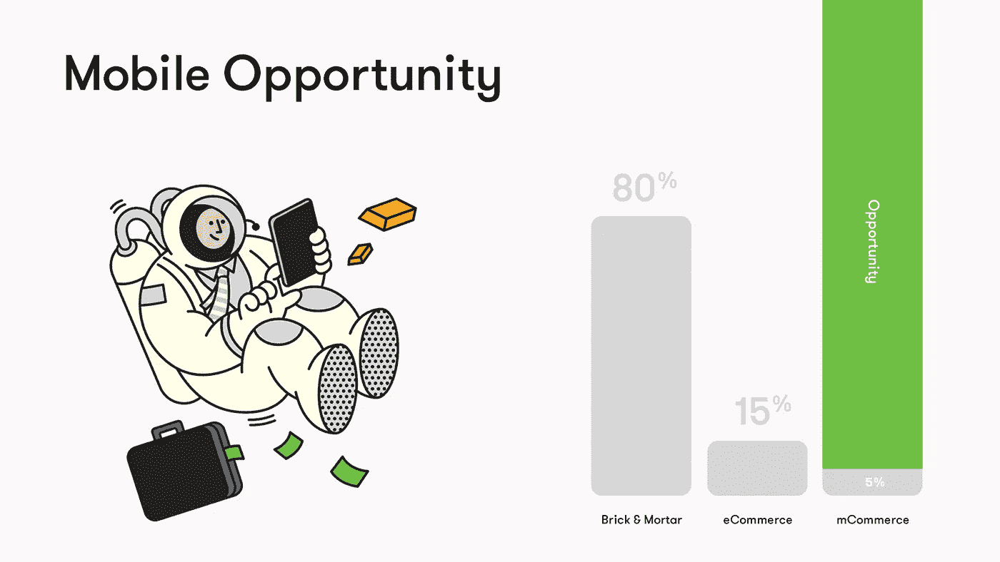

# 补充幻灯片

你花了三周时间构思了一个三分钟的故事，但你还没有完成。如果你真的投入工作，你已经探索了几种不同的叙事路径，并有大量的额外信息，为了简洁起见，你不能包括在内。

## **背囊故事**

幸运的是，这些想法不必浪费。一旦你的 3 分钟推销完成，投资者可能会有几个关于你的项目的问题。我们的想法是预测这些问题，并制作补充幻灯片，为您的答案提供视觉支持。

如果一个投资者问起你的竞争对手(他们肯定会问)，你要准备好说出谁存在，以及为什么你是独一无二的和优秀的。

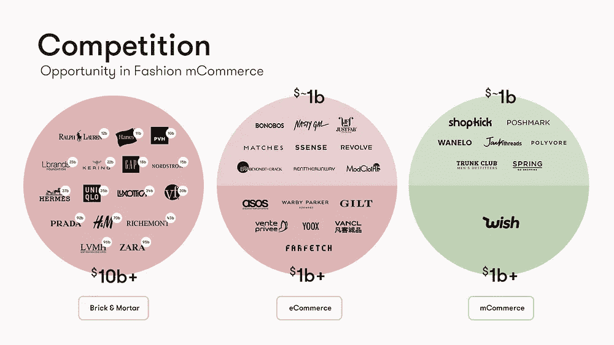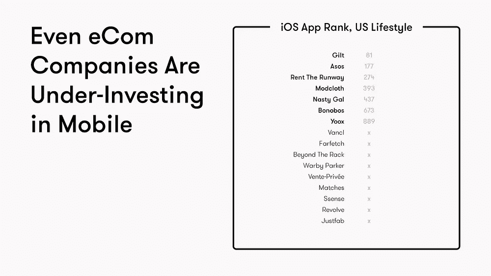

对 Mylo 来说，这是重申移动生活方式商务巨大机遇的绝佳时机。我们准备的补充幻灯片包括一个竞争对手矩阵的变体，投资者习惯于看到和忽略它。

我们还花时间思考了生活方式商务的 TAM，但无法将我们的想法融入核心推介。相反，我们将我们的想法转化为一个补充的故事幻灯片，讲述我们成为移动时代领先的生活方式公司的愿景。我们讨论如果 Gap + Ikea 混合产品在今天生产出来会是什么样子，以及它会如何与亚马逊竞争。

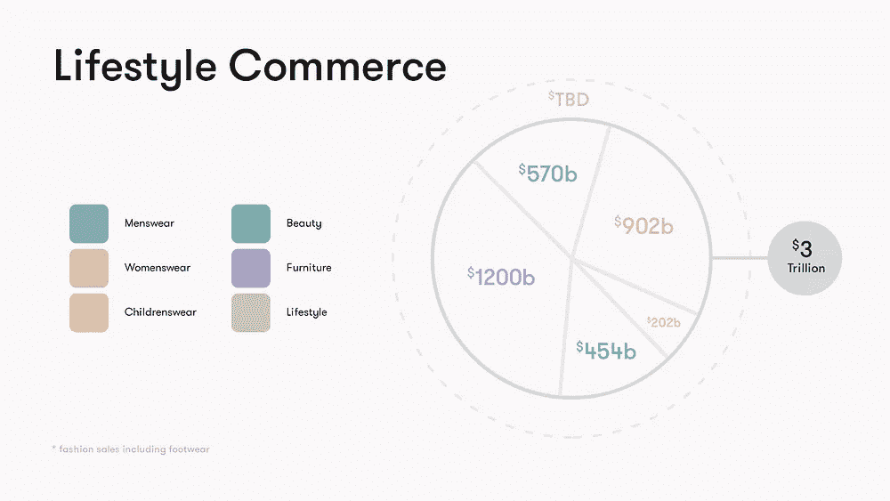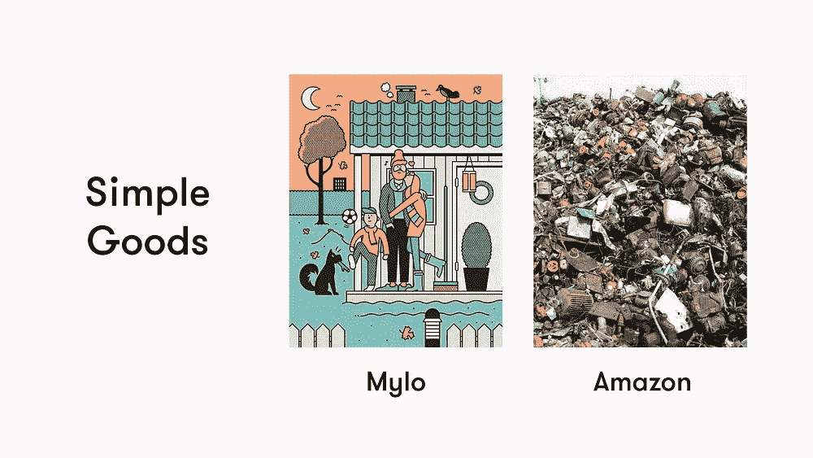

## **提高你的字数**

还记得限制你每张幻灯片 20 个单词的规则吗？很难遵守。这里是你可以打破它的地方。

如果您的核心幻灯片中有一张幻灯片需要额外的解释，可以制作一张补充版本的幻灯片，作为帮助您记住所有未能浓缩到您的推介中的要点的秘籍。

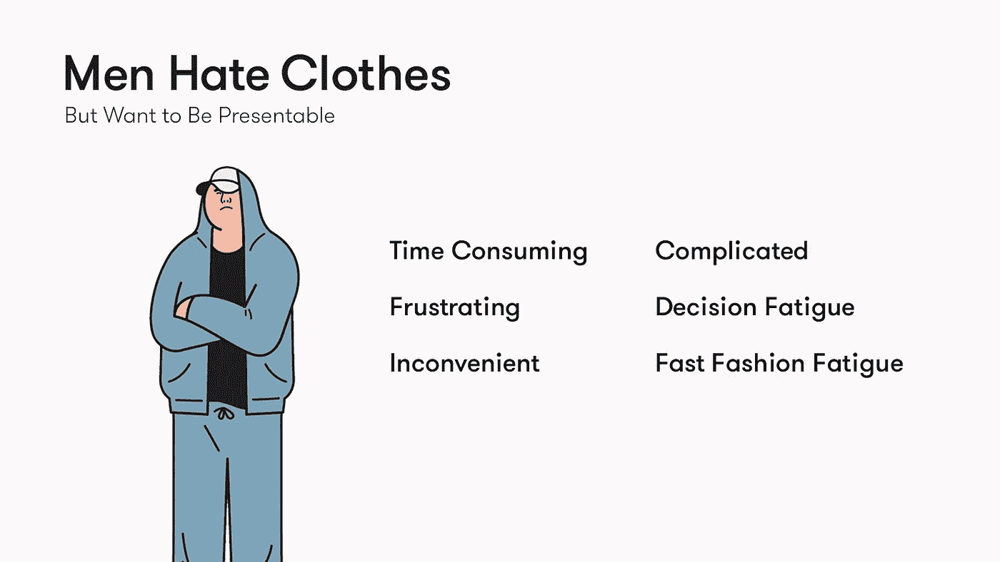

## **去通用**

不是每张幻灯片都是艺术作品。包含一个通用的可模板化的幻灯片，以添加在一个图像或幻灯片中无法清晰表达的信息。

在一个理想的世界里，你会把你懒洋洋地合并的想法分成原创的/令人印象深刻的/漂亮的补充幻灯片，但你是一家初创公司，你破产了，这就是为什么你把这些放在一起。你不可能让每一张幻灯片都尽善尽美；)

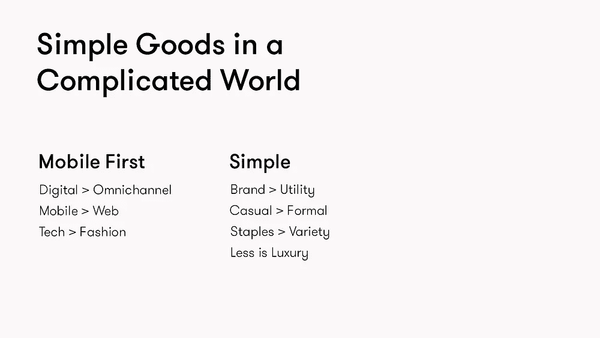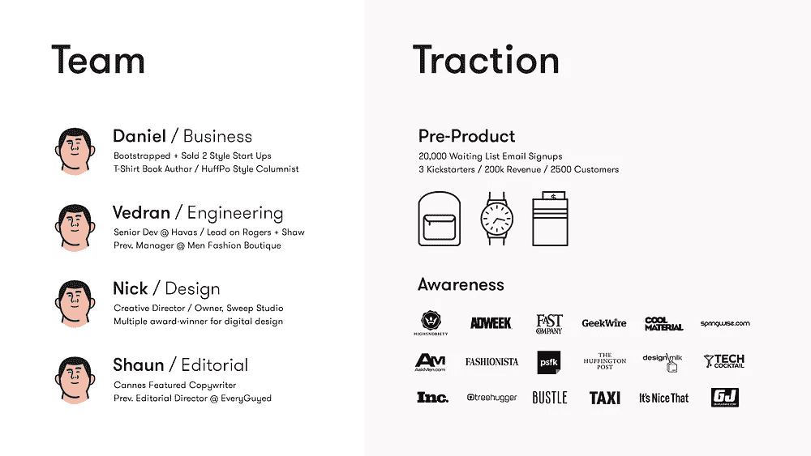

# **其他资源**

希望我的建议有用。如果你喜欢读这篇文章，请通过 Twitter 或脸书分享。

如果你知道任何感兴趣的投资者，请让他们给 daniel@okmylo.com 发电子邮件，Mylo 目前正在筹集种子资金

感谢阅读:)

**延伸阅读**
要获得其他更好的推广资料，请查看以下链接:[想要更好的推广？](/firm-narrative/want-a-better-pitch-watch-this-328b95c2fd0b)、 [4 点故事结构融资](/startup-study-group/4-point-story-structure-for-fundraising-a78e330e2afe)、[风投平均在上面花 3 分钟](http://techcrunch.com/2015/06/08/lessons-from-a-study-of-perfect-pitch-decks-vcs-spend-an-average-of-3-minutes-44-seconds-on-them/)、[三张幻灯片然后闭嘴](http://www.mondaynote.com/2015/05/04/three-slides-then-shut-up-the-art-of-the-pitch/)、[七张怎么样？](http://www.mondaynote.com/2015/05/11/three-slides-youre-nuts-ok-how-about-seven/)、[你在演讲中需要的仅有的 10 张幻灯片](http://guykawasaki.com/the-only-10-slides-you-need-in-your-pitch/)、[为演讲做辩护](http://abovethecrowd.com/2015/07/07/in-defense-of-the-deck/)、[演讲前建议](http://techcrunch.com/2015/07/02/read-this-before-meeting-vcs-for-pre-pitch-advice/)

**附加设计参考** 如果您想查看一些经过深思熟虑的非 Mylo 平台，请查看以下链接:[最佳推介平台](http://bestpitchdecks.com)、 [PitchEnvy](http://www.pitchenvy.com/) 、[最佳启动推介平台](http://onboardly.com/startup-pr/best-startup-pitch-decks-of-all-time/)

如果你迷路了，很匆忙，需要一些东西让你立即开始，试试 Crowdfunder 的这个模板。

> 如果你喜欢读这篇文章，请点击页脚的♥按钮，这样更多的人可以欣赏伟大的设计！

嗨，我是[丹尼尔](http://www.danieleckler.com)。我创办了一些公司，包括 Piccsy (acq。2014)和 EveryGuyed (acq。2011).我目前对新的职业和咨询机会持开放态度。通过[电子邮件](mailto:hi@danieleckler.com)联系。

# 你可能也会喜欢:人性化设计

我写的一篇互动文章，探索了拟人化设计的过去、现在和未来。此外，[还可用作会议、活动等的演讲](http://designforhumanity.danieleckler.com/)。

 [## 人性化设计

### 1950 年，美国心理学家哈里·哈洛进行了一项实验，将幼猴从它们的…

medium.com](/swlh/the-future-of-design-is-emotional-5789ccde17aa)