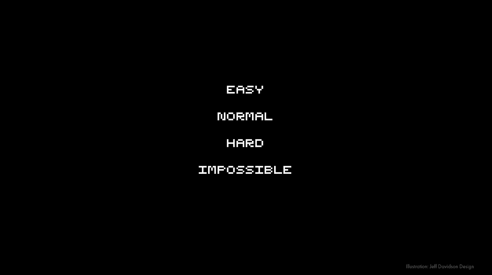
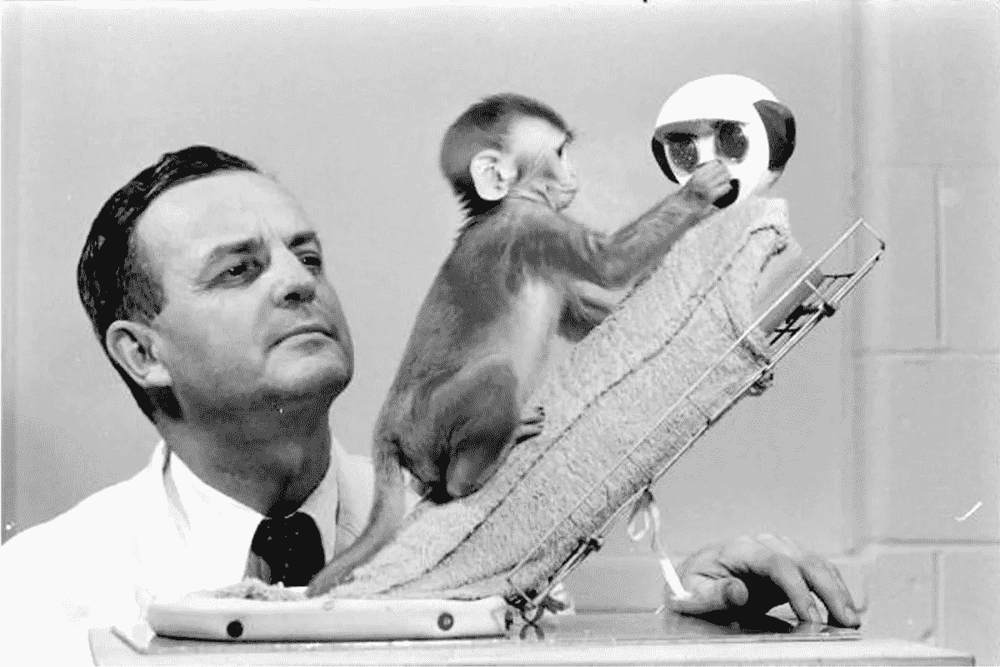
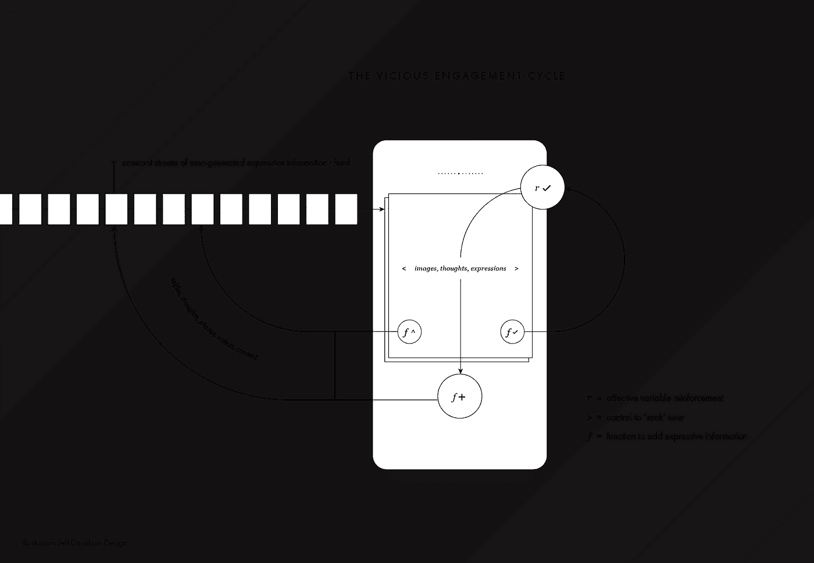

# 如何设计令人上瘾的产品

> 原文：<https://medium.com/swlh/how-to-design-an-addicting-product-29b948c427de>

## 我过去解决问题，现在我试图创造问题

我们中的大多数人认为设计是使一些东西更实用、更直观、更舒适，并且最终更令人满意。在很多情况下，这就是设计的目的。通过减少日常任务的繁琐来创造更快乐的人类。但是，如果让事情变得更容易实际上并没有让我们更快乐呢？如果快乐的关键实际上是通过培养挑战呢？什么时候我们应该让事情变得简单，让别人变得困难？这些是每个产品设计师和企业家都应该问的问题，因为理解动机的基本系统是创造令人满意的产品和服务，最终丰富生活的关键。

根据关于动机的新旧科学，我们——检验人群——被迫提出关键问题，作为一个整体的社会应该解决这些问题。把这篇文章看作是认识论转变的补充——我觉得这种转变早就应该发生了。接下来的七个部分将概述被称为*内在动机*和/或*寻求系统*的现象的简史。我将强调电视、脸书和互联网等产品是如何满足搜索系统的，并因此获得巨大成功的。文章最后将举例说明公司如何创造出令人上瘾的产品，这些产品打击了寻求系统和社会情感强化系统，从而创造出只需要最少创意投入的恶性吸引产品。所有这些原因使得内在动机和社会制约成为一个非常经济可行的研究课题，一个每个活着的人都应该意识到的课题。

# 旧的驱力减弱理论

要了解一个成瘾产品的组成部分，我们必须首先了解动机的科学，旧的范式，以及彻底打破它的发现。早在 20 世纪初至中期，占主导地位的理论认为，人类的动机主要是出于生理目的。根据驱力简化论者(占主导地位的理论)，口渴、饥饿和性是主要的驱力，而金钱和物质财富等东西的价值是通过条件反射习得的。因此，根据罗伯特·赫尔和肯尼斯·斯彭斯等科学家的说法，大多数行为都被解释为渴望减少这些天生的驱动力。为了生存和繁衍，我们找工作，买豪车，帮助或伤害他人。当时，它类似于弗洛伊德和马斯洛对人类需求和动机的不同但概念相似的“分层”解释，其中食物和性总是处于这些欲望的最前沿，无论是有意识的还是无意识的。

此外，驱动还原论者认为食物和性(外在激励因素)是有机体的“主要”驱动力，因此说有机体可以用这些类型的奖励来调节。例如，如果老鼠在每次成功后得到食物，它会更好地完成迷宫。简而言之，这就是强化。直到二十世纪中叶，一位科学家的观察完全改变了我们对生活中的动机、条件反射和最终成就感的看法。

# 老鼠、猴子、人和动机的发现

这一发现似乎是偶然开始的，当时一位多产且有争议的美国科学家哈里·哈洛正在研究恒河猴解决问题的能力，这是他实验的一个常见主题。故事是这样的，哈洛注意到他的实验对象猴子会在计划的实验前后继续玩机械拼图——在没有典型奖励(食物)的情况下。本质上，猴子是为了学习而学习。这与传统智慧相反，传统智慧认为积极的强化会不可否认地积极塑造行为(达到预期的结果)。令人震惊的是，当积极的奖励被引入以试图加强“游戏”(探索)时，它对行为产生了抑制作用。更简单地说，当受试猴子被鼓励或奖励玩耍时，它们出于某种原因失去了兴趣并停止玩耍。这种违反直觉的观察和最终被证实的现象违背了科学家们对根本动机的所有想法，而根本动机通常被认为是直接或间接为某种生理目的服务的。这种探索行为被 Harlow 称为“内在动机”,它是我们参与模式的关键。

# 新的内在动机

哈里·哈洛首先创造了术语*内在动机*，但是心理学家爱德华·德西和理查德·瑞安却致力于研究它。以下是他们在 2000 年发表的题为*自我决定理论和促进内在动机、社会发展和福祉*的论文中的标准定义:

> 内在动机是指“寻求新奇事物和挑战，扩展和锻炼个人能力，探索和学习”的自发倾向(Ryan and Deci，2000，第 70 页)。

锻炼、游戏、旅行、阅读、甚至看电视都满足了寻求系统不同程度的努力操作。在光谱的一端，有人可以攀登珠穆朗玛峰，在另一端，他们可以浏览网飞。神经科学家 Jaak Panksepp 将这种探索行为定义为由生物体天生的寻找系统驱动。重申一下，*寻求*背后的反常之处在于，它提供了看似很少的实用价值——它没有满足某些生理需求赤字，但我们还是这么做了。**我们从内部创造自己的价值**。同样令人着迷的是，我们现在知道，即使在缺乏食物、水或住所等“基本”需求的情况下，生物体也会以内在动机的方式行事。你见过多少次无家可归的人在看书？你认为他们是在为求职面试而练习吗？不，他们在寻找。

# 寻道系统的设计

公司知道人类一直在积极寻找新的、新奇的东西。这就是为什么互联网是一个如此吸引人的工具——它给人一种能力，在他们的指尖，瞬间和无限地运用他们的搜索系统。旅行是人类锻炼这种特质的另一种方式，也是第一世界国家最大的经济驱动力之一。尽管这些都是人类的例子，但寻找系统并不是人类独有的特征——所有动物都有寻找系统。

电视是一个很好的例子，它能真正锻炼我们在家里的寻找系统。特别是随着遥控器的出现，用户可以不间断地保持在一个不断寻找的状态。现在，我们有了像网飞这样的工具，用户可以通过各种过滤器浏览看似无限的内容(封面艺术也增加了参与度)。有多少次你浏览网飞看似太久了？事实是，人类从观看图像和判断他们尚未观看的内容中获得乐趣。**预期和想象是有价值的，这些同样来自于内在**。一个人从看到新事物中获得的满足感似乎会随着动态的“社交”内容而急剧增加。例如，社交媒体平台为你提供了源源不断的信息，以及与信息提供者互动/表达自己的能力。这就是为什么像脸书、Instagram 和 Tinder 这样的工具如此不可抗拒，并把我们带到上瘾产品设计的下一个组成部分——作为强化的社会影响。

# 作为强化的社会影响

与外在奖励不同，社会情感是非常强大的行为强化因素，实际上有助于增强“寻求”行为。情感是社会暗示——微笑、皱眉、装腔作势，这些都是人类表达情感的方式(无意识的交流工具)。大多数人都经历过被热情介绍或被理所当然地冷嘲热讽的感觉是好是坏，我确信这种肢体语言对你未来的行为产生了影响。社交媒体利用这一现象，允许用户通过喜欢、分享、转发、评论或匹配他们看到的内容来表达他们的认可。

社交媒体中情感强化的一个重要特征是，展示你的赞同比展示你的不赞同要容易得多(没有“不喜欢”按钮)。这意味着，在社交媒体反馈生态系统中，奖励通常多于惩罚，不喜欢的行为的负面后果可以说是微不足道的。这些都增加了这些平台想要的强化。他们希望你继续创造内容。这是一个梦想的商业模式，因为用户做所有的工作(贡献)，而你(企业)只是建立发现和奖励机制。在社交媒体上，当有人“喜欢”他们的表达时，用户会追逐多巴胺，而这些“喜欢”会加强这种表达行为，导致这种恶性循环。

# *上瘾提示可变，间歇奖励

如果每次你扔鱼线，都能钓到东西，钓鱼会有趣吗？对于这个问题，令人难以置信的复杂答案是，不。当强化具有随机性时，一些奇怪的事情会发生在我们身上——这使得我们更有可能重复行为，尽管在强化流中存在“滞后”或打嗝。赌场知道这一点，这也是赌博如此容易上瘾的原因。人们追逐高点，而高点在面对损失时变得更加明显。想象一下，如果你每次赌博，你都得到一个名义上的但是正的等值的回报，那会怎么样？那就不好玩了。即使这实际上会更有回报(你最终胜出)，你最终也会感到厌倦，意识到你总是可以回到这种源源不断的收入中，然后去做别的事情。

此外，奖励的变化甚至缺失会强化行为，这是另一个与条件反射相违背的现象。你可能以前在电梯里见过这种反应。场景:有人(可能是你)走进电梯，按下“关门”按钮。门没有立即关闭，该人又按了 2-4 次，就像第一次发生故障一样。或者，想象一个网站上的死链接。你点击了一次，没有效果，所以你继续连续点击了八次，只是为了“确认”。脸书、Instagram 和 Tinder 都利用了这一现象，改变你每天在这些平台上收到的赞、浏览和通知的数量。由于口味的主观性和不可告人的动机，强化的差异也不可避免地发生。不管怎样，强化的差异是上瘾的另一个组成部分，这种强化让用户生成的表达性输入(燃料)保持运转——它让自我维持的系统保持运转。

# 大自然选择的探索者

那么为什么*人类要寻找*？如果我们经常只是为了做而做这些事情——通常没有回报——也没有具体的理性目的，那么做这些事情的意义何在？为什么它会在我们的 DNA 中如此根深蒂固？从进化的角度来看，寻找一定有利于生物的生存。仔细想想，这是有道理的。当一个有机体探索——当它寻找——它可以发现新的资源，增加它(和群体)生存和繁殖的机会。**合体兽求**。人类先进的工具制造已经将这种寻找行为发展到了令人难以置信的极限，我们已经学会了航行，然后飞翔，现在又将自己炸出了太阳系。作为一个社会，我们寻求——正如历史所表明的那样——我们经常寻求和破坏。

不管结果如何，当人们寻找、学习、探索和操纵周围的环境时，他们通常是最快乐的。如果你想创造一个吸引人和/或令人上瘾的产品，满足寻求系统和情感奖励系统——允许人们探索，表达自己，并根据他们的输入接收积极的社会暗示。当然，你的生意可能在本质上完全是功利的，在这种情况下，我可能会建议*反对*创造寻求体验(加上这个世界不需要更多的‘上瘾’产品)。考虑到这一点，设计师、高管和企业家可以通过多种方式实施从自我决定理论家那里学到的经验，比如:给用户选择的机会，鼓励“浏览”(不是热情地销售)，或者通过反馈服务给人们交流和表达自己的能力。说到满足寻求系统，可能性是无穷无尽的。

# 结论

当你剥夺了一个人寻求的能力，或者当一个人失去了这种精神上的人类特征时，他们要么——或者经常——变得非常沮丧。寻求赋予人类生活以目的，更重要的是赋予他们的工作和对更大整体的贡献以目的。这种相对较新的激励科学应该彻底改变企业奖励员工的方式，并考虑他们的产品/服务。在新的世界经济中，你需要严格地创新，而创新的人在被给予自主权时会工作得更好——这是我们目前的劳动力仍然普遍缺乏的。你有没有注意到，当你试图强迫一个孩子玩玩具时，他会失去兴趣，转而玩盒子？

让他们去找吧！

…

# 我是杰夫·戴维森

我帮助公司设计有利可图的数字产品。项目咨询请联系 jeffdavidsondesign@gmail.com。

【http://jeffdavidsondesign.com/ 号

 [## 杰夫·戴维森设计

### jeffdavidsondesign@gmail.com

jeffdavidsondesign.com](http://jeffdavidsondesign.com/) 

## 这篇文章发表在[《创业](https://medium.com/swlh)》上，这是 Medium 最大的创业刊物，有 283，454+人关注。

## 在这里订阅接收[我们的头条新闻](http://growthsupply.com/the-startup-newsletter/)。

