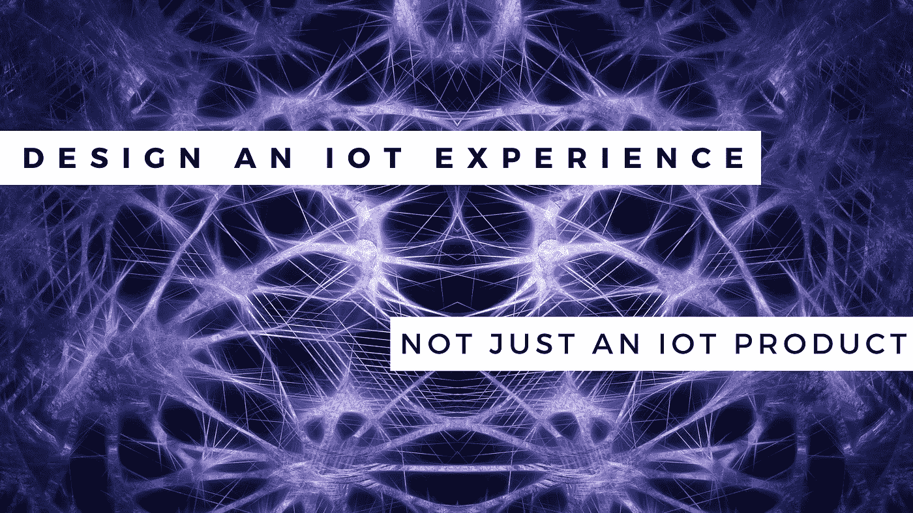

# 如何设计一个物联网体验，而不是一个物联网产品？

> 原文：<https://medium.com/swlh/how-to-design-an-iot-experience-not-an-iot-product-678638d5e8cc>

我们的设备和产品看起来可能与联网和智能之前一样。即便如此，它们还是有本质的不同。现在他们是一个更大的流程、产品和利益相关者社区的成员。确保你的产品能够胜任这些新角色是一个严峻的设计挑战。你看，机器对机器的连接，以消费者为中心的物联网的先驱已经存在了几十年。通常，物联网应用的 M2M 阶段推动技术解决 B2B 市场需求。该阶段的产品设计考虑对于说服客户接受产品并不重要。企业物联网买家很少要求出色的设计，因为买家通常不是产品的最终用户。然而，在物联网的应用已经扩展到更广泛的商业机会的今天，企业 B2B 应用已经变成了 B2B2C。

如今，在为物联网重新定义其服务或产品体验时，企业往往无法超越复杂性。随着软件智能的大规模开发的形式因素和交互模式的扩散，这种技术进步的范围、速度和影响是势不可挡的。随着品牌、制造商和服务提供商匆忙制定数字战略，他们的战略往往是单一的战术，优先考虑技术。构建互联产品或开发移动应用。但是你看，成功背后的驱动力更多的是设计，而不是技术。那么，我们来谈谈设计。

# 1.以用户为中心

如今，您的用户需要处理更多的设备、软件应用和数据，因此必须考虑每个接触点。公司必须精心设计，否则会有压倒性的风险或惹恼客户，迫使用户放弃产品。在一个顾客要求个性化和几乎实时的服务的时代，每个层次的设计师都必须考虑更多的背景。请记住，为环境而设计有助于优化设计决策。目标用户在使用产品或服务时的位置和生活方式为功能、形式和交互开发提供了有用的线索。敏感动态往往会影响品牌互动的性质。将用户环境作为设计流程的核心也迫使公司认识到他们是在为技术而技术，并考虑在哪里利用合作伙伴可以扩大价值，甚至创造新的收入流。与理解宏观和微观互动独特组合的团队一起工作。那些确保使用实践的人给研究结果带来严谨性。

# 2.教化

直到一项技术有机地融入我们的生活，它才算人性化。物联网具有前所未有的人性化产品的潜力。品牌必须努力为产品体验带来真正的个性，利用这一点，投资于人性化的产品，以释放情感联系。任何一个不太像样的品牌创意都会谈到人的个性，消费者在多大程度上描述你的品牌，就好像它是房间里的一个真人一样。调整你投射的角色，通过数据理智化，通过语义、内容和语调建立情感。对于人性化的产品经济来说，这可能是革命性的。

# 3.重要的地方用鹅卵石

工作或从你所拥有的开始。不要浪费时间多此一举。构建物联网产品时，请四处看看。你已经掌握的现有系统、服务或组件中有哪些可以推动你的项目？拼凑是进入互联技术游戏的一种快速、智能和有效的方法。

# 4.常规的力量

当考虑使用物联网的力量来使你的产品人性化时，要以适合用户日常生活的产品或服务为目标。他们已经在做的任务的自动化是在他们的生活中找到一个位置的更简单的方法。开发与客户已经使用的产品不同的物联网产品是有风险的。

# 5.β测试

用户比大多数测试人员更容易发现功能问题。您不希望您的客户在发布后挖掘问题，这可能会导致硬件召回。修复这些问题比简单的软件更新要昂贵得多。

# 6.与懂技术的设计师合作

你看，物联网也需要一种技术感知的设计方法。产品体验现在包括适应其他产品、个性化、升级和大数据。设计团队和技术团队必须紧密合作，了解在客户体验设计中什么是必要的，什么是可能的。

# 7.打造梦之队

事实上，你必须外包。你正在开发的物联网产品或服务不是你可以在车库里组装的项目。谦虚地承认你的团队并不具备所需的全部知识。因为物联网涉及到硬件和软件，所以你需要一批拥有不同背景的开发人员。

# 8.测试多个原型

你需要测试多个原型来评估创造高质量产品的可行性。如果你一开始就决定做大，你可能会浪费资源。这反过来会限制你在发布后满足客户需求的能力。

# 9.无特征

少即是多。如果有疑问，请放弃该功能。由于复杂的技术支持，充满功能的物联网产品很快就会失去用户友好性。这对你来说可能不容易，但是去掉多余的装饰可以让你避免过于复杂的界面和糟糕的用户体验。环顾空间中的巨人，吸收他们的设计理念。一切都是有目的的，不会分散注意力。以亚马逊为例，它可以很容易地将其 Dash 按钮复杂化，但他们选择坚持单一按钮的简单性。

# 10.在本地工作

我们没有一个人能一直上网。在为物联网进行设计时，不要假设您的客户会一直保持互联网连接。理想情况下，首先你会设计没有互联网连接，然后看看在你需要访问互联网之前，你可以在本地添加多少功能。

# 11.你能带来什么价值？

不要指望赶上潮流，认为消费者会因为它是潮流而购买它。你需要一个独特的价值主张。如今市场上的许多物联网产品都通过削减成本和帮助保护环境来推销自己。

# 12.入职

不要忘记入职。尤其是对于不太懂技术的用户来说，第一次唱一个物联网产品可能会让人不知所措。留出一些时间用于开发，以设计考虑到面临技术挑战的消费者的入职流程。

# 13.最低纲领

瞄准一个消失的设计。在开发物联网产品时，一个重要的考虑因素应该是它的日常可见性。正如没有人想要一部感觉像放在口袋里的砖头的手机一样，当涉及到他们产品的硬件时，开发人员应该努力用隐形技术来代替闪存。通过增加功能和缩小尺寸，可穿戴公司在减少可穿戴设备的占地面积方面做得很好。

得益于物联网，产品设计正在从以产品为中心向以体验为中心转变。物联网发展迅速。它的技术前景可能会在短短四个月内发生转变。因此，请找一个团队，他们能够从广泛且不断增长的选项目录中自信地推荐最适合您项目的选项。理解这种体验的团队现在就是产品。

*原载于* [***见解***](https://www.cognitiveclouds.com/insights/how-to-design-an-iot-experience-not-an-iot-product/)**摘自****cognitive clouds:Top***[***物联网应用开发公司***](https://www.cognitiveclouds.com/custom-software-development-services/internet-of-things-iot-application-development-company)*

**

## *这个故事发表在 [The Startup](https://medium.com/swlh) 上，这是 Medium 最大的企业家出版物，拥有 293，189+人。*

## *在这里订阅接收[我们的头条新闻](http://growthsupply.com/the-startup-newsletter/)。*

**