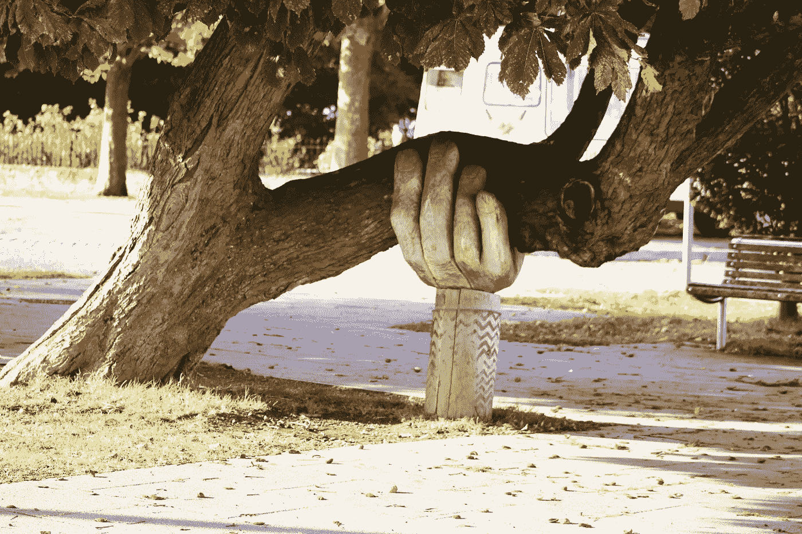

# 如何为真正的用户需求设计

> 原文：<https://medium.com/swlh/how-to-design-for-real-user-needs-67376a5c943>

Photo by [Neil Thomas](https://unsplash.com/photos/SIU1Glk6v5k?utm_source=unsplash&utm_medium=referral&utm_content=creditCopyText) on [Unsplash](https://unsplash.com/search/photos/solution?utm_source=unsplash&utm_medium=referral&utm_content=creditCopyText)

你已经给了你的想法一些结构和形式，它现在是一个清晰可辨的“东西”。你的想法很可能源于个人的挫折，或者你观察到其他人经历的挫折。

然而，你现在有了一个想法，你可以把它放在某人面前，并得到一些初步的反馈。你可以确保它被设计成做一些他们会觉得有用的事情。