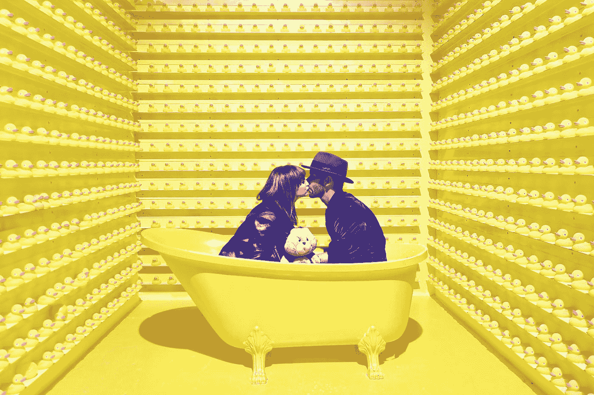

# 如何为幸福设计你的世界

> 原文：<https://medium.com/swlh/how-to-design-your-world-for-happiness-ebc623190103>

## 不要让挫折吞噬你生活中的快乐。

“man and woman kissing inside yellow bathtub” by [JOSHUA COLEMAN](https://unsplash.com/@joshstyle?utm_source=medium&utm_medium=referral) on [Unsplash](https://unsplash.com?utm_source=medium&utm_medium=referral)

> 他们问我长大后想做什么。我说“快乐”———约翰·列侬。
> 
> 约翰的老师告诉他他不明白这个作业，约翰回答说她不明白…