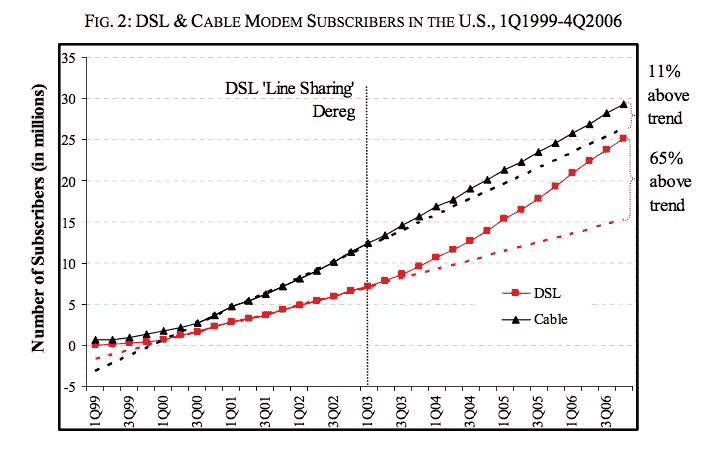

# 如何废黜国王:大技术时代的监管与创新

> 原文：<https://medium.com/swlh/how-to-dethrone-a-king-regulation-and-innovation-in-the-age-of-big-tech-56ee2881c59>

## 去中心化(本着网络中立的精神)和再中心化(掌握在中央政府手中)

Annotote is the most frictionless way to get informed and inform others

当然，免费开放的网络容易乞求、借用和窃取你的注意力。阅读博客、新闻和研究一直是低效的用户体验——就像在干草堆里找针一样——但现在 Annotote 是解药，所以检查一下: [*不要浪费时间或注意力；开门见山*](http://annotote.launchrock.com) *。*

How kings and queens lose their crowns

每个人都应该读一读你这篇经过精心研究的文章。尽管有细微差别，我总体上是支持网络中立的，但我必须对你的一些推论和建议进行修正。

首先，ISP 不同于水电公司。例如:

> 与宽带相比，用电和用电是更加静态的市场。你不会每 3 年拉 10 倍的屎。
> 
> —马克·安德森(@pmarca) [2014.02.03](https://twitter.com/pmarca/statuses/437683055629570048)

就像我说的，我的立场是微妙的:你可以支持网络中立和互联网去中心化，同时也反对第二条。

一方面，正如你提到的，第二章有很多方法仍然允许歧视(例如，零评级)，所以现有的监管充其量是漏洞百出。此外，正如上面的推文所描述的，我认为互联网还没有完成——我的意思是还有很多增长和创新有待实现，比如更快的速度，更高的带宽等。增长和创新需要研究、开发和基础设施，这些仍然需要投资，仍然需要资金。这笔钱可能来自公共资金(例如赠款)和消费者(更高的利率)的某种组合，但我不认为我们希望将这样关键的、资本密集型的、高增长的基础设施完全掌握在政府手中——像任何其他人或实体一样容易犯错——作为公用事业进行监管。

另一方面，本着网络中立的精神，有更多的有机手段来重新分散互联网…

## 当神想要惩罚我们时，他们会回应我们的祈祷

这是我对你、你的观众和公众的第一个论点。解决“互联网落入政府之手”的问题肯定不能是“把互联网放在政府之手”。但是，这确实是你建议做的(强调我的):

> 如果你什么都不做，我们将会输掉这场开放互联网的战争。人类历史上最伟大的交流和创新工具将会落入少数强大的公司和政府手中
> 
> 好消息是我们的曾祖父控制了类似的垄断。在 20 世纪初，美国人面临着滥用石油，铁路和肉类行业的垄断。我们通过勇敢的新闻报道提高人们的意识，并迫使政府采取行动，从而战胜了他们。

我不是一个自由主义者，但是赋予政府对互联网的主权将完全违背互联网去中心化的承诺，正如你自己所描述的:

> 开放的互联网是分布式的。它一部分归每个人所有，一部分不归任何人所有。它在很大程度上存在于政府边界之外。它是这样设计的。

The impact of regulation and deregulation on broadband

第二章的冒险本身就应该是联邦政府管理的一个教训——或者说是其中的艰辛。(第二篇的范围相当狭窄，所以我一想到更广泛、更深入的接触就不寒而栗。)事实上，我们可以看看标题 I 的冒险来建立[对这种监管的经验基础案例预期](https://papers.ssrn.com/sol3/papers.cfm?abstract_id=1093393)。回到早期，不受管制的有线宽带增长是高度管制的 DSL 宽带的两倍。但是，在 2003 年 FCC 解除对 DSL 的管制后，落后者几乎完全填补了有线电视的空白——最终为光纤网络的发展铺平了道路。至关重要的是，在加拿大，DSL 在整个美国经历中保持放松管制，DSL 在此期间保持了更陡峭的线性增长轨迹——提供了一个对照组，在美国监管和美国 DSL 的停止/开始采用率之间建立了因果联系。

我们已经处在类似 DSL 战胜电缆和光纤战胜 DSL 的进步边缘。像 5G 无线这样的持续创新*已经到来。也有可能出现像网状网络这样的新的市场颠覆。*

这是你关于垄断观点的一个很好的延续…

## 历史只是押韵

我完全理解围墙花园的问题——我会提醒每个人重新考虑其中的错误信号——但是你凭什么认为今天的现任者会与你的“围墙花园简史”中的前辈有所不同？美国在线和雅虎都是他们以前的影子。追溯到更远的历史，微软和 IBM 从第一名变得最差。

当然，像这些虎钳一样的市场领导者很少会被内生的市场力量，如行业内的传统竞争，所取代。

当然，今天的大型科技公司与这个世界上的任何公司都不同——由于网络效应的良性循环和零边际成本，它们更加强大和无懈可击:

> 聚合理论认为，通过开发差异化的体验，聚合者可以获得足够数量的消费者，从而拥有超越供应商的权力；然后，激励供应商按照聚合商的规格交付产品，这改善了整体体验，允许聚合商进一步增加他们的消费者基础，这进一步加强了他们相对于供应商的议价地位。公平地说，这是描述双边市场的另一种方式，但聚合器的独特之处在于互联网实现的零边际分销成本和计算机实现的零边际交易成本，这意味着这些公司基本上可以扩展到整个世界。

最后，当然，我本人不会对市场支配力指手画脚——肯定有合法的违反反垄断法的行为需要监管审查。事实上，你描述的大多数关于围墙花园的陷阱只是平台风险，单点故障集中化问题，我在写了本书[。](/adventures-in-consumer-technology/of-chinese-walls-and-techs-agency-problem-6cab543094d2)

但是…

## 认真的重要性

然而，任何人都可以对这些企业提起的大多数其他案件[都未能将它们定性为垄断](/@AnthPB/antitrust-techs-endgame-8705eac3cd00)。理解所有这些并磨练辩论是很重要的，原因有二…

首先，对互联网服务提供商和大型科技公司来说，宽松的监管是必要的，也是早该有的。然而，公众对这些行业的天真和虚假的描述已经将公众的共识瞄准了稻草人。不可或缺的是，政策制定者一直没有发挥作用，把资源花在了失败的事业上。(例如，像 GDPR 这样实际实施的政策，矛盾地加强了现有企业对各自市场的控制，而牺牲了中小企业的相对地位。)因此，理解手头的特质就相当于以最小化外部性所需的精确度制定有效的立法。

其次，我要重申我多年来多次提出的一个观点:这种对聚合经济学和反垄断适用性的普遍无知，是比大型科技公司自己的拥抱更大的急需创新的抑制因素。出自[胡萝卜加大棒](/adventures-in-consumer-technology/the-carrot-and-the-stick-on-the-missing-incentives-for-crypto-networks-87af5eed5deb):

> Big Tech 的游戏计划是集中化，他们越来越多地将开放网络集中在各自的围墙花园中。我个人认为这不完全是有意识的或邪恶的；更确切地说，这通常很容易被解释为惯性和利他。毕竟，仁慈的独裁——无论多么容易犯错——是与这个时代的贝佐斯和扎克伯格所取代的公司官僚竞争的最佳方法:对产品进行端到端的技术官僚控制，使其不断向更完美的用户体验发展——这是不满足的利益相关者所要求的无形渐近线。
> 
> 不管意图如何，这种集中化趋势显然会带来负面后果[如上所述]…
> 
> 新进入者只有以“新的市场颠覆”为目标才能维持下去，在这种情况下，他们占据了现有者的盲点——这是全新的载体，现有者无法挤压新贵，因为他们担心蚕食自己原有的摇钱树。想想谷歌通过组织混乱的网络来扰乱微软——而不是火狐仅仅建立了一个比 Internet Explorer 更好的浏览器。不要造更好的捕鼠器；建造一个水车，老鼠可以旋转来产生水力发电。

这就是前面提到的“持续创新”与“新的市场颠覆”的概念。无论是 IBM、微软、美国在线还是雅虎，推翻过去科技之王的代理人既不是内生的行业竞争对手，也不是外生的监管。完成这项工作的是新的市场颠覆——几乎总是完成这项工作。

你可以肯定，这种破坏正在某人的车库或实验室里酝酿。也许它会以网状网络或加密网络的形式出现——尽管根据定义，这几乎不可能事先确定。(这种不确定性永远是大众恐慌的谓语。)

虽然我看好主流的采用和创新，但我也对 crypto 达到这些目的的手段的幼稚感到惊愕。虽然我不是一个密码最大化主义者，但我和你一样有信心，去中心化的回归将是这种不可避免的、自我修正的新市场颠覆的“载体”。继续上述[胡萝卜加大棒](/adventures-in-consumer-technology/the-carrot-and-the-stick-on-the-missing-incentives-for-crypto-networks-87af5eed5deb)的最后一段摘录:

> 尽管大型科技公司在结构上不能(也不会)去中心化，但渐进式去中心化显然对各种科技市场的供给方和需求方都是可取的。理论上，去中心化是新的市场破坏的*载体——前面提到的“盲点……在那里，现有者不能挤压新贵，因为害怕蚕食他们自己的、先前存在的摇钱树。”*

总的来说，有一些滥用权力的地方应该受到政府外科手术式的监管，但有更大的表面区域没有被登记为滥用，并且在不知情的政府手中存在更大的集权风险。

与你提到的“周期”一样，引用“[黑仔应用程序和应用程序黑仔](/adventures-in-consumer-technology/instagram-and-the-interest-graph-47508ff15069)”是一个很好的总结，因为它概括了“不可避免的、自我纠正的、新的市场颠覆”，就像商业生命周期的重力一样:

> 这让我想起了有线电视中正在进行的捆绑/拆分……钟摆从一个极端摆动到另一个极端(即，新媒体拆分了整合的现有媒体，然后最终重新绑定了由此产生的分裂的格局)

一个行业杀手从房间里吸出的空气越多，它就越容易受到破坏。

## 关于颠覆的话题

*成为信号，而不是噪音:*

Highlights, by you and for you, on all the blogs, news, and research you read. Annotote has all the distilled knowledge you need. All signal. No noise.

## 这篇文章发表在 [The Startup](https://medium.com/swlh) 上，这是 Medium 最大的创业刊物，拥有+390，426 名读者。

## 在此订阅接收[我们的头条新闻](http://growthsupply.com/the-startup-newsletter/)。

