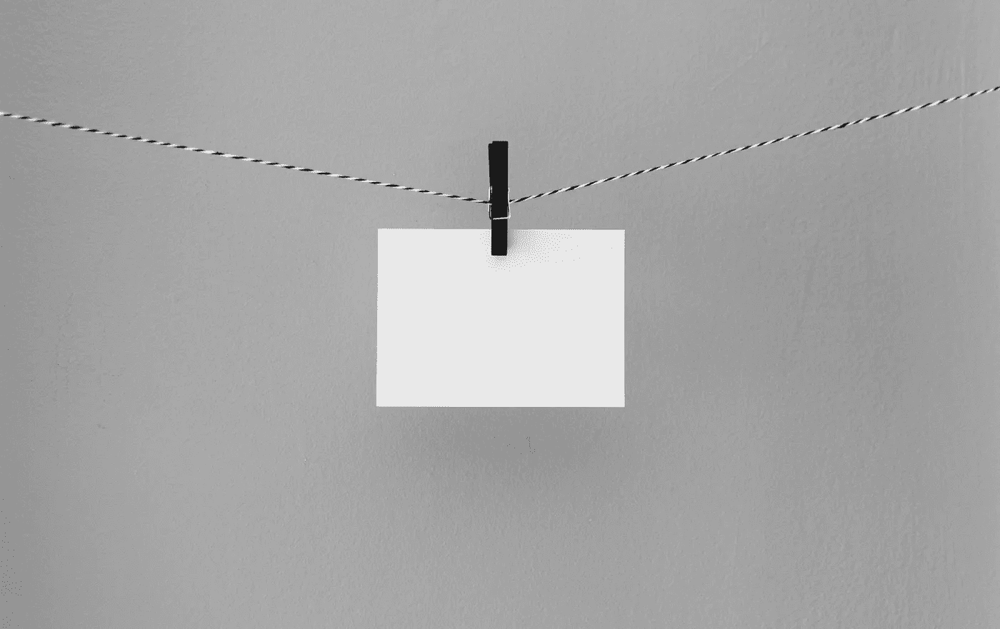

# 如何为你的自由职业者业务制定一个基本的营销计划

> 原文：<https://medium.com/swlh/how-to-develop-a-basic-marketing-plan-for-your-freelance-business-cb175b58faec>

Photo Credit: Kelly Sikkema via Unsplash

## 自由职业基础

大多数自由职业者都不擅长营销，因为他们放弃得太早。

你不要指望在街道上慢跑一圈后就能恢复健康。如果你努力锻炼一个月，然后减掉三个月，你也不会期望保持肌肉质量和轮廓。

一百万个锻炼计划可以融化腹部脂肪，预示着你性感手臂的胜利回归。

所以挑一个计划，坚持一年，就会看到效果。

## 选择一个计划。坚持下去。

你的营销健康也是如此。计划本身没有你的承诺和坚持重要。

*   在营销中，一致性胜过一切。
*   一旦你[把自己限制在两种策略](/@austinlchurch/want-to-grow-your-freelance-business-limit-yourself-to-two-strategies-eeb7ba45e03c)，你就能清楚地看到什么是行不通的。
*   一旦你[停止做那些不起作用的事情](/@austinlchurch/what-isnt-working-anymore-e7e352d58ac6)，你就可以尝试新的策略，最终[加倍做那些起作用的事情](/@austinlchurch/double-down-on-whats-already-working-502366dae4a0)。

当然，这种千篇一律的营销方式是建立在你保持条理性的基础上的。混乱是营销中的大象。组织混乱比糟糕的策略更快地践踏结果。

如果接下来的一年你所做的就是在附近用世界上最丑的邮递员轰炸邮政编码——我可以推荐一些深褐色的吗？—那你还是会接到几个电话。

## 消除摩擦。

通过消除障碍和摩擦，你可以与健身和营销保持一致。

去年 12 月，我参加了迈克尔·凯悦(Michael Hyatt)的“有史以来最好的一年”课程，他在课程中分享了一条关键建议:“降低障碍的最有效方法之一是提前做好计划。”

**例#1**

我可能会承诺在下午 5:30 前结束工作，这样我就可以在下午 5:45 前把全部注意力放在我的妻子和孩子身上。

将电话安排在下午 5:00 是可以的，除非超过 30 分钟。他们经常这样做，我不能在 5:45 前结束一天的工作。

更多的深谋远虑会告诉我永远不要安排在下午 4:30 以后打电话。

**例#2**

我可能会承诺一周跑步三次，一周锻炼三次。

信不信由你，懒惰不是主要的阻碍因素。随着时间的推移，我锻炼的可能性越来越小。所以如果我要健身，就必须在早上。

然而，我不喜欢穿脏的运动服，当我早上从壁橱里翻出干净的衣服时，我不喜欢打开灯打扰我熟睡的妻子。

更多的深谋远虑会告诉我投资几套运动服，并在前一天晚上把它们放在厨房里。

## 找出真正的罪犯。

我们有一系列常见的嫌疑人，我们把最严重的失败归咎于他们:恐惧、焦虑、自满、懒惰、贪婪、匮乏的心态。

但通常情况下，真正的罪魁祸首是一个更微妙的障碍，一些我们忘记消除的微小摩擦。

如果你消除了摩擦，你更有可能实现你的营销目标。

对我来说，计划不是关于完美的表现，而是关于识别潜在的障碍。清除杂乱和突发事件，你就能创造一条通往营销目标的顺畅之路。

一旦你给你的营销带来了更多的远见和组织，你将会在承诺和一致性方面更加轻松。

不要在星期二醒来，想着“我今天应该做什么营销？”几个月前你就应该自己解决这个问题了。

## 你应该组织什么？

为了进入营销状态，你必须组织以下活动:

*   目标
*   战略
*   策略
*   活动
*   日程安排
*   工具

现在，让我们谈谈你的营销目标。

(人们一直在写关于营销的书，而你现在没有兴趣看书。)

## 你的营销目标是什么？

填写下列陈述中的空格:

> 在(特定日期)之前，我想有(X 个)新的自由职业客户，他们每月为(你的自由职业类型)支付我(X 美元)。

为了实现这个目标，你必须选择一个初步的战略和战术。

许多自由职业者混淆了这两者。战术不是战略，就像右转不是公路旅行一样。策略不是目标，就像去洛杉矶的公路旅行不是洛杉矶一样。

因此，确保你清楚基本的营销术语:

*   你的目标就是你的目的地——洛杉矶。
*   你的策略是你选择的特定路线——40 号和 44 号州际公路。
*   你的战术就是你的转身。或者，如果你喜欢，在驾驶方向的不同要点。

你将采用不同的策略来增加你的 Instagram 粉丝，而不是增加你博客的流量。

假设你真的增加了 Instagram 粉丝，然后呢？你如何将追随者的数字货币转换成真实的美元？关注者和喜欢如何融入你的商业模式？

许多自由职业者开始营销时，脑子里都有一个模糊的“成功”概念。每一种策略，包括“建立大量的 Instagram 粉丝”，都做出了同样模糊的贡献。

所以在这方面，使用像 Instagram 这样的营销渠道并不等同于营销。你可以开着车四处逛逛，而不用去洛杉矶自驾游。

## 在 Instagram 上卖儿童书籍

既然我们已经讨论了今天的第二个类比，让我们来看一个具体的例子。

*   **目标**:卖出 1000 本[我的第一本童书*抢*。](http://grabblingbook.com/)
*   **策略**:使用 Instagram 上的购物向我的 Instagram following 销售。
*   **战术** : 1 —策划漂亮的儿童书籍插图，培养我的追随者；2——每周用一到两张插图教育我的粉丝关于*攫取*,并包括一个清晰的行动号召来购买这本书；3-每月举办一次免费赠书竞赛。请每位获奖者在书打开时拍一张他/她最喜欢的插图的照片，并在 Instagram 上用适当的手柄和标签分享；4——把书发给 Instagram 上有影响力的人(大多是妈妈们)。
*   **活动**:发帖、跟进、建立关系网、组织竞赛、跟进、跟踪结果。
*   **日程**:每日发布。每周日提升*抓取*。在每个月的第二个星期四开始竞赛。
*   **工具** : SmarterQueue，Shopify，TailWind，Rafflecopter。

## 结束语

我可能刚刚用这个营销的基本解释侮辱了我 99%的自由职业同事。原谅我。

我只想让大家明白这一点:营销不一定要复杂。再看看我上面的图书营销计划。它可以放在一张 4 英寸 x6 英寸的卡片上！

然而，如果你没有定义你的目标、战略、战术、活动、时间表和工具，你会在前进的每一步都遇到摩擦。当你真正想去洛杉矶的时候，你会在你的家乡兜圈子。

最终，你会放弃，让自己成为自由职业者。

请不要这样做！选择一个计划。坚持下去。如果有必要，把它写在一张 4 英寸×6 英寸的笔记本上。只是不要太早放弃。

你的计划本身没有你的承诺和坚持重要。

## 你今天想认真对待你的营销吗？

一个好的下一步是使用我的免费[“吸引更好的客户”工作表](https://app.convertkit.com/landing_pages/306495?v=6)来重新思考你的营销，并开始与你真正想要的自由职业客户联系——也就是那些会支付你所值的报酬的客户。

[点击此链接](https://app.convertkit.com/landing_pages/306495?v=6)分享您的姓名和电子邮件地址，我将向您发送工作表的下载链接。

## 这个故事发表在 [The Startup](https://medium.com/swlh) 上，这是 Medium 最大的创业刊物，拥有 272，751+人关注。

## 在这里订阅接收[我们的头条新闻](http://growthsupply.com/the-startup-newsletter/)。

