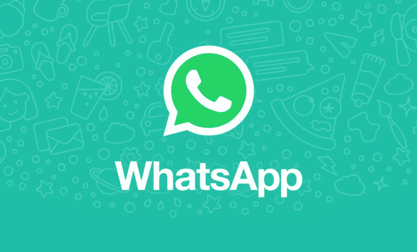
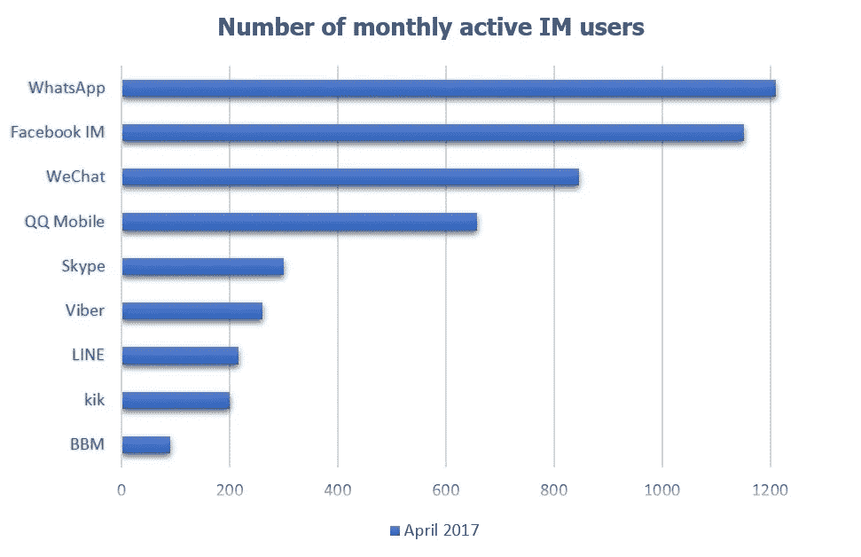
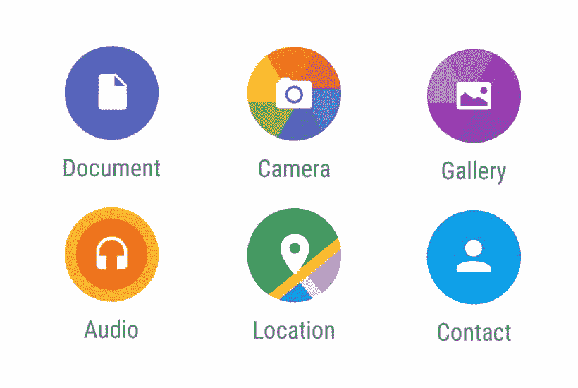
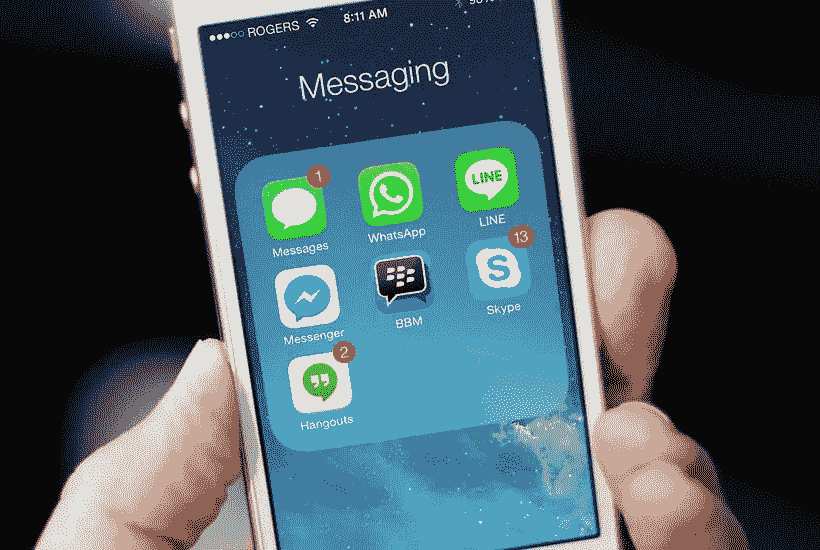

# 如何开发像 Whatsapp 这样的聊天 App

> 原文：<https://medium.com/swlh/how-to-develop-a-chat-app-like-whatsapp-e695257320f4>

你上一次用手机发 app 是什么时候？据发现，世界上 97%的人一生中至少发送过一次短信，平均每人每天发送多达 14 条短信，直接通过手机或通过 Whatsapp 等聊天应用。

还有 75%的移动用户更喜欢使用即时通讯应用进行交流，而不是电子邮件等更传统的交流方式。因此，毫不夸张地说，基于即时聊天的消息传递确实已经占领了整个行业，而且只会越来越多。截至 2016 年，Whatsapp 目前拥有 12 亿用户，是仅次于脸书 IM 和微信的全球最受欢迎的消息应用。

实时即时消息应用程序的特点是在两个用户之间实时传递消息和多媒体，这并不奇怪，投资者和开发者试图在自己的聊天应用程序中复制 Whatsapp 的成功。本着这种精神，本文将概述你可以装备自己成功创建 iOS 或 Android 聊天应用程序的主要方法，并看到你的应用程序在市场上取得成功。

# 聊天应用的理想功能

Whatsapp 的核心是为智能手机打造的消息服务，依靠互联网连接或手机数据。比短信服务更便宜，一些聊天应用以低成本订阅模式运行，但大多数都是免费的。每个成功的实时聊天应用都有吸引新用户的显著特征，而正是这种良好的功能是成功聊天应用的核心。

您的应用程序将承载的功能数量进一步决定了您的应用程序的开发成本。好好看看让 Whatsapp 如此大获成功的特性:

*   **即时通讯:**这是你的 app 成功的基础，也是所有聊天 app 的基本特性。它主要通过用户与互联网的连接来运行，即使当他们离线时，用户也能够在重新上线时收到他们错过的所有通知。因为所有的聊天应用都有这种即时通讯功能，所以这里重要的是一些小的附加功能:例如，进行私人或公共聊天的能力。你的应用程序会托管自定义字体、贴纸和表情符号，或者为那些永不停止的群聊提供“静音聊天”功能吗？提前安排功能也可以吸引用户(例如，推送通知提醒即将到来的生日、周年纪念日和节假日)。Skype 在一定程度上做到了这一点，但您可以更进一步。
*   **实时连接:**与即时消息中的“即时”相关，实时连接是聊天应用程序的首选媒介，因为消息传递迅速、即时，没有任何距离障碍，使用户感觉彼此更近。
*   **多媒体文件传输:**you chat 应用程序的用户将会爱上分享各种类型多媒体的能力，例如图片、视频、文件、GIFS 和贴纸。通过进一步允许与流行云服务(如 Dropbox、Google Drive、Evernote)的同步服务，最大限度地提高效率。然而，这个特性确实增加了开发成本。
*   **安全性:**这应该是您的另一个主要关注点，因为有必要保护您用户的数据安全，防止第三方渗透。对公开私人数据的担忧达到了前所未有的高度，因此一定要优先考虑用户安全。你可以投资高级加密技术来保护信息免受第三方渗透(见 [ChatSecure](https://chatsecure.org/about/) 和 [CryptoCat](https://crypto.cat/) )。
*   **推送通知:**这让用户在应用程序中保持活跃，并让他们全天候关注折扣、消息提醒和用户在线状态。允许用户自定义他们希望接收的通知数量(例如，每小时、每 7 小时等接收一次通知。).对于 android 聊天开发，可以使用 [Firebase 云消息](https://firebase.google.com/docs/cloud-messaging/)，对于 iOS 使用可以使用 Firebase 或者[苹果推送通知](https://developer.apple.com/library/ios/documentation/NetworkingInternet/Conceptual/RemoteNotificationsPG/Chapters/ApplePushService.html)，iOS 平台原生。您可以通过[套接字和套接字流](https://developer.apple.com/library/ios/documentation/NetworkingInternet/Conceptual/NetworkingTopics/Articles/UsingSocketsandSocketStreams.html)风格的编程进一步优化服务器和应用程序之间的通信。
*   **快速搜索:**这使得你的聊天应用的用户可以很容易地搜索和跟踪很久以前发生的对话。该功能在个人和职业生活中非常有用，在这种情况下，重要的细节可以在对话中分享，因此搜索功能应该易于使用和查找。
*   **群聊:**您的聊天应用程序应进一步允许用户通过群聊与其他用户联系，他们还可以在群聊中共享多媒体文件。
*   **视频和语音通话:**国际视频通话最初是由 Skype 推广的，即时聊天工具将这种即时的交流方式推向了一个新的高度。语音和视频通话功能进一步增强了聊天应用的互动性，对用户之间的互动和交流方式没有任何限制。
*   **社交整合:**社交媒体和社交生活并不存在于彼此脱离的真空中，那么你的应用为什么要脱离其他社交媒体应用呢？允许用户在你的应用程序上共享来自其他应用程序(如脸书和 Instagram)的帖子和内容，以充分利用信息共享。

# 使实时聊天成为可能的技术

聊天应用中使用的两种主要连接类型是 HTTP +推送通知和扩展消息和存在协议(XMPP)协议。HTTP +推送通知更多地用于 Instagram 等文件共享应用程序，当你发表评论时，用户会收到推送通知，当应用程序重新打开时，它会连接到应用程序的服务器，但在应用程序中内置默认的推送通知是一个好主意，这样用户就可以收到新消息的通知。

**潜在技术**

[**Erlang:**](https://www.erlang.org/) 这是主要的编程语言，大量流行的聊天应用 Whatsapp 和微信都是基于这种语言构建的。这是一个通用的垃圾收集器程序，使即时消息应用程序对用户的需求如此有用和直观。您的服务器可以从 Erlang 构建，但是 PHP 和 Java 也是不错的选择。

[**YAWS**](http://yaws.hyber.org/) :使用 YAWS 管理您的多媒体，YAWS 是一款高性能 web 服务器，专为高负载动态内容流入和流出的应用而开发。

[**可扩展消息和在线协议服务器**](https://xmpp.org/rfcs/rfc3920.html) :有了 XMPP 服务器，就不再需要多个客户端服务器来进行信息交换，允许应用程序扫描用户的通讯录，以建立可在应用程序中使用的联系人列表。这是 Jabber 的标准化形式，一种基于开放标准的协议，被用于创建 Facebook Messenger、微信、Whatsapp 等。

[**Mnesia DB:**](http://erlang.org/doc/man/mnesia.html)**这是一个数据库，允许您存储消息、文件、图像、文档以及将通过您的应用程序运行的其他多媒体文件。拥有一个这样的数据库至关重要，Mnesia DB 能够存储任意数量的数据，这是您创建和维护聊天应用程序所需的技术类型，远远超出了您的需求。**

# **开发和成本**

**构建聊天应用的主要任务包括后端开发、前端和网络应用、设计、原生平台和质量保证。
了解了聊天应用程序的基本特性后，聊天应用程序开发的初始成本大约在 30，000 美元到 55，000 美元之间，最高可达 120，000 美元。这些成本取决于您团队的小时费率。**

**一个经验丰富的开发团队构建应用程序本身的过程可能需要长达 1400 个小时(例如，集成一个消息功能可能需要多达 150 个工时，而多媒体传输至少需要 100 个小时)。**

**您的聊天应用程序的时间和相关费用将取决于您的应用程序功能的包容性，包括用户注册、地址簿信息和集成、消息交换和消息通知、多媒体互动程序传输、群聊功能、位置共享、用户状态/档案、搜索用户和聊天的能力，以及主持视频通话的能力。**

# **结论**

**这些是开发类似 WhatsApp 的聊天应用程序所需的一些细节。Whatsapp 可能会主导市场，但你的聊天应用仍有发展空间，只要你明白你的应用有哪些 Whatsapp 没有的功能。这种差异将使你的应用脱颖而出，吸引人们使用你的应用。**

****

**自下而上，这个过程可能看起来很复杂，尤其是如果您缺乏在前端平台上设计、开发和维护应用程序所需的高科技技能。你需要一个探索所有可能性的团队，不遗余力地满足你的业务和发展需求；一个帮助调查您所有业务需求和未来愿望的团队，让您的应用程序发挥最大潜力。**

**看看我们的网站，从我们以前的项目中汲取灵感，如果你需要开发一个即时聊天应用程序，请随时与 T2 联系。你需要一家有经验和能力为 iOS 和 Android 平台开发应用的公司。我们可以根据您的需求和预算为您提供免费的咨询和调查。**

***本文原载于* [*Octodev 博客*](https://octodev.net/how-to-develop-a-chat-app-like-whatsapp/) *。***

**如果你喜欢这篇文章，请点击下面的拍手图标，让我知道！**

****

## **这个故事发表在 [The Startup](https://medium.com/swlh) 上，这里有 263，100+人聚集在一起阅读 Medium 关于创业的主要故事。**

## **在这里订阅接收[我们的头条新闻](http://growthsupply.com/the-startup-newsletter/)。**

****