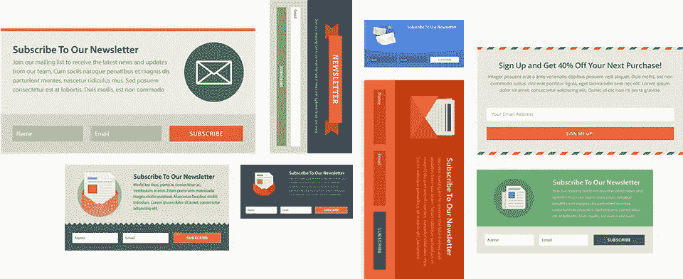
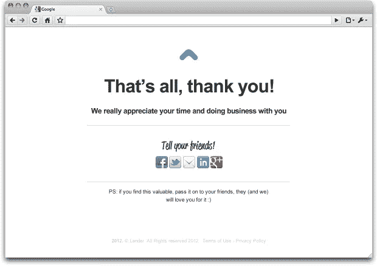

# 如何用表格和邮件成功开发一个营销目的数据库？

> 原文：<https://medium.com/swlh/how-to-develop-a-marketing-purpose-database-successfully-with-forms-and-emails-64322059cfe6>

“Colorful lines of code on a MacBook screen” by [Caspar Rubin](https://unsplash.com/@casparrubin?utm_source=medium&utm_medium=referral) on [Unsplash](https://unsplash.com?utm_source=medium&utm_medium=referral)

我们都知道，作为营销人员，如果我们想留住现有客户或获得更多新客户，建立一个包含客户信息的列表非常重要。但是很多情况下你会发现，通过表格和邮件成功收集客户的信息真的很难。从现在开始，因为顾客平均每天会收到 20 封邮件，所以他们宁愿不打开就删除或退订。

但这并不意味着电子邮件和表格不再有效，**这是因为大多数营销人员没有以正确的方式设计这些资产，以至于他们失去了这封小小的电子邮件和表格所能产生的大部分效果。**

这里有一些建议，我们可以尝试通过创建有效的表格和电子邮件来建立全面而有用的数据库。

我们之前讨论过行动号召和登录页面，在那里我们向客户提供**有用和相关的信息**。然而，**表单是我们向客户索取信息的地方。**

为了使购买快捷方便，你需要遵循以下规则。

# 少即是多

只问你真正需要的信息。

你问的问题越少，人们提供的可能性就越大。只需坚持基本的信息，如名和姓、电子邮件、电话号码、公司、职位，还可以留一个空间给可选的信息或请求。

# 重复你的行动号召

这是另一个吸引访客的机会。

标题应该鼓励客户采取最后的步骤并完成表格。但不要在最后一次点击时使用“提交”。你应该尝试更多的定制词，例如:**开始您的免费旅程/下载您的免费报告/注册免费时事通讯/兑换您的优惠券。**

# **明确标注字段**

这样人们就能清楚地知道哪些是必须的，哪些不是。如果他们不清楚需要什么，错过了一个，他们就不能提交并一个接一个地回头寻找空白，很可能会沮丧地放弃这个过程。最终你会失去他们。

# 向访问者保证他们的信息在你这里是安全的。

您可以包含隐私政策页面、网站条款和条件的链接。包括认证或安全席位，如果你有的话。这将有助于缓解游客的焦虑，使公司和品牌更值得信赖。

# 实时响应

试着实时提供你承诺的报告、指示、确认和其他东西。

客户对实时响应有很高期望。

# 说谢谢

别人填完你的表格后，说谢谢。人们花时间来填写你的表格，所以一定要感谢他们的时间和提交。

> 花点时间想想你想要什么样的经历。只要求人们乐于分享的必要信息。这将有助于创造积极的体验，增加您购买成功的机会。

## 在担心表单的事情之后，接下来就是从表单中创建和维护数据库的步骤。

这可以帮助您定制沟通方式，以便与客户建立联系，让他们愿意参与您的品牌。

> **数据库**是一个有组织的、可访问的信息集合。

数据库系统通常是加载在计算机上的软件程序，允许您输入一些信息，并在需要创建潜在客户列表时进行一些研究。

> 您输入标准，数据库将竞争搜索，并生成符合这些标准的销售线索。

如果您还在考虑是否需要创建一个数据库？这里有一些令人信服的因素，

## 节省时间

一旦你建立了数据库。，只需点击几下鼠标，信息就会被分类。各种查询都可以通过点击来解决，而不是手工收集。

## 帮助您定制

这样您就可以个性化您的信息。这将提高您电子邮件内容的一致性和质量。

## 创建透明度

因为所有的信息都是由你公司里有权限的人提供的，所以要避免重复劳动，提高效率。

## 扩展您的业务

随着您雇佣员工并随着矿石位置的增长而支出。

## 提高自动化程度

因为它可以用特定的软件创建自动电子邮件。

# 那么如何创建一个呢！

这里有三个步骤！

# 获取信息

从您的网站注册表格和登陆页面添加到您的数据库。许多网站程序自动与网页通信，以填充信息。

# 创建类别

**根据标准对数据库中的潜在客户进行细分，然后根据对您的业务最重要的因素**进行排序，比如地点、公司规模。

# 保持当前状态

消除重复和不活跃的线索。**这将有助于您专注于当前和合格的线索。**

> 创建联系信息数据库使您能够将潜在客户转化为合格的潜在客户。您的数据库范围广泛，能够帮助您随着时间的推移发展和扩展业务。

# 在这里找到更多我的故事！

# 顺便说一下，👏🏻*鼓掌*👏🏻如果你喜欢这篇文章，请举手(高达 50 倍)。它鼓励我继续每天写作，并帮助其他人找到它:)

## 这个故事发表在《创业》杂志上，这是媒体最大的创业刊物，有 314，551 多人关注。

## 订阅在此[接收我们的热门故事](http://growthsupply.com/the-startup-newsletter/)。

