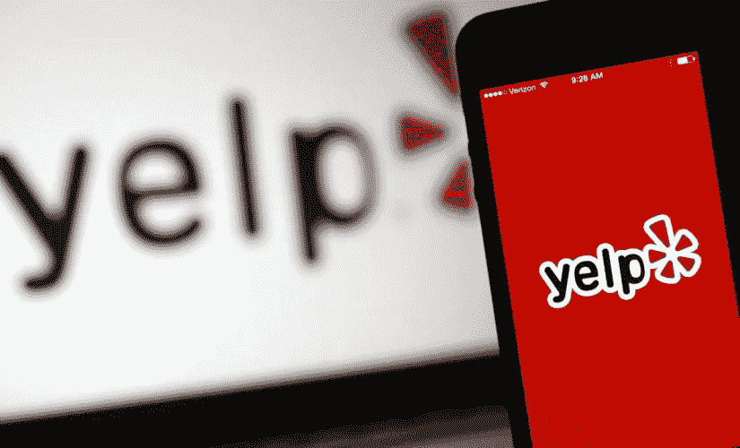
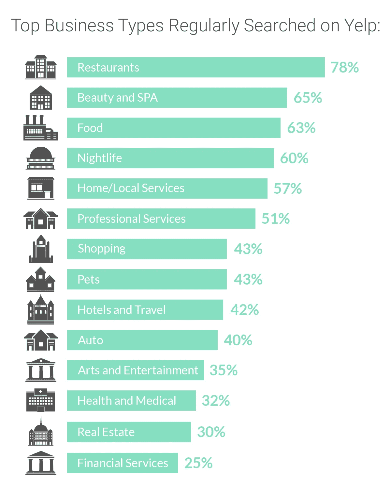
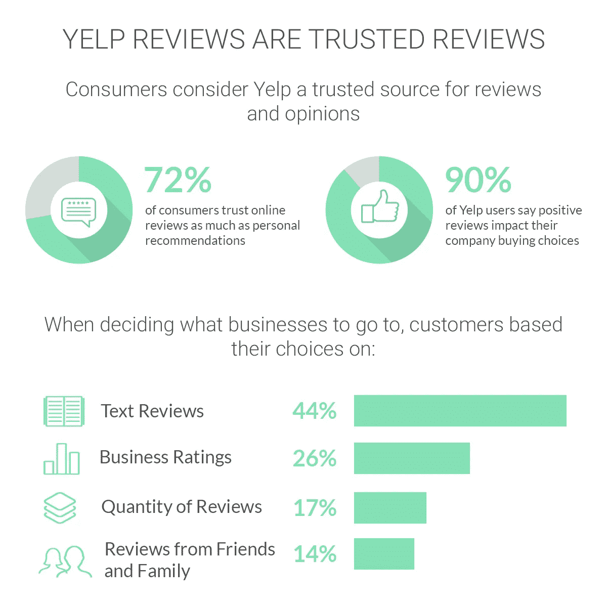
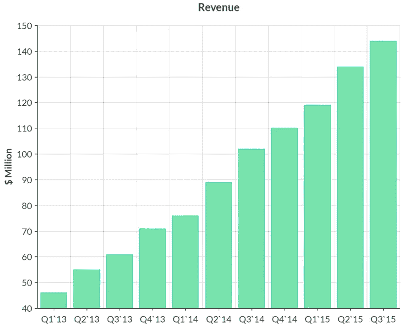
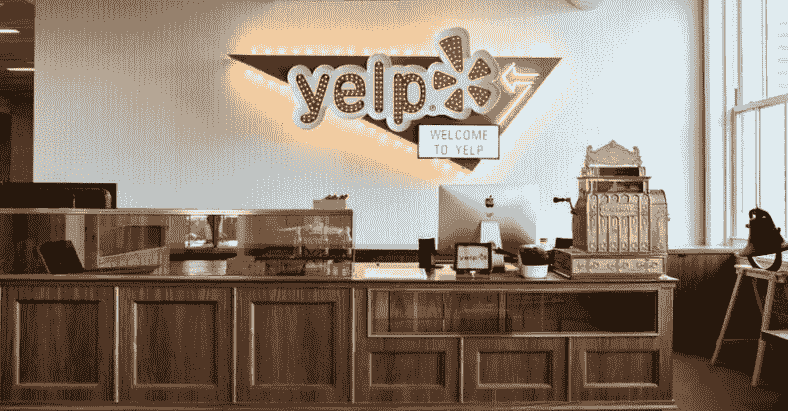

# 如何开发一个类似 Yelp 的应用程序

> 原文：<https://medium.com/swlh/how-to-develop-a-yelp-like-application-8224e8a86828>

# 叫声里有什么？

Yelp 应用程序允许其 1.42 亿独立用户搜索本地企业和服务，并查看关于它们的评论。这是一个应用程序，让用户提交该地区各种商店的信息，如名称，地址，图片和评级，在另一个页面上，用户可以看到在地图上提交的商店，以更好地可视化哪些商店在位置上更近。像之前的许多点播应用一样，Yelp 的成功之处在于它能够简化生产线，让消费者直接面对需求。

这看起来像是一个基本的商业模式，但实际上，已经证明 Yelp 评级审查将销售额提高了 5-9%，这相当于每年大约 8000 美元。Yelp 简单而有效的模型改变了服务选择的概念。在这里，我们将概述构建“Yelp for X”所需的一些关键组件和功能需求。

# 关键 Yelp 组件

## 确定你的市场受众

这是开发“Yelp for X”类型应用程序的第一步。在服务提供商方面，为了构建应用程序，您需要两个页面，一个用于提交商店，另一个用于在地图上显示它们。

你必须思考并澄清这两个重要问题:“我的应用程序将选择哪种类型的服务来确定附近的地点”和“在这个特定地区/国家开发我的应用程序的特性和功能时，哪些地理和人口统计需求是至关重要的”。

但是要考虑到你的应用程序的主要用户可能是当地居民、旅行者、商人或游客。进一步考虑到 78%的用户对餐厅/食品类别更感兴趣，所以你可以将你的应用程序定位于这一领域，或者使其更加小众。

## 建立一个像 Yelp 一样的应用

**1。用户资料:**这可以包括与其他社交媒体账户的整合，如脸书或 Twitter。这是大多数社交媒体应用的基本功能，有助于简化应用的用户体验，所以不要错过。

开发 Yelp for X 应用程序所需的时间取决于您的开发经验。在用户的个人资料中，他们可以看到他们所有的评论和照片，进一步浏览他们过去访问过的所有地方，并将这些地方添加到您的“收藏夹”列表中。

考虑为那些去过最多地方和提供最多评论的用户添加一个分级功能。用户资料越是身临其境、安全、可靠和个性化，你的用户就会越信任你的应用，并把它推荐给他们的朋友，从而扩大你的客户端用户群。

**2。评论和评级:**这可能看起来是一个常见的功能，但通过评论和评级选项查看过去的用户体验和阅读它们的能力是非常重要的。这是吸引潜在客户的原因，所以像 Yelp 一样，把评论和评级作为你的主要特色之一。

72%的消费者相信在线评论和个人推荐，还有 90%的消费者认为正面评论会影响他们的公司购买选择。

为了实现这个功能，你需要一个服务器来存储所有必要的信息(可以通过唯一的谷歌/苹果标识符来进一步跟踪评论)。

当我们考虑到高达 82%的 Yelp 用户带着购买的意图来到应用程序或网站时，利用这个机会是有意义的。该窗口仅持续一周，因为 89%有购买意向的用户会在一周内完成购买。

因此，我们可以从 Yelp 用户的评论如何对你的应用程序的成功产生巨大影响中学习。为了开发您的评级算法，请考虑这样一个事实，即它需要能够分析大量的用户活动和他们生成的内容。为此，需要一台专用服务器。

**3。推送通知:**你会希望你的应用能够为你的用户提供与他们周围的企业类型相关的信息，而要做到这一点，你需要关于人们偏好和生活方式的关键信息。Yelp 目前只提供关于评分和评论的信息，所以这是一个机会，让你的 Yelp like 应用程序比 Yelp 更新，更面向用户。

**4。活动流:**这是社交媒体应用和网站的另一个核心组成部分。此功能按时间顺序列出所有之前的活动和通知，并显示在您的应用程序中。它让用户了解正在发生的事情以及其他人如何使用该应用程序，并可以指导他们尝试新的业务和服务，因此这一功能带来了大量的机会。

**5。基于地理位置的搜索:**这是每个按需应用成功的基石，也是这类应用的关键特征。把你的客户从指出他们居住的城市的麻烦中解救出来，因为你的应用地理定位服务会为他们做这件事。

能够根据距离对企业进行分类是很重要的，这样你的应用程序用户就能知道商店相对于他们的位置在哪里。当然，地理定位是用户让你的应用程序访问他们的地理位置的可选功能，如果用户切断了你的应用程序的权限，你的应用程序将无法发挥最佳水平。

# 种类

您可以进一步考虑添加搜索类别，以便能够在地图上快速找到您需要的任何和所有机构，无论是 3 星级的米其林餐厅还是当地的加油站。此外，你可以阅读评论，查看每一个比萨饼店，酒店，商店和任何其他地方的评级，以选择最好的一个。

你的 Yelp 应用程序检测并显示附近所有有趣场所的列表，这个列表会很长，包括美发沙龙、商店、市场、咖啡馆。过滤器的应用将优化用户体验，因为他们可以选择他们的优先级(即，根据距离、价格或评级对地点进行排序的能力)。

为了进一步优化 Yelp for X 应用的用户体验，请确保用户在选择地点时，可以查看企业的详细信息(即正确的企业地址、电话号码、工作时间)。您希望您的应用程序提供所有这些信息，并进一步能够计算出到达目的地的路线。

# 货币化方法

**付费/赞助搜索:**这是最简单也是最有效的创收方式之一，简单来说就是你让当地的企业主为你的应用托管他们的广告而付费。您可以通过为用户添加付费服务来进一步赚钱，让用户拥有广告删除功能，从他们的个人资料中删除广告。

**广告:**这是从你的 Yelp 应用中获取收入最简单快捷的方式。福布斯估计，当地企业的广告占 Yelp 公司评估价值的 73%左右，这在 2014 年至 2015 年间增加了 310 亿美元至 350 亿美元。

**优惠和交易:**像 Groupon 一样，考虑实施一个内置的优惠系统。如果用户能够找到你的应用程序上独有的服务折扣和交易(去当地加油站可以享受优惠油价，如果他们留下评论，可以在餐馆享受优惠或免费用餐)，这将极大地激励他们使用你的应用程序。

用户和服务提供商都以这种方式获益，而作为应用开发者的你也从每笔交易中获利。这是 Yelp 赚钱的主要方式之一，所以作为一名应用开发者，这是你应该考虑的一课。

网上购物:这将增加你的启动成本，但允许顾客网上购物的服装店功能为 Yelp 带来了约 5%的年收入，所以这是一个可以考虑的选择。

# 可选:添加游戏化功能和其他附加工具

人们发现，增加竞争精神的优势会增加你在生活中和应用程序中的参与度，所以考虑增加游戏化功能。

Foursquare 是一个比 Yelp 更好的例子，因为他们实现了贴纸、徽章、虚拟货币和提名，如果你决定进行应用内购买，这些可以转化为额外的收入形式。如果我们仔细看看 Yelp，我们可以看到它添加了创新工具 SeatMe，这使得各种餐厅和咖啡馆远程管理餐桌预订成为可能。

向餐馆收取这些工具的费用增加了一条额外的收入途径。添加一个**注册功能**来从你的应用程序中在餐馆和应用程序中预订餐桌(为此功能向用户和餐馆收费)是一个潜在的创新选择。

此外，能够**上传图片和视频**，并通过社交媒体(如脸书直播、Snapchat、Instagram Stories)传播这些视频，将意味着用户可以分享他们的生活体验。

拥有**过滤功能，**用户可以上传和编辑你的应用程序独有的特殊功能的图片，也可以吸引你的用户，并保持他们对它的忠诚。

应用内购买也是获得额外收入和提高用户友好度的好方法。它很时尚也很有用，因为直接在应用程序中搜索和预订外国城市的酒店的功能进一步刺激了用户对应用程序的喜爱。

# 需要多长时间？

根据开发人员的经验，这可能需要 12 到 24 个月的时间，你需要 3 到 5 个不同的专家来建立数据库、后端、前端、设计等。

开发 Yelp 这样的应用程序的启动成本很难估计，所以我们建议开发 MVP(最小可行产品)。这将帮助你测试你的想法，并通过不在大量资源上花钱来省钱。Foursquare API 有一个很棒的场地数据库，而且大部分是免费的。

应用程序开发每小时的平均市场价格为 50 美元，但这一价格取决于开发国家/地区(您的开发人员所在的国家/地区，例如乌克兰大约为 35 美元/小时)、您的平台(iOS 与 Android)、设计界面，这可能需要 80-200 美元，也可能从 4，000 美元到 10，000 美元不等。

创建一个用户友好的应用程序，UX 设计(即一个易于使用的应用程序，这样你的客户，通常是某种类型的旅行者，可以快速而轻松地确定自己的方向)，可能需要 40-140 个小时，成本约为 2000-7000 美元。

以下是对“Yelp for X type”应用程序的开发时间和成本的估计。

*   社交登录:30-40 小时，1100 美元以上
*   推送通知:80-100 小时，费用 2800 美元以上
*   地理定位:大约 70-100 小时，最高 2500 美元以上
*   上传图片和视频:80-160 小时，3000 美元以上
*   评论和评级:80-160 小时，2800 美元以上
*   过滤器集成:300 多个小时，15，000 美元以上
*   按类别过滤:40-60 小时，1400 美元以上
*   预订:200–250 美元，7000 美元以上
*   用户简介:300-340 小时，10，500 美元以上
*   购买应用程序:120-160 小时，4000 美元以上

所以，你看到的最低价格是 9 万美元，最高价格大约是 17 万美元。这可能看起来有点高，但你的 it 开发人员和设计团队的质量决定了你的应用程序的未来，所以把你的资金投入到一个好的团队，以最好地确保一个独特的应用程序的开发和成功。

像优步和 Yelp 这样的应用程序可能会主导市场，但利基新应用程序总是有空间可以走得更远。我们自豪地与真实的人合作，为 web 和应用程序开发做真正的工作。我们的团队相信任何想法都值得尝试，我们相信我们可以帮助您更好地了解您的项目，帮助您设定里程碑，并一步一步地走向未来。我们将与您详细讨论 Yelp for X mobile 应用程序的所有规格，为您打造一款功能强大的应用程序，并让您全程参与其中。

这似乎是一个挑战，但为一个规模较小、服务不足的市场开发一个应用程序，有可能让你扩大业务规模，并获得惊人的结果。我们想帮忙。请向我们咨询更多信息，以便我们可以帮助您构建您的杂货交付应用程序！因此，请立即联系我们，我们可以为您的业务和发展需求奠定基础。[今天就联系我们](https://octodev.net/contact-us/)免费咨询或评估你的 Yelp like 应用，我们将尽最大努力帮助你，为你的公司和应用的成功铺平道路。

*本文原载于* [*Octodev 博客*](https://octodev.net/developing-a-yelp-like-application/) *。*

如果你喜欢这篇文章，请点击下面的拍手图标，让我知道！

## 这个故事发表在 [The Startup](https://medium.com/swlh) 上，这是 Medium 最大的创业刊物，拥有 273，971+人关注。

## 在这里订阅接收[我们的头条新闻](http://growthsupply.com/the-startup-newsletter/)。

