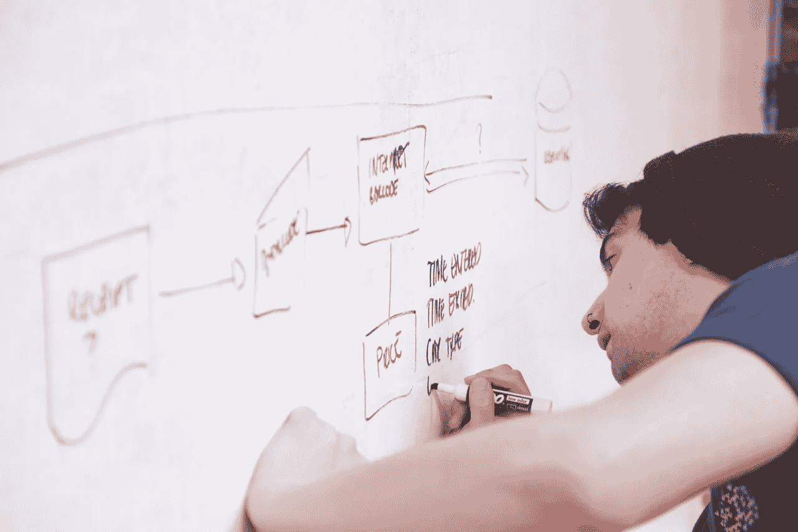

# 如何为一个 Rails app 开发更好的 UI？

> 原文：<https://medium.com/swlh/how-to-develop-better-ui-for-a-rails-app-c64681999daa>

How to develop better UI for a Rails app?

互联网包含了我们寻求的所有答案。这种著名的媒介是密集的，有时是混乱的。然而，我总能找到我想要的答案。功劳属于可用性和熟悉度。当你悬停在键盘上，一切准备就绪，你的手指将完成工作，你的眼睛不需要离开屏幕。你只需要一个带下划线的蓝色单词或短语就能识别超链接。我们是网络的常客，所以我们的感官熟悉标准的视觉线索和模式，使我们能够在几秒钟内无缝地浏览大量数据。如果你想在这个迷宫中找到自己，更重要的是，转化成用户的日常习惯，一个开发良好的用户界面是至关重要的。话说回来，你明白这一点。因此，你今天出现在我们的页面上。

# UI 如何影响我的用户？

将您的 web 应用程序视为用户的家。你的用户界面(UI)很像底座和电线。换句话说，UI 是帮助用户与设备交互的可视化功能结构。所有固定的设计元素，如页脚和页眉，都属于 UI。他们撑起屋顶，让灯彻夜亮着。另一方面，你的用户体验(UX)是室内装饰和美化。UI 关注的是建造一个坚固、实用的房子，而 UX 关注的是这个房子能改造成什么样的家。它用美学来控制你的用户在那里的感受。用户界面和 UX 对人们是否喜欢使用这个网站有很大的影响。

# 前端友好导轨

Ruby on Rails 是一个开发 web 应用程序的引人注目的框架，它为 web 开发提供了 MVC(模型-视图-控制器)方法。您的前端开发将负责 MVC 的“视图”部分。从本质上来说，MVC 旨在将这些组件分离开来，所以你的前端开发人员可以在不了解控制器和模型是如何实现的情况下设计视图。然而，他们需要知道 Rails 是如何工作的，它的项目结构是什么样子，以及一些 Ruby。

对于一个前端友好的 Rails，React 将被证明是一个非常适合您的工具箱。看，React 非常适合构建前端应用，而 Rails 非常适合后端应用。如果您的项目需要一个后端，它拥有一个记录良好的可靠数据库，以及稳定增长和稳定性的历史记录，那么 Rails 就是您的答案。Rails 和 React 两者配合得非常好。

# 如何开发更好的 UI？

*   您会发现，对于某些应用程序，先在 Rails 中构建它们，不使用 Javascript，然后使用 Javascript 增强其行为会更容易。对于任何基本的 Javascript MVC 框架，这通常需要对 Rails 控制器和视图进行大规模的重构。即便如此，你会发现在最初的时候，构建一个没有任何丰富交互的应用要容易得多。这使得你的开发者可以专注于使应用程序的核心部分稳定和快速:数据模型，数据加载和相关的主题，获得一个体面的用户界面。
*   更改您的 [Rails 应用程序](http://www.cognitiveclouds.com/custom-software-development-services/ruby-on-rails-development-company)以包含前端生成的 UUIDs。这个开关可以让你的前端从后端解放出来，关于咨询。它允许您的开发人员以比顺序 id 更简单的方式编写某些高级后端通信技术。
*   仔细考虑 API 响应的格式。这将确保您的 API 更易于使用，对于您的前端和第三方，此外还有可扩展性。JSON API 是一个优秀的响应标准，所以您不需要重新发明轮子。
*   创建一个活的 API，超越请求-响应循环。这将有助于使你的前端更加互动，带来实时更新，让你可以看到其他用户正在实时编辑你的应用程序。
*   大多数团队经常忽略将他们的前端提升到一个更高的水平所带来的挑战，即将他们的前端与 Rails 完全分离。在这种情况下，请确保设置跨来源资源共享。
*   为多次修订留出空间。您可以从使用图形编辑器制作原型开始。然后将它转换成标记，并使用一个主要用于网格布局的框架。
*   研究。尝试查找优秀的网页设计，找出你喜欢的东西，它们的微妙之处，配色方案和排版。学以致用。

> 优先考虑并选择最合适的方法。在当今这个即时满足的世界里，最成功的应用程序是那些快速高效响应的应用程序。设计和软件在很大程度上基于用户体验，因为它已经完全与消费者相关。即使他们只是简单的浏览，你和你的 UI/UX 设计者也要尽可能的以最有效的方式引导他们浏览你的网站，这样他们就能得到他们需要的产品或服务。

*原载于 2017 年 7 月 22 日*[*【www.cognitiveclouds.com*](http://www.cognitiveclouds.com/insights/how-to-develop-better-ui-for-a-rails-app/)*。*

## 这篇文章发表在 [The Startup](https://medium.com/swlh) 上，这是 Medium 最大的创业刊物，拥有 299，352+人关注。

## 在这里订阅接收[我们的头条新闻](http://growthsupply.com/the-startup-newsletter/)。

