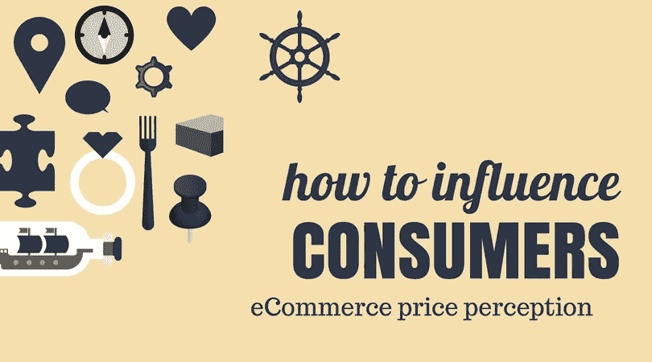
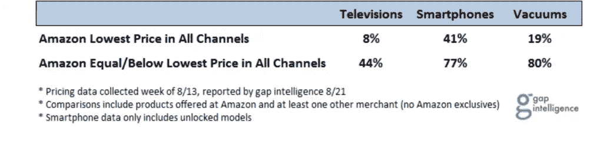
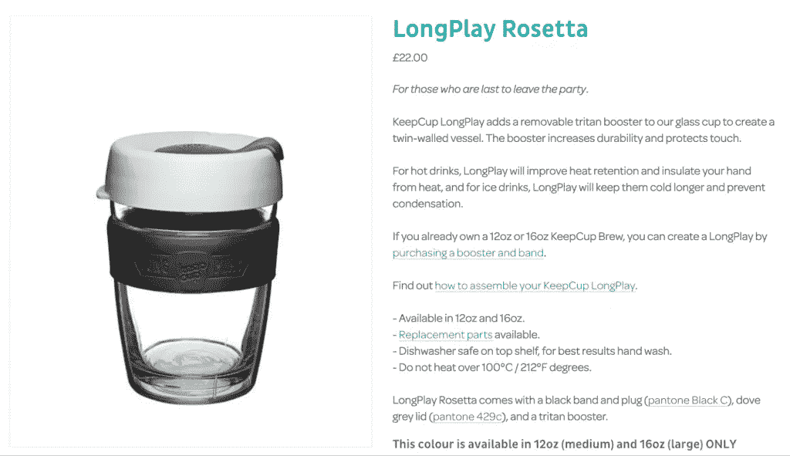
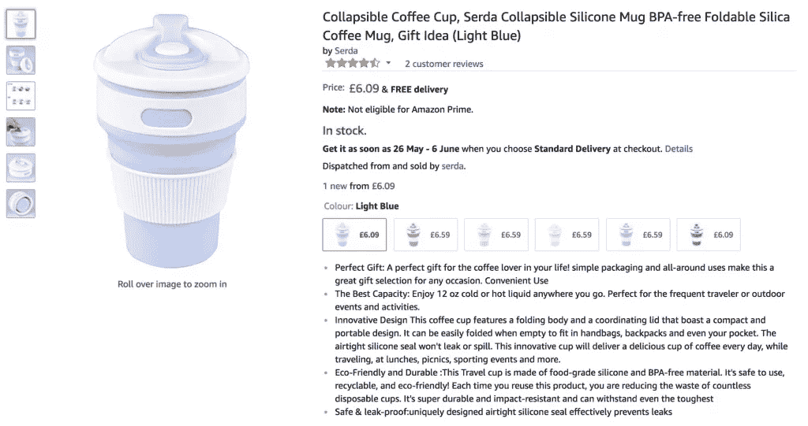
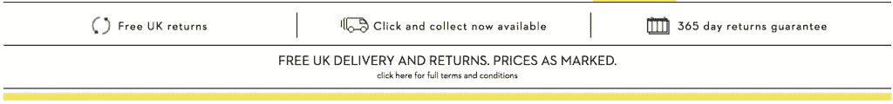
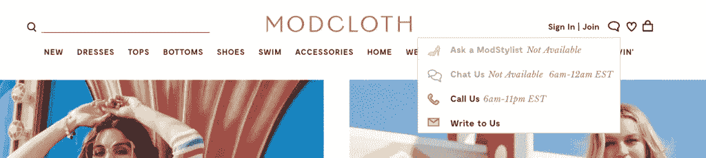
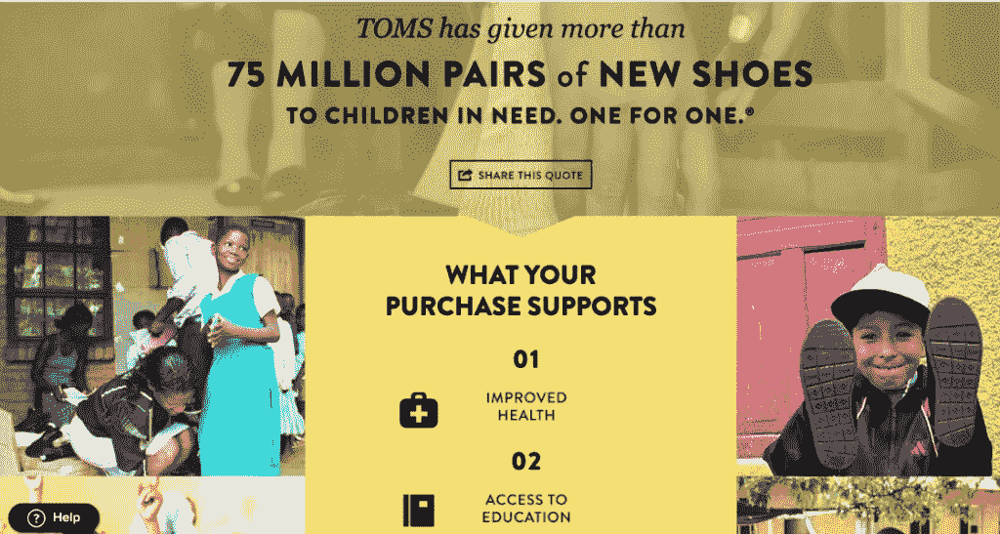
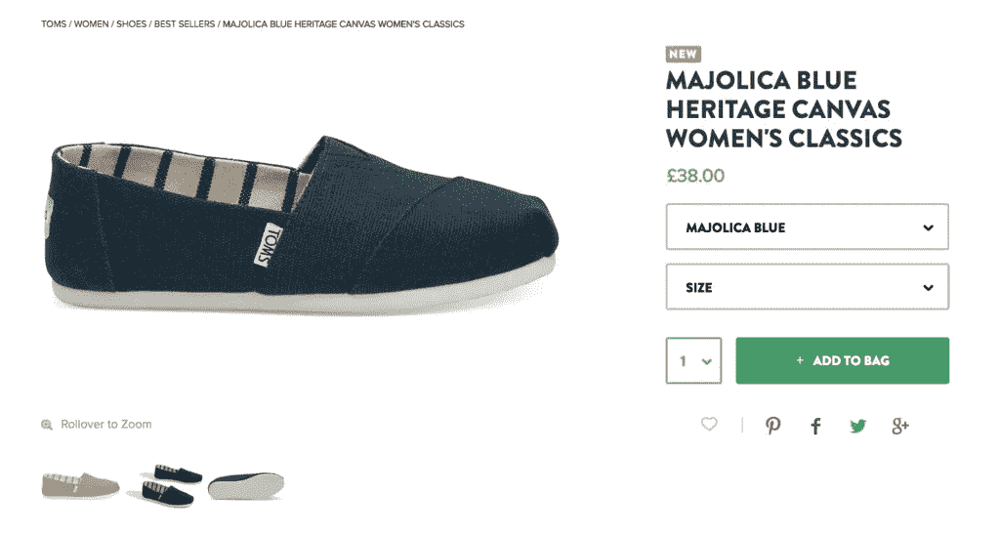
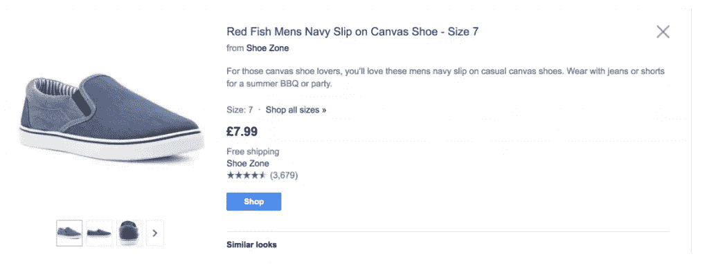

# 如何引导和影响在线购物者对电子商务价格的感知

> 原文：<https://medium.com/swlh/how-to-direct-and-influence-online-shoppers-ecommerce-price-perception-b209bfdbb592>

任何事物都有内在价值或价值吗？这是许多电子商务企业主在确定价格时会思考的问题。

你看，事实是，你的价格只有在你的顾客认为好的时候才是好的。

这样想吧。

一美元的房子？与房子通常的价格相比，这似乎是一笔不小的数目。

4500 万美元的房子？在这一点上，如果你有这笔钱花，你可能会想仔细考虑你的房子里会有什么东西和功能可用。

这一切都归结于感知。如果你能在很大程度上影响你的购物者的看法，让他们认为你的价格是值得的，你就可以开始围绕定价和要求你想要的价格进行对话。

但是，你如何去影响电子商务的价格认知，这又如何适应你的定价策略呢？我们将在本帖中找到答案。

# 亚马逊，感知还是现实

当谈到电子商务价格认知与现实时，这一切都归结到价值主张。找到正确的价值定位，你就能主宰市场。如果弄错了，你的目标客户对你的品牌或产品的唯一印象就是:低价值。

谈到价格认知，亚马逊是先驱。亚马逊购物者大多认为，通过使用亚马逊，他们买到了便宜货。除此之外，亚马逊还能够为购物者提供如下好处:

*   产品系列
*   便捷的购物体验
*   安全性
*   速度

但是他们低廉的价格往往吸引购物者来到他们的市场，创造出一种近乎本能的商品。

需要买点什么吗？我们先查一下亚马逊。

该过程通常如下进行:

在其他商店浏览您的商品->首先查看亚马逊

它很少遵循

在亚马逊上浏览您的商品->查看另一家商店。

通过占据每日电子商务销售的很大一部分，亚马逊能够保持他们的看法，即他们的价格是最好的。

亚马逊通过以更低的价格提供许多产品来做到这一点。许多购物者不知道(或者即使知道也不在乎)的是，亚马逊在其他商品上弥补了损失的利润。

由于上面列出的其他好处(安全性、易用性等)，客户不介意在其他商品上花更多的钱，因为他们知道他们正在购买某些产品。进退两难。从亚马逊购买一切是有意义的。

这是他们的价值主张，也是他们能够主导和实施价格认知的方式。

但是这种策略对于那些发现很难与亚马逊这样的公司竞争的小型电子商务商店来说公平吗？

# 较小的电子商务商店价格认知

当谈到较小的电子商务商店时，价格认知的一个流行策略是[竞相杀价](https://blog.prisync.com/benefits-of-competitor-price-monitoring-software/)以获得最低价格。

然而，当你削减每笔销售的利润时，这对你的整体利润没有帮助。不过，事情不一定非要这样。

顾客通常会通过两种方式对你的商品进行估价并决定其价值:

1.  他们自己的直觉
2.  将其与另一种产品进行比较

我们已经说过，像亚马逊这样的巨头不必处理比较因素，因为消费者很少将亚马逊的价格与小型电子商务零售商进行比较。

然而，每个零售商都需要关注直觉因素。直觉起着很大的作用，因为它帮助消费者“知道”某样东西对他们来说值多少钱。

对于较小的零售商来说，要提高价格认知，你可以采用一些策略，让顾客在看到你的产品时的直觉是“这很超值”。

我们来看一些战术。

# 通过有效的品牌推广提高您的电子商务价格认知

在电子商务中，如果你想要求更高的价格，品牌就是一切。这是你区别于兼职店主的地方，也是你成为成熟企业的原因。

从心理学上讲，当顾客看到一个好品牌时，他们会自动想到更高的价格。你可以用多种方式给你的产品打上品牌，从你发布的营销材料到你使用的产品描述。

当你有一个强大的品牌时，顾客会被你吸引，并乐意为你的产品支付额外费用，尤其是当其他人都是这样的时候。

[Keepcup](https://uk.keepcup.com/?country=United%20Kingdom) 是一家公司利用品牌提升其电子商务价格认知的绝佳例子。

KeepCup 是一家可重复使用的杯子公司，销售饮料行业的各种产品。

他们的 12 盎司大杯售价 22.00 英镑

然而，在亚马逊上快速搜索显示，你可以以 6.95 美元的价格免费获得一个类似大小的杯子。那么，为什么有人会花两倍多的钱买一个杯子，而他们可以用更便宜的价格买到一个相似的杯子呢？

再次归结为品牌。如果你在研究可重复使用的咖啡杯，KeepCup 这个名字会经常出现。这在很大程度上归功于他们令人印象深刻的营销。

因为它经常出现在你的搜索中(因此在你的脑海中),当你做决定时，你会被更昂贵的选择所吸引。

看亚马逊杯，是什么牌子的？这很难知道，正因为如此，它会吸引那些只是寻找最便宜的选择，而不太关心研究的廉价买家。

Keepcup 能够吸引他们的完美观众，并迫使他们以他们认为物超所值的价格购买。

# 为了提高价格认知，超越

我们之前提到过亚马逊如何通过易用性和其他因素获得并展示强大的价值主张。仅仅因为你的电子商务商店没有亚马逊大，你仍然有办法通过超越来提高你的电子商务价格感知。

你可以为你所有的产品提供免费送货和退货。这增加了价格认知，因为顾客或多或少会乐于支付更高的价格，因为他们知道如果产品不适合他们，他们可以免费退货。此外，如果你有一个很棒的产品，他们退货的可能性很小。

英国服装零售商博登为所有顾客提供免费送货和退货。它消除了一些消费者在网上购买衣服时的摩擦，因为他们感觉不到它们。

在这种情况下，客户的平均订单价值实际上可能会增加，因为他们更愿意尝试不同的商品，因为他们知道可以轻松退货。

你也可以利用[客服](https://blog.prisync.com/improve-online-sales-customer-service/)作为你的竞争优势，提供 24 小时实时聊天，或者甚至承诺在一定时间内给客户回复。注:不耐烦的客户希望在比你想象的更短的时间内收到回复。

Modcloth 有各种选项供客户联系。

他们明确地告诉客户如何以及何时联系他们。知道一个支持代理只需点击一下鼠标，对购物者来说是一个非常有用的激励，将会提高你的品牌和产品的价格和价值感。

# 向前支付以增加价格感知

这并不奇怪，消费者喜欢与回馈当地和全球社区的公司一起购物并给予支持。

当人们决定买什么和如何花钱时，他们喜欢他们的购买可以帮助别人的想法。

这就是 TOMS 鞋业公司如此成功的原因。

在帮助贫困社区方面，TOMS 一向以慷慨著称。

你每买一双 TOMS 鞋，他们就给需要的人捐一双鞋。此外，他们根据自己的现状和生活条件，为有需要的人提供一系列不同的鞋子。

买一双 TOMS 经典编织鞋，你得花 38.00 英镑左右，客观地说，我发现一双类似的鞋只要 7.99 英镑。但是顾客回到 TOMS 是因为他们为那些不幸的人做了很多艰苦的工作。

如果你想提高你的电子商务价格感知，为什么不看看你是否可以利用慈善的概念到你的业务。回报你的社区，你的社区也会回报你。

# 电子商务价格感知:最后的话

在这篇文章中，我们分析了电子商务价格感知的概念，以及它如何影响购物者对你的商店和产品的看法。

我们已经了解了价值主张的概念，以及为什么您需要了解自己的价值主张才能在行业中占据主导地位。

为什么不试试通过灌输价格感知策略来增加自己的电子商务利润呢？

## 这篇文章发表在《创业公司》杂志上，这是 Medium 最大的创业刊物，有 325，521 人关注。

## 订阅接收[我们的头条新闻](http://growthsupply.com/the-startup-newsletter/)。

