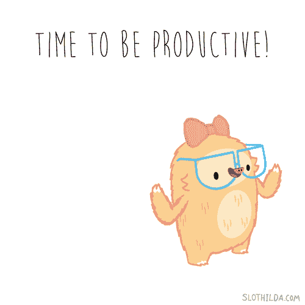

# 如何驱散未完成的边项目魔咒

> 原文：<https://medium.com/swlh/how-to-dispel-the-unfinished-side-project-curse-181da1331b8d>

Photo by [Lacie Slezak](https://unsplash.com/@nbb_photos?utm_source=medium&utm_medium=referral) on [Unsplash](https://unsplash.com?utm_source=medium&utm_medium=referral)

副业项目通常以极大的热情开始，但这种热情会很快消失。

在你意识到之前，你已经把十几个伟大的想法送进了一个缓慢的死亡，并对自己承诺“以后再来”…然后迅速开始一个全新的想法。

幸运的是，打破未完成的兼职项目诅咒很少涉及改变你的心态和组织——请继续阅读，了解更多。

Image courtesy of Giphy.

# 什么阻止了你？

有可能是以下一种或多种情况:

*   你没有足够的时间。
*   你感觉不到动力。
*   你不记得从哪里开始或者不知道从哪里开始。
*   你遇到了一个特殊的问题。
*   你对工作的某个方面(或者甚至是整个项目)有疑问。

## 一天中没有足够的时间

如果你总是想做一个兼职项目，但不知何故从来没有抽出时间去做，在你的日历上划出一些特定的时间。

它可以像一个晚上或一个周末标记为“做兼职项目”一样笼统，也可以像一个有截止日期的任务清单一样详细，但无论哪种方式，留出一段时间都是确保你的业余时间不会被花在其他地方的最佳方式。

> 留出特定的时间做你的兼职项目

试着选择一个你能最大限度减少干扰并且能以合理的效率工作的时间(例如，不要在你的工作结束后马上工作，或者如果你是夜猫子，不要在早上做第一件事)。

即使你不能每周在你的日历上划出相同的空间，在那里放些东西——如果只有 20 分钟浏览笔记或网站——将帮助你保持动力，并确保工作在你的脑海中保持新鲜。

> 尽量减少干扰

像 [Todoist](http://www.todoist.com/) 或 [Wunderlist](http://www.wunderlist.com/) 这样的生产力列表应用程序也可以帮助你保持在正确的轨道上，并提醒你最后到达了哪里。

## 我开始时很好，但不知何故，我就是不能再继续下去了

除了划出空闲时间，还要为你的项目划出一个特定的物理空间。

不管你的首选地点是星巴克还是你的家庭办公室。重要的是你在那里工作很舒服。

> 在你觉得舒服的地方工作

留出一个特定的空间(或者甚至使用不同的技术，比如用上网本代替台式机)，创建一个微妙但重要的心理链接，并帮助你的想法和心态进入边项目模式。

Image courtesy of Giphy.

你还需要确保为一个地方创造积极的心理联系，而不是把它视为一个你最终拖延或放松的空间。让它变得有趣。

不管是什么让你更有可能接近你的副业，去做吧。事情可能很简单，比如买一把更好的椅子或一个漂亮的笔记本，创建一个新的播放列表，暂时屏蔽社交网络，从你喜欢的任务开始。

见鬼，这甚至可能只是一个坐下来开始的问题。

## 我不记得我最后做了什么，现在我不知道从哪里开始

当你正在做一些复杂的事情或者留下了无尽的半成品项目时，这尤其令人恼火。

从收集你为一个特定项目(在线和离线)所拥有的一切开始，扔掉所有无用/过时的东西。

> 将所有笔记集中在一个地方

一边走一边做笔记，回顾你所拥有的一切，而不仅仅是你做的最后几件事。

在此基础上，为你的项目制定一系列阶段，例如“调试”、“决定推广策略”、“在网站上做前端工作”，然后为每个阶段定义更小的待办事项。

> 将您的项目分成几个阶段

把其他阶段放在一边，一次专注于一个阶段，这样即使几个月过去了，你都没有机会去做，也很容易记住你刚刚完成了什么，以及你接下来需要做什么。

如果你正在处理多个项目，或者一个非常复杂的项目，使用一个清晰的文件夹系统(虚拟的或物理的)来组织一切。

有可能你的电子邮件、书签和其他项目组成部分都是一大堆东西的一部分，而不是物理上分开的，所以把它们组织到文件夹中，如果需要的话甚至打印重要的笔记，并把它们放在单独的活页夹中。

如果有帮助的话，在处理下一个项目的组织之前，检查一个项目的所有事情并完成它。

Image courtesy of Giphy.

## 我被一个烦人的问题困住了

当你已经为同一个问题纠结了一段时间，很容易因为沮丧而放弃。

有时把它放一两个星期，然后带着清晰的头脑回来会有帮助。

> 把它放在一边一两周，让你清醒一下头脑

或者，如果你的问题非常独特，还没有被讨论过，互联网上有无数的社区和团体可以帮助你。

为了加快速度，尝试与该领域的权威人士或网站接触，或者与联系人会面或打电话寻求建议。如果它真的不起作用，完全放弃你完成任务的方法，重新开始。

> 不要害怕寻求建议

如果你刚刚回到一个因为这个原因而停止工作的项目，暂时把令人沮丧的任务放在一边，先专注于一个小的、有回报的工作，这样你就有足够的动力继续下去。

## 我不确定这个项目是否“正确”

是什么感觉不对劲？是某件事如何运作的一个方面，还是项目本身？花点时间想想这个。

然后，从你所在行业的其他人或目标用户那里获得第二种意见，看看他们怎么想。

最好现在就弄清楚，然后决定是修复它还是抛弃它，以免以后浪费时间。

如果您在排除故障后仍有疑问，并有第二种意见，那么可能是时候转移到其他事情上了。

# 使用正确的工具

当涉及到日程安排、时间管理、待办事项和通用生产力软件组合时，有数以千计的选项。开发正确的工具集至关重要。

将开发特定的工具集作为任何兼职项目的第一项任务，以满足您当前的情况，而不是默认您的标准工作流程。虽然这是一项额外的任务，但使用新软件可以极大地激发你的动力，你很可能会发现隐藏的宝石，并将其融入到你的标准工作流程中。

最好的工作流程是通过限制自己使用重要的工具来创建的。

找出你发现自己从一个程序或应用程序手动转移到另一个程序或应用程序的任何地方，并加入任何扩展、插件、[食谱](https://www.ifttt.com/)、插件、机器人等。这将减少那些手动任务。

如果你是 Trello 或 Evernote 用户，我们的 [Trello 日历连接器](https://trello.cronofy.com/?utm_source=the_startup&utm_medium=referral&utm_campaign=side_project_curse)和 [Evernote 日历连接器](https://evernote.cronofy.com/?utm_source=the_startup&utm_medium=referral&utm_campaign=side_project_curse)可以帮助你😉

# 拒绝失败的想法

到目前为止，我们已经介绍了重新拾起项目的方法，但是那不一定是正确的选择。

副业应该很有趣。如果它们自然结束，或者你中途决定去做别的事情，这并不是一件坏事。

> 兼职项目应该是有趣的，但有时它们会自然结束

像谷歌一样思考——他们根据需要开始和结束项目；有些留下来，有些没有。这是他们业务发展的一部分，不存在“这已经失败了”的文化。

所以，不要因为半途而废或被放弃的项目而自责——把它们看作旅程中的另一步。如果你在这个过程中学到了一些东西或者获得了乐趣，这是对时间的一个很好的利用。

Image courtesy of Giphy.

# 知道什么时候退出

如果你的项目不再相关或者不再可行，放弃可能是一个容易做出的决定。

然而，如果你在是否继续下去的问题上犹豫不决，或者你发现自己很快就会对项目感到厌倦，那么就很难做出具体的决定。

一劳永逸地决定退出一个项目意味着你可以专注于眼前的工作，并确保你不会分散自己的精力。

一旦你有两三个未完成的项目，它们可以很快变成五六个。决策瘫痪很快就会出现。

故意缩短你的项目清单，坚持新想法，直到你完成或放弃旧想法，这样你更有可能将一个项目进行到底。

问自己的主要问题是你是否喜欢这个项目(或者喜欢重新开始的想法)。如果你的本能反应是冷漠、半心半意或恐惧，那么是时候放弃了。任何其他的挑战都可以解决。

# 结论

组织和决策是消除未完成项目诅咒的核心。

做多个项目，几个月后再来做一个项目，或者辞职都没关系。

留下太多的可能和混乱是不好的。规划你的时间和任务，优化你的工作环境以获得最佳效果。

*本帖原载于* [*Cronofy 博客*](https://www.cronofy.com/blog/dispel-the-unfinished-side-project-curse/) *。*

## 为了提高你的工作效率，看看我们的 Trello、Evernote、Zendesk 和 Slack [日历连接器](https://www.cronofy.com/calendar-connectors/?utm_source=the_startup&utm_medium=referral&utm_campaign=side_project_curse)。

## 这个故事发表在 [The Startup](https://medium.com/swlh) 上，这是 Medium 最大的创业刊物，拥有 326，962+人关注。

## 在此订阅接收[我们的头条新闻](http://growthsupply.com/the-startup-newsletter/)。

