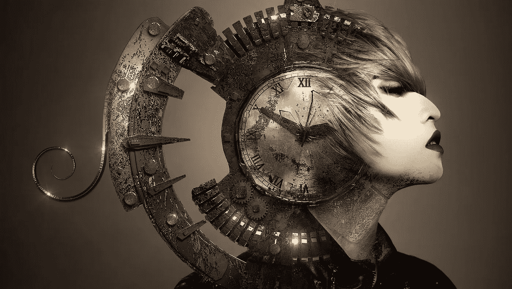
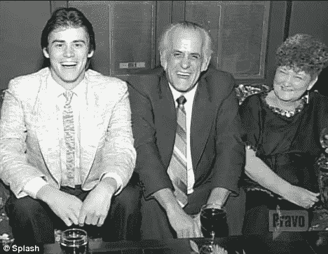

# 如何打破你的梦想

> 原文：<https://medium.com/swlh/how-to-disrupt-the-daily-grind-slipstreaming-your-dream-be0fae6fc04d>

[Photo: Stefan Keller](http://www.stefankeller-fotografie.de/)

## 金凯瑞、诗人、艺术家和我的教训

## 在金凯瑞给印度管理大学的一次演讲中，他通过对父亲一生的痛苦观察，定义了磨砺和梦想。

“我们很多人选择我们的道路是出于伪装成实用性的恐惧，”他说。

“我父亲本可以成为一名伟大的喜剧演员，但他不相信这对他来说是可能的。所以，他做了一个保守的选择，相反，他找到了一份会计的工作。”

{注:这不仅仅是凯瑞的观点。当资深喜剧演员鲁德尼·丹泽菲尔德见到珀西·凯瑞时，他被自己的喜剧天赋惊呆了。}

[Jim Carrey and Parents](https://goo.gl/images/vDdELv)

凯瑞透露。

“当我 12 岁的时候，他被从那个*安全的*岗位上解雇了。为了生存，我们一家不得不竭尽全力。我从父亲那里学到了很多重要的经验，其中最重要的是*你可能会在你不想做的事情上失败，所以你不妨冒险做你喜欢的事情。”*

四十多年前，当工作保障和世界经济稳定得多的时候，凯瑞学到了令人心碎的一课。在一系列精神病公司搞糟经济之前。

他的建议非常适合当今混乱的政治和经济时代。

在今天的混乱中，完美的条件到来了，让你抓住你的梦想，并把它融入到日常工作中。

# 什么是研磨？

***研*作为名词的意思是“辛苦、枯燥的工作”**

作为动词，*grin*是“通过压碎把某物变成小颗粒或粉末。”

古英语 *grindan* 的意思是“摩擦、摩擦、刮擦”。通过挤压来破坏

折磨是让你和你的生活变得迟钝和萎缩的一切。

## 枯燥、艰苦工作的影响

> "记住——无聊是敌人，而不是某种抽象的“失败”. "
> **——蒂姆·费里斯，每周 4 小时工作制**

在美国，人们平均每周工作 35-40 小时。对于一个典型的职业生涯来说，总共大约需要 80，000 小时。

来自美国一项大规模研究的证据显示，只有不到三分之一的员工专注于他们的工作。

佛罗里达州立大学[研究了来自 48 个州的 4963 名 32-34 岁的成年人，并得出结论:无聊、重复的工作会导致认知能力下降。](http://news.fsu.edu/news/health-medicine/2016/06/16/dull-dirty-workplace-affect-brain-function/)

## **磨致滞斥。**

在现实中，除了昨天发生的事情，什么都不会发生。生活是固定的，可预测的。

你渴望一个令人兴奋的邀请或一次幸运的机会，但是如果没有对这些机会的愿景，它们就不太可能实现。

在职场中，你感到有压力、匆忙，但又感到无聊。你缺乏向前推进的能量，因为没有内在的目的指导你的行动，只有义务。

研磨的能量是排斥、收缩和反冲。

你被迫后退，远离你被要求的任务；因此，你需要与情绪上的抗拒作斗争来完成哪怕是最小的任务。

这种冲突严重损害了你的心理健康。

## 磨砺获胜的迹象:

*   缺乏热情和精力。
*   长期抱怨。
*   对食物、酒精、毒品、工作、色情等上瘾。
*   婚外情或对婚外情的渴望。
*   通过诈骗、赌博和高风险投资来玩弄系统的欲望。
*   每天结束时的失望感。
*   感觉被*生命的意义*问题困扰和恐慌。

# 什么是梦想？

作为一个名词，一个(醒着的)*梦*是“一个珍视的或有意义的目的、愿望、抱负或理想。”

梦作为动词是“想象或发明某事”

梦这个词的起源在古英语中被认为是“快乐、欢笑和音乐”的意思

## 意义和目的的影响

> “每个人都是为某种特定的工作而生的，对那种工作的渴望已经放在每个人的心里。”
> –鲁米

目的和意义对我们健康的影响是一个相对较新的研究领域。然而，有大量证据表明，目的和意义(梦的本质)与健康的认知功能、良好的记忆力和抗衰老有关。

美国心脏基金会在 2015 年的一项研究中发现,“对生活有强烈目标感的人随着年龄的增长不太可能患脑梗塞。拥有生活目标还可以防止痴呆症、运动障碍和死亡。”

在哈佛大学公共卫生学院的 2017 年[研究](https://jamanetwork.com/journals/jamapsychiatry/article-abstract/2648692)中，研究人员发现，“如果你觉得自己有更高的生活目标感、意义感和生活目标和方向，你就更有可能随着年龄的增长保持健康和身体强壮。”

## 梦引起积极的欲望和改变。

> “然而，在这里，我们不会长久地向后看。我们不断前进，打开新的大门，做新的事情，因为我们很好奇……好奇心不断引领我们走上新的道路。”
> **—华特·迪士尼**

当你努力激活你的梦想时，事情就发生了。

机会来找你，因为你能想象它们。

通过与你最有意义的愿望保持一致并表现出来，你会感觉到一种掌控生活的力量。

按照你的愿望行动会让你以符合你的自然生理和神经病学的方式前进。你注定要前进。你面向前方，面向未来。

当你的内心感受和行动一致时，你就不再为了完成任务而与自己抗争。你走在阻力最小的道路上，这释放了让你保持健康的正能量。

## 梦想获胜的迹象:

*   生活的热情和能量。
*   对健康体验、食物、锻炼和活动的渴望。
*   感激你所拥有的。
*   对爱人的承诺。
*   谦逊的举止。
*   慷慨。
*   寻找意义的渴望。
*   一天结束时的满足感。

# 我是如何用我的梦想打破这种困境的

> “当我们不能再做梦的时候，我们就死了。”
> ― **埃玛·戈尔德曼**

在我二十几岁的时候，我创作并导演了艺术和叙事电影，这些电影在世界各地的美术馆、电影节和电视网放映。

十年过去了，我厌倦了项目工作的零星性质和收入，因此我下定决心在接下来的五年里有固定的工作。

我放弃了写作和电影制作，进入商界，协助一家新成立的环境媒体公司。

九个月后，一种神秘的疾病来袭。

我不能下床。我的身体感觉像混凝土。我的大脑变慢了——几乎停止了。

确定我有慢性疲劳，我看了几个医生，但没有一个证实我的自我诊断。我的病仍然是个谜。

后来有一天晚上，我梦见了一个像老太婆一样的女人(她以前在梦里引导过我)。她站在一台电影放映机旁，放映机正在播放我当前生活中的场景和我以前拍电影时的场景。

这条信息是显而易见的。我需要做好我的工作，继续实现我的梦想。

一旦我有了一个项目，一个正在酝酿的梦想，我就恢复了。

我花了一大早、一些晚上和周末的时间写作、计划和与剧组成员争吵。

我的假期都用来制作游击风格的电影，尽管制作的电影没有我之前的电影规模大，但它们在美术馆和我当地的电视网上播放。

然而，最大的好处是对我的健康和情感幸福。

当然，我很努力，但是在我人生的那个阶段，我的梦想还没有完成，或者我应该说，我的梦想还没有完成。

我一直致力于我的梦想，作为回报，我的梦想让我保持健康和快乐。

# 现在来滑入你的梦想

> “一个人所能做的最糟糕的事情就是不去尝试，意识到自己想要什么而不屈服于它，在沉默的伤害中度过数年，思考一些事情是否会实现——永远不知道。”
> ― **吉米·罗恩**

如果你有一个渴望创造的梦想，无论你的逻辑思维告诉你什么，你都必须创造它。

秘密在于创造一个能让你伸展，但你能掌控的梦想。

## 像珍惜黄金一样珍惜你的时间。

> “不要害怕慢慢成长。怕站着不动。”
> ——中国谚语

当工作被控制时，你的时间就贬值了，因为你觉得好像有人在控制你的时间:你的老板、家人、同事——除了你以外的任何人。

这种心态认为时间是巨大的、不透明的、孤立的、固定的时间段:9 点到 5 点工作，5 点到 6 点通勤，6 点到 8 点吃饭，等等。

梦境思维将时间视为微小、透明、灵活、相互关联的创造机会:7 点到 7 点 10 分用于冥想，10 点 30 分到 10 点 35 分用于头脑风暴，9 点到 9 点 15 分用于写小说。

**美国顶级私人教练和健康专家本·格林菲尔德写了一本奇幻小说《T4 森林》，每天增加 15 分钟。**

为了实现你的梦想，你首先需要反思你时间的真实性——你的每一分钟都是你生命的一部分，因此也是你最宝贵的资源。

一旦你尊重这个关于你自己的真相，你会自动地看到其他人看不到的东西:片段、片断、结合点和时间间隔是展现的机会。

你将绕过之前阻碍你脱离困境的巨大而繁重的障碍。

开始识别 3 到 15 分钟的时间段，你会想你怎么会错过它们。

## 向伟大的艺术家和科学家学习。

以下诗人在创作他们的作品时，白天也有工作。查尔斯·布可夫斯基:信件归档员，罗伯特·彭斯:税务员，弗兰克·奥哈拉:博物馆馆长，华莱士·史蒂文斯:保险律师，沃尔特·惠特曼:政府职员，罗伯特·弗罗斯特:工厂工人。

音乐家菲利普·格拉斯是一名水管工和出租车司机。

音乐家劳瑞·安德森在麦当劳当收银员。

作家 TS 艾略特是一位银行家。

库尔特·冯内古特拥有一家破产的汽车经销店。幸运的是，他有一个可以依靠的梦想。

阿尔伯特·爱因斯坦在美国专利局全职工作，同时在夜间进行发明。

这些创造者是在研磨，但不是它的一部分。他们的作品证明了他们属于梦幻思维。

## 找不到自己的梦想？创建一个。

> 我们必须不断地从悬崖上跳下，并在下降的过程中发展我们的翅膀。
> ― **库尔特·冯内古特**

如果你要求自己必须找到你最终的、真实的、唯一的梦想，你会在一开始就被打败。让自己休息一下。

找到你的梦想并不比创造它更有价值或意义。

带着最轻微的好奇心朝着积极的方向前进，将会打断痛苦，迎来新的能量。

当你朝着渴望的方向前进时，你会从一些实际的任务开始；为项目收集材料，与一两个人会面讨论，自愿成为社区工作的一部分。

重要的是开始。如果没有进展，就重新开始。

## 拥抱你的恐惧。

> “恐惧总是由创造力引发，因为创造力要求你进入不确定结果的领域。这没什么可羞愧的。然而，这是一个需要解决的问题。”
> ― **伊丽莎白·吉尔伯特**

当你朝着梦想的大致方向前进时，恐惧就会产生。

你对未知的恐惧，不知道你要去哪里，或者你到底在做什么的恐慌，以及摸索中的孩童般的天真，这些都是你已经粉碎了磨人心态的可靠迹象。

和这些健康的、混乱的感情待在一起；你的创造力刚刚被释放。

## 不要半吊子。

> “不要放弃努力去做你真正想做的事情。哪里有爱和灵感，我不认为你会错。”
> –艾拉·费兹杰拉

要有这样的态度:你会尽一切努力去寻找或创造你的梦想。

让你的身体、精神和情感肌肉工作起来。

尽一切可能激发你的能量:锻炼、健身、跑步、教练或咨询。

## 做个交易。

> “如果你已经围绕一份高薪工作建立了一种昂贵的生活方式，如果你缩减规模，寻求更多的快乐或慷慨，你的生活会发生什么？”
> ——塞思·戈丁

所有的创造都需要牺牲。这是没有出路的。

决定你愿意牺牲什么，例如，空闲时间，周末睡懒觉，网飞系列，酒精，不健康的饮食，定期的社交活动，一个你的健身之夜。

让任何需要的人知道你致力于做一些工作之外的事情，你将会在一周的早上或两个晚上需要 X 的时间。

请求他们的理解和支持。如果合适的话，让他们让你负责。

## 向内看。

> "唯一比失明更糟糕的事情是有视力却没有视觉."
> –海伦·凯勒

以一种自然的方式与你的内在视觉联系起来，例如，通过冥想、沉思、自动写作，或者回忆你睡觉时的梦。

我曾经有过一个客户，她通过跳舞找到了自己梦想中的工作。她以前从未跳过舞，尽管她是一名古典音乐家。她天生格外谨慎，凡事都会想得太多。通过自发的舞蹈解放了她的身体，释放了她的想象力。

你无法通过思考与你的内在自我联系起来。思考只会让你沮丧，让你永无止境地寻找。太疯狂了。

只有你深切感受的头脑让你与自己更亲近、更亲近。你的自我放松了，你开始关注真正重要的事情。

## **打。**

> "玩乐的对立面不是工作，而是沮丧。"
> **–简**麦克戈尼格尔，游戏设计师兼作家

如果你觉得困在了枯燥的思维模式中，就开始尝试创新和玩耍吧。

**我有个想法。**

拿一种你喜欢触摸的材料，例如丝绸、毛皮、纸张、铅笔、颜料、粘土、土壤、植物或食物。

想象一个物体:一幅画，一件衣服，一个泥人。

享受你的感官，对你想要创造的东西充满乐趣。

全力以赴。

构思想法并迅速创造出来。然后再做一次…一次又一次。

这听起来像是浪费时间吗？如果你是在磨心态。你觉得幼稚。

在梦的思维模式中，这个深刻的实验为了创造而点燃创造力。

如果你想*创造*你的梦想，你必须练习*创造。*

# 通过创新改变

当你开始创造你的梦想时，你的生活会以你无法预见的方式改变。

机会以人、事件和资源的形式出现，看似突如其来，原因有两个:

## **#1。模式中断**

> "创造力是独创性对习惯的击败."
> ――亚瑟·库斯勒

用对你有意义的欲望的有意行为来打破重复的、自动的模式，将习惯意识转化为创造性意识。

创新意识仍然潜伏在磨砺的心态中。

创造性意识属于那些有梦想心态的人；改变世界的创新专业人士、企业家、发明家、作家、艺术家和人道主义者。

## **#2。创世之谜**

> 神秘是创造力的核心。那，还有惊喜。”
> ― ***朱莉娅·卡梅隆***

当你把以前不存在的东西放进这个世界时，神秘的力量开始发挥作用。

就像把一个孩子带到这个世界上，你的创造物有了自己的生命。

起初，你看着你的作品，发现很难相信*是你*创造了它。但是当你看得更深一点的时候，你会比以前更清楚地看到自己。

你意识到你与比你个人身份更广阔和神秘的东西的联系。

制造有创意的东西本身会给你一种惊奇和敬畏的感觉。你会对你的生命和生命力感到一种自然的敬畏。

努力实现梦想的整个经历现在将变得非常有意义。

为了梦想的心态而离开磨心的最终目的是让你明白你真正的力量和美丽在哪里。

你是创造性意识的管道。因此，你成为一个强大而有用的人。

> “在创作过程中，我们比以往任何时候都更有活力，因为我们在创造东西，而不仅仅是消费，是我们创造的小现实的主人。在做这项工作时，我们实际上是在创造我们自己。”罗伯特·格林，权力的 48 条法则

# 回到有趣的人

金·凯瑞是我崇拜的人，不仅仅因为他追随自己的梦想，或者(对我来说)他是活着的最滑稽的喜剧演员之一，还因为他拥有发自内心的智慧。

> “你对接受的需求会让你在这个世界上隐形。不要让任何东西阻挡穿过这个形体(你)的光。冒着被人看见你所有荣耀的风险。”

# 感谢阅读！现在 l **et me 向你展示如何用我的** [**免费清单**](https://mailchi.mp/11075e79a154/transform-your-beliefs) **快速跟踪你的梦想心态 10 倍。**

## 这个故事发表在 [The Startup](https://medium.com/swlh) 上，这是 Medium 最大的企业家出版物，拥有 292，582+人。

## 在此订阅接收[我们的头条新闻](http://growthsupply.com/the-startup-newsletter/)。

