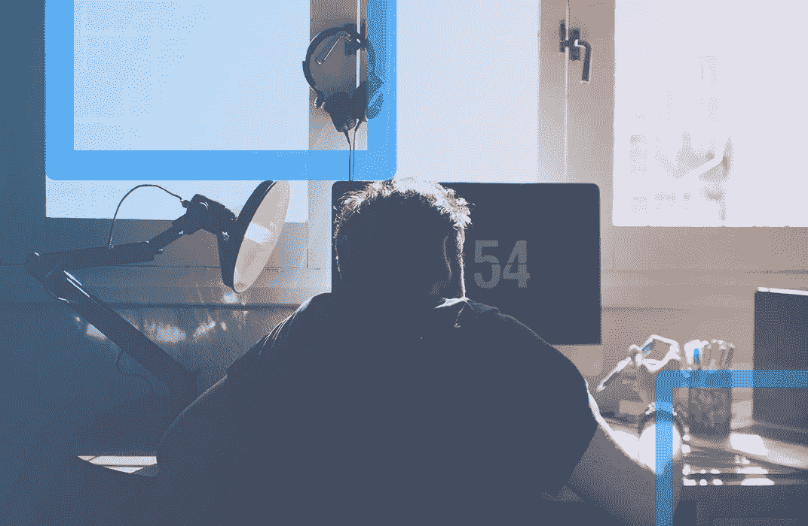
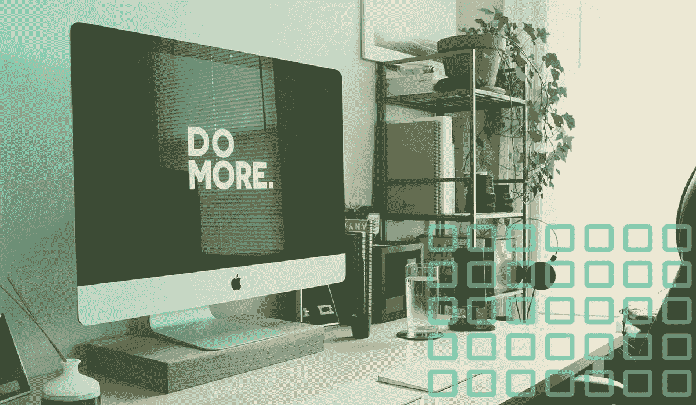

# 今年做大事的 10 条指导原则

> 原文：<https://medium.com/swlh/how-to-do-great-work-fb943be11d9e>

## 不仅仅是好。太好了。

This post was originally published on [crew.co](https://crew.co/blog/how-to-do-your-best-work/). Sign up for [our weekly newsletter](http://crew.us2.list-manage1.com/subscribe?u=655606e77350bfa30e1ab5457&id=7f313472f5) to get more like it.

我们如何确保我们不仅做好工作，而且做有潜力成为真正伟大的工作？

爱迪生说过，天才是 99%的汗水和 1%的灵感。

牛顿说，如果其他人也像他一样努力工作，他们也会得到类似的结果。

虽然努力工作肯定是等式的一部分，但它不是全部。

在他的论文*中，多次获奖的科学家、工程师和作家 Richard Hamming 博士[总结了一个做伟大工作的简单公式](https://www.cs.utexas.edu/~dahlin/bookshelf/hamming.html):*

> *“如果你要做重要的工作，那么你必须在正确的时间以正确的方式解决正确的问题。没有这三者中的任何一个，你可能会做得很好，但你几乎肯定会错过真正的伟大。”—理查德·海明博士*

解决正确的问题。致力于伟大的想法。[分享你的作品](https://crew.co/blog/teaching-what-you-know/)。[从您的社区获得反馈](https://crew.co/blog/show-your-work-creative-community/)。所有这些都会帮助你确保你在正确的时间做正确的工作。

但是如何以正确的方式工作呢？

在过去的 4 年里，我们一直致力于寻找最佳的工作方式，不仅仅是为了我们自己，也是为了我们网络中所有的自由设计师和开发人员——从[非固定工作时间](https://crew.co/blog/why-you-shouldnt-work-set-hours/)到[拥抱远程文化](https://crew.co/blog/how-to-find-the-perfect-remote-working-setup-for-you/)到[创造系统和流程](https://crew.co/blog/makers-and-managers/)，帮助每个人一次又一次地做到最好。

因此，随着又一年的伟大工作摆在我们面前，我们收集了关于如何正确工作的 10 个最有影响力的想法。

# 关于开始

每一天我们都选择如何度过我们仅有的几个小时。然而，尽管不断有人警告我们要花时间去追求我们相信的东西，我们还是经常成为拖延症的受害者，甚至害怕刚刚开始。

行为经济学家将这种现象称为**——*人类大脑倾向于将眼前的回报看得比未来的回报更重。*

*当我们专注于工作时，[很容易被小任务](https://crew.co/blog/urgent-vs-important/)冲昏头脑:电子邮件、通知、繁忙的工作。*

*当你只看着面前的岩石，而不是努力去看远处的山时，生活会简单得多。*

*但是，即使朝着更大的目标迈出第一步，也能带来巨大的变化。*

*有一种心理过程叫做[蔡加尼克效应](http://www.psychwiki.com/wiki/Zeigarnik_Effect)，当你接近完成一项任务时，这种效应就会出现，推动你奔向终点线，就像你从一堆僵尸中跑出来一样。*

*如果这不能帮助你开始，请记住作家兼理论家埃利泽·尤德科夫斯基的话:*

> **“在每时每刻的基础上，正在做工作的人通常比正在拖延的人更少痛苦。”—埃利泽·尤多斯基**

# *培养正确的习惯*

*伟大需要坚实的基础。*

*作为生产力的鼻祖，吉米·罗恩，[解释了](http://selfmadesuccess.com/jim-rohn-quotes/):*

*"成功只不过是一些简单的训练，每天都要练习."*

*但是培养良好的工作习惯很难。尤其是当我们感到缺乏灵感或者最终结果感觉太遥远而不真实的时候。所以我们需要从小处着手。*

*你想要养成的每个习惯都可以分解成一系列的步骤。*

*例如，健身房锻炼可以分为以下几个步骤:起床，换衣服，整理运动包，去健身房，锻炼，洗澡，回家。*

**

*但是我们的大脑喜欢阻力最小的路径，所以在实际锻炼过程之前和之后的所有这些步骤？他们在我们和我们的目标之间设置了障碍。*

*所以我们需要简化流程。*

*我们最喜欢的技巧之一是斯坦福大学教授、心理学家 BJ·福格所说的“为懒惰而设计”。基本上，自我调整，让最简单的任务成为最重要的任务。例如:*

*   *关掉手机，把它放在抽屉里*
*   *拔掉电视插头，把它放在壁橱里*
*   *关闭所有浏览器标签，除了第二天早上需要的那一个*

*如果你需要更多的帮助，试试这个打破坏习惯的极端方法。*

# *有仪式也有惯例*

*在他最有影响力的文章之一中，散文家、程序员和风险投资家保罗·格拉厄姆[提出有两种非常不同的方式来安排你的工作日:](http://www.paulgraham.com/makersschedule.html)*

> *“经理的时间表是给老板看的。它体现在传统的约会簿上，每天被分割成一个小时的间隔……当你这样使用时间时，与某人见面只是一个实际问题。在你的日程表上找一个空位置，预订它们，然后你就完成了。*
> 
> *但是还有另一种利用时间的方式，这种方式在程序员和作家等制造东西的人中很常见。他们通常喜欢以至少半天为单位来使用时间。你不可能以小时为单位写好或写好程序。这点时间刚刚够开始。"*

*不幸的是，我们大多数人坐在中间，每天花一部分时间处理重要的任务，然后被迫回到“经理”模式。但是我们都知道，大脑不能一心多用。一些研究甚至说[在受到干扰后，我们可能需要 25 分钟才能重新集中注意力。](http://lifehacker.com/how-long-it-takes-to-get-back-on-track-after-a-distract-1720708353)*

*这就是为什么我们需要尊重时间来创造和完成伟大的工作。*

*对于 Brainpicking 的创始人 Maria Popova 来说，[这意味着建立仪式和惯例](https://crew.co/blog/makers-and-managers)。*

> **“常规的目的是让日常生活的混乱变得更加可控，而仪式的目的是让世俗充满神奇的元素。”—玛丽亚·波波娃**

*仪式是个人的。*

*它可以是任何东西，从你用来喝咖啡的杯子到你听的音乐。见鬼，在开始工作之前，贝多芬必须为他的早晨咖啡精确地数出 60 颗咖啡豆。*

*重要的是，这表明是时候专注于重要的工作了。一旦你知道了你的仪式，你就可以用它来推动自己进入创造模式。*

# *管理你的时间*

*讽刺的是，你可以浪费更多的时间去阅读关于时间管理的书籍。说到做到最好，只有两件重要的事情需要记住:自动化和分组任务。*

*为了克服决策疲劳，提高总体效率，蒂姆·菲利斯[建议建立尽可能自动化思考的系统和流程。](https://itunes.apple.com/us/podcast/ep-44-how-to-avoid-decision/id863897795?i=325332026&mt=2)*

*目标是将开放式问题(我早餐要吃什么？)转换成 if/then 语句(如果是工作日，我打算早餐吃燕麦片)。这样，你就把你的意志力和决策能力留给了重要的任务。*

*当谈到如何安排你的一天时，我们跟随设计师兼作家保罗·贾维斯的领导，[在他的一周](http://pjrvs.com/a/productivity)中把相似的任务组合在一起。例如，如果他专注于写作，他会一次写 3-4 篇文章，而不是每天只写一篇。这有助于他的大脑进入“写作模式”。*

*想了解更多的想法，看看[这 5 种非常规的管理时间的方法](https://crew.co/blog/5-alternative-ways-to-manage-time/)，以及[创建不会让你难过的待办事项列表的方法](https://crew.co/blog/does-your-to-do-list-make-you-sad-mine-did-until-i-changed-this/)。*

# *战胜拖延症*

*哈佛培养的心理学家基思·西蒙顿写道:“创意的质量是数量的正函数”。*

*换句话说，要想有创造力并完成伟大的工作，我们需要全力以赴，做更多的工作。*

*顾问出身的教师安吉拉·杜克沃斯称这种品质为勇气，并暗示这是任何人未来成功的头号预测指标。*

*正如安吉拉所说，勇气是“对长期目标的热情和坚持。”它是拥有耐力，日复一日地坚持你对未来的愿景，不仅仅是一周或一个月，而是几年。*

*培养毅力，进而战胜拖延和缺乏动力的方法是建立一种成长的心态——在这种心态下，我们相信学习是一生的努力，更重要的是，失败不是永久的状况。*

*伟大的工作来自于产出，相信以有趣的方式失败是可以接受的是一种迫使你创造和超越现状的好方法，而不是躲在过去的成就后面。*

*或者，正如 Twitter 的联合创始人比兹·斯通解释的那样:[成功部分是运气](http://www.wsj.com/articles/SB10001424052702303725404579461623575366420?mg=id-wsj) …*

> **“但我想说的是，时机、毅力和 10 年真正的努力最终会让你看起来像一夜成名。”—比兹·斯通**

# *创造合适的工作环境*

*当初创公司正在安装滑梯、乒乓球桌和午睡室时，一些最具创新精神和最成功的人[已经在海滩小屋、地下室和酒吧](https://crew.co/blog/it-doesnt-matter-where-you-work/)找到了灵感。*

*虽然做好工作不受地点的限制，但拥有一个持续激发灵感的空间仍然非常重要。*

**

*所以当你感到缺乏动力时，有一些方法可以让你很快进入适合你的状态。以下是一些例子:*

*消除杂乱:爱因斯坦认为“如果一张杂乱的桌子标志着一个混乱的头脑，那么，一张空桌子又是什么标志呢？”事实是，杂乱会分散注意力，使人困惑，甚至会导致我们身体上的疼痛。*

***寻找阳光:**人们早就知道[拥有更多自然光线的学校为学生提供了更好的学习环境](https://crew.co/blog/5-ways-to-hack-your-workspace-for-productivity-crew-backstage/)考试成绩往往因此而提高。众所周知，自然光和新鲜空气也能提高工作效率。*

***管理你的感官:**除了空间的物理布局和心理联想，你周围的声音也会对你的工作效率产生巨大影响。下面是我们为你的工作日创建正确播放列表的指南。*

# *让自己休息一下*

*当兴奋沸腾，你觉得自己即将取得重大突破时，你脑子里想的最后一件事就是停止工作。但是有规律的休息是避免精疲力尽、提升你的能量、发现新的方法来解决手头的问题的最好方法之一。*

*具有讽刺意味的是，根据伊利诺伊大学心理学教授 Alejandro Lleras 的说法，它们甚至可以帮助你保持专注。他发现[取消和重新激活你的目标可以让你更加专注。](https://open.buffer.com/science-taking-breaks-at-work/)*

*企业家杰森·祖克(Jason Zook)的日程安排打破了他一天的用餐时间。*

*每一个都被故意设置在你工作的时间，并且有 10-30 分钟的休息时间来充电和调整注意力。*

*关于如何休息的更多想法，试着[去散步](https://crew.co/blog/this-is-your-brain-on-exercise/)、[看书](https://crew.co/blog/boost-reading-retention/)、[冥想](https://crew.co/blog/sit-and-do-nothing/)，或者甚至只是[让你的思绪游走](https://crew.co/blog/isolation-and-creativity/)。*

# *关于放弃“完美”的想法*

*正如我们之前所说，伟大的工作来自于以一种有趣的方式接受失败。但是如果我们沉迷于完美的想法，我们永远也不会到达那里。*

*完美是一种疾病，它会扼杀你作品的伟大。*

> **“如果你能看到你的路一步一步地铺在你面前，你就知道那不是你的路。你的每一步都是你自己走的路。”—坎贝尔·约瑟夫**

*有太多成功的故事，却没有对非成功的时代给予足够的关注。在心理学中，他们称之为[生存偏差](https://en.wikipedia.org/wiki/Survivorship_bias)——这是一个逻辑错误，我们关注那些在某个过程中“幸存”下来的人，而无意中忽略了那些没有“幸存”下来的人(可能是因为他们没有被放在前面和中间)。*

*如果你能从完美到完整地重新构建你的思维，你肯定会取得更大的成就。*

*不要担心以完美的方式完成一项任务，担心完成任务。对错不重要。重要的是你在不断地推动你自己和你的工作前进。*

# *把压力变成你的优势*

*当你朝着伟大的目标努力时，你不可避免地会开始感到肩上的重担越来越重。压力。*

*你正在做的工作的压力。在不知道自己的投资方向正确的情况下，你投资的时间压力。外部关系的压力和其他被推到一边的任务。*

*我们都有这种感觉。但是我们不需要让压力把我们带走。*

*根据都柏林三一学院的认知神经科学家伊恩·罗伯逊的观点，他是即将出版的新书《压力测试:压力如何让你变得更强更敏锐》的作者，有很多方法可以让你真正利用压力。*

**

*当我们有压力时，我们的大脑会释放一种叫做去甲肾上腺素的化学物质，这种化学物质会导致不安和焦虑。但是，在适当的剂量下，这种化学物质还能增强觉醒和警觉，提高警惕，增强记忆的形成和恢复，并集中注意力。*

*这并不容易，但是通过一些简单的技巧(我们[将在这里](https://crew.co/blog/stress-and-panic-into-productivity/)进行更深入的探讨)，比如将你的压力重新定义为兴奋，退后一步重新评估情况，将压力视为挑战，你可以找到去甲肾上腺素的最佳状态，压力实际上会提高表现。*

# *关于避免倦怠*

*关于生产率的最大误区是它是对你完成了多少工作的衡量。*

*我们不是机器，我们工作的伟大不取决于我们做了多少，甚至不取决于我们做的质量，而是我们做了*正确的*事情。当你在做正确的工作时，很少会精疲力尽。当你沉浸在你不关心的任务中时，它就来了。*

*为了避免精疲力尽，你需要不断地问自己:我在做正确的事情吗？*

*设置全天提醒，查看你是否偏离了道路。*

*我喜欢把这些时间设定在我知道自己最有可能犯错的时候，比如上午 10 点左右，这个时候我的大脑充满活力，很容易被一些话题冲昏头脑。或者下午早些时候，我的精力开始衰退。以及晚上当我试图断开连接或处理个人项目时。*

*提醒你停下来检查你的地图意味着你永远不会迷路，可以继续朝着最终目标前进，而不用担心筋疲力尽。*

*创造伟大的作品意味着*做*工作。*

*这意味着放弃坏习惯，创造仪式，处理压力和拖延，把自己放在最好的位置，无论是精神上还是身体上，以创造有意义的东西。*

*我们希望这个列表能帮助你在新的一年有个好的开始。虽然这看起来很难，但我们都能做到。当你做到的时候，一切都是值得的。*

**嘿！我是乔里。屡获殊荣的作家、编辑和内容策略师。如果你想一起工作，可以在* [*的博客*](http://blog.rescuetime.com) *或* [*上查看更多类似的帖子。*](http://jorymackay.com/)*