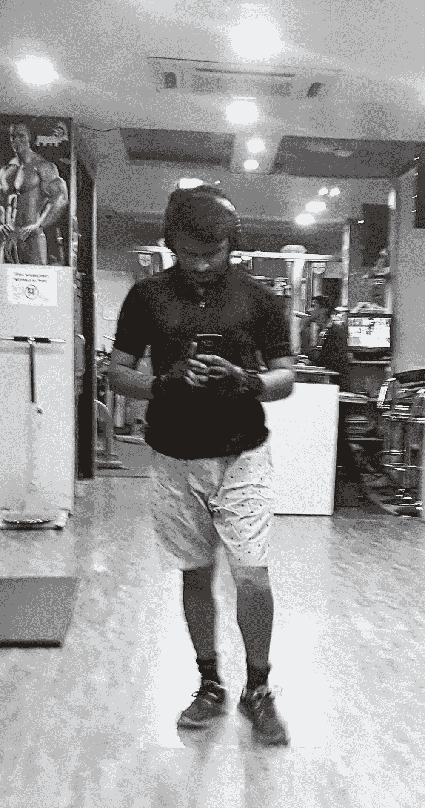

# 如何事半功倍？

> 原文：<https://medium.com/swlh/how-to-do-more-in-less-aaa8716c2567>

[Siddhant Kiishorre Instagram](https://instagram.com/kiishorre)

我们大多数人都觉得把事情做完是一件令人畏惧的事情。我们接受了一项任务，但不知何故，这项工作没有按原定计划完成。我是拖延症的最大受害者之一。以至于我的父母习惯称我为“*最后一刻男孩*”我的朋友最终邀请我提前 30 分钟，只是为了确保我准时。

**最糟糕的是，我没发现它有任何问题。**我认为迟到是可以的*，不按时完成事情是可以的*。当时对我来说重要的是工作即将完成。随着年龄的不断增长，我开始意识到时间**的价值**，很快我就看到了我做事方式的问题。**

**我尝试了多种方法来改变这种“临时抱佛脚”的态度。看看我最成功的方法，你可以用更少的时间完成更多的工作:**

## **关掉手机**

**不。别调成静音。即使在飞行模式下也不行。把那该死的东西关掉。我就说说我自己用手机的经历吧。**

**我决定写点什么。两个不同的日子，两种不同的方式。有一天，我的手机开着，另一天，却没有。**

**我手机开机的那天，我花了大约 3 个小时写了 1000 个单词。我既没有过多地查看手机，也没有接听电话，由于某种原因，它令人难以置信地令人分心，我无法进入“心流”**

> **我手机关机的那天，我花了 40 分钟写下同样数量的单词。高达 80%的降幅。**

## **养成早晨的习惯**

> **醒来后你所做的事情为你一天的剩余时间定下了基调。**

**如果按下贪睡键是你早上做的第一件事，那就是你的大脑已经习惯了——打盹。信不信由你，拥有一个简单而有效的晨间作息可以将工作效率提高 10 倍。**

**我有一个简单的惯例，一醒来就做十个俯卧撑。这一天，我看到我的工作方式和行为发生了显著的变化。**

**早晨的例行公事是我想更详细讨论的一个话题，所以我将建议你做一种早晨的例行公事来给自己充电。**

## **计划你的一天**

**睡觉前，试着计划好你的第二天。这会节省你的时间，而你大部分时间都浪费在思考下一步该做什么上。**

**这个计划不一定要精确。仅仅是一个你希望你的第二天是什么样子的大致想法就能对你的生产力产生奇迹。**

## **每天在同一时间睡觉**

**你一定听说过人体的自然闹钟，如果你愿意的话，它会习惯于一个时间表。规律性对你身体的影响是，它让你的身体更有效地运转。**

**每天在同一时间睡觉也会帮助你避免昏昏沉沉的早晨和懒散的夜晚。**

## **从事体育活动**

**健康的身体促进健康的精神。作为人类，我们在技术上有所发展，但这也导致了一种致命的久坐不动的生活方式，这种生活方式让你在总体上效率更低。**

**如果你有一只狗，尤其是一只寻回犬，你知道如果它不去散步会发生什么。人类表现出类似的倾向，如烦躁、懒惰、幸福感下降等。去散步，做你最喜欢的运动，或者去健身房。做你最喜欢的事情。**

## **把你的工作分成几类**

1.  **重要且紧急**
2.  **重要但不紧急**
3.  **紧急但不重要**
4.  **不重要或者不紧急**

**以同样的顺序处理你的工作。完成重要和紧急的事情，然后继续下一个。**

> ***讽刺之母***
> 
> **避免分心很重要。写这篇文章的时候，我正在飞机上，一位漂亮的空中小姐走过来问我—**
> 
> **"先生，蔬菜卷还是非蔬菜卷？"**
> 
> **“非蔬菜，”我说。**
> 
> **她把面包卷递给了我。我很喜欢这顿饭，但我花了很长时间才回到正题，因为我被食物的美味迷住了，也被空中小姐迷住了。**

****感谢阅读:)****

****

## **这篇文章发表在[《创业](https://medium.com/swlh)》上，这是 Medium 最大的创业刊物，有 293，189+人关注。**

## **在这里订阅接收[我们的头条新闻](http://growthsupply.com/the-startup-newsletter/)。**

****