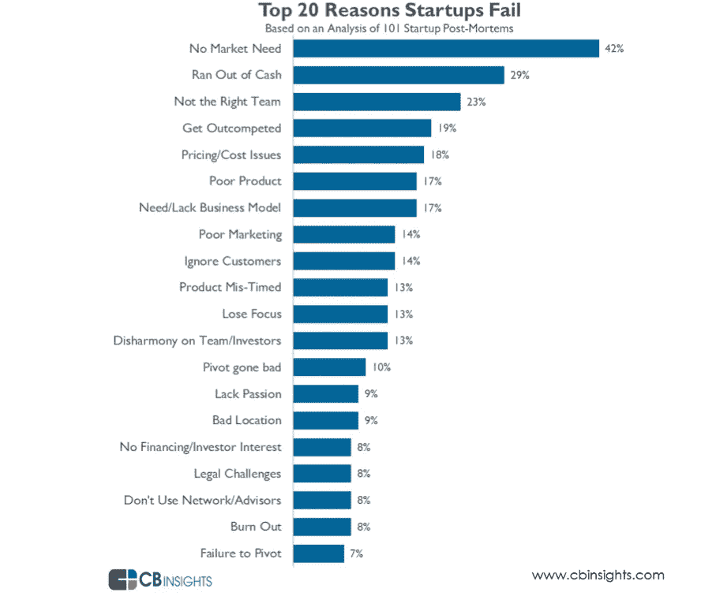
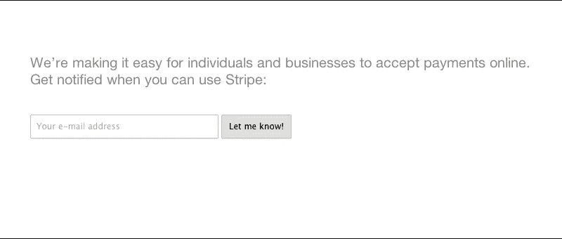
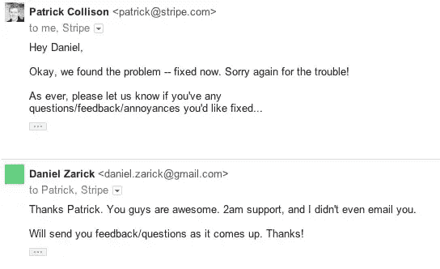
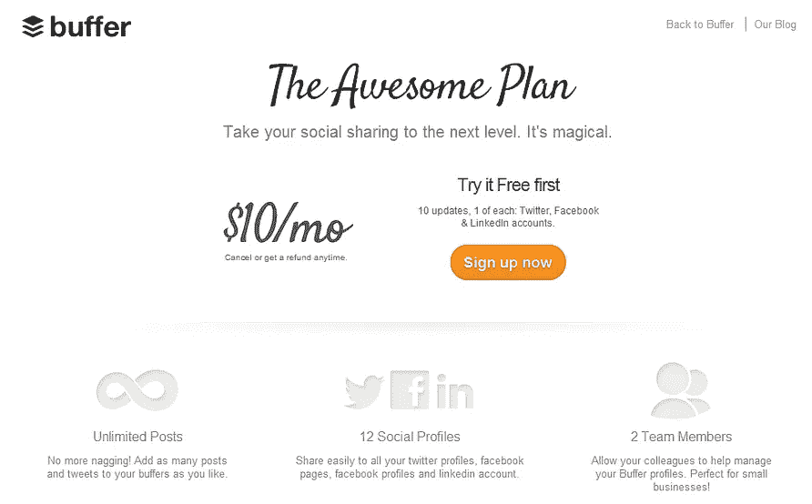
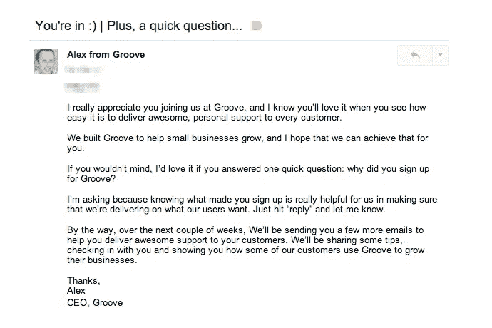
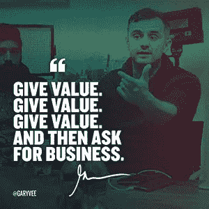

# 如何做不可扩展的事情

> 原文：<https://medium.com/swlh/how-to-do-things-that-dont-scale-73eee1f59d77>

## 成长和扩大早期创业的一些实用经验

*{本文原载于* [*博客*](https://www.indiez.io/blogs?utm_source=Medium&utm_medium=Content&utm_campaign=Things_that_dont_scale)*at*[*indiez . io*](https://www.indiez.io/?utm_source=Medium&utm_medium=Content&utm_campaign=Things_that_dont_scale)*}*

每天都有创业公司诞生，也有创业公司死亡。成千上万。

在建立 Indiez 的时候，我和 600 多位早期创始人交谈过，现在只有少数人是成功的。这让我很惊讶，因为大多数创始人都不是无能的。事实上，他们中的一些人是连续创业者，拥有令人难以置信的产品思维。

一个简单的谷歌搜索“为什么创业失败？”让我想到了这个:

‘No market need’, ‘running out of cash’, ‘lack of business model’ , ‘getting outcompeted’ and ‘poor marketing’ are all related to not being able to find enough customers.

大多数情况下，死亡的原因是饥饿。发生这种情况有两个原因:**没人想要你的产品**和**没人知道你的产品。**

作为创始人，我们真的很享受让数百万用户谈论我们产品的那种高潮。我经历过，如果你是创始人，我知道你也经历过。

但是，如果我告诉你这真的不是一下子达到一百万用户呢？

似乎大多数创业公司在第一次尝试时就锁定了完美的产品，它是如此之棒，以至于它像病毒一样传播开来，几乎瞬间就拥有了一百万用户。

但事实并非如此。

所有成功的创业公司都是从数量可观的用户开始，通过不断重复做不可扩展的事情而成长。

没有捷径可走。这是成长的必经之路。

根据保罗·格拉厄姆(Y Combinator 创始人)的说法，作为一个年轻的初创公司，你只需要关注三件事

1.  你要制造的产品
2.  构建用户想要的东西
3.  为了让公司运转起来，你最初做的不可扩展的事情

信不信由你，这是接触一百万用户的唯一途径！

简单？不，实际上一点也不。

我广泛阅读了不可扩展的事情的真正含义。很多博客都在谈论做不可扩展的事情的重要性，但是很少有人真正提到*如何*去做这些事情。以下是我能够找到的一些令人难以置信的见解。

# 1.招募测试用户

当然，这已经被谈论得令人生厌了，但是你到底是怎么做的呢？我们举个例子。Stripe 现在是一家市值 50 亿美元的初创公司，它有一个非常简单的测试版注册页面，如下所示:

通过这个简单的页面，他们招募人员来测试他们的产品。一旦有人同意尝试 Stripe，他们会说“好吧，把你的笔记本电脑给我”，然后当场安装好。这种“**碰撞装置**的方法帮助他们获得了第一批用户。

测试版用户之一丹尼尔的 Quora 回答说:“一旦我使用了他们的产品，我就被卖掉了。几周之内，我大概已经 ***告诉每一个在网络上做东西的朋友关于使用 Stripe*** 。它过去是，现在仍然是一款出色的产品。”

丹尼尔还谈到，如果他点击了错误页面，即使是在凌晨 2 点，创始人也会主动通过电子邮件联系他。问题会在几分钟内得到解决。

**提示:获得用户的支持，他们会发微博，告诉别人，等等。没有他们的支持，几乎不可能创造早期牵引力。**

# 2.弄脏你自己的手

在产品开发的初始阶段，你不能坐以待毙。这是投身这个行业的最佳时机，通过动手实践，尽可能多地学习。

1.  与人交谈以了解痛点
2.  体验现有解决方案，发现可以改进的地方
3.  参与开发过程

在 Indiez 的最初几天，我们坚持参加所有重要的开发者大会。我们向每一个我们能联系到的开发者推销这个想法。这就是我们如何建立一个由来自世界各地的一些最好的开发人员组成的令人敬畏的社区，并对该行业有更深刻的见解。

没有其他方法能做得这么快。我们不能只是创建一个工作列表，然后等着人们来申请。

AirBnB 创始人切斯基和格比亚租了一辆 DSLR，挨家挨户上门推销他们的首批房源。

Pinterest 创始人本·希伯尔曼参加设计会议，招募设计博主，为平台创造令人敬畏的内容。

Topspot 创始人走访了湾区的近 60 个家庭，与他们进行了交谈。

**提示:当你刚开始时，你应该使用所有大公司无法使用的渠道，因为他们专注于规模。关注邮件列表、论坛、线上社区、线下聚会等。这些都是联系人们的好方法。**

# 3.只构建真正需要的东西

你不需要成品就可以开始试水。开发过程几乎永远不会结束。总有你可以改进的地方。

但是很容易上手。例如，Buffer **甚至没有实现支付网关就开始要求支付！**

Buffers 创始人乔尔·加斯科因(Joel Gascoigne)有一条重要的经验:

“我不仅从第一天就推出了付费计划的产品，而且我也没有完全实施支付系统。当有人升级到付费计划时，我会在收到 Paypal 发来的邮件后马上亲自给他们发邮件。我这样做不是为了逃避工作，我这样做是因为我不知道第一次支付缓冲费是 4 天还是 4 个月。**如果没有经过一些付费用户的验证，就实现一个巧妙的支付系统，这将是对编程工作的浪费。**

提示:开发人员的时间是一项重要的资源，最聪明的构建方式是只构建真正需要的特性。

例如，如果你正在建立一个社交平台，而目前只有 10 个活跃的日常用户在使用它，那么“消息”功能就不是你应该建立的。相反，去见见那 10 个活跃用户吧！

# 4.建立个人联系

像这种简单的事情在早期是很重要的。你可以通过电子邮件与你的用户建立惊人的关系。刚开始的时候，你可以回复每一封邮件，并与他们保持联系。

欢迎他们，问他们问题，让他们感兴趣。

你的前 5000 个用户会让你拥有 50 万个用户。给他们一个疯狂的好体验。

提示:与你的用户面对面交流是你能做的最有力的事情之一。如果你在某人注册你的服务后 5 分钟内给他们打电话，你的到达率通常会从 25%上升到 75%。

# 5.给每一个用户带来价值

在初始阶段，尽力帮助每一个用户并为他们提供价值是可行的。提供一对一的会议，让你了解他们的问题并解决它们，这是与他们建立联系的一个很好的方式。

例如，我们在[的 Indiez](http://indiez.io/?utm_source=Blog&utm_medium=Medium_Inline_Link&utm_campaign=how_to_do_things_that_dont_scale) 使用[对讲机](https://medium.com/u/7ca8972daf76?source=post_page-----73eee1f59d77--------------------------------)与登陆我们网站的每一个人进行个人对话。我们可以实现自动化，但我们可能无法通过这种方式为每个用户提供如此多的价值。

小贴士:尽力付出比人们期望的更多，他们一定会记住你。

如果你是一家 SaaS 的初创企业，首先要关注服务。人们热爱 SaaS。但是他们也喜欢被人牵着手。首先，也是最重要的，做一个朋友。告诉客户，如果他们有你的个人风格，他们可以做得更好。赢得客户的是个性化的服务。你可以以后再把注意力放在让他们皈依 SaaS 教上。

# 6.让火燃烧吧

这是我能告诉你的最矛盾的事情之一。我知道我在自相矛盾，但有时你必须让愤怒的顾客生气，因为你把注意力放在了别的地方。

在一个著名的例子中，PayPal 的创始人肯定让这种情况发生了。

“我们让 10，000 多个投诉继续下去，直到有一天我们能够一次性解决问题，”他们指出。"这个团队飞到奥马哈，在两个月内建立了一个 200 人的呼叫中心."

请记住，不是每个客户都很重要。你可以让火燃烧！

提示:当你知道一个功能可以解决 98%的客户问题时，最好先开发这个功能，然后拿着解决方案去和愤怒的客户沟通。

这些只是一些技巧，在你构建产品的时候，它们一定会帮助你扩展。记住，如果你想解决一个问题，没有理由你找不到解决方案。

# 现在出去吧。大胆尝试，大胆挑战。

你建立想法的热情和信念是你所做的一切的核心。从数据中学习，然后继续前进。

## 启动？**让我们一起打造牛逼。🙌**加入 100 多位与 Indiez 一起打造成功产品的卓越创始人的行列。

## 这个故事发表在[的初创企业](https://medium.com/swlh)上，这家媒体的出版物拥有超过 256，410 人的关注。

# 订阅[在这里获取头条](http://growthsupply.com/the-startup-newsletter/)。

