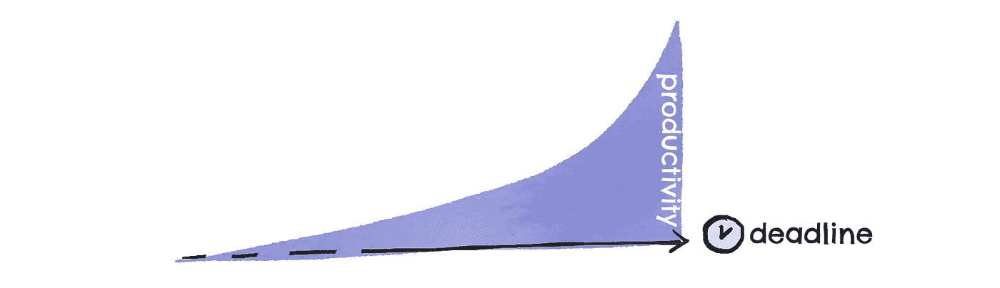
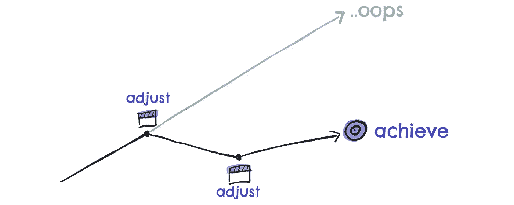
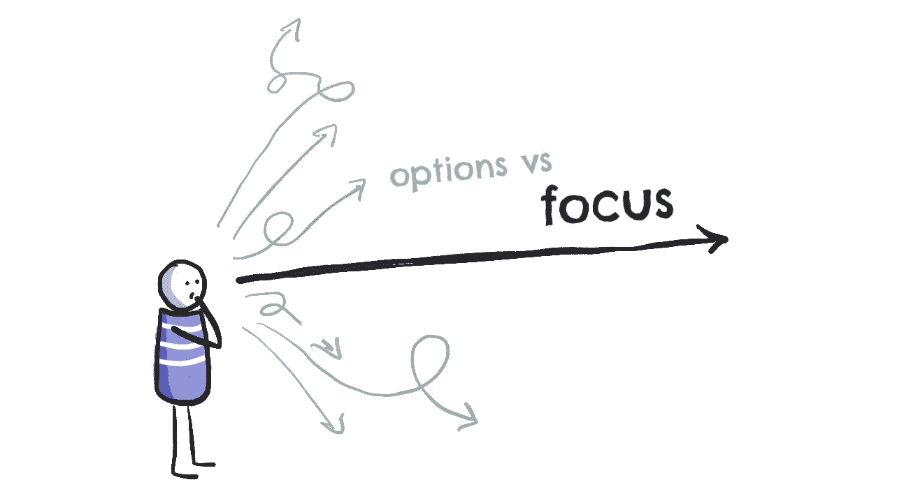
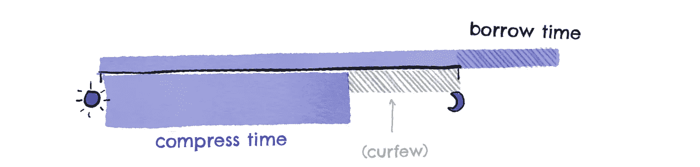

# 如何通过更少的工作让你的生意翻倍

> 原文：<https://medium.com/swlh/how-to-double-your-business-by-working-less-4d67e9d4b5f6>

Photo by [广博 郝](https://unsplash.com/photos/I--YyrXUphc?utm_source=unsplash&utm_medium=referral&utm_content=creditCopyText) on [Unsplash](https://unsplash.com/?utm_source=unsplash&utm_medium=referral&utm_content=creditCopyText)

## 以及为什么我们忽略了我们的首要任务

今天，我去港口散步，做了晨练，洗了个澡，然后一边喝着希腊咖啡看着大海一边写日记。然后，我的一天真正开始了:我接受了一个客户，写了两篇简短的博客，现在，我在这里。周三是我的满足日，所以我很清楚该做什么，该忽略什么。

几年前，这对我来说是不可能的。每一天都是为了更接近“成功”而采取的一系列随机行动，甚至不知道那看起来像什么。我会昏昏沉沉地醒来，毫无热情，但有一种感觉，我必须尽快找到我的笔记本电脑。我现在什么都得做。

这是个人生产力的最大陷阱，尤其是当你为自己工作的时候:因为想做每件事而分心，以至于你从来没有完成重要的事情。
你总是忙忙碌碌，工作到深夜，却又时常感觉落后。

当我开始为自己工作时，我只知道这些。直到我意识到我得到的结果与我付出的努力不匹配。与此同时，我的友谊，我的关系，我的健康和健身，以及生活中的许多其他领域都暂停了。无限期。

从那时起，我开始用约束来组织我的一天。不要给自己完全的自由去做“任何事情”(这让我没有任何结果)，而是为我不应该做的事情以及时间和地点设定一些界限。

结果呢？

仅在过去的 4 个月里，我就推出了一个月收入 1000 美元的新数字产品，写了一本书，将于今年晚些时候出版，开始与 5 个新的高价教练客户合作，并开始与另外 2 个人合作，帮助扩大我的业务。
我在整个欧洲旅行，每个月更换一次城市(和国家),并在朋友来看我的几天里探索新的地点。

像地点这样的限制减少了我可用的时间，所以我被迫变得非常高效，选择那些与我投入的时间和精力相比会带来不相称的结果的活动。

为什么？

# 我们都忽略的每日上限(以及如何利用它为你带来优势)

你一天只能做这么多。即使不睡觉，你还是有一个硬帽:24 小时。所以多工作是一种失败的策略，因为无论如何都是有限度的。另外，到现在为止，你可能已经听说过帕金森定律，该定律指出，工作扩大到填满完成工作的时间。
我相信你一定经历过帕金森定律，当你接近最后期限时，突然，一切都发生了。

Productivity grows as time becomes scarce. Use it to your advantage.

这里有三种方法来设置限制，这样你就可以在减少工作的同时发展你的业务。你甚至不用去旅行(尽管你可以)。

# #1 用数学来设定一个明确的努力目标

> “如果你不知道你要去哪里，任何道路都会带你去”–*柴郡猫说。*

当你不确定你努力的目标时，你就没有办法选择哪些活动能让你达到目标。如果你不知道成功是什么样子，任何活动都会把你带到那里。

这就是为什么设定你可以跟踪的可衡量的目标是重要的，最重要的是，用来知道你现在采取的行动是否会让你达到目标，或者甚至不会接近目标。

## **第一步:你想把你的生活和事业带向何方？**

每当我与一个新的教练客户合作时，我都会看到这一点:当为公司设定业务目标时，大多数人会接受当前的情况，并逐步改善或扩大。一个经典的例子是“将我们的月销售额提高 50%”或“将我的日费率提高 250 美元”。现在，这些目标的问题在于它们完全是随机和抽象的。他们只是一个数字，并不令人兴奋。

为了设定一个你和你的团队将要努力实现的令人兴奋的目标，首先想想你想从中获得什么。与其从金钱目标开始，不如从你想完成但还做不到的事情开始。它可能是雇佣一个专家，发布一个新产品，或者只是一周少工作一天。
不管那是什么，与其从金钱目标出发，然后弄清楚如何使用它，不如从你想完成的事情出发，然后弄清楚为了实现它你需要什么。

一旦你有了这样的想法，你就可以开始创建你的目标了。

## 第二步:建立可衡量的目标。

像“更多的客户”、“更高的日费率”、“更多的空闲时间”之类的商业目标会让你失败，因为你永远不知道你是否已经足够接近了。见鬼，你甚至不知道你是否已经到了那里。

多一个客户够吗？50 美元一天怎么样？还是 10 分钟的自由时间？2 个小时呢？你打算用它做什么？

这么多问题。但是如果你不提前问他们，你将永远追逐一种感觉，而不是一个实际的结果。

关键是要设定容易衡量的目标:它们需要有一个明确的实现条件，以及实现目标的时间。例如:
在接下来的 12 周内再找到两个高价客户
每周去健身房两次，每次一小时
到 3 月底，每天的价格翻倍
这些都是可以衡量的目标:你会知道你是否达到了目标。更重要的是，你不必等到最后期限才知道你正在做的事情是否会给你带来结果。你可以预测未来。

你可以在中途建立里程碑和检查点，这将告诉你是否在正确的方向上前进，并且足够快。

为了帮助您创建自己的可衡量目标，您可以使用此[工作表](https://www.timezillionaire.com/smart-goals-worksheet/)。

**一旦你有了最终目标**，你就可以把它作为你做任何事情的主要约束。在承诺一项任务，同意一个新项目，甚至接受一个新的会议之前，问问自己“这会让我更接近我的目标吗？”

# **#2 关注什么带给你不成比例的结果**

我受不了微内容。推文、脸书更新……都需要我的大量脑力，然而，它们消失得如此之快。很痛苦，你猜怎么着？直到今天，我还没有从社交媒体上得到一个高价的教练客户。

大多数企业主关注的是一切，而不是关注实际带来的结果。他们看到其他人在做什么，并试图做所有的事情。
由于 24 小时的上限(你看到了这一点)，这是一个不可能的方法。

相反，把注意力集中在少数能给你带来结果的事情上，然后利用它们。去年，我和一位企业主一起工作，他将自己的公司发展到了 7 位数:这是一个不可思议的里程碑。然而，该组织一到那里，事情就开始停滞不前了。他忙着做每件事，支持业务中的其他人，以至于他几乎没有时间继续致力于那些使公司发展至今的优势:销售和物流。

Spreading your bets will make your gains risible.

找到你自己的高影响力活动的秘密，是在早期测试许多事情，然后致力于那些带来一些结果的事情，并不断变得更好，直到结果释放出更多的资源，让你扩展到下一个金矿，而不必离开那些有效的东西。

这里的秘密是使用你在上一步中创建的目标来衡量结果，然后放下其他一切，本质上是围绕什么有效创建一个约束。

# #3 快速学习，更快获得成果

如果你在 6 个月内将业务翻了一番，对大多数人来说，这将是一个巨大的成功。但是如果你在 60 年后做了同样的事情会怎么样呢？同样的结果会变成失败吗？

时间是一个我们经常忽略的变量，但它可以是成功和失败的区别。你越快得到结果(和失败)，你就能越快学习和重复有效的方法。然而，我们倾向于关注运动，或者忙碌的感觉，而不是我们实际创造的东西——但这就是生产力:生产。而是你创造的产出，而不是你消耗的投入。
这里有三种方法**让你的效率最大化，这样你就不会迷失在无用的工作中。**

## **设定里程碑。**

**我们在第一步中设定了可衡量的目标，其中一部分是设定里程碑来衡量你所做的是否有效。设立里程碑是确保你压缩时间并在同一时间线内完成更多事情的另一种方式:它还会让你专注于真正重要的事情，而不是迷失在 2000 个策略中。**

**这利用了截止日期的原则:你知道一旦截止日期临近，一切似乎都变得更快了吗？有里程碑可以确保你有许多可管理的截止日期，所以你总是在最终目标的一小部分上工作。**

## **宵禁。**

**我喜欢为自己的一天设定宵禁时间:我的设备上有一个互联网屏蔽，在晚饭后一小时启动，晚上我不做任何工作。以下是你也应该设定界限的原因:当你的可用时间减少时，你将不得不专注于重要的事情，而不是迷失在选项中(然后发现自己在晚上拼命追赶)。然而，要让它起作用，你必须首先打破负面循环，然后尊重你自己的规则:这就是为什么我喜欢使用像 [Freedom](http://timezillionaire.com/freedom-app) 这样的网站拦截器来带走诱惑。**

****

**Curfews help you make the most of Parkinson’s law (and actually have a life).**

## **主题化。**

**主题化是另一个限制，它让你保持专注，迫使你选择做什么…所以你必须放弃不重要的。本质上，你为一周的每一天设定一个主要目标或焦点，然后只专注于此。
例如，我喜欢在周一列出所有内容的大纲，然后在周三写作。这让我可以围绕我的约束来计划我的一周，但这也意味着我需要在周一完成一些事情，否则它就不会在另一天发生。**

**这就是为什么有界限可以促进你的生活和事业。**

**记住，只有当你生活中有其他事情发生时，约束才会起作用。如果工作是你的全部，你不会想要停下来。你会一直忙于错误的事情，只是因为那是消磨时间的最好方式。
这就是为什么每天锻炼、看望朋友、旅行、定期做一些令人兴奋的事情，对你的事业和个人成长都非常重要。**

**忽视生活中的其他方面就像是因为做了伟大的工作而惩罚自己。它也将你的一天扩展到晚上，让一切都融入到工作中。**

**记住，做任何事情都是失败的策略:即使你是每项工作的最佳人选，你也只有 24 小时。你必须选择什么会给你带来不成比例的结果。**

**你可以分三步完成:**

**根据目标产生的影响设定可衡量的目标，然后用这个目标作为你所有活动的过滤器。**

****测试什么有效**:开始时尝试许多事情，但之后选择专注于能给你带来最大结果的事情。**

**选择速度和学习:很容易迷失在许多任务中，这些任务不会让你有任何进展，但会让你对自己的一天感觉良好。
无情地对待你的时间，这样你可以更快地得到结果。**

**记住，时间是成功和失败之间的终极变量。**

**马特**

********

## **这篇文章发表在 [The Startup](https://medium.com/swlh) 上，这是 Medium 最大的创业刊物，拥有+ 372，747 名读者。**

## **在此订阅接收[我们的头条新闻](http://growthsupply.com/the-startup-newsletter/)。**

****