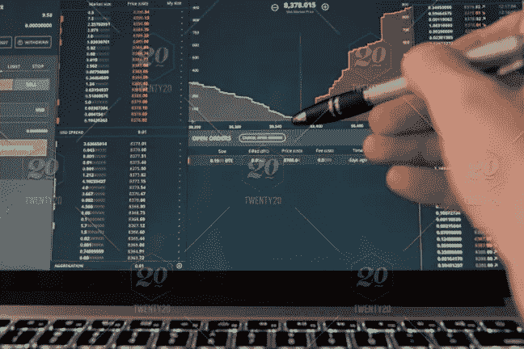
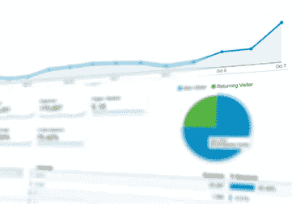

# 如何轻松评估不同情况:调查和分析

> 原文：<https://medium.com/swlh/how-to-easily-assess-different-situations-inquiry-and-analytics-94e4833955c9>

一个经常被忽视的与成功相关的技能是评估情况。不管你的职业是什么，发展这项技能将会改善你的工作和家庭生活。

我是一家公共会计公司的审计员，想分享一下我们是如何评估财务状况的。然后我想解释一下这种评估方式在任何情况下都可以使用。

作为一名审计师，我们对客户进行“审查”。这只是一个“范围较小”的审计。我们没有获得实质性的证据，而是专注于调查和分析。

不管顺序如何，分析通常在询问之前。在我们了解客户的财务状况之前，我们会进行分析。这涉及到两件事。一个是在我们有本年度数据之前，另一个是在之后。

首先，收集以前的数据。

看看过去的三五年，分析一下。寻找共同趋势。对今年**应该是**的样子制定一个预期。

当你开始回顾当年的财务状况时，请记住这些共同的趋势和模式。

在做了一些基本的分析后，我们收到客户的试算表(财务)并开始审查。这就是调查发挥作用的地方。

当数字看起来或似乎不正确时，使用查询。例如，一个客户在过去三年里有大约 1000 万美元的稳定收入。然后，突然之间，该客户的收入在当年跃升至 4000 万美元。我们现在需要询问这次远足是如何发生的。

我们评估了形势，直觉告诉我们有些不对劲。然后，我们通过管理层询问到底发生了什么。原来他们在这一年开始和一家财富 500 强公司做生意。这解释了收入的大幅增长，销量的大幅增加。

现在我们回到我们的分析。

我们分析的第二部分是将当前的财务状况与行业基准进行比较。例如，与竞争对手相比，客户的债务水平是否相似？如果没有，为什么？也许公司坐拥现金，而不是将其再投资回公司。这也许可以解释为什么他们的债务低于行业平均水平。如果我们注意到某个比率偏离行业平均水平太远，我们必须询问管理层并记录为什么会出现这种情况。

**分析和查询以一种美丽的方式相互依存**

为什么我要告诉你这一切？这和日常生活有什么关系呢？

我告诉你这一切是因为这些财务评估工具可以在任何可以想象的情况下使用。这不仅仅与金融有关。

下次你在社交场合，我希望你考虑一下询问和分析。

分析形势。意识到你周围的环境。想想你喜欢和不喜欢这种情况。将它与过去的类似情况进行比较。

**对形势进行基本分析**

这种情况过去后，这就是调查和分析的第二部分发挥作用的时候。反思现状，询问不确定事件。

如果有一件事让你不确定，和能帮助你澄清差异的人谈谈。这一点非常重要，但通常也很困难。我们并不总是觉得问问题很舒服。**跳过这一步。问题引出答案，答案才是目标。**

然后等做完了，情况过去了，再来回顾一下情况。评估这种情况与之前的情况有何相似之处以及有何不同。

这里潜在的主题是意识到正在发生的事情。如果这些工具有助于阐明那个战略，**我已经完成了我的工作。**

如果您喜欢这篇文章，请留下您的掌声并关注！感谢您抽出时间阅读。关注@ bkrajci1。

## 这篇文章发表在 [The Startup](https://medium.com/swlh) 上，这是 Medium 最大的创业刊物，有 322，555+人关注。

## 在这里订阅接收[我们的头条新闻](http://growthsupply.com/the-startup-newsletter/)。

