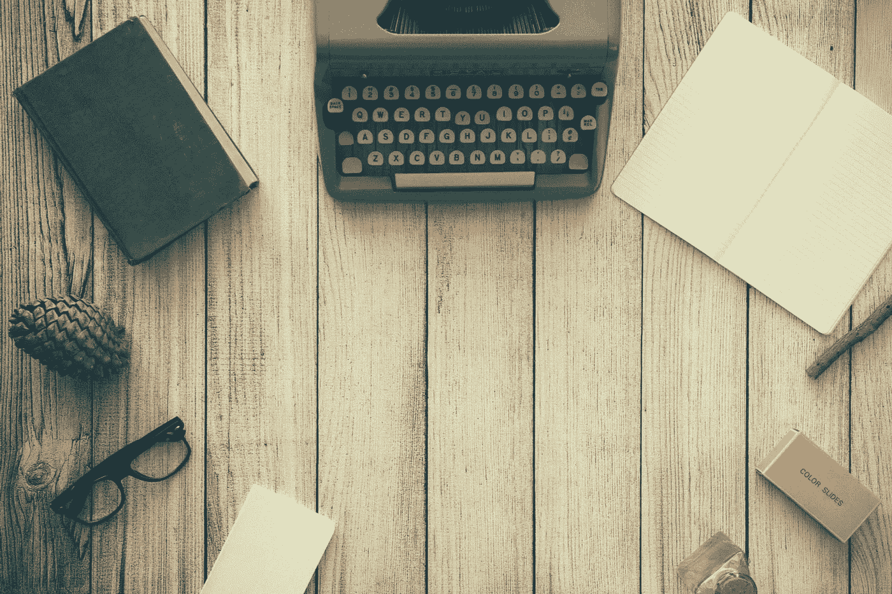

# 如何在没有时间微观管理的情况下轻松提高生产力

> 原文：<https://medium.com/swlh/how-to-easily-increase-your-productivity-without-time-micromanagement-271bf787968>

## 我知道你太忙了。

Photo by [Dustin Lee](https://unsplash.com/photos/jLwVAUtLOAQ?utm_source=unsplash&utm_medium=referral&utm_content=creditCopyText) on [Unsplash](https://unsplash.com/?utm_source=unsplash&utm_medium=referral&utm_content=creditCopyText)

你有一大堆要做的事情，而且似乎永远不会停止。

你有如此多的工作要做，以至于你的大脑不堪重负，感觉就像你在精力充沛的兔子模式下工作，走过场。

你已经尝试了很多次来安排好你的一天，但是它从来没有按计划进行。

你在事情上落后，所以它总是推后你的时间表。

如果我们都能够准确地安排好我们的一天，那将会很棒，但对大多数人来说，这是不可能的。

所以很多人试图提高他们的时间管理技能，但是没有发现他们的生产力有一点提高。

如果这是你，你可能还没有看到更大的画面。

# 这不仅仅是关于你如何管理你的时间。这是关于你如何管理你的能量。

我说的不是呜呜呜类型的能量。我说的是字面上的能量。你需要全天工作的类型。

举例来说，如果你想开始一个副业，你可能会发现除了全职工作和养家糊口之外，你不可能找到精力去做这件事。

即使你在孩子们上床睡觉后安排了一个时间来做它，你可能会累得睁不开眼，更不用说让你的大脑功能接近满负荷了。

所以在管理你的时间之前，你能做的第一件事就是开始管理你的能量。否则，你只会感觉很忙，但实际上并不富有成效。

这里有一些关于如何做的实用技巧。

# 首先处理你最重要的任务

尽可能早地处理你一天中最重要的工作是很重要的。一整天，你的能量水平会随着你所从事的脑力和体力活动而下降。

对于所有的夜猫子来说，这可能意味着你必须早睡早起，这样在新的一天开始之前，你就有了属于自己的时间。否则，在一天开始的时候，当你头脑清醒、充分休息的时候，简单地处理最重要的事情会产生更好的结果。

对于任何需要最少脑力的事情，你可以把它留到下午，因为它不需要太多的能量。

# 为了节省更多的能量，尽可能自动化。

如果有什么事情你可以自动化，你绝对应该。

现在大多数事情都可以自动化了，比如支付账单或者将你的薪水存入你的银行账户。

如果你想让它更上一层楼，你甚至可以雇佣一个虚拟助理，或者雇佣一个像 [Fancy Hands](https://www.fancyhands.com/) 这样的公司来帮你解决很多琐碎的任务。

你可以使用一个非常强大的工具来自动化你的应用程序，这个工具就是[。如果你有创造力，你几乎可以自动化任何事情。](https://ifttt.com/)

例如，我用它来通知 craigslist 上的最新事件。我设置了它，这样当一个新的帖子出现时，它会自动触发一封电子邮件给我，这样我就可以第一个看到它。这样，我个人就不必再去网站浪费精力不断刷新提要来寻找交易了。

# 遵循奥卡姆剃刀原则:最简单的方法往往是正确的。

把事情复杂化很容易，简化却极其困难。

> 天才的定义是化繁为简。
> 
> -阿尔伯特·爱因斯坦

管理你精力的一个伟大策略是改变你的环境，让你尽可能容易地完成一项任务。

**相关:** [如何毫不费力地实现自己的重要目标](/swlh/how-to-effortlessly-achieve-your-important-goals-6759643dfb95?source=linkShare-40f8def10efb-1515485769)

想想遥控器是怎么发明的，这样你就不用从沙发上起来换频道了。

在你的日常生活中应用同样的方法。

**让自己做事更容易。**

如果你想早上第一件事就是去跑步，把你的运动服放在你的床边，这样你一起床就可以马上穿上。

如果你想在睡前多看看书，少消费社交媒体，那就在客厅给手机充电，把书放在枕头边。

如果你想吃得更健康，每天早上为自己做一杯奶昔，把所有的原料放入搅拌机，前一天晚上放入冰箱。

# 你的大脑会一直朝着阻力最小的路径前进，所以好好操纵自己。

我们天生懒惰，所以我们需要想办法让它对我们有益，而不是拖我们的后腿。

当有人开始解释某事时，当事情变得太复杂时，你就开始不去理会他们。

这是你的大脑关闭了，因为它想得太多了。如果你有太多事情要做，这同样适用于你的生产力。

如果你的时间分配得太分散，你的能量水平处于历史最低点，你会筋疲力尽，不能完成你想要的那么多事情。

你有没有注意到一个人向你解释某事的方式比另一个试图向你解释的人更有意义？

这是因为第一个人可能更擅长于简化解释，让你更容易消化和理解，而不必为此苦苦思索。

所以也要简化你的生活，这样你就更容易完成任务，而不必花费过多的精力。

这样就可以做到事半功倍。

**如果你喜欢这篇文章，那么你可能也会喜欢我的免费指南，** [**立即开始你最好的生活的四个步骤**](https://mailchi.mp/de7ebe746809/destiny-hacks-free-guide) **来学习一个简单的练习来找到你为什么以及其他重要的战略来发展你的业务**。

## 这篇文章发表在 [The Startup](https://medium.com/swlh) 上，这是 Medium 最大的创业刊物，拥有 282，454+读者。

## 在这里订阅接收[我们的头条新闻](http://growthsupply.com/the-startup-newsletter/)。

