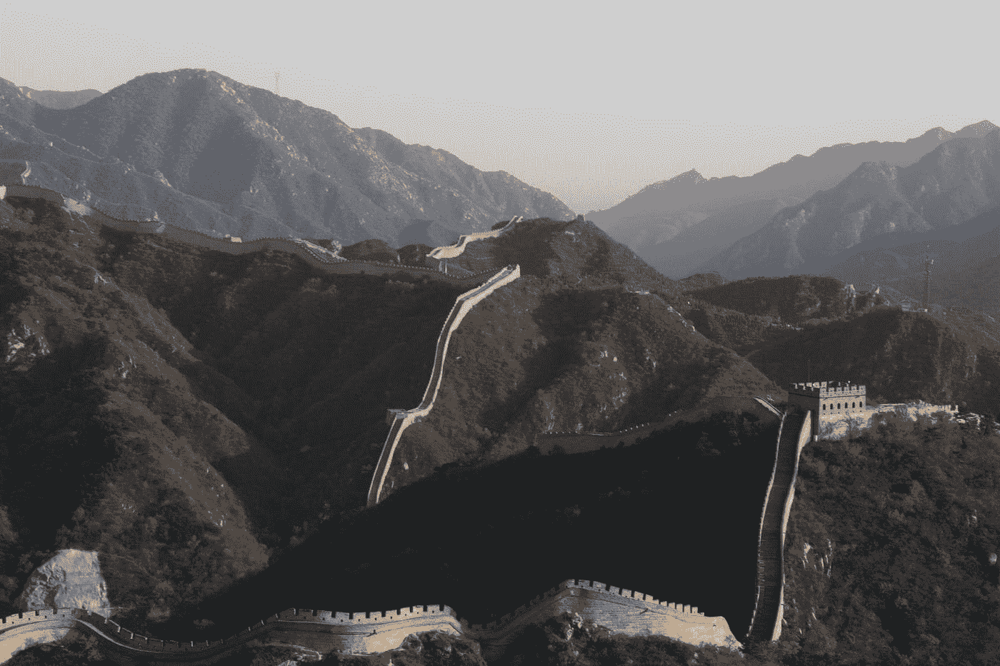

# 如何拥抱个人成长和美好生活的长征

> 原文：<https://medium.com/swlh/how-to-embrace-the-long-march-to-personal-growth-and-a-better-life-75d4d0cca19a>

## 需要耐心、坚持和信念

“Great Wall of China” by [Violette Filippini](https://unsplash.com/@violettefil?utm_source=medium&utm_medium=referral) on [Unsplash](https://unsplash.com?utm_source=medium&utm_medium=referral). Of course I used a pic of the Great Wall! It’s in China after all.

实现人生潜能的道路漫长而艰难。这不是一朝一夕的事，除非我错过了什么。如果我错过了，我会很生气，但是我跑题了。