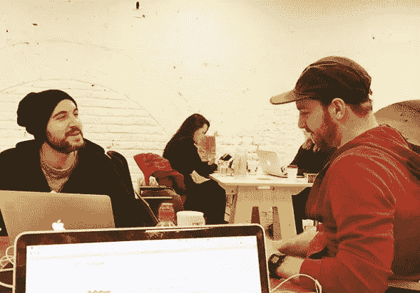
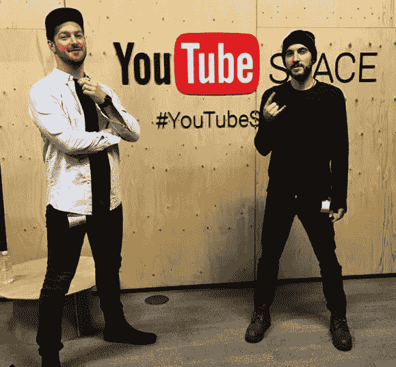

# 如何拥抱创业的不确定性

> 原文：<https://medium.com/swlh/how-to-embrace-the-uncertainty-of-entrepreneurship-284114022cef>

一家初创公司诞生时会产生一股情感洪流。

从零开始建立一个想法的兴奋、满足和喜悦。确保这个想法变得有利可图也带来了压力和不确定性。

我与 [GoGetters](https://www.gogetters.live/join-the-community.html?utm_source=medium&utm_medium=medium&utm_campaign=joeelvin) 的联合创始人 Harry Coburn 和 Josh Phillips 就如何处理这些情绪并确保你留下一个成功的创业公司进行了交谈。

## **什么是 GoGetters，你是怎么得到这个想法的？**

哈利:我们试图创建一个社区，在这里人们可以互相帮助，走出舒适区，实现他们想要的一切。人们被困在自己的生活中，我们希望给人们一个空间，看看外面有什么，打破他们的精神束缚。

我已经在创业公司呆了一段时间了。2016 年底最后一个死了之后，我知道是时候‘全押’去做自己的事了。

当乔希和我讨论 GoGetters 的想法时，这是显而易见的。我回顾了过去十年我自己的想法和反思，它们都指向这一点。最重要的是相信你的直觉。对我来说，没有别的办法。

在我 19 岁生日那天，我被紧急送往医院，并被告知只能活半天。这时你会意识到生命是多么短暂，并开始做你真正想做的事情。很多人没有那个叫醒电话。也许这就是我们能产生巨大影响的方式。

## 辞职去专注于 GoGetters 的可能性是如何产生的？

我在一家社会创新公司做了大约 18 个月的全职工作。起初我很高兴，但很快就对我在那里做的事情感到有点失望。我在想‘我还能做些什么，我能帮助什么样的人，我怎样才能有所贡献，产生更大的社会影响？’

我有机会在公司内部建立一个公司，就像一个“内部企业家”，但很明显整个公司没有时间或空间来完成这项工作。我知道我必须离开，去创造一些我可以全心全意投入的东西。

我被介绍给哈里，我们有很多共同的目标。我们就我们想要做的项目类型进行了一次头脑风暴，不到一周，我就决定和他一起工作。

对我来说这是个合适的时机。我知道，如果我现在不面对这种不确定性并采取行动，我可能永远不会这样做，我会一直想知道会发生什么。

Harry Coburn (left) and Josh Phillips (right) are ready for the roller-coaster of entrepreneurship

## **你会建议创业者做哪些尽职调查，以确保他们的想法可能行得通？**

乔希:首先要做的是测试它。可以是一个小测试，但是你需要证明你的概念。如果你有一个可行的想法，那就去尝试一下。市场的美妙之处在于，它会告诉你你的对错程度。《精益创业》是一本讨论这一过程的书。它真的可以帮助消除很多不确定性。

**哈利:**正是。我邀请了 10 个人到我家，问他们“有什么事情是你一直想做但又没有做的”。我告诉他们‘你们有三周时间来做这件事，否则你们必须向慈善机构捐赠 200 英镑。’人们喜欢这个想法。它激发了一个人环游世界。另一个家伙实现了他在一周内驾驶火车的抱负。这个项目更多的是观察人们的反应。每个人都很兴奋。每个人都告诉了他们的朋友。我们为这次挑战创建了一个 Whatsapp 小组，规模扩大了一倍。所以我们知道我们可能会赢。

## **你会建议哪种人不要创业？**

哈利:你需要准备好牺牲一切。我们牺牲了高薪、舒适的生活方式和名誉。你必须准备好生活和呼吸你的想法。你必须对此深信不疑，否则很多事情都会失败。你也需要准备好来自朋友和家人的支持。最重要的是相信你自己。

乔希:对你的愿景有信心非常重要。此外，能够采取灵活的解决问题的方法。我认为这并不适合所有人。有些人将创业视为快速解决问题或致富的迷人途径。也许会，但是有很多不确定性。你必须享受实现愿景和解决问题的过程。在这个阶段，参与和满足是对我们的回报。如果你觉得你会被自己的创业所吸引和满足，我会说去做吧。

## **有必要对你的商业想法有热情吗？**

哈利:我不这么认为。我有个朋友在网上卖椰子油。他可以高枕无忧，每周花几个小时经营自己的公司。他正在实现财务自由的目标。有很多成功的企业都是基于销售劣质产品。我不能制造劣质产品，这不是我的专长。我必须做我热爱的事情。我不认为你需要激情，但是如果你在做一件以使命为导向的事情，你可以走得更远，提供更多的价值。

## **你今年给 GoGetters 定的目标是什么？**

Josh: 我们有 GoGetters 直播，这是我们的第一个大型活动。它将被指定于 2 月 24 日在伦敦卡姆登举行。我们将挑战人们在一天内众筹、众包并执行一个想法。该活动的动机是让优秀的人做他们通常不会在一个充满创意和乐趣的空间里做的事情。除此之外，第一季度是关于建立社区和产品测试。第二季度的重点是向 Q1 学习，并致力于盈利、众筹和投资。

## **你认为这种方法会让人们吃惊吗？**

**哈利:**我们基本上是一家以人为本的创业公司。社区是我们现阶段的产品。有些人对此感到惊讶，同样，我们不做正常的工作也令人惊讶。

Josh: 我们希望建立一个了不起的人的网络，所以首先建立一个社区是有意义的。很少有公司成功地先建立了一个观众群，然后再将它货币化。看看 YouTube 或者社交媒体公司。如果你没有一个社区，我们的想法就没有意义。

***需要一点推动来帮助你实现你真正想要的？*** [***点击此处***](https://www.gogetters.live/join-the-community.html?utm_source=medium&utm_medium=medium&utm_campaign=joeelvin) ***加入 GoGetters 等候名单，并收到加入其社区的邀请。***

## 这个故事发表在 [The Startup](https://medium.com/swlh) 上，这是 Medium 最大的企业家出版物，拥有 282，454+人。

## 在这里订阅接收[我们的头条新闻](http://growthsupply.com/the-startup-newsletter/)。

