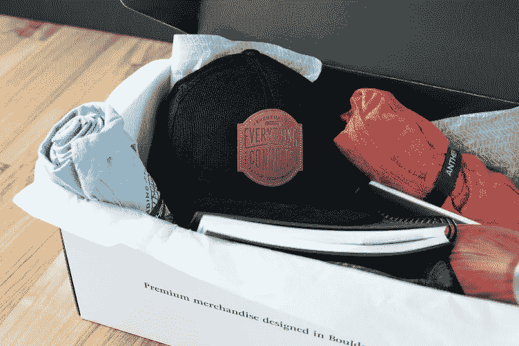
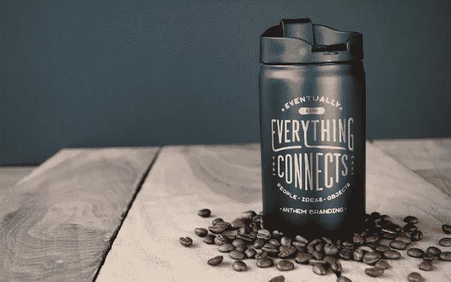
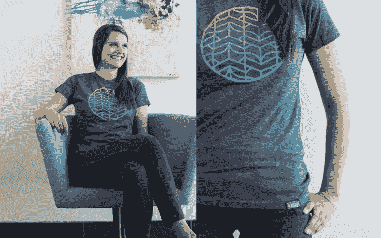

# 如何利用独家赠品增强您的集客策略

> 原文：<https://medium.com/swlh/how-to-enhance-your-inbound-strategy-with-exclusive-giveaways-a71e82957e5d>

如果您使用集客营销策略来获得更多线索、培养客户和推动销售，提供独家赠品是提高活动知名度的有效方式。这些赠品通常会比其他广告方式产生更强的口碑联系，因为它们创造了与你的品牌相关的体验，并给你的受众带来了你品牌的有形部分。然而，要创建一个回报最大的赠品策略，你需要记住几件事。以下是这些步骤是如何分解的，以及为什么你会想在你的活动中使用它们。

# 定义你的目标受众

你需要了解集客营销活动的所有阶段，以便充分利用你的赠品促销。根据 [Envision Creative](https://www.envision-creative.com/the-4-stages-of-an-effective-inbound-marketing-strategy/) 的说法，这种营销活动有几个基本阶段。首先也是最重要的，集客营销的基本目标是确保你的活动得到你的目标受众的注意。换句话说，你将如何吸引访问者到你的活动网站，并告诉他们你的独家赠品？这与你用来吸引他们的内容类型有关。

在你开始计划营销活动的各个阶段之前，确定你的目标受众是很重要的。了解你试图吸引的人群将为最有效的[定制商品](http://info.anthembranding.com/premium-merchandise)或促销产品奠定基础。即使是最好的产品(在你看来)也可能对你的目标受众没有吸引力，并可能引起错误人群的共鸣。

相关:[高端品牌营销权威指南](http://blog.anthembranding.com/blog/the-definitive-guide-to-premium-brand-merchandising)

Inc.com 给了企业家一些有用的想法，告诉他们如何找出谁是他们的目标受众。为此，您可以:

*   看你的产品或服务。它为哪些挑战或问题提供了解决方案？哪些群体认为你所提供的最有价值？做一些市场调查，找到这个问题的答案。
*   如果你经常接触你的客户，问问自己他们的共同特点。他们主要属于哪个年龄段或工作角色？他们需要解决什么问题？为什么他们买你的产品而不买别人的？在那个人群中，什么商品和服装是流行的？
*   你的竞争对手是谁？他们有什么样的定制或品牌商品？了解这一点有助于你进一步确定你的利基和你为赠品选择的项目。

# 内容类型

简而言之，集客营销是一种让人们来到你的网站或社交媒体页面的方法，这样他们就可以注册/了解更多关于你的推广活动。集客营销人员使用几种不同类型的线索生成和内容推广工具。其中一些包括:

*   利基相关博客
*   YouTube 和 Vimeo 上的视频
*   电子邮件简讯
*   社交媒体网站
*   亚马逊上的书籍
*   谷歌和其他网站上的在线广告
*   证明书
*   个案研究

此外，吸引游客只是等式的第一部分。你需要记住的第二件事是，你想要培养你的访问者，使他们有资格并转化为潜在客户。这有助于建立您的潜在客户名单和邮件列表，以便您有合格的买家出售您的商品和服务。这是一个强大的赠品可以帮助你。

要做到这一点，你需要一个赠品宣传片，让你值得参加比赛。根据 [Shopify](https://www.shopify.com/blog/72726597-how-to-grow-your-business-with-giveaways-and-viral-contests) 的说法，一些可能的赠品包括礼品卡、旅行套餐或限量版产品。然而，要真正成功地吸引你的目标受众，提供与你的理想消费者产生共鸣的品牌产品，并为你的活动添加情感元素，已被证明是最有效的方法(稍后将详细介绍)。)

Shopify 继续解释为什么你应该提供赠品作为有效营销策略的一部分。例如，一个简短的病毒式营销计划/赠品——比如说 10 天——可以为你的名单增加多达 1500 名(或更多)新订户，并为你带来 5000 美元的净销售额。

# 分销渠道和方法

您还会注意到，在某些方面，您的内容也决定或定义了您的分发方法/渠道。例如，你可以通过你的利基博客发布关于你的[品牌商品](http://info.anthembranding.com/branded-merchandise)和赠品的信息。假设你写了一个关于美食咖啡的博客，并且你正在为你的推广提供一个高质量的咖啡杯。你在自己的网站上提供咖啡配方、咖啡源信息和品牌产品。所有这些元素都可以成为你博客的主题。

但是精明的营销人员知道，经过研究和整理的信息可以有多种用途。例如，在你写完博文后，你可以为 Pinterest 或 Twitter 等网站创建一个关于这篇博文的信息图。此信息图可包含您当前独家赠品的信息，并带有一个返回赠品登录页面的链接。

一旦你有了足够多的博客文章，你还可以用它们创作电子书，并在亚马逊或其他图书销售网站上出售这些内容。你可以在书的电子版前面放上一个正在进行的赠品的链接。人们可以注册你的赠品，并因此获得酷的[品牌装备](http://info.anthembranding.com/custom-gear)。

基本上，你为你的博客文章策划的内容可以成为通过你的目标渠道发布的多种内容的基础。当你创作你的内容时，总是问自己是否有另外一种方法可以用另外一种媒介来传达信息。

# 使用优惠和品牌商品

[印有贵公司名称的定制商品](http://info.anthembranding.com/custom-gear)如 t 恤或[单肩包](http://blog.anthembranding.com/blog/googles-custom-bags-the-perfect-combo-of-functionality-branding)可以作为大赠品。如果你对此不确定，只要想想像迪斯尼或硬石咖啡馆这样的品牌在销售品牌商品方面是多么成功。

对于这些品牌的狂热粉丝来说，获得免费商品是值得的。请记住，在这种情况下，价格并不意味着他们付钱参与赠品。相反，他们会将自己的姓名和联系信息添加到您的邮件列表中，以换取参加并赢得赠品的机会。

但是根据 TIME.com 的说法，赠品还有更实际的一面。口碑广告已经被证明是最有效的一种广告。通常花费也更少。那么问题是，你如何让人们谈论你的产品？TIME.com 说最简单的方法是提供免费赠品——该网站有数据支持这一说法。对赠品感到兴奋的人会以比其他促销高出 15%的价格与他们的朋友聊天。

最后，你会想知道你的赠品获得了良好的投资回报率。 [Growth Hacking Pro](http://growthhackingpro.com/12-proven-steps-successful-giveaway-campaigns/) 建议，当你把赠品作为一种营销策略时，寻找一些关键绩效指标(KPI。)这可能是一个产品的大量下载，你的时事通讯订户数量的增加，或者额外的销售，等等。

# 关于赠品的最终想法

独家赠品可以成为您品牌的绝佳营销推广项目。精心设计的品牌 t 恤或一双 rad [定制袜子](http://blog.anthembranding.com/blog/these-brands-put-the-swag-back-in-swagger-with-custom-socks)可能正是你需要的东西，来鼓励更多人加入你的网站或在社交媒体上关注你，以扩大你的拥护者社区。要创建一个成功的活动，您需要创建内容来推广竞赛。这为你的集客营销策略奠定了基础。最后，你会想知道你所做的正在创造一个良好的投资回报率，你可以通过销售额或电子邮件列表的增长来衡量。

准备好开始下一次集客活动的独家赠品了吗？联系我们的[品牌代理](https://anthembranding.com/)，与品牌专家谈论[会引起你的目标受众共鸣的品牌商品](http://info.anthembranding.com/branded-merchandise)。让我们一起创造一些东西。

*原文来源:*[*http://blog . anthembranding . com/blog/how-to-enhance-your-inbound-strategy-with-exclusive-赠品*](http://blog.anthembranding.com/blog/how-to-enhance-your-inbound-strategy-with-exclusive-giveaways)

## 这个故事发表在 [The Startup](https://medium.com/swlh) 上，这里有 259，700+人聚集在一起阅读 Medium 关于创业的主要故事。

## 在这里订阅接收[我们的头条新闻](http://growthsupply.com/the-startup-newsletter/)。

