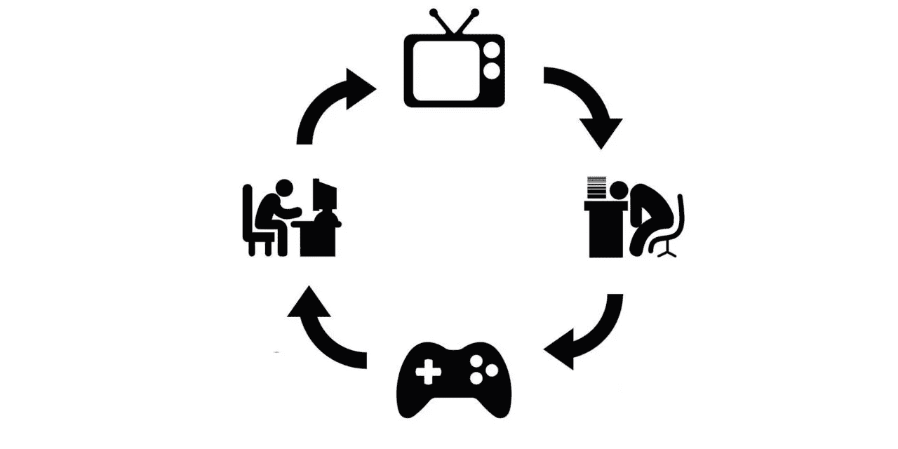

# 如何逃离拖延症的厄运循环

> 原文：<https://medium.com/swlh/how-to-escape-the-procrastination-doom-loop-c1a3424e5edc>

在我们最意想不到的时候，诱惑有一种神秘的力量悄悄靠近我们。前一分钟你还准备出发，下一分钟你就在检查手机或散步来“进入状态”。

在你意识到之前，你已经陷入了 ***拖延的厄运循环***——在那里你不断推迟开始一个项目，以至于想做*任何事情*的想法都是压倒性的。

我们都经历过。但是，95%的美国人说他们拖延，超过 26%的人说他们是慢性拖延者，这不是一个小问题。

那么，为什么我们对开始感到如此无助，即使我们知道这是对我们最有利的？当拖延症困扰我们的时候，有没有一种方法可以让我们摆脱它呢？

# 拖延死亡循环是什么样子的(以及为什么它如此强大)

当我们大多数人想到拖延时，我们会将其归咎于糟糕的时间管理或过于关心短期回报。但是越来越多的研究人员发现拖延的根本原因是更深层次的:我们的情绪。

正如德里克·汤普森在《大西洋月刊》的**中所写的，人们很容易混淆合理拖延和真正拖延之间的区别。前者可能是有用的(“等我有更多时间写的时候，我会回复这封邮件”)。而后者，顾名思义，是弄巧成拙(“我应该马上回复这封邮件，我有时间…但是我就是，不… ***觉得*** 喜欢)**

**当我们真的在拖延时，我们会推迟行动，因为我们觉得自己心情不好，无法完成任务。*和*，我们假设我们的情绪在不久的将来会发生变化。例如，“如果我现在小睡一会儿，以后就能集中注意力了。”或者“如果我先查看社交媒体，然后我会准备好做一些工作。”**

**但是，众所周知，我们不知道未来的自己想要什么或者我们会有什么感觉。因此，相反，我们被推入了一个坏情绪和拖延的循环。**

*   **我们推迟开始工作，因为“我们不想做”**
*   **这让我们感到内疚和压力**
*   **这种焦虑意味着我们没有好心情开始工作**
*   **所以我们再次拖延**

**等等等等。**

**这是毁灭性的。但是，你*能*打破拖延的厄运循环。**

**它始于理解和意识到你的心情。然后在你被卷入延迟的漩涡之前介入。**

# **第一步:让别人为你设定最后期限**

**总的来说，我们摆脱拖延症最简单的工具就是截止日期。当我们知道*有*事情要做的时候，我们似乎更善于抛开情绪，把事情做完。**

**但不幸的是，并不是所有的期限都一样有效。**

**在一项著名的研究中，行为经济学家丹·艾瑞里雇佣了 60 名学生来校对三篇文章，他们发现的错误将得到奖励，每迟到一天将被罚款 1 美元。**

**第一组有每周的最后期限。第二组的三篇文章只有一个截止日期。而第三组可以选择自己的截止日期。**

**实验结束时，第二组表现最差，而第一组——有固定的外部期限的那组——表现最好。**

**Ariely 和他的合著者 Klaus Wertenbroch 总结道:“人们战略性地试图通过使用昂贵的自我强加的最后期限来抑制拖延。”然而，研究表明，你给自己设定的最后期限很少像外部期限那样有效。**

**当你感觉陷入了一个厄运循环时，让别人为你设定最后期限。无论是老板、同事，甚至是朋友。你越能强迫自己说“情绪不是一个选项，我只是需要继续下去”，你就越能打破这个循环。**

*****改期提醒是提醒自己应该做什么的好方法，或者如果你在分散注意力的任务上花了太多时间。*** [***了解更多关于提醒的信息，尝试这些提醒食谱来帮助你战胜拖延症***](https://blog.rescuetime.com/rescuetime-alert-examples/) ***。*****

# **第二步:在你应该开始一个项目后设置提醒**

**截止日期起作用是因为它们提醒我们工作的时间有限。然而，即使是外部截止日期也很容易被忽视。**

**研究人员表示，大多数拖延者都偏向于现在，并且对自己记住重要任务的能力过于自信。截止日期看起来是个好主意，但是我们倾向于把它们推到一边，并认为我们以后会处理它们(听起来很熟悉吧？)**

**那么，你能做什么？一个选择是为截止日期设置提醒。听起来很明显，对吧？设置提醒可以让你时刻记住截止日期，帮助你开始工作，即使你不喜欢它。**

**然而，太多的提醒，太早的提醒，很容易成为巨大的压力来源，当你已经陷入拖延的厄运循环时。被提醒你已经拖延只会破坏你的心情，让你更难开始。**

**为了打破这种循环，你需要取消忽略提醒的选项。正如 Derek Thompson 在《大西洋》 的 [*中所写的，这意味着在*之后为*设置“一次性”提醒，理想情况下你应该已经开始着手这个项目了:*](https://www.theatlantic.com/business/archive/2014/08/the-procrastination-loop-and-how-to-break-it/379142/)**

> **“最后一秒的提醒和迫在眉睫的最后期限不仅会打破厄运循环，让你震惊地采取行动，而且也不会给你时间推迟——甚至可能忘记——任务。”**

# **第三步:从任何事情开始，持续任何时间**

**截止日期和提醒对于让你在正确的心态下开始工作很有帮助。但是厄运循环的情绪化本质使得跨越这个门槛并真正完成工作变得非常困难。**

**更糟糕的是，当你让工作和截止日期堆积如山时，很容易感到不知所措，并再次陷入拖延的怪圈。**

**相反，到时候你需要想办法做任何少量的工作。这里有一些建议:**

1.  **[**将你的任务分解成尽可能小的行动**](https://blog.rescuetime.com/why-you-should-be-setting-smaller-goals/)**:**这意味着对你能完成的事情持现实态度。例如，如果你想写一篇文章，不要说你会一口气写完。相反，承诺写一份提纲。设定较小的期望，快速获得成功是改善心情的好方法。**
2.  ****使用 Instagram 创始人凯文·斯特罗姆的** [**5 分钟法则**](https://blog.rescuetime.com/5-minute-productivity-hacks/) **:** 如果你仍然觉得任务太大(压力和负罪感正在积聚)，试着告诉自己你只打算花几分钟去完成它。在大多数情况下，做工作比拖延要容易得多。你只需要一个方法来欺骗自己开始。**
3.  **提醒自己在准备好之前开始是可以的:感觉没有准备好是推迟开始做任何事情的一个简单方法。但是纵观历史，最成功的人总是在他们准备好之前就开始了。提醒自己这一点，并尝试刚刚开始。如果你遇到困难，你可以做更多的研究或准备。**

# **当你把工作重新定义为更积极的东西时，你的情绪和对它的感觉就会改变**

**人们很容易忽视或低估你的情绪对你做有意义的工作的影响。但是你无法控制自己摆脱坏心情。**

**要打破拖延的厄运循环，你需要直面它。这意味着设置不可协商的最后期限，使用“一次性”提醒，把你的任务分解成几分钟就能完成的小任务。**

**最后，记住你的情绪是你感知的反映。如果你认为“工作”是*应该*带给你压力的事情，你很可能会感到有压力。**

**所以，当你发现自己面临拖延症的厄运循环时，花一秒钟退一步，问问为什么。有时候，简单地了解压力来自哪里可以帮助你摆脱它对你的控制。**

# **嘿，我是乔里！**

***我帮助公司和有趣的人通过聪明和专注的写作讲述他们的故事。想一起工作吗？在 hello@jorymackay.com 给我发邮件***

***这篇文章的一个版本最初发表在* [*改版博客*](https://blog.rescuetime.com/procrastination-doom-loop/) *。查看更多关于生产力、专注和动力的文章。***

****

## **这个故事发表在 [The Startup](https://medium.com/swlh) 上，这是 Medium 最大的创业刊物，拥有 316，638+人关注。**

## **在此订阅接收[我们的头条新闻](http://growthsupply.com/the-startup-newsletter/)。**

****