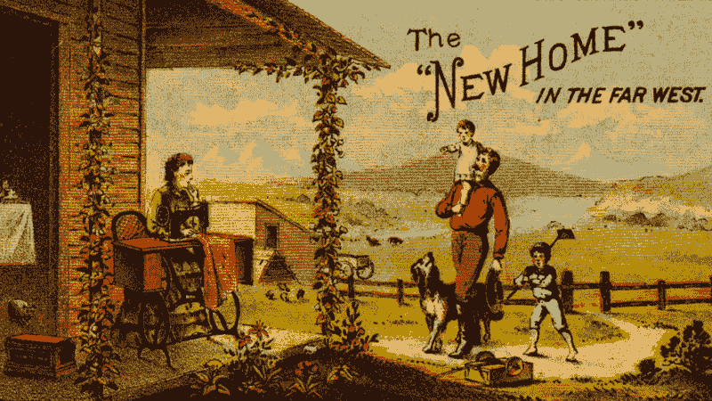

# 如何在 5 分钟内向你爷爷解释敏捷和 Scrum？为了更好地了解你自己

> 原文：<https://medium.com/swlh/how-to-explain-agile-and-scrum-to-your-grandpa-in-5-mins-and-to-better-understand-both-yourself-3792748fa085>

## 你会发现敏捷非常直观。

当你不能用简单的术语解释某事时，你开始怀疑某事可能出了问题。特别是如果你的大脑和我的一样工作:为了完全理解自行车的功能，我需要重新发明一辆。

在敏捷中，如果我有一个共同的问题，并且会找到解决方案，我每次都会告诉自己(或者我的团队会告诉我):

*“娜塔莎，住手！不要想。*

*你仅仅读了 3 本关于这个主题的书，参加了几个为期两天的研讨会，参加了一个敏捷夏令营，看了几个视频，和敏捷教练开了几个策略会议。嗯，还花了几年时间在 sсrum 工艺上。*

*很明显，娜塔莎，你哈哈！你能理解什么？不要敢于自己寻找问题的答案。写下来，等待你的敏捷教练的咨询。”*

哦，但是我真的很讨厌不该思考的时候。这是“shuhari”原则:你不允许打开你的常识。看起来是不是有点可疑？

*Speaking of suspicious*

加入讨厌敏捷的阵营对我来说不是一个选择。我的一切都信奉敏捷原则。我是一个善于改变的人，我不能没有灵活性。

我决定鼓起勇气写一篇关于敏捷和 scrum 实际上是多么直观的文章，并且在正确的时间打开它们是非常重要的。并且在适当的时候关掉它们。再一次:

> 并在适当的时候关掉它们。

所以，叫你爷爷过来，我们开始吧。

## 向爷爷解释敏捷

—爷爷，想象一下:你还年轻，你刚结婚。有人让你和你妻子留下来过暑假。但是*冬天来了*，你需要及时盖房子。你会怎么做？(我举的例子可能看起来很奇怪，但我来自俄罗斯，在我的国家，这些例子很常见。这种情况在我祖父母年轻的时候非常典型。)

—我会建一个小房子，但是要有坚固的地基，这样我们就可以在寒冷袭来之前搬进去。我会用简单的方式铺好屋顶，这样我们就能过冬了。

—然后呢？

—然后第二年夏天，我会建一个附属建筑，并以坚固的方式重做屋顶。在那之后的夏天，我会建一个门廊。在那之后的那个夏天——也许会增加一层楼。我会和我的妻子一起决定先做什么和下一步做什么。

干得好，爷爷。现在记住:

> 我们将称房子为产品。是的，不要笑。
> 
> 你的第一个“只是为了搬到某个地方”的房子是一个 **MVP** 。即最低可行产品。
> 
> 有附楼的房子和有玄关的房子是**增量**。
> 
> 你是**产品负责人**，你负责房子的外观。
> 
> 你的妻子是利益相关者，她的意见很重要，因为她必须住在房子里。
> 
> 附属建筑、门廊、另一层楼、坚固的屋顶以及任何你想建造的东西都是**待办事项**。
> 
> 当你和你的妻子坐下来决定做什么时，你**整理**积压**的**。

——现在告诉我，爷爷，你打算怎样建造你的房子。

—嗯，我自己是一个糟糕的建筑工人，但我是一个好的安装工，所以我会继续在工厂工作。我会邀请我的哥哥和叔叔沃瓦为我建房子。我哥哥是个手巧的人，沃瓦叔叔是个聪明人——他会做所有的蓝图和计算。两人都是伟大的工作者。最后，我会让我的邻居一天喂它们三次，并保持它们之间的和平，以防它们开始争吵。

—完美。现在把它放下:

> 你哥和 Vova 叔叔就是**开发者团队**。
> 
> 他们的优势在于能够互相替代。所以他们是 T 型人:他们都可以把一件特定的事情做得很好，但在其他事情上他们可以互相帮助。
> 
> 你的邻居是一个 scrum 大师。她的主要任务是保持团队精神。

—你如何确保他们做好每一件事？建筑材料不会用光？

—在每周的开始，我会讨论接下来的 1-2 周需要购买什么。早上，在去上班之前，我会和他们在邻居家喝咖啡。会密切关注他们已经完成了什么以及他们将要构建什么。有时我们可能会一起喝醉，然后每个人都会抱怨其他人工作越来越差。但那时我们会和好如初。

好吧，爷爷，所以:

> 你们每周开始的讨论就是一次**冲刺**规划**规划**。
> 
> 你的早晨咖啡是一杯站立的咖啡。
> 
> 喝醉了开始争论就是在开一个回顾会。

—爷爷，但是你的妻子呢？她可能也有兴趣参与建造这座房子。

—我每两周带她一次。以防万一会出问题。

—看看我们有什么:

> 你妻子来访前的两周是你冲刺的时间。
> 
> 当你妻子来的时候——这是一次冲刺复习。你应该以一种能让你总是有东西展示给她看的方式计划你的冲刺。
> 
> 你的乔迁派对是**产品**推出。

爷爷，我们到了。你刚刚重塑了敏捷和 scrum 的主要部分。当我们需要快速、廉价地构建一些东西时，我们会凭直觉找到灵活的解决方案。历史上发生过很多次。

## 历史背景

在殖民美国的时候，殖民者去了远离文明的西部。他们受到资源和时间的限制，他们必须在冬天到来之前建造一个住所。第一年，他们会用石头和泥土建造小草皮屋和一个炉子。这是他们的 MVP。第二年，他们会用原木建造一个小屋(这是他们产品的 2.0 版本)。只有从第三年开始，他们通常会开始建造一个真正的固体房子。

*1883, Nebraska. Sod house typical for settlement of the time, with a bull in place of a dog*

巴西贫民窟的居民有更多的时间，而且没有冬天。但是他们的资金和资源有限。他们用大砖块建造他们的房间，也是以一种敏捷的方式。他们能买得起多少砖，就建多少墙。他们可以稍后完成，然后添加窗户，铺设屋顶，有时甚至粉刷墙壁。当家庭成员增加时，他们建造下一个房间。

*Favelas illustrate the intuitiveness of agile.*

Gradnpa，开发人员永远没有足够的资源做他们想做的一切，所以他们也找到了一种灵活的方法，并称之为‘敏捷’。

> **敏捷**是出于需要的灵活性。它是准备先住在一个小房子里，经常与你的团队见面，与那些能同时做几件事的人一起工作，并随着你的进展增加变化。
> 
> **Scrum** 是灵活性所需的交互、操作和角色的框架。

## 敏捷，还是不敏捷

——爷爷，如果你有足够的钱和时间马上建一座坚固的大房子，你会怎么做？

那时，我不会为一个小房子而烦恼，我只会雇佣一家建筑公司为我建造一个随时可以搬进去的房子。我们会确定一个计划并签署一项协议。我会去建筑工地参观几次，检查工程进展如何，但更多的是出于好奇，因为他们肯定会按照计划建造一切。

—但是马上建一栋大房子会花更多的时间。那你就不能在九月前搬进来了！

—嗯，我宁愿等六个月，但要有一栋坚固的两层楼的房子准备搬进去。在一天结束的时候，我实际上会存下很多钱。我不会把我的资源浪费在一个临时屋顶上，而是从一开始就有一个坚固的屋顶。

—如果你不确定是想住公寓还是房子，该怎么办？

——那我可能会先建一个小房子。我不想等很长时间，也不想花很多钱在我可能实际上不需要的东西上。

结束了。

**孩子们有什么可学的**

爷爷现在肯定什么都懂了。他的孙子怎么办？

1.  敏捷原则是直观的。当我们的资源有限时，我们会变得更加灵活和敏捷。我想给敏捷宣言再补充一点:“常识比任何事情都重要，包括敏捷本身。”
2.  如果我们不知道我们是否首先需要产品，或者产品应该是什么样子，我们最好以敏捷的方式构建它。即使我们有足够的资源。任何实验项目都需要敏捷的方法。
3.  如果我们有资源，并且知道我们确实需要产品以及它应该是什么样子——我们应该忘记敏捷，仅仅是构建它。这里我们需要的是良好的项目管理。在这种情况下，我们将会失去，而不是从敏捷中获得:我们将无法优化最后期限(将建设 3 年而不是 6 个月)和费用(将支付两个不同的屋顶而不是一个)。

关于爷爷的故事有了续集:如何在 5 分钟之内向你的爷爷解释 web analytics(附图片)。翻译即将推出！敬请期待！

## 这个故事发表在[的创业](https://medium.com/swlh)上，这是 Medium 最大的创业刊物，有 340，876+人关注。

## 订阅接收[我们的头条新闻](http://growthsupply.com/the-startup-newsletter/)。

