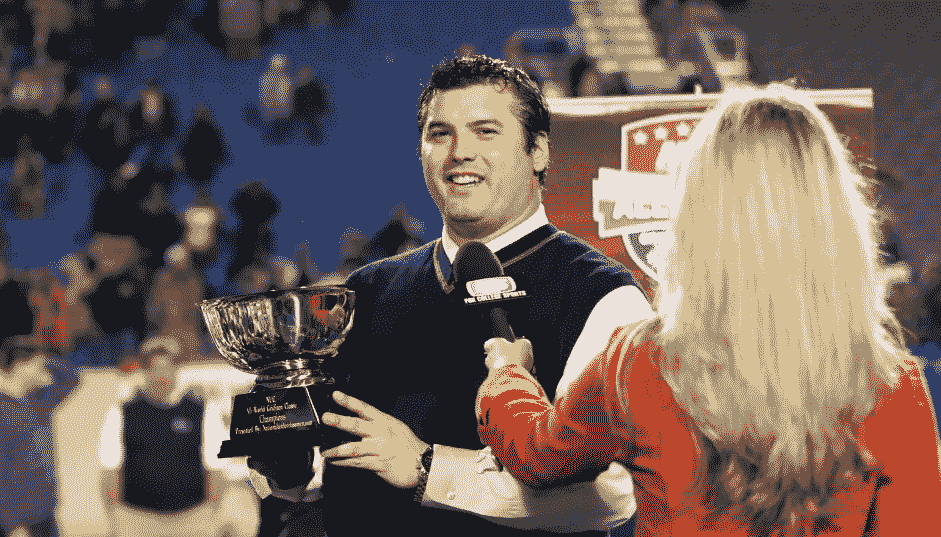

# 如何在 4 小时内完成一项活动

> 原文：<https://medium.com/swlh/how-to-fill-an-event-in-4-hours-6514e6f711b3>

我想让你知道我在 4 小时内完成一项活动的小策略。如果你正在寻找新的商机或者让人们参与到你的生意中来，这是一个很好的策略。

David Schuman with Ali Laforce

1.  **扩大您的数据库**

在过去的 10 年里，我一直在运行一个潜在客户挖掘项目，每周挖掘 50-100 个潜在客户。我是通过提供一些免费的东西，付费运行廉价的 facebook 广告和具有高度针对性的 instagram 广告来做到这一点的。最后，我还使用引导页和漏斗来创建生成引导的系统。我总是询问姓名、电话和电子邮件，并且总是专注于提供一些回报。对于运动员和家庭，我通常会将他们纳入我的数据库，免费提供给大学教练。

**2。提出一个他们无法拒绝的报价，并使其免费**

在这种情况下，我向我的营地提供了 100 个绝对免费的名额，我在 4 个小时内就卖完了。实际上，我给现在和过去的客户发电子邮件，在脸书广告、Twitter 和 Instagram 上做推广。我用脸书的故事来宣传，很快就销售一空。现在我的数据库超过 100k，所以它相当大！

**3。我创造了一个有效期，排他性，并坚持下去**

我只提供了 100 个位置，并告诉他们当它消失了。我就是这么做的。我让它免费，产生了线索，并告诉他们有有限的位置。如果你想让人们加入，给他们一些独特的东西，让他们与众不同，他们就会 100%加入进来！

我希望这三个建议能帮到你。请随时通过[www.nucsports.com](http://www.nucsports.com)或 dschuman36@gmail 联系我。或者在推特[大卫·舒曼](https://medium.com/u/2ac977d8dda2?source=post_page-----6514e6f711b3--------------------------------)或者 instagram @大卫·舒曼

## 这篇文章发表在 [The Startup](https://medium.com/swlh) 上，这是 Medium 最大的创业刊物，拥有 336，210 多名读者。

## 在此订阅接收[我们的头条新闻](http://growthsupply.com/the-startup-newsletter/)。

