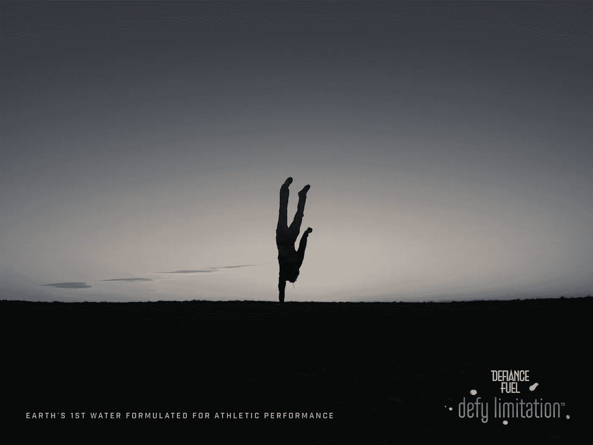

# 如何(最终)抓住客户的注意力

> 原文：<https://medium.com/swlh/how-to-finally-capture-your-customers-attention-1a0675a4013>

## 大卫·布瑞尔

> “如果你试图说服人们做某事或购买某物，在我看来，你应该使用他们的语言，他们每天使用的语言，他们思考的语言。”广告之父大卫·奥格威

*我们如何吸引顾客的注意力？*

**我们如何成为他们的选择品牌，而不仅仅是他们可能性列表中的一个选项？**

**如果你曾经寻找如何引起客户的注意，结果却没有找到答案，请继续阅读。(这个项目的一部分使用了[原则，耐克用](http://www.risingabovethenoise.com/nike-branding-after-27-years-with-david-brier/)创造了它的世界级品牌。)**

# **抓住客户的注意力:
如果你知道这一技巧，就很容易**

**下面这个创业公司的故事告诉你所有你需要知道的。**

**最近，我被要求为运动员设计一种新的天然快速恢复水产品。**

**不含咖啡因。不要糖。不含碳水化合物。没什么。**

**换句话说，他们发现了运动员需要很长时间才能恢复“第二次呼吸”的真正原因。**

**在收集了一些关于运动员的驱动力的令人难以置信的见解后，我与首席执行官密切合作，开发了产品名称，更重要的是，开发了一个反映运动心态的愿望和价值观的标语，这是一个经常被创业公司和品牌忽视的细节。**

**所以我告诉我的客户，我们需要进一步问真正的运动员这些问题:**

*   **“作为运动员，你为什么要做他们做的事情？”和**
*   **“你的目标是什么？你的议程？”**

**…这样我们就可以分离并明确他们的确切冲动和动机。**

**在问了这些和其他问题后，将他们的热情具体化，并将其缩小到他们语言中的东西(正如广告传奇人物大卫·奥格威所说的)，最终归结为两个词。*“不服限制。”***

**没有什么比这两个词更让我们与之交谈的运动员兴奋了。一点也不。**

**这成为品牌、口号和整体品牌个性的支柱。**

**于是，品牌诞生了。**

**产品描述闭环:*“地球上第一款为运动表现而配制的水。”***

**请注意，这是针对“运动表现”的，而不仅仅是针对运动员的(这将排除一些可能不认为自己是“运动员”的人)。微妙但至关重要。**

**因此，我们现在可以做的不仅仅是作为一个品牌进行宣传。**

**我们现在有了必要的工具和信息。**

# **如果你能数到三，你就能学会引起他们的注意**

**看看上面所做的，我们是如何开发一个能引起目标受众共鸣的品牌和信息的？**

**这是通过 3 个步骤实现的(如下文整个活动所示):**

1.  **我们感兴趣的是我们的观众要说什么，而不仅仅是我们要说什么**
2.  **我们问他们真正的潜在需求是什么**
3.  **在我们理解了那种需求之后，我们开发了*这个品牌，用他们的语言来说就是*。****

*换句话说，你必须首先意识到你并不了解全部。你可能对你的产品了如指掌，但你必须了解你的受众。*

*其次，你必须找出他们说了什么，更重要的是，深入挖掘，直到你得到了核心。*

*最后，聪明地想出如何用一种有别于你的竞争对手的方式来表达(记住不要用[陈词滥调](http://www.risingabovethenoise.com/how-to-brand-3-details-that-brands-overlook/)来淡化它，那会降低你的品牌影响力)。*

# *想看看这是怎么做的例子吗？*

*首先，我知道树立品牌必须从故事开始。他们的*声音。*因为我们进入了一个有大玩家的领域*可以说污染了水域*(双关语)。*

*从佳得乐到智能水，以及介于两者之间的一切，噪音水平震耳欲聋，空间中几乎没有区别。*

> *我记得给 CEO 发短信说，“我有了！我有品牌故事。”*
> 
> *他回答说，“用电子邮件发给我。”*
> 
> *我发了一个词的回复。*
> 
> *“没有。”*

*然后我补充道，“我需要把 ***读成*** 给你听。”*

*我知道节奏和传递是这个信息的关键。*

*我知道我们最好用一个强有力的品牌个性和明确无误的故事情节来完成我们的故事。*

*最初的脚本发生了什么？从下面你听到的内容中，只有几个词被改动了(不到 5 个)。*

*当我在电话里把它读给首席执行官和团队听时，你可以听到一根针掉在地上的声音。*

*他们马上就明白了。而且(故意地)这是 ***而不是*** 像他们所期望的任何事情。*

# *把信息带给大众*

*所以，现在所有的部分都需要到位，这样品牌就有了必要的一致性，就像你要求运动员在球场上的一致性一样。*

*你在下面看到的是*标志和标语。**

**

*这是包装设计:*

****

*以下是抓住品牌精髓的海报宣传活动:*

******************

*最后但肯定同样重要的是(这是我个人最喜欢的，注意右下角的标志):*

**

*这让我只剩下最后一个问题:*你的品牌是为了超越你所在空间的噪音而设立的，并且*挑战限制*来抓住你的客户的注意力吗？**

*如果你觉得这篇文章很有价值，请分享并发布出去，让其他人也能欣赏。*

**最初发表于*【www.risingabovethenoise.com】*