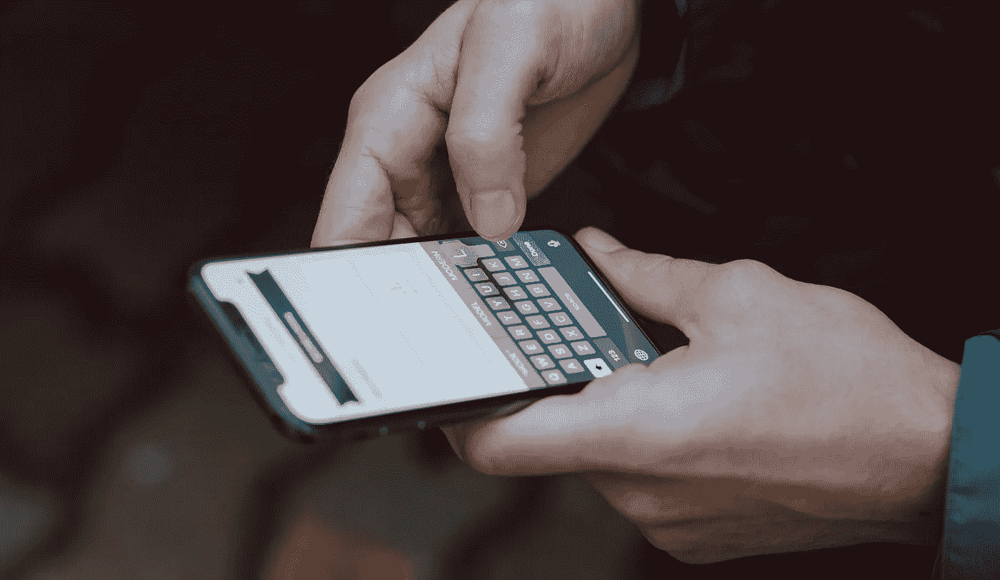
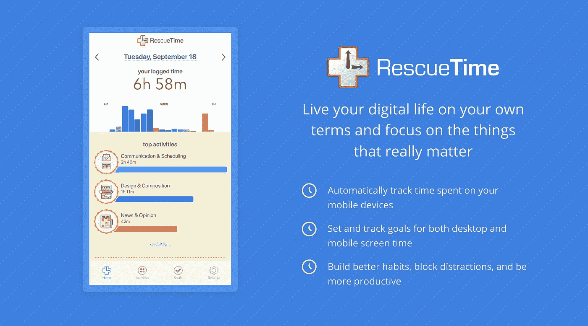
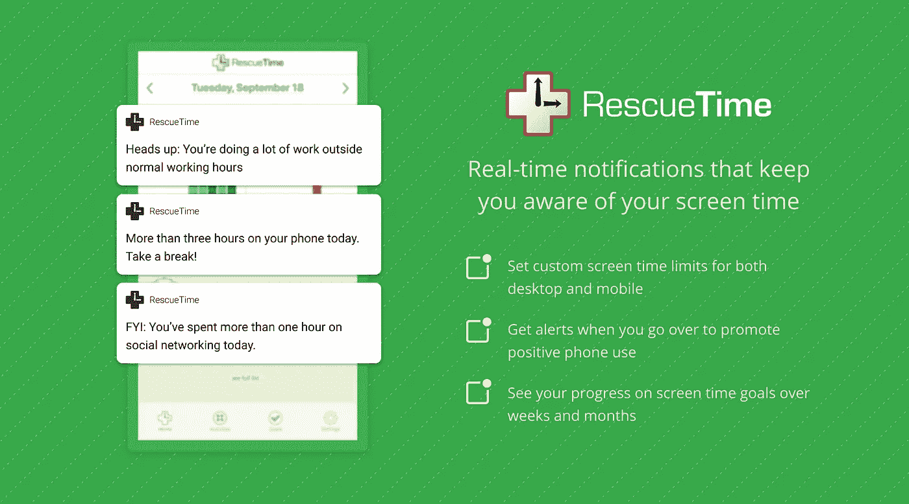
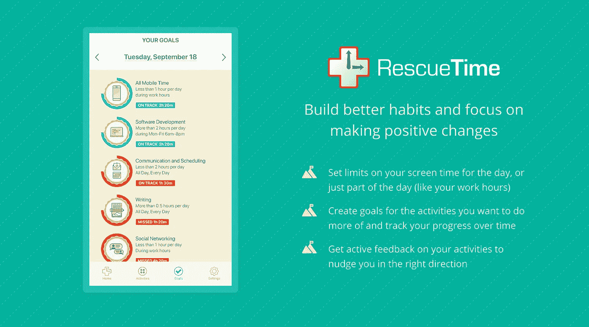

# 如何(最终)控制你花在手机上的时间

> 原文：<https://medium.com/swlh/how-to-finally-take-control-over-the-time-you-spend-on-your-phone-2a1816b19a25>

## “数字健康”本身不足以与你的设备建立健康的关系

自第一代 iPhone 问世以来，已经过去了十多年，它几乎改变了我们日常生活的方方面面。

把整个互联网放进我们的集体口袋，让我们可笑地联系在一起。我们可以立即接触到*所有的东西*——新闻、娱乐、回家的方向、令人惊叹的莱姆派食谱、家人、朋友、朋友的朋友、来自世界各地的陌生人！

没有人会想到你的手机会成为你学习一门新语言或参加冥想课程的地方。然而，我们在这里，*这是惊人的。*

**但是智能手机革命也有其不利的一面。**

当我们第一次开始刷屏幕时，我们可能没有想到它们会以[破坏我们的睡眠](https://sleep.org/articles/is-your-smartphone-ruining-your-sleep/)、[削弱我们的注意力](https://www.theglobeandmail.com/technology/your-smartphone-is-making-you-stupid/article37511900/)，以及[让我们沉迷于它们的乒乒乓乓和闪光](https://www.nirandfar.com/2012/03/want-to-hook-your-users-drive-them-crazy.html)，就像老虎机吸引赌徒一样。

在过去的几年里，我们看到越来越多的人意识到他们无法控制自己与手机的关系。

事实上，我们的研究发现，普通人每天花在手机上的时间超过 3 小时(25%的人超过 4.5 小时！).而大多数人每 3 分钟检查一次手机。

我们的手机已经成为我们生活中如此巨大的一部分，简单地试图限制它们就像试图在一个吃到饱的餐馆开始节食一样。没有一点帮助，这是不会发生的。

***今天，我们很兴奋地宣布一款全新的用于 iOS 的***[***resume time 应用程序***](https://itunes.apple.com/us/app/rescuetime/id966285407?ls=1&mt=8) ***和一款更新的***[***Android 应用程序***](https://play.google.com/store/apps/details?id=com.rescuetime.android&hl=en_CA)***——让您完全控制和洞察如何在所有数字设备上度过时间。***

# 太多的数字健康应用只关注你“不应该”做的事情

当谈到数字健康时，大多数移动应用程序——如苹果即将推出的屏幕时间或谷歌的数字健康——只关注你**不应该**做的事情。

*不要在脸书上花太多时间。*

*停止整天查看电子邮件。*

*限制你的 Instagram 使用。*

但是当涉及到实际改变你的行为时，研究发现你更有可能通过做更多你想做的行为来获得成功。不仅仅是停止做那些你不想做的事情。

那是因为**限制依赖于意志力**——而我们每天只有有限的量。

想想节食和身体健康。有多少人通过使用一些新的饮食时尚或速成饮食成功减肥并保持体重？当然，你可以在一段时间内限制你的饮食。但最终，我们都会崩溃。

仅靠意志力不足以改变行为。相反，我们需要了解食物和锻炼在我们具体生活中扮演的角色。不只是告诉我们自己“不要再吃垃圾食品了。”

你的手机也是如此。你不能指望仅仅通过说“不再有脸书”或“下午 5 点后停止查看邮件”来改变你和它的关系你需要理解它与你整个生活的关系——好的*和坏的*。然后做相应的计划。

# 如何真正理解(和控制)你的手机使用如何影响你的工作、注意力和焦点

有许多应用程序和插件可以帮助你了解你的时间。就连 iOS 和 Android 本身也有帮助你少用手机的功能。

太好了。但是如果没有更大的背景，它会让人感觉很黑暗。

围绕我们使用手机的整个对话似乎都是关于过度使用和冲动控制，像“上瘾”这样的术语被随意抛来抛去。但这只是问题的一部分。

我们认为大局很重要。很多。

这就是为什么我们对 [RescueTime 的新 iOS 应用](https://itunes.apple.com/us/app/rescuetime/id966285407?ls=1&mt=8)和[更新的 Android 应用](https://play.google.com/store/apps/details?id=com.rescuetime.android&hl=en_CA)如何让你更好地控制你与所有设备的关系感到非常兴奋。

不是简单地告诉你你在手机上使用了哪些应用程序，或者你在手机上花了多少时间，而是让你了解你的手机时间如何影响你的设备时间、你的工作习惯和你的注意力。

以下是我们构建的一些特定功能的高级视图，旨在帮助您与盯着屏幕的时间建立一种有意义且平衡的关系。

# 实时了解您的数字活动(以及它们如何影响您的日常生活)

使用 RescueTime Mobile，您可以快速、简略地了解自己的近况，包括:

*   桌面时间与生产力得分
*   当天的主要活动
*   总体生产力脉动
*   移动屏幕总时间，按小时细分

# 设定屏幕时间目标，并在超过目标时收到通知

可以肯定地说，RescueTime mobile 这样的应用程序的首要原因是帮助抑制智能手机的使用。无论您是想缩短工作时间还是工作时间，我们都可以提供帮助。

iOS 和 Android 的 RescueTime 可以让你设定一天的具体屏幕时间目标，并在你超过目标时向你发送通知。

# 把你的日常目标放在最前面和最重要的位置，这样有助于养成习惯，关注积极的变化

屏幕时间并不是让你的数码设备保持健康平衡的唯一因素。你的其他目标同样重要，这就是为什么 RescueTime Mobile 的界面将你的所有目标放在最前面和最中心。

# 还有更多

虽然我们试图让 RescueTime 移动体验在所有设备上都相同，但 Android 和 iOS 应用程序之间还是有一些差异。其中一些是由于任一平台的限制，其他的我们将努力在未来的版本中保持一致。

在 Android 应用程序中，您可以:

*   **手动记录离线活动。**这意味着跟踪你的会议、电话、吃的东西或其他任何东西，这样你就能更清楚地了解你的时间是如何度过的。*我们将在即将发布的版本中把它添加到 iOS 中*。
*   **查看应用级使用情况**，这样你就能准确知道一天中你在每个应用上花了多少时间。可惜，这在 iOS 中是做不到的。如果情况有变，我们会把这个加进去。
*   **在 FocusTime 会话期间，将手机设置为免打扰模式。**当您在台式电脑上启动 FocusTime 会话时，您的手机会收到通知并进入免打扰模式。您可以在设置屏幕上启用此功能。

在 iOS 上，您可以:

*   **查看您最常使用手机的地点**(比如在工作场所、通勤途中或家中)。这是储存在本地的设备，并显示你的手机时间累积的物理位置。这是一个新概念，我们很想了解更多。将来我们可能会将它添加到 Android 应用程序中。

# 在过去的 10 年里，我们目睹了智能手机接管了我们的生活

像大多数人一样，我无法想象没有手机的生活。

虽然它帮助我与我爱的人保持联系，查找晚餐食谱，并确保我不会迷路，但它也可能是一个主要的分心。问题不在于使用我们的手机。而是被他们利用了。

通过我们新推出的 iOS 和 Android 应用的[更新时间，你现在可以看到你的手机使用如何与你的整个数字生活相关联，并重新控制你如何在所有数字设备上花费时间。**毫无羞耻之心。**](https://play.google.com/store/apps/details?id=com.rescuetime.android&hl=en_CA)

***准备好为你的数码设备抢时间了吗？下载我们新推出的***[***iOS 版 app***](https://itunes.apple.com/us/app/rescuetime/id966285407?ls=1&mt=8) ***或我们更新的*** [***安卓版 app***](https://play.google.com/store/apps/details?id=com.rescuetime.android&hl=en_CA)******

**

## *这篇文章发表在 [The Startup](https://medium.com/swlh) 上，这是 Medium 最大的创业刊物，有+369，832 人关注。*

## *在这里订阅接收[我们的头条新闻](http://growthsupply.com/the-startup-newsletter/)。*

**