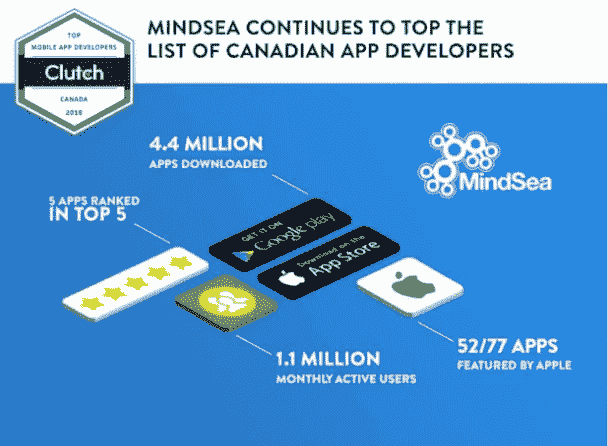

# 2018 年如何为自己的创业公司寻找发展伙伴

> 原文：<https://medium.com/swlh/how-to-find-a-development-partner-for-your-startup-in-2018-2b2208a7a7fa>

所以你一直在考虑一个很棒的商业想法。

几个月前，甚至几年前你就想到了，但你还没有真正下定决心全力以赴，开始将这个想法变成现实。也许你没有时间，也许你只是不确定这个想法是否好。有可能，阻碍你的一个主要因素是:

**你没有技术联合创始人或开发伙伴。**

在你现在的想法中，你不可能把你的想法变成现实，因为你实际上没有技术知识来[开发一个应用](https://www.mindsea.com/how-to-prototype-a-mobile-app/)。

**那么你应该怎么做呢？**

你肯定不准备放弃，让别人把你的想法变成改变游戏规则的生意，但是你感觉*卡住了*。

好消息是:

为你的企业寻找发展伙伴并不像你想象的那么困难。如果你明白找到完美伴侣的最佳方式，这实际上可能会少一些痛苦。

在本帖中，我们将分解扩展你的人际网络和向潜在的技术合伙人或发展伙伴推销你的商业想法的过程，这样你就可以把你的绝妙想法变成现实。

让我们开始吧。

# 理解你的核心价值主张

在你真正开始寻找发展伙伴之前，你需要确保你知道你在说什么。

如果你去见一个潜在的技术联合创始人或开发伙伴，却不清楚你做什么，为什么做，为谁做，你第二次约会的机会就不太好了。

在你因为认为这些大问题的答案必须刻在石头上而恐慌之前，请理解这一点:

随着时间的推移，这些事情会发生变化。

现在，你的答案应该表明你已经做了研究，这不仅仅是你昨天洗澡时想出来的疯狂想法。一旦潜在的合作伙伴知道你是认真的，他们可以检查你的愿景，并决定他们是否也可以支持。

# 尽快验证你的概念

在你明确了你要做什么，为什么要做，为谁做之后，在和潜在的伴侣见面之前，下一步是很重要的。

你需要确认你正在做的事情。

当然，你可能*认为*你正在开发一个创新的移动应用来帮助 20 多岁的人更有效地管理他们的时间，但是你的目标受众对你开发的东西有任何兴趣吗？

这并不意味着你需要在此时此地拥有一个功能齐全的产品，拥有所有的花哨功能——毕竟，这就是你寻找开发合作伙伴的原因。你所要做的就是确认你在正确的轨道上，对你正在做的事情有的*需求和*的* *兴趣。**

无论你是签下十几个早期用户，还是召集几个支持你愿景的专家，证明你的创业想法有吸引力都是关键。

# 开始花时间在共同工作的空间

现在是有趣的部分！到现在为止，你已经有了一个你了如指掌的商业想法，并且已经被你的目标受众或者这个领域的专家所证实。

不要跳到 LinkedIn、脸书、Quora、Twitter、Reddit、Instagram 和你能想到的所有其他渠道去宣扬你的好主意，并请求一位技术联合创始人加入进来…

开始让自己沉浸在社区中。

如果你在当地有一个创业公司或科技公司的合作空间，每天花几个小时在那里是你日常工作的一部分。当你在那里的时候，和其他工作的人友好相处。当你看到他们休息的时候，和他们搭讪。

请记住，在合作的世界里有一些非常大的禁忌:

不要只是在某人旁边拉一把椅子，然后开始投球。

不要为了聊天而打扰正在工作的人。

**不要**现身去问，问，问却不给任何回报。

共同工作空间是一个社区。如果你的计划是出现，问房间里的每个人是否知道你可以会见的发展伙伴，然后一有答案就离开…祝你好运。

如果你希望社区帮助你，你需要帮助社区。成为一个提供价值的人，无论是通过分享你的专业知识，如果他们要求的话，还是简单地在周一早上带着新鲜的百吉饼出现。

# 给你的人际网络一个扮演红娘的机会

一旦你开始建立这些联系并扩大你的关系网，是时候看看你的团队中是否有媒人了。

在这一点上，通过 LinkedIn 或其他渠道给你熟悉的人发信息是完全可以的，**问**你是否可以[推销你的商业想法](https://www.mindsea.com/pitch-investors/)看看他们是否认识任何你可以合作的人。

关键是要事先问清楚——没有人希望当他们出现准备做自己的事情时，遇到一个令人惊讶的推销。

如果他们同意听你的推销，并帮助你解决问题*(如果你有意建立关系，很多人都会同意)*确保你尽可能多地将信息带到会议上:一份基本的商业计划，一个有点功能的原型，你已经完成的概念验证——全部带上。

如果一个相互的联系可以把你介绍给一个发展伙伴，你已经处于一个更好的位置来建立必要的关系，把你的商业想法带到下一个层次。

# 找一个发展机构合作

如果你能够通过你自己的关系建设或者通过你的关系网的推荐找到一个技术上的联合创始人，那就太好了。

如果你试了又试，但一无所获，不要惊慌。

这里有一些好消息给你:

为了开始成长，你不需要有一个技术上的联合创始人。

有一个完全认同你的愿景的人专门从事技术方面的工作是一件好事，但这并不是成功的绝对要求。事实是，在早期阶段，*甚至不需要*一个技术联合创始人。

早期，当你试图打造你的第一个 MVP 并找到适合市场的产品时，许多技术工作可以由一个[开发机构](http://mindsea.com/)来处理……如果你能找到一个完美的合作伙伴的话。

关键是要找到一个已经去过那里的机构，做到这一点。你需要一个帮助像你这样的初创公司起步的团队。找到你需要的专业知识的最好方法是在 Clutch.co 这样的网站上查看顶级应用程序开发机构，并检查他们的投资组合。

例如，MindSea 团队已经帮助像 [Proposify](https://www.mindsea.com/case-study/proposify) 、 [Adam 帮助](https://www.mindsea.com/case-study/adam)和 [National Post](https://www.mindsea.com/case-study/national-post/) 这样的公司开发移动应用程序，将他们的业务提升到一个新的水平。

当你调查一个开发机构时，试着找到描述他们过程的案例研究，看看它是否符合你的创业公司的独特需求。

# 现在轮到你了

你有一个很棒的生意点子，可能会及时改变世界。棘手的部分是找到合适的人或团队来帮助你实现你的愿景。这可能很难，但请记住:

要建立一个成功的公司，你并不绝对需要一个技术型的联合创始人。看看 Pinterest 就知道了——这个社交媒体巨头刚起步的时候没有真正的技术联合创始人。

当你经历创业的各个阶段时，MindSea 团队会很乐意为你提供帮助。今天，您可以 [**安排一次与我们的产品策略师**](http://content.mindsea.com/schedule-your-free-meeting-with-our-product-strategist) **的免费会面，讨论如何将您的想法付诸实践。**

如果你想开始为你的创业公司建立一个 MVP，我们也准备了一个免费的指南，它分解了每个创业公司在启动 MVP 之前需要的 [**五件事情，这样你就可以尽可能顺利地建立 MVP。**](https://cta-service-cms2.hubspot.com/ctas/v2/public/cs/c/?cta_guid=34accb13-a53f-4e62-b492-6e5d3f71979d&placement_guid=460a9dcd-4f3a-4162-9d75-656b3c387090&portal_id=2059954&canon=https%3A%2F%2Fwww.mindsea.com%2Fresources%2F&redirect_url=APefjpEsafwEXsz0hKEKh3YF-2fkuCHchO-xWUpNuTc_doZBGvqdrQ2ZFbYMTLwI_WMRpJKtU79K-PwxClIxp39UDTgY1cLzmzfZhVjPqiQc3NNnrY9r8qxERrq21RvAvsaFdXwIeJnAnqVIQPeUk1oDVifV4qPY_uxwPcQEzMv0LRiR3Uotkpp-cXjytjAoiPupvj3yV4chSSAssf7cWeys1iuC2G3c_WqMMIZdsd6IMoj_tY6T3mxbeYgV6VvlNHoyffiN38RKQt_PTm1sMWMBqgUMjo4qKg&click=9104256c-93fd-4a13-b08d-3821791920eb&hsutk=c6120dfb53fc8f9ae70d0ee7679a1558&utm_referrer=https%3A%2F%2Fwww.mindsea.com%2Ftop-mobile-agency%2F&__hstc=71280975.c6120dfb53fc8f9ae70d0ee7679a1558.1529325596112.1532944727187.1533898710988.11&__hssc=71280975.4.1533898710988&__hsfp=4008900978)

*原载于 2018 年 8 月 31 日 www.mindsea.com***。**

**

## *这篇文章发表在 [The Startup](https://medium.com/swlh) 上，这是 Medium 最大的创业刊物，拥有+365，945 读者。*

## *在这里订阅接收[我们的头条新闻](http://growthsupply.com/the-startup-newsletter/)。*

**