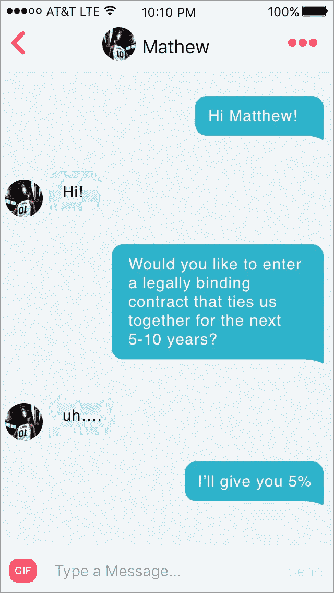
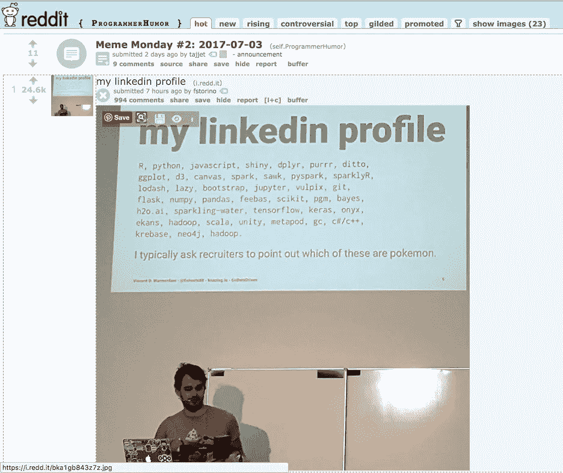

# 如何与像我这样的极客交流——寻找联合创始人的一课

> 原文：<https://medium.com/swlh/how-to-find-a-technical-co-founder-dffea3954d2f>

## TL；dr——联合创办公司就像结婚一样，所以不要操之过急。

找到一个技术上的联合创始人是你所做的最重要的决定之一。这也是你必须做出的最早的决定之一。投资者通常不会投资内部没有任何技术人才的公司。技术型联合创始人对于掌舵和招募人才也至关重要。更不用说创业是你做过的最难的事情，有人在你身边会让世界变得不同。

Found a company is like getting married — only you’ll spend more waking hours together. Photo by [Brooke Cagle](http://unsplash.com/photos/oMtXGNw4ZEs?utm_source=unsplash&utm_medium=referral&utm_content=creditCopyText) on [Unsplash](https://unsplash.com/?utm_source=unsplash&utm_medium=referral&utm_content=creditCopyText)

你可以随时学习自己编码，而且你绝对应该学到足够危险的程度。学习编码让你更容易与你的团队进行明智的对话。但你真的需要一个专注于业务的人，作为一个非技术型的创始人，这个人应该是你。

但找到一个优秀的技术型联合创始人绝非易事，我们看到的几乎每家公司都在以错误的方式进行尝试。就像创业的其他方面一样，这需要时间和努力。

# 一个技术联合创始人是做什么的？

根据你的公司所处的阶段和你所掌握的资源，你的技术合伙人的角色会有所不同。除非你有钱与承包商合作(稍后会详细介绍)，否则在早期，你的技术合作伙伴将会专注于产品的开发。

这意味着你需要一个有很强编程能力的人。像所有早期招聘一样，你应该倾向于多面手而不是专家。早期有太多的事情要做，以至于拥有非常专业技能的人将会有一段更艰难的适应时间。这并不意味着他们必须自称为“全栈开发人员”我们程序员有很多描述自己的方式，大多数优秀的开发人员都不会过多考虑头衔。

Which full-stack developer are you? by [CommitStrip](http://www.commitstrip.com)

取而代之的是，专注于寻找那些曾经在早期创业公司工作过，或者有自己的副业项目的人。最重要的是，寻找一个贪婪的学习欲望。

最终，如果你成功了，你的技术合伙人写的代码会越来越少。随着从技术联合创始人到首席技术官的转变，他们的职责将开始变得更像你早期雇佣的其他人。他们需要建立你的产品团队，创建开发文化，做出高层架构决策，并领导公司的产品部门。

注意:你可以随时引入外部首席技术官，但他们不会像你的联合创始人那样了解产品和团队。

# 是什么造就了一个伟大的联合创始人？

让一个人成为伟大的技术联合创始人而不仅仅是伟大的程序员的技能也是让任何人成为伟大的联合创始人的技能。根据我们建立 Krit 的经验，任何一个联合创始人都有三个特质。

## 1.通讯技能

交流是任何人都能拥有的最重要的技能之一。无论你是在规划你的 MVP 还是建立一个团队，沟通都是关键。注意人们听得多好；良好的沟通不仅仅是交谈。

Communication is everything.

## 2.团队第一的心态

创业需要牺牲。一个伟大的联合创始人会把团队的成功放在他们个人的成功之前。ZipRecruiter 的首席执行官谈到寻找“我们”人。当有人谈论他们的经历时，他们用“我”还是“我们？”

Look for someone who is a team player.

## 3.长期思考

在创业公司的世界里，没有一夜成名的事情。你需要的联合创始人要考虑未来 5 到 10 年，但现在仍有能力执行。

## 奖金:

找一个和你优势互补的人。这超出了技术/非技术范畴。如果你没有条理，考虑找一个有条理的联合创始人。

# 何时寻找技术联合创始人，何时雇佣合同工。

许多人经常问，他们是否应该找到一个技术联合创始人或外包他们的 MVP 的开发。

如果你无法获得资金，那么你就没有太多的选择。可以学习编码，也可以找技术联合创始人。

但是，即使你能为这个项目提供资金，并在像南卡罗来纳州查尔斯顿这样的毒品之乡找到一个很棒的开发团队来打造你的 MVP，你仍然应该找一个联合创始人。在困难的时候，有人依靠和推动你是非常有益的。你最终将不得不建立一个技术团队，所以你需要一个会说这种语言的人来领导这个团队。

我们在 Krit 的目标是让我们所有的客户最终变得足够成功，以至于他们不得不取代我们。在你找到合适的联合创始人之前，与我们这样的团队合作是将你的产品推向市场的好方法。但最终你需要有人在家里。

# 结婚

他们说共同创办一家创业公司就像结婚一样。你们每天在一起呆 8 个多小时，做很多重要的决定，担心自己的财务状况……这实际上是两个人之间具有法律约束力的合同。

你会在第一次约会就向别人求婚吗？不。那会很恐怖的。假设他们同意了。如果结果证明你们是可怕的一对呢？你们对彼此一无所知。

但是创业公司的人总是这样。他们匆忙建立了共同创始人关系。或者他们在几乎不了解开发者的情况下，请他们开发自己的应用。

寻找联合创始人不是一蹴而就的。你必须随着时间慢慢建立关系。不要指望他们在第一次约会时就做出承诺。

你如何建立这种关系？就像你对待任何关系一样。和他们谈谈。去了解他们。一起去聚会。

也许事情进展得很顺利。你喜欢他们，而且你很确定他们也喜欢你。所以你想更进一步。所以请他们为你建立一个登陆页面。一些小事，而不是一个大的承诺。但是会给你们一个合作的机会。

记住，是你要求的，所以你买单。付钱给他们。

# 你应该付给联合创始人多少钱？

首先，一起做小项目是个好主意。建立一个登录页面，创建一些线框，设计项目。对于这些项目，你应该向你的潜在合伙人支付标准的时薪。如果你不愿意在项目中投入少量资金，这对于开发者来说不是一个很有信心的信号。更不用说大多数开发商已经被“创意人”烧伤，他们提供 10%的股权，如果他们只是在两周内从零开始重建脸书。

但最终，如果他们是你的联合创始人，他们将需要拥有股权。你应该希望他们有很大的股份。你想让他们参与项目的成功。我们稍后会写一整篇关于如何分配股权的文章，但这里有一些问题可以引导对话。

*   每个人带来了什么技能、关系或独特的价值？
*   每个人将在这个项目上投入多少时间？
*   每个人的责任是什么？
*   每个人投入多少钱？
*   有人会领薪水吗？如果有，多少，什么时候？
*   到目前为止，你投入了多少时间/金钱？

请注意，想法的所有权不在问题列表中。想法是廉价的，执行就是一切。而且整个团队应该对你正在处理的问题拥有所有权。

此外，你应该和你的联合创始人在同一个[授权时间表](http://www.investopedia.com/terms/v/vesting.asp)上。

# 去哪里找联合创始人

寻找潜在联合创始人的最佳地点是当地的科技聚会。但是不要试图假装，或者走进去推销你的创业公司。试着学到足够危险的东西，然后去参加你真正感兴趣的聚会。你会学到一些东西，遇到一些很酷的人。给开发者留下深刻印象的最好方法是了解一点他们的世界。你也可以考虑寻找在技术和商业之间架起桥梁的聚会，比如专注于产品的聚会。

如果你所在的地区没有任何科技会议，那么你可以上网看看。Reddit 有一些很棒的开发者社区。 [Dev.to](https://dev.to/) 是一个较新的社区，充满了开发者。花时间去了解社区，学习语言。你不必学习如何编码来学习如何与编码员交谈。不明白什么？问问别人。开发人员通常都很友好，尤其是对那些渴望学习的人。

[r/ProgrammerHumor](http://reddit.com/r/ProgrammerHumor) is a a great resource for learning how to (and how not to) talk to developers

# 如何知道开发商是否合法

如果你不了解他们的代码，最好的方法是看看过去的项目。他们开发过真正用户正在使用的严肃的应用程序吗？随着你越来越了解他们，找出他们感兴趣的事情和他们做过的项目。

最重要的是，要有学习的意愿，对商业的理解和欣赏，以及热情和动力。只要有足够的时间，任何优秀的开发人员都可以掌握一门新的语言或技术。不要担心他们使用了哪种语言或框架，而要担心你们合作得有多好以及他们的成长能力。

# 家庭作业

在 andrew@builtbykrit.com 给我发邮件，告诉我你将开始花时间寻找联合创始人的三个地方。这些可以是 IRL(现实生活中的)或者网上的。

我也很想听听你在纠结什么问题。你会有兴趣看哪些帖子？让我知道。

*这篇文章最初出现在南方的*[*Start*](https://builtbykrit.com/blog/how-to-find-a-technical-co-founder)*上，这是一个关于在通常的枢纽之外建立盈利公司的博客。*

*安德鲁是*[*Krit*](https://builtbykrit.com)*的创始合伙人，这是一家为早期创业公司提供产品开发的工作室，也是* [*信天翁*](http://getalbatross.com/?ref=medium) *的联合创始人。他认为每个人都是某方面的书呆子。*

## 这个故事发表在 [The Startup](https://medium.com/swlh) 上，这是 Medium 最大的企业家出版物，拥有 290，182+人。

## 在这里订阅接收[我们的头条新闻](http://growthsupply.com/the-startup-newsletter/)。

