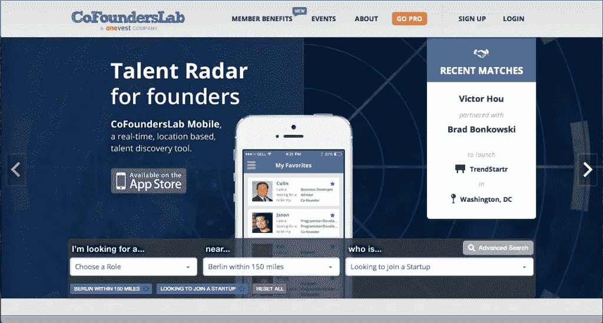
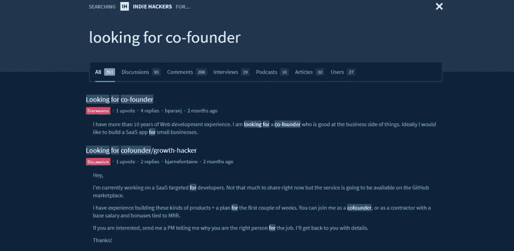

# 如何为创业公司寻找技术联合创始人、CTO 或技术合伙人？

> 原文：<https://medium.com/swlh/how-to-find-a-technical-cofounder-cto-or-tech-partner-for-a-startup-6d719575fd1>

今天，我们将讨论完成项目技术方面的不同选择，比如寻找技术合作伙伴、承包商开发者或技术合作伙伴。寻找创业伙伴可能需要一些时间，但我们会努力帮助你应对这一挑战。那么，如何找到一个技术上的联合创始人，还有哪些其他的选择呢？让我们来解决这个问题！

你有一个伟大的创业想法，你相信这个想法，你生活在这个想法中。你愿意尽快开始，创造一些改变世界的新事物！甚至比实现你的想法更重要的是，你想找到一个和你一样相信这个想法的人..你们将一起征服世界。

认清自己？我打赌你有！

但是伟大的想法并不足以让一个创业公司获得成功。你可以有一个 100 万美元的想法，一个完美的商业计划，愿意付钱给你的投资者，等待你产品的潜在客户和用户，但只有 50%的工作要做。你可以处理与营销和销售有关的一切，但技术方面呢？

**为什么你需要寻找联合创始人、首席技术官或技术合作伙伴？**

当企业家开始一项新业务时，他们通常会想到的第一个想法是雇佣自由开发者。许多小企业使用这种方法工作，但是如果你没有技术背景，或者在你现有的团队中没有至少一个技术领导，你将很难创建一个可扩展的 MVP。

**解决这个问题有不同的方法。你可以找到:**

*   **科技联合创始人。技术创始人是公司的关键角色之一。这个人将负责所有与技术相关的流程，并分享整体利润。在这种情况下，他或她也会称你为他公司的联合创始人，一个非技术型的联合创始人。**
*   **CTO。是一个员工，他将成为你雇佣的技术总监。**
*   **技术伙伴。**一个关注所有开发过程的外包团队——不仅仅是一个承包商，还要考虑所有的业务需求。

一旦你明确了你要找的人，你就可以开始寻找理想的候选人了。又或许你已经尝试过但没有成功？

因此，让我们弄清楚如何为你的初创公司找到一位联合创始人(或者可能是一位首席技术官)，以及如果你无法通过你的关系或在推荐的帮助下找到他们，该怎么办。

**去哪里寻找创业公司的联合创始人或合伙人？**

这里有一些流行的解决方案，可以帮助你找到合适的技术专家加入你的团队。

**1。** [**为初创公司寻找技术合伙人是最好的选择之一。**](https://cofounderslab.com/)

这里怎么找联合创始人？你需要在平台上注册(你可以用你的脸书、谷歌、Linkedin 或电子邮件注册)，回答几个关于你和你的企业的问题，然后导航到搜索页面。该平台是免费的，但也有收费选项。

**2。**[**Founders Nation**](http://www.founders-nation.com/)是另一个你可以找到创业公司联合创始人的地方。它不是很大，但仍然是一个平台，有类似的选项，如 CoFoundersLab。它旨在连接那些希望通过创新和技术让世界变得更美好的梦想者。

这里怎么找技术联合创始人？这个想法实际上是一样的。你在一个平台上注册，然后使用过滤器更准确地找到合适的人。

**3。****Angel.co 是一个为创业公司、投资人和专业人士寻找彼此而创建的热门平台。**

**在这里你可以找到一个技术联合创始人，一个 CTO 或者有经验的开发者。网站很简单，还有前面两个。你所需要做的就是注册成为招聘人员并发布空缺职位。此外，还有过滤器可用于浏览专业人员的个人资料。**

****

****4。** [**独立黑客**](https://www.indiehackers.com/)——一个相对较新的平台，供创业者向数百家盈利在线企业背后的创始人学习。该平台旨在与其他正在创办和发展自己公司的人建立联系。**

**在这个网站上寻找一个程序员伙伴或寻找一个技术合伙人可能比前面的例子要困难一些，因为这里都是关于交流的。没有过滤器，没有结构，但是很多专业人士在一个论坛里互相交流。但尽管如此，它也可能是寻找技术合伙人或你需要的另一位专业人士的有效工具。**

****

****5。** [**联合创始人的 subreddit**](https://www.reddit.com/r/cofounder/) **上 Reddit.com**。这是流行的 Reddit 平台上的一个帖子。**

**要在这里找到一个技术上的共同创始人或合作伙伴，你应该注册，然后浏览许多线索，并创建自己的线索来描述你的业务和你的需求。同样，由于服务的结构，查找信息可能有点困难。但是 Reddit 在全世界有很多优秀的技术专家。绝对值得使用。**

****

****6。** [**上的合作线程不一致**](https://discordapp.com/) **和** [**上的松弛**](https://slack.com/) **通道。**这是两个拥有商业和企业家渠道的信使。为了在这里找到一个联合创始人，你应该注册并使用短码通过关键字找到渠道。**

**比如在/r/startups 上的 Discordapp 你可以找到#Cofounding 等频道，在那里问人家你需要什么。**

****

****7。技术合作伙伴****

**为初创公司寻找技术合作伙伴是另一个非常受欢迎的选择，这往往比寻找程序员合作伙伴、首席技术官或联合创始人更具目标性、时间性和成本效益。在这种情况下，您使用一家特殊公司的服务，该公司在技术开发方面拥有丰富的经验，并提供“ ***CTO 即服务*** ”。**

**这大大降低了你在寻找首席技术官、自由开发人员甚至技术联合创始人时所面临的风险，如“这个人不合适”、“他们没有足够的经验”、“他们工作太慢”、“我们需要比预期更多的钱”。**

***另一方面，它给你:***

*   **一个经验丰富的专业团队，他们遵守条款和要求；**
*   **不仅仅是等待你指示的承包商，而是关心你的业务并掌握所有技术事务的合作伙伴:创建架构、规划工作、平台设计、扩展、监控、编码等。；**
*   **与自由团队相比，价格往往更合理(尤其是考虑到财务和时间相关的风险)。**

**我们和一些创业公司一起研究这个模型。对他们所有人来说，这正是他们想要的。要了解我在说什么——只需在 Clutch.co 查看我们合作伙伴的评价。**

**如果你看到一个合适的并且需要一个可靠的技术合作伙伴，只需[**填写简短的表格**](https://eze.tech/contacts/) ，告诉我们你的创业想法，让我们找到发展你的项目的最佳方式！**

> ***原载于*[*Ezetech*](https://eze.tech/)*[*博客*](https://eze.tech/blog/how-to-find-a-technical-cofounder-cto-or-tech-partner-for-a-startup/) *并分享给媒体社区。****

# ***别忘了给我们你的👏下面！***

************

## ***这篇文章发表在 [The Startup](https://medium.com/swlh) 上，这是 Medium 最大的创业刊物，拥有+383，719 名读者。***

## ***在这里订阅接收[我们的头条新闻](http://growthsupply.com/the-startup-newsletter/)。***

******