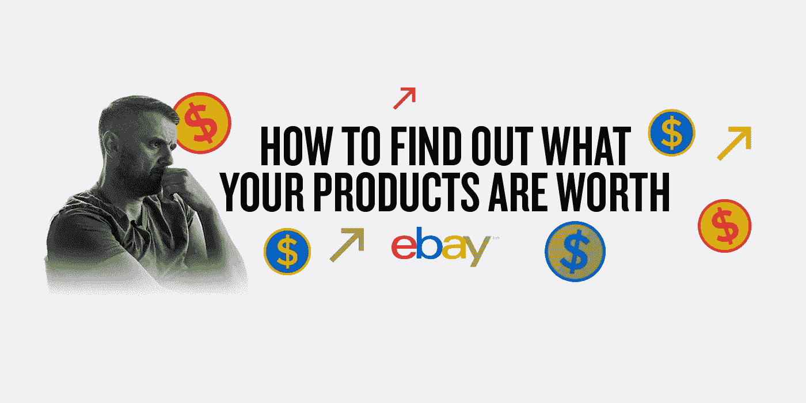
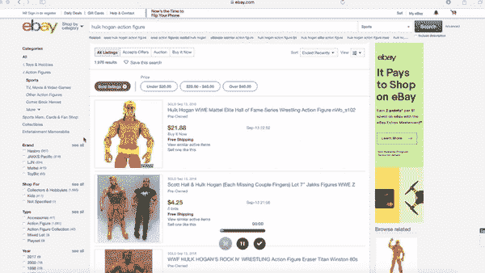
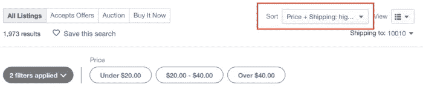
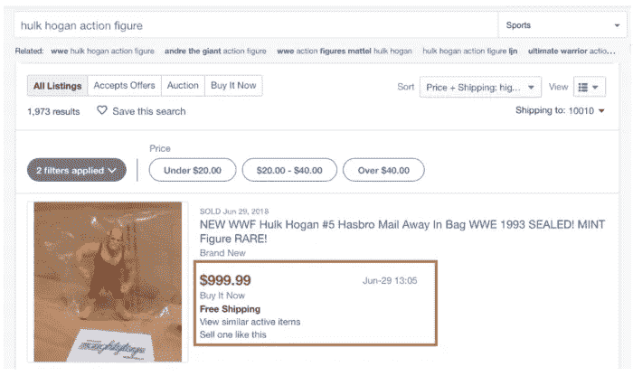
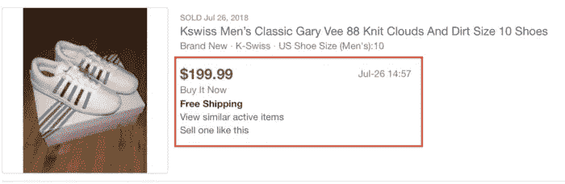
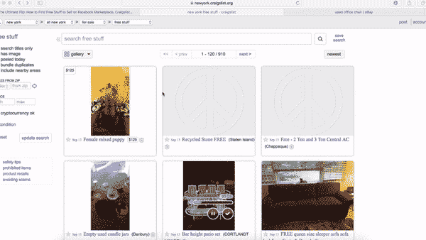

# 如何在易贝上找到容易销售的产品(即使你没有钱)

> 原文：<https://medium.com/swlh/how-to-find-easy-products-to-sell-on-ebay-even-if-you-have-no-money-bf6dade54327>

在 2017 年初，我创建了“ [2017 Flip Challenge](https://www.youtube.com/watch?v=lv_8StGEegc) ”来推动人们在易贝等网站上销售产品以获取利润。

你们中的许多人抱怨没钱创业、投资广告或建立个人品牌。但与此同时，你也可以在家里摆放一些东西，然后在网上出售。

你可以把看《纸牌屋》或《权力的游戏》的时间花在寻找易贝值得购买的产品上。你可以算出你的衣服值多少钱。找出你的旧电子产品的价值。找出玩具的价值。

你可以利用这些数据开始销售你已经拥有的产品，从旧货店翻东西，或者[出售你从 Craigslist](https://www.garyvaynerchuk.com/the-ultimate-flip-how-to-find-free-stuff-to-sell-on-facebook-marketplace-craigslist-and-ebay/) 上免费得到的东西。

[在我早期的《每日生活》剧集](https://www.youtube.com/watch?v=WwhP754Cqw0)中，我和我的妹夫贾斯汀·诺韦洛开车去新泽西的一家旧货店，向你展示我们如何买卖车库拍卖的东西。我们已经做了很多年了。

尽管现在是 2018 年，[翻转游戏仍然比以往更加真实](https://www.youtube.com/watch?v=U8uzd1y8eAo)。

所以我想消除人们没有开始的每一个借口。

今天，贾斯汀将向你展示如何开始网上销售；)

—

**嗨，我是贾斯汀！**

我在 VaynerMedia 的 Gary 团队中从事影响者合作。我和 Gary 在 Wine Library 共事了 14 年，我是翻转游戏的忠实粉丝:)

在你能在易贝买卖东西之前，你必须知道你的产品能卖多少钱。本文的第一部分将帮助你弄清楚这一点，第二部分将向你展示如何使用这些数据来开始研究易贝。

# 步骤 1:在搜索中过滤“已售出的物品”

如果你想知道一个产品的价值，首先在易贝搜索中搜索它的名字。

例如，你可以搜索“浩克·霍根活动人偶”，向下滚动，点击“已售出物品”

当你选择「已售出的物品」时，易贝有时会自动勾选「已完成的物品」方块。

“已完成的项目”指的是针对该搜索已结束的拍卖——无论它们是否售出。

您可以取消勾选此方块，只查看已售出的物品。或者让它保持选中状态，也可以查看未售出商品的模式。

# 第二步:按价格范围排序

在显示“已售物品”的结果中，您可以按价格排序，以查看产品的售价。

如果你搜索胡克·霍根活动人偶，你会看到有一堆古董人偶卖到了近 1000 美元(如果你按“最高价”排序)。

同样的事情也适用于你可以在网上购买的限量版产品。例如，人们以 150-200 美元的价格翻转了加里的“云和泥”运动鞋:

你可以对你在旧货店、车库拍卖或阿里巴巴这样的网站上找到的产品做同样的事情。

而且一旦发现有利可图的东西，就把它列出来，收你的现金；)

开心翻转！

# 如何在易贝上翻转产品(免费)

一旦你开始在家里卖东西，你就可以开始在网上销售产品。

但我已经能听到各种借口冒出来:

“这些产品要花多少钱？”

“我没有钱。”

有一段时间，我们不得不迎合这些反应，因为如果不预先投资，很难找到获得产品的方法。

但是最近，加里发现了一种不同的方法。

以下是你如何从零开始赚到 1000 美元的方法:

**1。导航到 Craigslist 上的“免费”部分**

Craigslist 的主页上有一个“免费”栏目。导航到那里。

**2。找到产品**

人们会免费赠送几十件贵重物品来扔掉，比如椅子、床、桌子等等。

**3。了解易贝的价值**

浏览上面的步骤，看看类似的产品在易贝卖多少钱。

**4。上市，等到卖了**

在易贝上列出类似产品的售价。

你在 Craigslist 上得到的免费东西通常是人们想扔掉的大件物品，所以你可以把它列为“只在本地取货”或者收取额外的运费。

**5。一旦它被卖掉，就把它送给买它的人。**

要么把它运送给他们(如果他们支付额外的运费)，把它交给他们，或者让他们从你这里拿走。

就是这样。

互联网创造了如此多荒谬的套利机会。这只是其中之一。在 Craigslist 上免费挑选一些东西，在易贝这样的网站上列出清单，然后卖掉，每周可以多赚几百美元；)

如果你有任何问题，请随时在 Instagram 上给我发 DM，电话: [@JustinNovello](https://www.instagram.com/justinnovello/) :)

查看“DailyVee 093:如何在这个周末赚到额外的 100 美元”,观看我和 Gary 从车库拍卖中买卖东西！

*本文原帖*[*GaryVaynerchuk.com*](https://www.garyvaynerchuk.com/find-easy-products-to-sell-on-ebay/)*。*

## 这篇文章发表在 [The Startup](https://medium.com/swlh) 上，这是 Medium 最大的创业刊物，拥有+368，675 名读者。

## 在这里订阅接收[我们的头条新闻](http://growthsupply.com/the-startup-newsletter/)。

