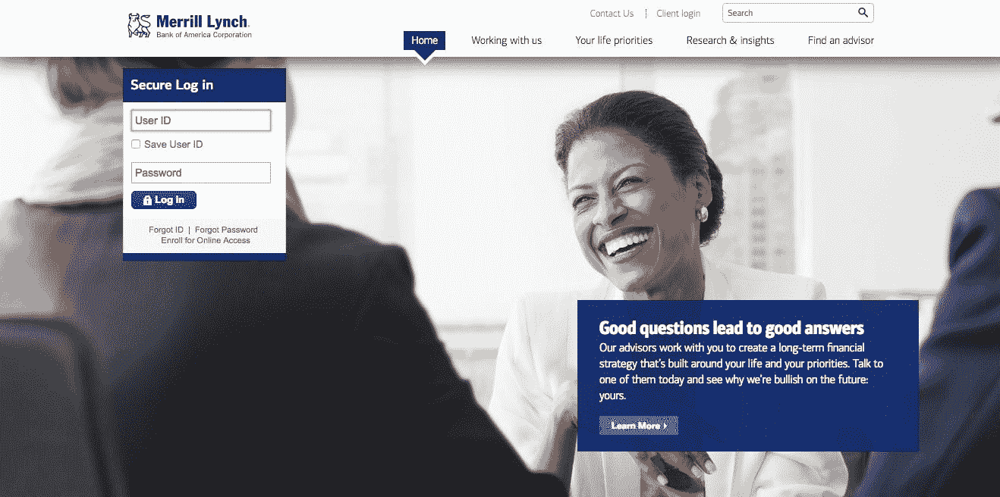
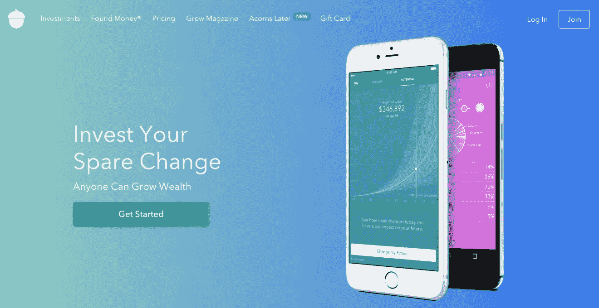
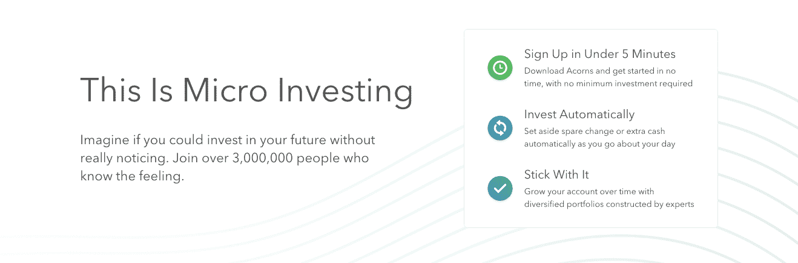
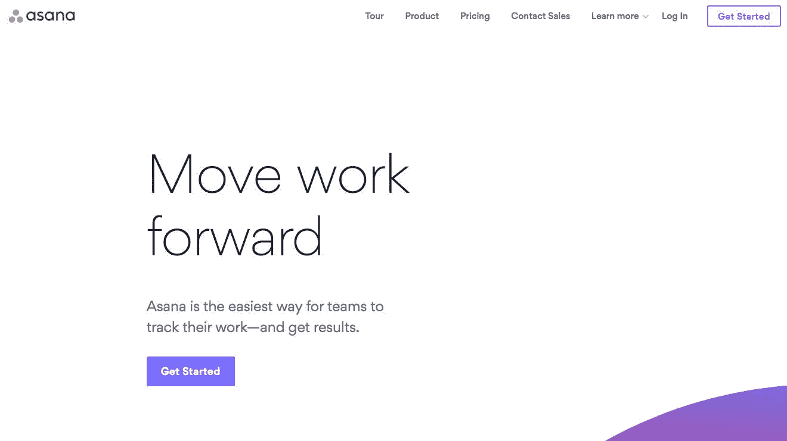
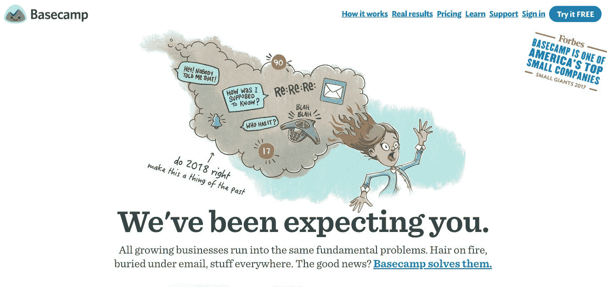

# 如何在你的维生素生意中找到止痛药

> 原文：<https://medium.com/swlh/how-to-find-the-painkiller-in-your-vitamin-business-f3039b2312c0>

## 通过更强有力的定位和信息向您的客户灌输紧迫感。

有一个众所周知的想法，你可以将任何企业分为两个阵营:**维生素**或**止痛药**。

维生素提供长期的好处。它们是一种投资，将帮助你在更大的目标上取得进展。不幸的是，对维生素的延迟满足会给寻求购买的顾客造成摩擦。

止痛药解决了燃眉之急。它们是你可以用来立刻在目标上取得进展的东西。付款和收到价值之间的时间间隔很短。因此，客户更容易扣动购买扳机。

公司一直在寻找将潜在客户转化为客户的最直接途径。维生素的长期益处是一个更复杂的销售过程。

一家止痛药公司可以专注于客户自己看到的好处*今天*。一家维生素公司必须描绘出将来某一天顾客会是什么样子。

大多数公司并不是严格意义上的非此即彼。即使一家公司有很强的维生素品质，它仍然可以利用止痛药成分。

在这一点上，你可能想知道你的公司是维生素还是止痛药。如果你暂停阅读一分钟，你可以参加我们的测验并找出答案:

# [点击此处参加测验](http://mapandfire.com/business-vitamin-painkiller?utm_source=medium&utm_medium=article&utm_campaign=vitamin-painkiller#quiz)

你可能认为某些行业天生更适合做维生素或止痛药。这话有些道理。按需用车服务具有天然止痛药的特性，而人寿保险则严重依赖维生素。

但是，有了正确的定位和信息，即使是维生素含量更高的企业也能展示其止痛药的一面。

下面是几个例子。

# 退休投资

在维生素强度方面，没有多少行业可以与退休投资相媲美。

这是每个人都知道很重要但却很容易被推迟的事情。无论我们看到多少演讲、讲座和广告，都很难优先考虑往往是几十年后的好处。

有没有一种方法可以让投资变得立竿见影、切实可行？

首先让我们看看美林的标准方法:

(via [ml.com](https://www.ml.com/))

“问题”、“顾问”、“长期”、“生活”、“未来”

他们的立场听起来像典型的投资。这很复杂，冗长，不是我自己能处理的。

这些信息试图以友好、积极的方式描绘这一点，但这不是你可以轻易投入的事情。

这是维生素的典型标志——我认为它有价值，但会欣然推迟。

现在，让我们来看看另一个投资案例，Acorns:

(via [acorns.com](https://www.acorns.com/))

“零钱”、“任何人”、“成长”、“财富”

尽管仍是一种投资产品，但这显然是一个非常不同的定位。这听起来很简单，容易实现，而且立竿见影。如果我因为缺乏投资而感到痛苦，这将是一个快速消除痛苦的方法。

当然，Acorns 有一个非常不同的方法，专注于小额投资。但它仍然围绕着同样的核心活动为以后投资。

他们页面的下一部分进一步强化了这些止痛药的概念。

(via [acorns.com](https://www.acorns.com/))

“微”、“5 分钟”、“自动”

这是很严肃的止痛药话题。或许这就是为什么他们有 300 万人使用这项服务。

关键是 Acorns 找到了一种让金融投资立竿见影的方法。即使它不是你所有退休需求的完整答案，它也是你的敲门砖。这总比拖到明年好。

他们的立场和信息对今天的*和明天的*说话。

# 项目管理

哦。这是另一张带有经典维生素气味的竖条。

这些年来，我使用过许多项目管理工具，完全理解它们的价值。但是主要的好处更多的是为了项目的长期健康发展。保持事情按计划进行，跟踪通信，组织资产。

在一天中，尤其是在一个项目的开始，通常没有什么痛苦可言。你所做的投资是为了一个平稳的过程和最终的稳定着陆。

这是通过体式的经典方法:

(via [asana.com](https://asana.com/))

“行动”、“工作”、“前进”、“团队”、“跟踪”、“结果”

是的，我想这就是项目管理。叹气。

我并不是说“向前推进工作”是一个不好的信息，但它几乎没有什么直接性。这更像是一种冰川事件的氛围。

事实上，我认为无论有没有项目管理服务，我的工作都会向前推进。是什么促使我现在尝试这个？即使我的项目明天开始，这也不能强迫我认为我需要今天就“开始”。

类似于其他信息陷阱，如“改变”和“不同”，“结果”是完全模糊的，本质上不是积极的。它们可能不好，但是一个团队无论有没有体式都会“得到结果”。

现在让我们看看另一个选项，Basecamp:

(via [basecamp.com](https://basecamp.com/))

哇哦。这是一个非常不传统的标题，因为它既没有提供产品的好处，也没有对产品进行描述。但是，凭借图片和副标题的力量，信息是明确的:你的工作是疯狂的，我们想修复它。

像“问题”、“火灾”、“掩埋”这些词听起来都像是我今天要解决的事情。

即使我现在没有这些症状，我还记得上次的感觉。

这将 Basecamp 定位为一个可以立即解决您的问题的工具。这些信息告诉我，项目管理不仅仅是随着时间的推移进行跟踪和观察，它还会影响我的生活。

这是我今天需要尝试的事情。

# 找到你的止痛药品质

一个企业的成功不是由它作为维生素或止痛药的地位决定的。然而，当涉及到利用客户的自然紧迫感时，止痛药确实有优势。

如果你想为你的业务利用一些紧急情况，问问你自己:**“我们解决了什么问题会让人们今天购买这个*？”***

*如果您想了解客户的动机和难题，请下载下面的免费工作表:*

# *[获取免费地图&消防工作表](http://mapandfire.com/problems-we-solve/find-product-market-fit/?utm_source=medium&utm_medium=article&utm_campaign=vitamin-painkiller)！*

**

## *这个故事发表在 [The Startup](https://medium.com/swlh) 上，这是 Medium 最大的创业刊物，有 323，238+人关注。*

## *订阅接收[我们的头条新闻](http://growthsupply.com/the-startup-newsletter/)。*

**