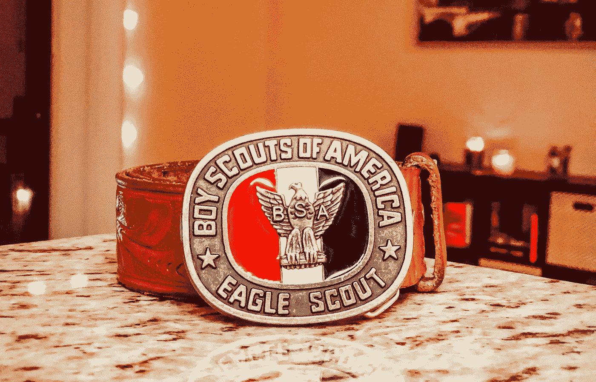

# 如何完成你开始的事情

> 原文：<https://medium.com/swlh/how-to-finish-what-you-started-329721ccdae0>

Source: [cristofer.co](https://www.cristofer.co)

## 避免遗漏

对许多人来说，开始做事情很容易。那是因为新事物的开始通常是令人兴奋的，它是新鲜的，很容易对它感兴趣。

我给你讲个小故事。我这辈子开始了很多事情。其中一个是我 6 岁时的童子军。那是 2001 年 9 月 11 日。我当时太小，无法理解已经发生的悲剧的深度，在我的学校里有一场关于童子军的演讲。他们展示了帐篷和小刀。我被迷住了。我决定要成为一名童子军。

我成了一名童子军(这并不像听起来那么容易，但那是以后的事了)。不久之后，我发现了童子军，更确切地说是鹰级童子军:在童子军活动中获得最高级别的童子军。伙计，那些家伙对我太好了。我想成为其中一员。我决定我要成为其中一员。

在接下来的几年里，我致力于童子军活动。我参加了每一次旅行，我获得了我能获得的每一枚徽章，我加入了童子军，并开始一步步晋升。

我大概 12 岁的时候开始失去兴趣。童子军不再“酷”了。我是我们学校还在童子军的最大的男孩。我希望女孩们喜欢我，我不认为被人看到穿着包括短裤和奖章的制服对我有帮助。

我不想告诉任何人，因为我的父母花了很多时间和金钱让我成为一名优秀的童子军；他们支付我的旅费，带我去参加所有的会议，等等。我不想告诉我的童子军领导，因为我不想被视为一个懦夫。

所以，我必须自己解决这个问题。我花了很长时间认真思考我当初为什么开始童子军活动。我回顾了我在野营旅行中获得的所有乐趣以及我学到的所有东西。我看着自己设定的目标:成为一名鹰级童子军。我认为我投入了太多的时间和精力，现在不能放弃。我是一名“星探”(下一个级别是“生命侦察兵”，再下一个是“鹰”)，与我已经做过的事情相比，我面前的事情少得多。

看着这些帮助我度过难关，我做到了。我 13 岁时完成了成为鹰级童子军的所有要求，并在我 14 岁生日后几天获得了审查委员会的认证。

最终，这教会了我两件事:

1.  即使你开始失去兴趣，也有可能完成你开始的事情。
2.  **为了重新点燃对某件事的兴趣，你需要审视自己当初为什么开始做这件事，并回到那种心态。**

回到最初的心态不一定是世界上最容易的事情，但有一些方法可以做到。

有时候，仅仅看看最初的心态是什么就足够了。有时需要把它写下来，列出你开始那个活动或项目的所有原因。有时你只需要坚持一点点(即使你不感兴趣)，因为积极地做某件事本身就是重新点燃兴趣的好方法。

在某种程度上，有时就像饥饿。你有没有真的饿到不想吃饭的时候？你曾经不得不开始吃东西吗？你有没有注意到有时候一旦你吃了几口，食物开始变得美味，你开始有点饿了，想吃更多？

重新点燃兴趣也是同样的方法。

你还可以做另一件事来提高自己的能力，让自己始终保持动力。那就是把你正在做的事情分解成容易完成的任务，每个任务都是他们自己的小项目。

每个项目都有开始、中间和结束。通过把一个大项目分成几个小项目，你给了自己一些“完成”的满足感，这将帮助你在完成大项目的过程中保持动力。

总之，通过检查你最初的目的来重新点燃你的兴趣。通过小的“完成”来完成，累积成大的“完成”。

***感谢阅读！***

如果这个故事对你有所帮助，请点击“鼓掌”按钮，让更多人看到它。

## 这篇文章发表在 [The Startup](https://medium.com/swlh) 上，这是 Medium 最大的创业刊物，拥有 281，454+人关注。

## 在此订阅接收[我们的头条新闻](http://growthsupply.com/the-startup-newsletter/)。

