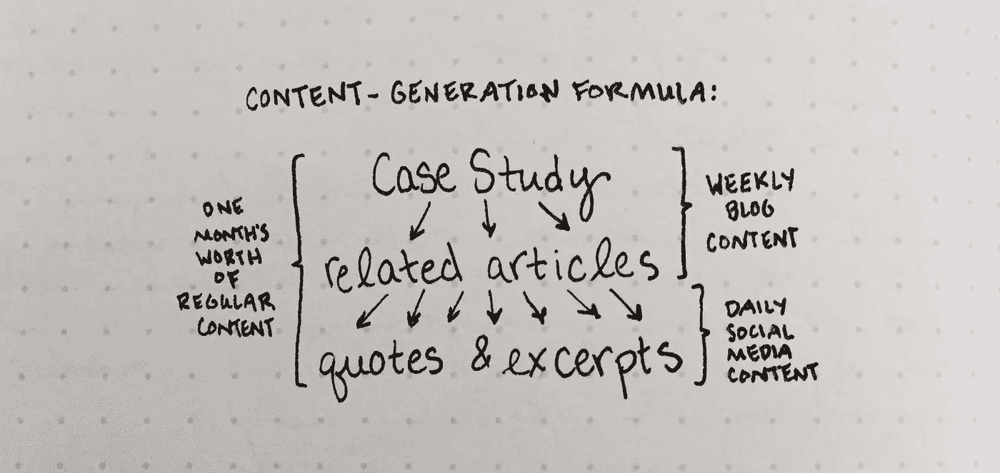

# 如何为基于服务的业务生成一致的内容

> 原文：<https://medium.com/swlh/how-to-generate-consistent-content-for-your-service-based-business-6a4c07821417>

## {内容营销变得简单}

内容营销背后的基本理念是，持续发布有价值的内容将有助于人们了解、喜欢和信任你。当人们了解你、喜欢你、信任你时，他们更有可能雇佣你。

概念简单，但执行起来并不容易:*每周发布有价值的博文，每天分享到社交媒体就可以了。*好的，但是你如何想出这些内容，如何让它有价值呢？

# 从一个核心内容开始。

写[一个案例研究，讲述你如何让一个过去的客户成功的故事](http://civanpro.com/wowclients)。这将是整整一个月的内容的核心。

当你写的时候，把你的潜在客户记在心里:你如何用这样一种方式来讲述这个故事，让他们相信你是值得雇佣的？

案例研究不仅仅是你作品集的一部分。如果你想解开这个想法，看看我的文章:

 [## 为什么一个案例研究比完整的投资组合更好

### 你的投资组合可能是阻碍你获得更多工作的原因

xmedium.com](/@jordanaspen/why-one-case-study-is-better-than-a-full-portfolio-c7a7a89471ac) 

# 使用案例研究作为更多内容的灵感。

让你的案例研究激发出 3-4 篇博客文章来填补你每月剩余的每周文章。

这里有一个例子:如果你从一个关于你为印刷杂志创作的插图的案例研究开始，你可以接着写一篇关于你对印刷和数字媒体的看法的博文。然后你可以分享一个色彩理论的帖子，用你的插图作为例子。最后，你可以写一篇文章，详细描述你吸引杂志编辑眼球的过程——是他们主动接近你还是你主动提出关系的？

突然之间，一个月的每周博客帖子变得触手可及！

# 将引用和摘录转化为社交媒体帖子。

从浏览你的案例研究和其他博客文章开始，寻找足够简短的信息。不要取笑你的推特粉丝，给他们一句他们只有点击阅读你的完整帖子才能理解的话；在推特上告诉他们整个概念。不要为了从你这里得到有价值的东西而让他们离开平台。

Instagram 比 Twitter 允许更长形式的内容，你可以在脸书上发布几乎任何你喜欢的内容。考虑你想活跃在每个平台上的追随者。以他们喜欢的方式向他们提供对他们有益的引用和摘录。

如果你在 Medium 上很活跃，首先在你自己的博客上发布案例研究和其他文章，然后使用[导入功能](https://help.medium.com/hc/en-us/articles/214550207-Import-post)在 Medium 上分享它们。这样来源永远是你自己的平台。(这是[正是我做的](http://jordanelisheva.com/blog/content-formula)。)

# 简而言之:

*   创建一个核心内容([案例研究](http://civanpro.com/wowclients))
*   拿出 3-4 篇相关文章
*   从每篇文章中找出 5-7 段引言或摘录(取决于你是一周 7 天都在社交媒体上分享还是只在工作日分享)
*   现在你有了整整一个月的内容:每周的长篇博客帖子和每天的短篇社交媒体帖子

> 想要帮助学习写案例分析吗？对于一篇文章，甚至一个系列来说，这是一个太大的主题，所以我创建了[课程](http://civanpro.com/wowclients)来一步一步地引导你完成这个过程。现在开始招生，截止到 2019 年 5 月 6 日！

 [## 哇潜在客户

### 利用故事的力量来获得关注和被雇佣

civanpro.com](http://civanpro.com/wowclients) 

## 这篇文章发表在 [The Startup](https://medium.com/swlh) 上，这是 Medium 最大的创业刊物，拥有+369，518 名读者。

## 在这里订阅接收[我们的头条新闻](http://growthsupply.com/the-startup-newsletter/)。

