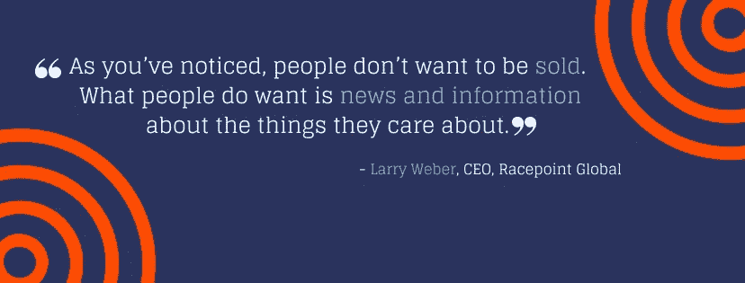

# 如何利用完美的潜在客户档案增加销售

> 原文：<https://medium.com/swlh/how-to-generate-more-sales-with-the-perfect-prospect-profile-bb64cdf8225e>

2007 年，平均需要 3.68 次电话推销才能接触到潜在客户。然而，今天平均需要 [18 次尝试](http://blog.topohq.com/sales-development-technology-the-stack-emerges/)才能真正联系到买家。

我们生活在迄今为止竞争最激烈的销售时代——新的媒体渠道、外展技术和成百上千的竞争者无时无刻不在争夺消费者的注意力。用销售电话和营销信息轰炸你的潜在客户不足以推动转变，这些激进的策略在后 GDPR 时代不再可行。

如果你想增加你的销售额，你需要首先确定*你要卖给谁*。每一次活动和每一次推介都需要以潜在客户的问题开始和结束，以及你如何解决这些问题。

> 用已故伟大的金克拉的话说:“停止销售。开始帮忙吧。”

# 为什么要关注潜在客户简介？

创建完美的潜在客户档案就是要收集潜在客户的相关数据，不仅要了解他们是谁，还要了解他们想要什么和需要什么。是的，你可以针对约翰，但谁是真正的约翰？约翰是做什么工作的？约翰住在哪里？约翰需要什么帮助？约翰想听到什么信息？如果你发现了这一点，你就更有可能给约翰他真正想要的东西。

为了做到这一点，你需要做两件事:

1.  收集尽可能多的关于你理想前景的信息和数据。
2.  通过让你的销售与他们相关来鼓励参与。

> “让内容吸引人的是相关性。你需要把联系方式和内容信息联系起来。”— *咨询公司首席执行官盖尔·古德曼联系人*

**建立详细的潜在客户档案将:**

*   帮助你找到最好的联系对象
*   开始向你展示接触他们的最佳方式。
*   允许你磨练你的营销努力，并以最有效的方式与他们交谈。

**如需了解与潜在客户沟通的最佳方式的更多信息，请下载我们的电子书** [**《沟通策略:为什么电子邮件带来的会议比电话多 11 倍》。**](https://www.taskeater.com/downloads/read-our-ebook-on-outbound-emails-v-cold-calls/)

Words of wisdom from Larry Weber

# 如何创建您的潜在客户档案

# 1.看到了吗

仅仅考虑你的理想前景是不够的，因为你会错过这个过程中最重要的方面:细节。细节有助于你创建一个个人的和相关的信息，所以把你的信息尽可能详细地写在纸上或屏幕上，开始建立你的完美前景的视觉画面。

# 2.从回顾开始

在你目前掌握的所有信息中，你过去的客户是最好的切入点。回顾过去，找出谁是你最好的朋友。你真正喜欢和谁一起工作？谁对你的营销反应最大？谁得到了最好的结果？这些客户有什么共同特征？开始建立一个你想与之合作的客户类型的图片，以及谁想与你合作。

# 3.既看个人特点，也看职业特点

记住你过去最喜欢的客户共有的特质，想象你正在和他们交谈。这听起来可能很奇怪，但是为了得到最好的结果，你会想继续想象你在和一个真实的人说话。

想想你理想对象的个人细节:他们的年龄、性别、工作、收入水平、所在地、婚姻状况、种族、宗教等等。请记住，如果这些统计数据与你的品牌无关，你应该跳过它们。同样，如果你的品牌主要涉及潜在客户生活方式中的某个特定元素(例如，你销售婚礼套餐，了解潜在客户的婚姻状况很重要)，那么你可以随意扩展这些领域，以获得你想要的数据。

你可能还会考虑你理想的潜在客户的职业人口统计，比如他们工作的行业、他们的职位、他们公司的规模、他们的经验、他们的教育背景等等。

在这方面，您需要尽可能详细地阐述，因为这些人口统计数据会告诉我们潜在客户的购买决策。

**试着再深入一点，想想:**

*   他们的工作描述和日常职责
*   他们的目标和优先事项
*   他们的痛点
*   他们过去为解决这些问题可能采取的任何行动
*   他们团队的结构以及谁参与了购买决策

将你发现的所有信息转化为一个理想前景的图片通常是有益的，因为它允许你就你的所有营销努力和你做出的每个决定咨询这个“人”。

# 这是我们之前做的一个…

Meet Sarah!

记住，你能给莎拉、她的生活和工作提供的细节越多越好。这个练习最重要的部分是你要关注莎拉想要什么和需要什么。她的目标是什么？与她的环境和情况相关的障碍是什么？深入探究细节。

建立这种形象的最好方法是与人交谈。出去和你想吸引的潜在客户和客户交谈。给自己描绘一幅他们是谁，他们在为什么而奋斗，他们想要实现什么的画面。这对一个好的潜在客户档案至关重要。

把以上作为一个起点，继续建立你的个人资料，你谈得越多，越了解你的潜在客户。

# 关于潜在客户简介的最后一句话…

总之，这一切都是为了确定你的最佳客户的共同特点，并创建一个尽可能详细的潜在客户档案，使你的营销和销售工作的相关性。

世界上最优秀的营销人员已经掌握了尽可能了解他们的理想前景的艺术，这使得制作正确的信息和解决正确的痛点变得更加容易。

# Taskeater 如何提供帮助

作为专业的销售线索生成者，我们帮助来自世界各地的客户创建更具体、更集中的目标标准，这在 GDPR 变得可执行的今天尤为重要。点击此处阅读更多关于[如何确保销售线索挖掘和冷邮件活动符合 GDPR 标准的信息](https://www.taskeater.com/insights/gdpr-compliant-b2b-cold-emails/)。我们在全球市场和各个行业拥有广泛的专业知识，这意味着我们可以帮助客户量身定制标准，使其准确、相关并符合他们的活动信息和目标。

[**立即向我们的销售线索挖掘专家进行免费咨询**](https://www.taskeater.com/contact-us/) **，并在今天的推广战略中获得利用您的潜在客户资料的帮助。**

# 作者:丹·范伦宁

Taskeater 的常务董事，Taskeater 以前的客户之一。他有 16 年的销售经验，两个男孩，热爱橄榄球。[接丹。](https://www.linkedin.com/in/dan-vanrenen/)

## 这篇文章发表在 [The Startup](https://medium.com/swlh) 上，这是 Medium 最大的创业刊物，拥有 338，320 多名读者。

## 在此订阅接收[我们的头条新闻](http://growthsupply.com/the-startup-newsletter/)。

