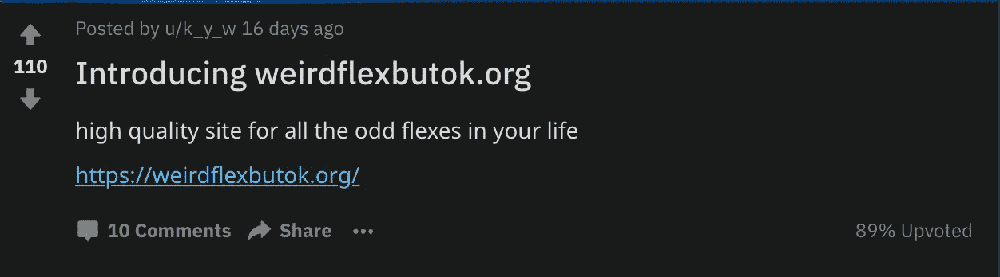
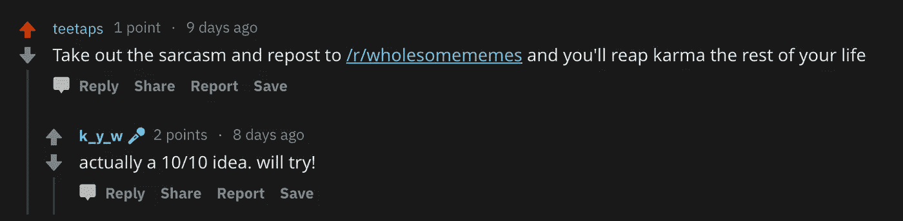

# 如何在 20 天内获得 1000 个用户

> 原文：<https://medium.com/swlh/how-to-get-1000-users-in-20-days-e3af984500ce>

## (或者，另一个标题是:迷因如何成为梦想)

2018 年初，我给自己定了一个新年决心。在年底之前，我会做一些东西——任何东西，真的可以供 1000 人使用。

我想让其他人看到我的作品时感到舒服，我也想让自己对创造人们真正会使用的东西负责*。*我需要成长，超越我做的有趣的项目，向自己证明我可以。我已经准备好创造*真实世界的影响*。

我一点也不知道，我会用我做过的最没用、最不起眼的东西来实现我的目标。

# 想象一下:

现在是 11 月下旬，是感恩节假期，你是大学三年级学生。这意味着你已经迟交了三周的课程，你还有一些几乎没碰过的重要项目要做，休息后的周二你还有一场繁重的期中考试。

与此同时，你开始看到学校停车场堆满了圣诞树，你会想，*天哪，都快 12 月了。怎么会？！*你回想一下你在一月份为自己制定的目标……*哦，我还没有做出任何获得 1000 名用户的东西。你意识到，除了拖延你的学业，你还设法拖延了你的个人目标。所以，为了挽回你那痛苦的自尊，你决定朝着你的新年决心努力。*

## 创造 weirdflexbutok.org

我最近在 YouTube 上看了一个 Casey Neistat 的视频，标题是“[奇怪的弯曲，但还好。](https://www.youtube.com/watch?v=vyhcOpW-LxA)“我确信这个[模因短语](https://knowyourmeme.com/memes/weird-flex-but-ok)有潜力，而且毫无疑问，我看到这个短语在脸书和 reddit 上越来越多地被使用。女士们先生们，这就是愿景诞生的地方。这是我奇怪的弯曲开始的地方。

Some SFW examples of “weird flex” in action — and its close cousin, “odd flex”

我从便宜的域名那里买了 weirdflexbutok.org 域名，因为它以 12 美元的价格出售，也因为 weirdflexbutok.com 被占领了。我草拟了总体计划，然后开始工作。很快，随着几个主要是样板 HTML/CSS 和 JavaScript 的文件、GitHub 页面的免费配置和一些谷歌分析的加入，一切都完成了。该网站的第一个版本是 live，这是一个讽刺的小东西，看起来像[这个](https://weirdflexbutok.org/s)。

# 如何处理业务方面的问题

当然，我确信我已经在迷因经济中发现了一个有前途的市场，但是现在是时候证明需求确实存在了。我在 reddit 上发帖，特别是在 subreddit 上，r/WeirdFlexButOK。这篇文章没有获得多少关注。所以，我又试了一次，这次是在 r/OddFlex 上。我的帖子获得了超过 100 次的投票，然后我的网站在那天有超过 300 个访问者。

My first peek at reddit glory

我无法相信这么简单的东西能如此有效地控制交通。然而，几天后，我的每日用户数急剧下降，我开始努力寻找更多可以发布的子主题。

## 换挡

然后我收到了一条引起我注意的评论:

“在[我的]余生中收获因果报应”的想法很吸引人，所以我决定将这条用户反馈整合到我的项目的非常有组织的迭代周期中。我把网站的内容改成了更长的、支持性的、有益健康的信息，也就是你今天看到的这个网站。

在接下来的几天里，我按照建议在 r/wholesomememes 和其他几个子博客上发帖。虽然我没有因为他们中的任何一个而在 reddit 上出名，但我注意到每当我的帖子获得几十次投票时，我的用户数就会明显增加。为了进一步提高知名度，我在脸书的相关迷因中标记我的朋友时，也发布了该网站的链接，尽管这没有 reddit 那么有效。但是很快，我就达到了目的。

My Google Analytics console

在不到二十天的时间里，我的用户超过了一千人。看到数字攀升的感觉太棒了，当我终于有一天刷新谷歌分析，看到一个超过 1000 的数字时，我在宿舍里跳了一会儿舞。但是，说我真的实现了我的新年决心也感觉很奇怪，几乎像一个谎言，因为，正如你现在可能已经注意到的*，我做的东西有点愚蠢*。

# 我学到的真实的东西

不管我是否真的能把我的目标标为“完成”，我确实在这个奇怪的实验中学到了很多有价值的东西。

## 1.“用户”是一个糟糕的指标

我很天真地制定了我的新年决心，因为现在我意识到 T4 用户计数的想法本质上是没有意义的。我可以客观的说，我做了一个用户过千的东西，但是谁在乎呢？

也许月活跃用户，粘性比率，或一些变化更好。但是，在社交媒体和病毒式传播以及注意力持续时间迅速减少的时代，某种产品的长期可持续性和有用性更难衡量。但这比“我们能让多少人访问我们的网站或下载我们的应用程序”重要得多

## 2.杀了你的宝贝

对于作者来说，“[杀死你的宠儿](https://www.goodreads.com/quotes/79715-in-writing-you-must-kill-all-your-darlings)”意味着消灭你喜欢的场景、人物、台词等。让它成长。我最初的设想是建立一个刻薄的网站，你可以把它发送给你那些过分炫耀、谦虚自吹的朋友，但我最终放弃了它，因为在那个领域没有发展。

但这是为了更好！如果不考虑我从一个不错的 redditor 那里收到的评论，我的“产品”将不会像今天这样有趣。我已经意识到整合用户反馈和保持开放态度的重要性，即使这违背了我制定的宏伟计划。没有什么是可以预测的，无论是在迷因网站、创业公司、总统选举还是其他任何事情上。

## 3.互联网是用来卖东西的

还有娱乐。但是谁说你不能同时做两件事呢？我对网站宣传的尝试让我意识到最好的广告是那些看起来不像广告的广告。

例如，也许我写这篇文章的目标是让 weirdflexbutok.org 的[有 2000 个用户！你必须相信我这不是，但不管怎样，这次经历让我真正看到了互联网猖獗的两面性。任何事物的存在都有原因…或者不止一个原因。不应低估互联网的销售力量，它就在那里等着你去驾驭。](https://weirdflexbutok.org/)

# 就是这样！

感谢阅读！希望你现在有灵感用最奇怪的方式实现你的新年计划。

## 这篇文章发表在[《创业](https://medium.com/swlh)》上，这是 Medium 最大的创业刊物，有+399，714 人关注。

## 在这里订阅接收[我们的头条新闻](http://growthsupply.com/the-startup-newsletter/)。

