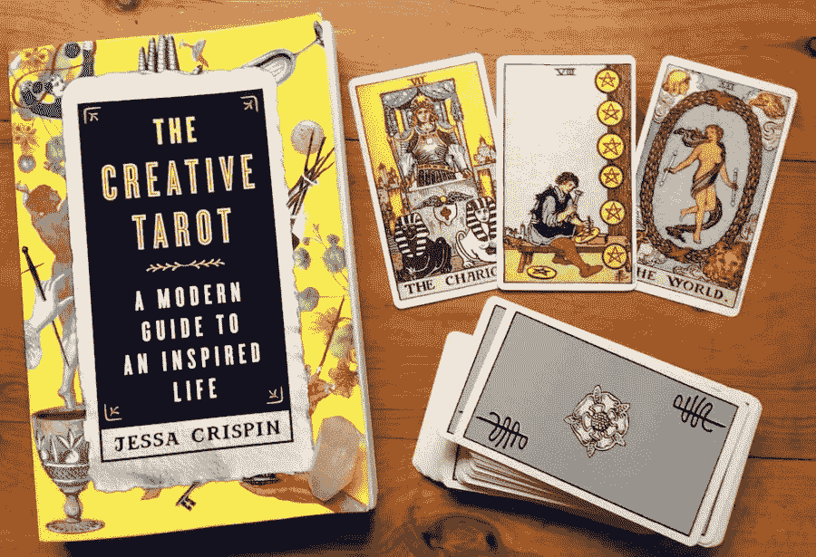

# 如何在播客中获得 F

> 原文：<https://medium.com/swlh/how-to-get-an-f-in-podcasting-9ec010497fce>

via [Paulette Wooten](https://unsplash.com/@paullywooten)

坦白说:我花了两年时间幻想我未来最好的 iTunes 播客事业，就像一些社交媒体单身人士幻想他们的 Pinterest 完美婚礼一样。对于长期博客读者来说，这并不奇怪。你可能还记得我开始录制的节目，还有在发布前被杀的[。当它的僵尸蹒跚着回来时，我又杀了它。我的一些亲密朋友可能会出版一本书，里面全是我说过有一天会开始的节目。

更不用说想法本身或者和我一起工作的人了。责任完全在于我自己弄巧成拙的行为。我花了太多时间迷恋拥有一个播客的想法，将自己与罗曼·马尔斯和伊拉·格拉斯相提并论，以至于我从未越过草案阶段。不知何故，用更少的技能，更少的时间，更少的资源，我应该达到 iTunes 前 10 名，任何低于前 10 名的事情都不值得做。至少，这是我开始相信的错觉。

就我的播客生涯到目前为止，我给自己打了个 f。

现在，尽管有这些抱怨，我现在确实有了一个播客——一个录制起来很有趣的播客，一个人们说他们喜欢的播客(尽管这不是美国生活)。但是这个节目的荣誉不属于我。这不是一个坚持不懈或克服自我怀疑的故事。如果不是因为一次愉快的事故，我还会坐在这里抱怨自我破坏，成绩单上有一个大大的 F。](https://blog.prototypr.io/the-step-by-step-breakdown-to-create-and-then-destroy-your-very-own-podcast-8cf0f130c277)

# 我拒绝开始播客…所以我的朋友骗了我

这一切都始于 10 月。从 2014 年的某个模糊的时间开始，我和布莱恩每周日早上都会见面(现在依然如此)。我们半心半意地在做一个即兴表演网站，但最终失去了火，它再也没有去任何地方。但是我们一直见面。我们会分享想法，各自做项目，或者只是聊天。去年秋天，在奥斯汀·克里昂的推荐下，我买了一本杰西卡·克里斯平的《创意塔罗牌》,这本书(不出所料)是关于阅读塔罗牌来启动创意过程的。

通常，我不会拿起那样的书——对我来说太新了。但是看了几页，我就被吸引住了。克里斯平的塔罗牌方法脱颖而出，因为它特别理性。

> “[塔罗牌]不一定是告诉未来。它是关于复述现在…一张特殊的卡片会出现，因为在某种程度上，我们需要它。我们不会让牌以这样的方式掉落，但每张牌都是一个有意义的巧合。”

对克里斯平来说，任何一张牌都是“正确的”牌，因为提出一个问题的行为和对一个困难局面更深入的思考足以取得前进。这种方法有些新奇，所以我决定偷偷买一副塔罗牌(我还没准备好让大家知道我已经加入了占星读者和水晶人的行列)。然而，我在第二个星期天为布莱恩做了一次阅读——一次出色的阅读，在我把每张卡片翻过来之后，我都在网上查找。

尽管我本人极其笨拙，但布莱恩对塔罗牌的兴趣却大增。他想开一个播客，我们可以在里面读卡片和回答问题，只是作为一种强迫我们练习的方式。但是我拒绝了。我说那会是太多的工作。我说我们不行。

尽管如此，他还是坚持了下来。一个周日，他带着 lav 话筒出现了，并告诉我我们要试一试。他有几个问题。我们就在咖啡店里录音 20 分钟。如果我不愿意，他甚至不会出版这些集。简单。但是如果我真的想释放他们，我们可以把这个节目叫做业余塔罗牌，就从标题上原谅我们的无能。你知道吗…域名也是可用的。

我说好。因为我没有骨气，不想伤害他的感情。

第一集非常糟糕(请不要听)，但慢慢地，布莱恩说服我在这部剧上投入更多时间，增加我们的制作价值。我们开始在他家录音，以消除咖啡屋音乐和混合中过量咖啡因的儿童，在几集出版后，我们开始放松，实际上(喘气)很开心。

# 想开始播客(或任何创意项目)？掌握三个 f。

## 找一个伙伴

我认为自己是一只有创造力的独狼。我知道这不是处理项目的最佳方式，但当一切都在我的控制之下时，我会感觉更好。但是就像有一个健身伙伴一样，一个项目伙伴可以在你没有感觉的时候激励你，提出你从来没有想到过的想法，并照顾你不想要的细节。直到今天，布赖恩承担了大部分工作——我大多只是出现开个玩笑。但与此同时，如果没有我们俩的合作，这部剧就不可能上演。

## 专注于你想掌握的技能

我一直最喜欢的散文之一是乔纳森·哈里斯的《寻找 Stuckness》。在这本书里，他讲述了他设计一个新项目的过程。

> “通常，我用工作来引导我的生活朝着一个特定的方向发展。我会找出我想改变自己的地方，然后设计一个项目来帮助我做到这一点。”

布莱恩和我都对塔罗牌感兴趣，但没有真正的方法(或理由)去练习。当我们开始的时候，我们不知道任何一张卡片的意思。但是播客提供了一个途径，我们可以用真正的问题进行真正的阅读(而不必强迫某人坐在那里，同时我们谷歌定义)。如果没有播客，我保证我的卡牌现在会被埋在地下室的某个地方。

## 跟着乐趣走

我从四年的即兴表演训练中学到的最重要的一课是，如果你出现并开始，奇迹就会发生。你不必担心你和你的场景搭档会谈论什么，因为你会想出一些东西——你必须这样做。播客也不例外。我们不会带着议程出现。我们没有计划好的笑话。在打开麦克风之前，我们甚至不讨论问题或卡片。我们刚刚开始，神奇的是，有趣的事情发生了。'

[业余塔罗牌](http://amateurtarot.com/)从来不是我梦想开始的播客。明显缺乏柔和的声音、有趣的采访和睿智的评论。然而，这是我真正开始的表演。这不是一个死在某个地方闲聊的想法。这是一个真实的节目，简单又有趣。谢天谢地，我有一个朋友允许我(也就是强迫我)制作一些不完美的东西。也许还不是 A+(还没有)，但我肯定不会得 f。

如果你喜欢这篇文章，分享你的爱。单击❤.

你也可以在这里查看播客或者[注册我的关于创造力、政治等等的双月系列文章](http://immakingallthisup.com)。它被描述为“一系列有趣的事情，来自一个非常现实和‘正常’的人。”"