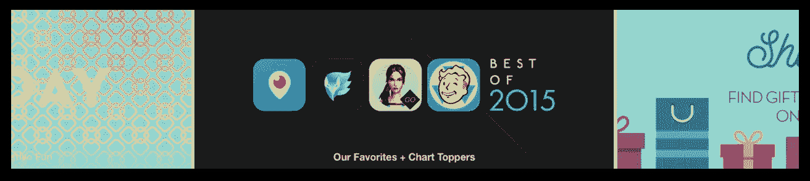
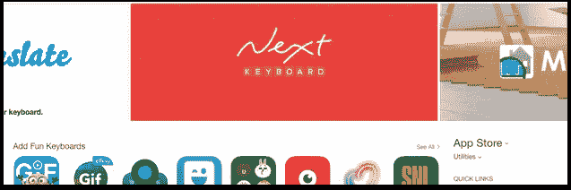
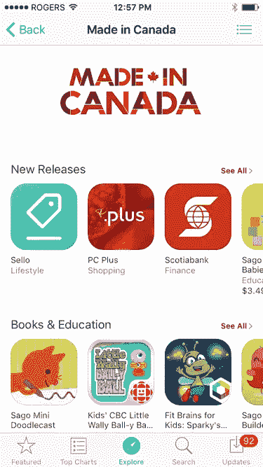
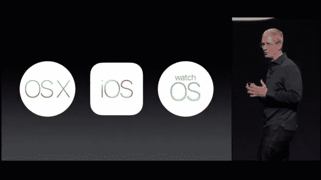
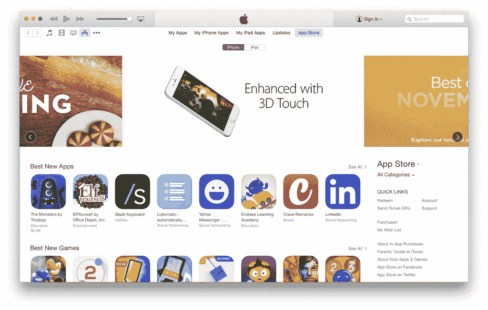
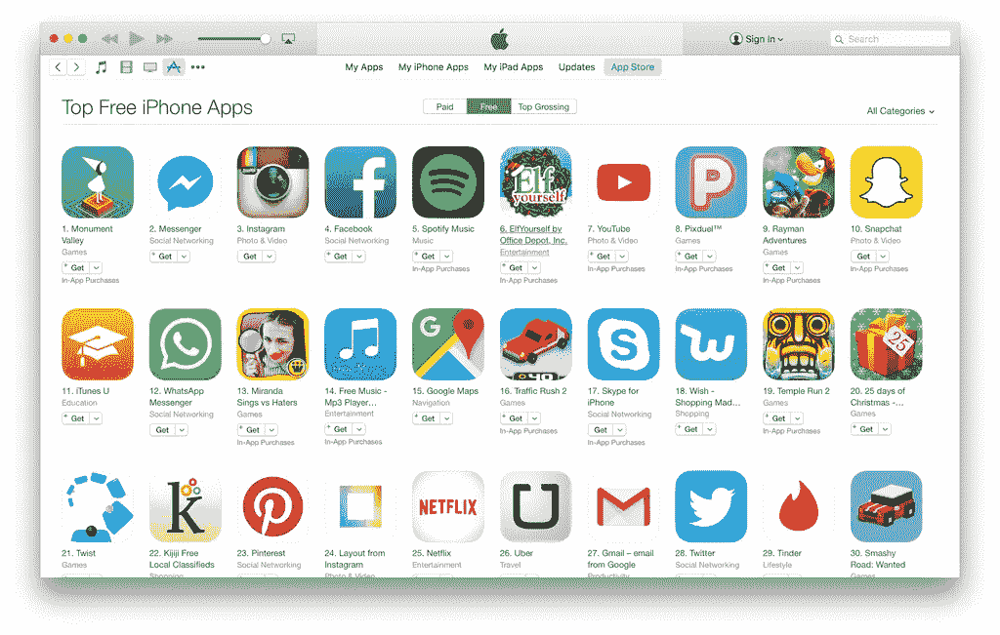
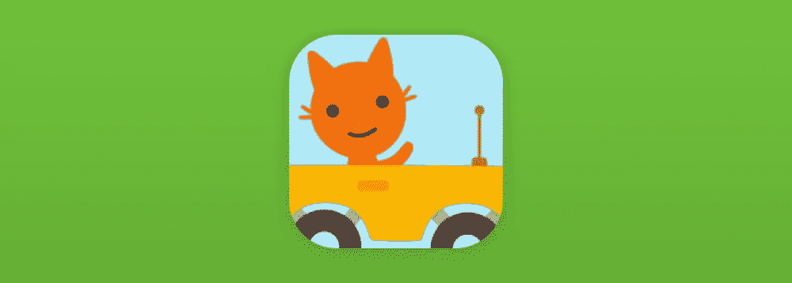
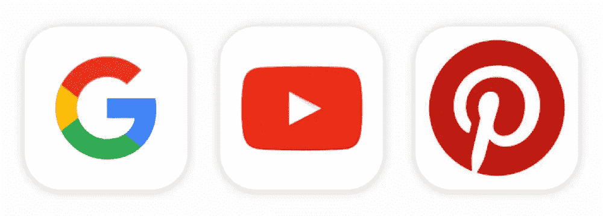

# 如何在 App Store 上获得特色

> 原文：<https://medium.com/swlh/how-to-get-featured-on-the-app-store-656ebe4cdd04>

在你进一步阅读这篇文章之前，这里有一些你应该 ***已经在做的事情*** 。如果你不是，你还没有准备好在应用程序商店上成为特色。跳过这篇文章，专注于你的工作:

*   构建一个伟大的应用程序
*   投资伟大的设计
*   确保你的应用与众不同并且 ***独特***

现在，在我们进入正题之前还有一件事:

被报道很棒。这非常令人兴奋，这是一个很好的机会，让你更加可信。但这并不是你的应用程序的最终目标。你的营销计划需要超越仅仅成为特色。我已经在这里写了关于[公关和媒体报道的文章](/swlh/the-press-release-is-dead-here-are-its-replacements-f0a0a27d6549#.wkdv683am)，这有可能为你的应用带来大量的流量。以下是您在规划移动增长堆栈时应该考虑的其他一些事情:

*   应用商店存在+搜索(ASO)
*   视频和网络展示
*   交叉促销
*   一对
*   付费广告

[Next Keyboard banner featured on App Store](http://blog.tinyhearts.com/th-blog/2015/10/22/next-has-fantastic-launch)

现在，主要的特征。以下是我和我的团队在[小心脏](http://www.tinyhearts.com)如何多次出现在 App Store 上(首页、分类页面、[苹果商业广告](http://blog.tinyhearts.com/th-blog/quickfit-apple-commercial)、[本周免费应用](http://blog.tinyhearts.com/th-blog/2015/10/23/wake-free-app-of-the-week)以及在苹果主题演讲上的简短介绍)，以及你如何也能做到:

# 1.建立关系

听着，很明显你的应用必须引起编辑的注意。这就是为什么很多文章都以“构建一个伟大的应用程序”为开头

然而，如果你想在这件事上更主动，另一个引起他们注意的方法是被介绍给苹果公司的合适的人。

If you’re in Canada — check out the Made In Canada section for Canadian developers in your area

例如，你可以看看你当地的应用商店，看看谁是特色。然后，您可以查找这些应用程序，并与负责它们的人员或团队会面。这些人很可能是应用商店经理或应用商店编辑团队的朋友。这意味着他们可能会把你介绍给苹果公司的人，如果他们感兴趣的话。

此时，你应该已经有了一个你引以为豪的应用程序。请记住，即使你与他们会面，你也不是要向这些人推销你的应用。你正试图以应用程序开发伙伴的身份与此人联系。去和他们一起喝咖啡，或者要求他们给你一点时间(例如 15-30 分钟)。如果你的工作地点在多伦多之外，来和我们一起喝杯咖啡吧。

当你第一次接触他们的时候，你应该已经用过他们的产品了。让他们知道你的想法。如果你喜欢，告诉他们你喜欢。(阿谀奉承只有不真诚才会被人不以为然！)你还应该准备好你产品的一个版本，这样你就可以给他们看，并征求他们的反馈。

我曾经收到一个视频，是这些应用程序开发者专门为我制作的，给我留下了深刻的印象。他们告诉我他们有多喜欢我的应用程序，解释了他们的应用程序，并礼貌地问我是否可以支持他们。在这一点上，我很乐意提交产品搜索。

## 喜欢你目前读到的吗？[加入我们不经常发布的简讯](http://bit.ly/1kp6lTN)，了解“如何在 App Store 上被发现”和“如何制造人们喜爱的产品”等内容。

# 2.了解苹果想要推广什么

将你的目标与苹果的目标保持一致是在 App Store 上获得推广的最佳方式之一。如果你能让苹果变得相关，他们会回报你，让你(和他们自己)曝光。

WWDC 2015 — Apple announcing El Capitan, iOS 9, and Watch OS2

关注 WWDC(6 月)，苹果的软件更新时间表，苹果的特殊硬件更新(9 月)，以及苹果的硬件时间表。大多数人只是观看，并简单地思考技术含义。然而，还有更多——如果你不仅仅从技术角度，而是从产品角度来看，你可以看到获得苹果功能的新机会。

例如，如果你意识到苹果正在发布或推广一个新的 API，你可以发布一个利用这个 API 的应用或产品更新。当你围绕他们的产品路线图构建你的应用程序的一部分时，苹果热衷于推广你，因为他们对推广他们的更新感兴趣。

Apple promoting apps that incorporate 3D Touch

当 6S 问世时，苹果推广了利用 3D Touch 的应用程序。因此，如果该功能与你的应用程序相关，你可以发布更新并联系苹果。如果你已经在苹果公司有了联系人，这将会事半功倍。苹果喜欢销售更多的手机，让他们的手机更有用，所以如果你能帮助他们实现这些目标，他们就会有兴趣推广你。

显然，我不是告诉你盲目地改变你的产品路线图，以配合他们的。最终，这取决于什么对你的产品有意义。不是每个人都需要苹果手表或苹果电视应用。如果你的用户做到了，如果你能把你的用户体验延伸到这一点，那就太棒了。但是不要强求。平衡潜在功能与产品目标和业务目标。

此外，请记住，一款电视应用目前可能不会改变你公司的发展轨迹(如果用户太少的话)。然而，它可以作为吸引他们注意力的与苹果的最初接触点。

您的产品更新不仅仅是更新。它们有可能成为营销工具。明智地使用它们。

## 喜欢你目前读到的吗？[加入我们不经常发布的简讯](http://bit.ly/1kp6lTN)，了解“如何在 App Store 上被发现”和“如何制造人们喜爱的产品”等内容。

# 3.打造出色的应用图标

我认为自己是一个应用图标鉴赏家。我可以整天谈论应用图标。(也许以后我会写一篇关于它的帖子。)这本身就可以构成一篇完整的博文，所以我将简单地介绍一下:

我们被介绍过几次，我们直接从苹果那里听说他们注意到了好的应用程序图标。虽然这是一个微小的细节，但它比人们想象的要重要得多。你的应用图标是潜在质量的指示器。如果你的应用程序图标很棒，你的应用程序的设计也可能很棒——这使得你的应用程序值得一试。

> 永远用图标来判断一个应用。

你的应用图标将不得不与一百万个其他应用竞争。但是，请记住，您的应用程序图标也需要与本节中介绍的所有其他人竞争。[大多数人使用冷色调](https://growthbug.com/the-colors-of-an-app-icon-b5e8805958d7#.8o9uxu458)(比如蓝色)，所以尝试一些不那么传统的、与此形成鲜明对比的颜色。(比如 Snapchat 的黄色。)我们为下一个键盘使用了橙色渐变。

The Next keyboard app icon.

有几个因素影响着杰出的应用程序图标:

Top free iPhone app icons

1.  ***技术:使用大胆的色彩，强烈的对比等。***

看看 [Videoshop 视频的 app](https://itunes.apple.com/ca/app/videoshop-video-editor/id615563599?mt=8) 、[叉过刀的 app](https://itunes.apple.com/ca/app/forks-over-knives-healthy/id903911740?mt=8) 和 [7 秒挑战 app](https://itunes.apple.com/ca/app/the-7-second-challenge/id1005017298?mt=8) 。每一个都有非常大胆，充满活力的颜色。它们在 App Store 上从较冷的蓝色中脱颖而出。

**②*。描述性的:他们解释你的应用程序做什么***

Sago Mini Road Trip app icon

你的应用程序图标应该不用任何文字就能直观地解释你的应用程序做了什么。所有之前提到的应用都很棒，但你也可以看看[奥拓的冒险](https://itunes.apple.com/ca/app/altos-adventure/id950812012?mt=8)、[森林](https://itunes.apple.com/ca/app/forest-stay-focused-be-present/id866450515?mt=8)和[西米迷你公路之旅](https://itunes.apple.com/ca/app/sago-mini-road-trip/id871230822?mt=8)来获得灵感。这些中的每一个不仅非常动态，而且一些特征角色(这对于游戏来说更重要。)

***3。一致:你的图标应该代表应用程序的界面***

Wake app icon — 8:24 is the average time people wake up

一个设计良好的应用程序图标代表一个设计良好的应用程序。我不怕在这里吹牛——我们的应用程序 [Wake](https://itunes.apple.com/ca/app/wake-alarm-clock/id616764635?mt=8) 在这方面做得很好。

当你设计你的图标时，记住苹果的一个功能在免费广告中价值几十万。这是推广你的品牌的好机会。

Trend of white app icons — Google, YouTube, and Pinterest

有一种趋势是品牌创建应用程序图标，这些图标是他们的标志[溅在白色背景上](/swlh/let-s-talk-about-white-app-icons-ce2e83b9eb86#.d8ger5sab)。对于大品牌来说，这不是一个坏主意——每当人们看到你的应用程序，你的标志和品牌就会获得知名度。[谷歌](https://itunes.apple.com/ca/app/google-app-search-made-just/id284815942?mt=8)和 [YouTube](https://itunes.apple.com/ca/app/youtube/id544007664?mt=8) 就是这么做的。 [Groupon](https://itunes.apple.com/ca/app/groupon-deals-coupons-shopping/id352683833?mt=8) 、[果然](https://itunes.apple.com/ca/app/indeed-job-search/id309735670?mt=8)、[dubssmash](https://itunes.apple.com/ca/app/dubsmash/id918820076?mt=8)、 [Musical.ly](https://itunes.apple.com/ca/app/musical.ly-your-music-video/id835599320?mt=8) 、[易贝](https://itunes.apple.com/ca/app/ebay/id282614216?mt=8)、 [Kik](https://itunes.apple.com/ca/app/kik/id357218860?mt=8) 、 [Pinterest](https://itunes.apple.com/ca/app/pinterest/id429047995?mt=8) 等也是如此。这种趋势也有不利的一面，它肯定不适用于大多数应用程序。迈克尔·弗拉鲁普在这里写了一篇关于这个[的好文章。](/swlh/let-s-talk-about-white-app-icons-ce2e83b9eb86#.62b3zm8ms)

# 不要那么自私

当你思考这个问题的时候，你会问，“我怎样才能成为主角？”仅仅是开始。功能可能是深思熟虑的设计的副产品，你的关系(“我需要认识谁？”)，你的时机(“我如何才能让这与人和苹果相关？”)，以及你如何代表你的品牌(“我的图标给人什么印象？”).

显然，正如每一篇关于特色的文章所说，你需要一个伟大的产品。但这是在 App Store 上获得特色的先决条件。我分享了一些我和我的一些朋友是如何成为主角的具体战术例子。希望它们能有所帮助。玩得开心，专注做一个值得苹果聚焦的 app！

> 附注:我们为特定客户设计和开发应用程序。如果你想在构建一个“有价值的功能”应用程序方面得到帮助，请随时联系我们。collab@tinyhearts.com

# 如果你喜欢这篇文章，你可能也会喜欢:

 [## 新闻稿已经作废了。这是它的替代品

### 获得结果的非常规公关的 3 个技巧](/p/f0a0a27d6549)  [## Next Keyboard 如何成为 Kickstarter 上资金最多的应用

当你众筹软件时，如何利用 Kickstarter 的优势和一些警告的教训](/p/ada26c4384d1) 

## Robleh Jama 是获奖产品工作室 [Tiny Hearts](http://www.tinyhearts.com/) 的创始人。他们生产自己的产品，如 [Next Keyboard](http://www.nextkeyboard.co) 、 [Wake Alarm](http://www.tinyhearts.com/wake) 和[Quick Fit](http://www.tinyhearts.com/quickfit)——以及为特定客户生产的产品，如 Plantronics 和 Philips。

## [查看我们的博客](http://blog.tinyhearts.com)和[加入我们的时事通讯](http://bit.ly/1kp6lTN)，了解诸如“如何在 App Store 上被发现”和“如何制造人们喜爱的产品”之类的事情。

**如果你喜欢这篇文章，请推荐，帮助别人找到！**

