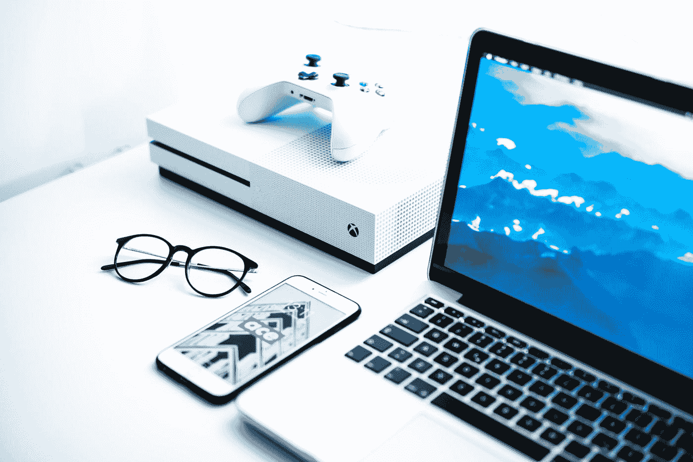
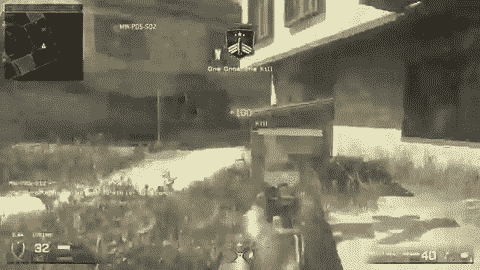
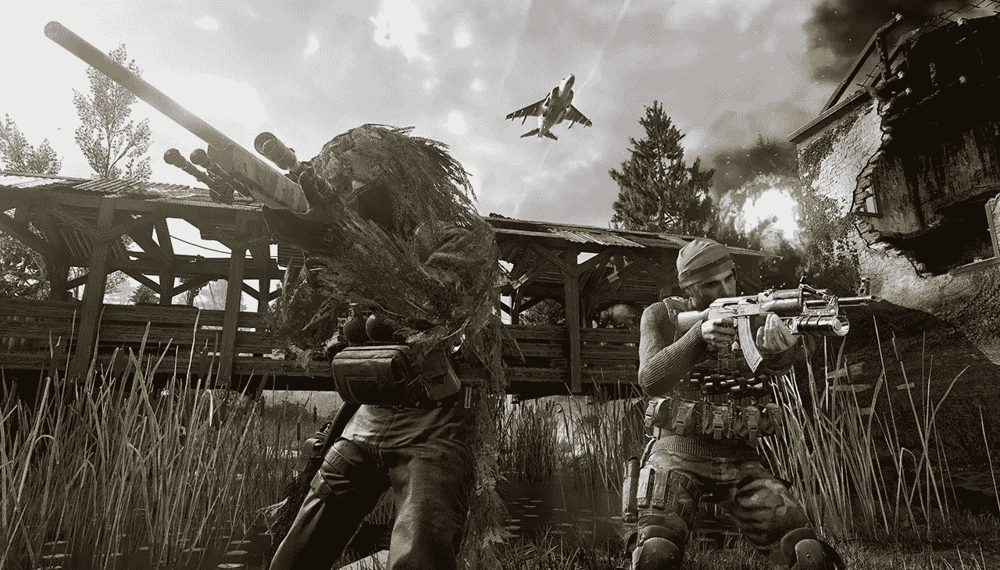
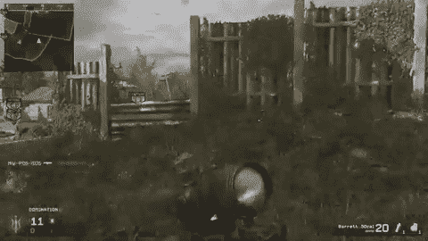

# 如何在任何事情上进入世界前 1%

> 原文：<https://medium.com/swlh/how-to-get-into-the-top-1-of-the-world-at-anything-d3a028704893>

Photo by [Alexandru Acea](https://unsplash.com/@alexacea?utm_source=medium&utm_medium=referral) on [Unsplash](https://unsplash.com?utm_source=medium&utm_medium=referral)

2017 年 11 月，我终于完成了我努力了几个月的事情..

我在《使命召唤:现代战争重制版》中进入了世界前 1%。

> 我敢打赌，你期待我告诉你同样的老故事，我如何最终在那个月从我的博客中赚钱。不，不，伙计们，这是关于使命召唤。

我知道。把使命召唤和成功放在同一个句子里有点亵渎神明，但是请听我说完。

事实证明，我每天在网上玩 30 分钟《使命召唤》的习惯已经获得了一些好处。

> 在《使命召唤:现代战争》重制版中，我是世界上排名前 1%的人。

总共有 400 多万玩家。我在 40000 强里。这是有意义的，因为我已经玩了 9 天 5 小时 19 分钟(总游戏时间)。

我知道我一直在进步，但我只是玩着玩着！我又不是整晚都在玩游戏。

> 相信我，在一天写完三篇博客和回复几十封邮件后，一个快速的鳕鱼游戏让我再次兴奋起来。

我开始意识到我在使命召唤中成功的原因可以令人惊讶地转化为现实生活。让我告诉你怎么做。

# 投入时间

> 我每天至少玩三十分钟使命召唤。对我来说很有趣。很有趣，因为我已经很擅长了。不过，我很少玩超过一个小时。

当你每天花 30 分钟——1 小时，时间一长就会累积起来，对吗？

当我开始玩的时候，我是 absymal。我喜欢玩重制版的唯一原因是它让我想起了 2007 年的美好时光。

相信我，当我说我不是一个电子游戏玩家的时候。

> 这就是这个案子如此有趣的原因。我从一场比赛背后被枪击 20 次，到在地图上来回切换俯卧姿势时获得清晰的头像。

我变好了。

* CANYOUFEELTHEARROGANCE *

时间会这样对你。你知道时间还会对你做什么吗？它让你变得熟悉。

# 熟悉胜过技能

> 你花的时间越多，你就越了解游戏本身。写作也是如此。我在 WordPress、[、Medium](https://findingtom.com/every-blogger-should-be-on-medium/) 或社交媒体上花的时间越多，就不可避免地教会了我更多关于这些平台的知识。只是时间问题！

例如，《使命召唤》中有一些我非常擅长的地图。因为我已经熟悉他们了。我知道最好的狙击点在哪里。我知道敌人像一群下水道老鼠一样从哪里跑出来。

很多时候，我只是在那里等他们盯着瞄准镜。

# 向他人学习

> 听说过摄像机吗？对于那些不熟悉的人，每当你背后中枪(经常发生)，COD 向你展示了另一个人在你重生时杀死你的视角。作为一名狙击手，这让我受益匪浅，因为我可以看到其他队员刚刚从哪里向我射击。

现在我知道哪里是拍摄的好地方了。

我不会撒谎，我时不时会剽窃其他玩家的策略。在生活中，有时你也需要站在巨人的肩膀上。

# 一遍又一遍地做同样的事情

> 根据我玩的地图，我事先知道我要去哪里。我称之为我的狙击热点。

如果因为某些原因我不能到达我的位置，我在那场比赛中的成功率可能会降低 50%。

众所周知，成功是一个长期目标。要获得 50，000 名 Twitter 粉丝，你需要每天关注大量的人。

> 要建立一个好的博客，你需要坚持几年。

使命召唤也是如此。

你需要找到有效的方法并充分利用它。你需要持续不断地这样做，才能看到任何结果。

# 专注于一项能力

> 毫无疑问，我狙击了每一场比赛。我从不摆弄 p-90 或 M16 或 M4 复写纸。我不是来当使命召唤武器官的。我来这里是为了赢得比赛，享受 30 分钟。

生活中也是如此。

> 做一件事，并且把它做好。如果你专注于一件事，你会更快地发现成功，因为其他人要么没有条理，要么困惑，要么漠不关心。他们会尝试其他的东西，当变得困难时就会放弃，很快他们就不会真正花适当的时间去掌握一件事情。

对我来说，那就是写作。你呢？

# 远离你的弱点

> 《使命召唤》里有几张地图我看得很烂。你知道我做什么吗？我像躲避瘟疫一样躲避他们。我从不接近他们。我立即离开大厅。我这样做有两个原因。

1.  我是来找乐子的。我不想浪费 10 分钟玩我讨厌的地图。
2.  我想最大限度地利用我在 200 米外击中人们眼睛的时间。也就是说，我想最大限度地利用成功的时间。

> 很多次我们被教导，我们需要成为一个全面发展的人。我读过很多关于为什么这是假的书。我们应该坚持我们擅长的事情，并把基本上所有的时间都用在这上面。

如果你是一名博客写手，而社交媒体又不是你的强项，那就不要花太多时间去学习了！

专注于创造炸弹内容。呆在你的车道上。有些人是社交媒体官方人士。有些人是营销大师。有些人可以写下一场风暴。选择一个，然后全力以赴。

我不是说完全忽略社交媒体和其他形式的营销，而是说尽可能发挥你的优势，而不是掩盖你的弱点。

你期待这样的事情吗？我不得不写它，因为我认为有时电子游戏会受到不好的评价。它们是放松和适度娱乐的神奇工具。

尽管无论如何我都不是一个铁杆游戏玩家，但我确实喜欢坐下来玩一两个小时。

你呢？

*想在 Medium 上赚外快吗？本周，我将主持几场名为“* ***如何在 Medium****”*[*的免费培训，在此获得免费席位*](https://events.genndi.com/register/169105139238473045/da2e6c5a01) *！*

## 这篇文章发表在 [The Startup](https://medium.com/swlh) 上，这是 Medium 最大的创业刊物，拥有+388，456 名读者。

## 在这里订阅接收[我们的头条新闻](http://growthsupply.com/the-startup-newsletter/)。

