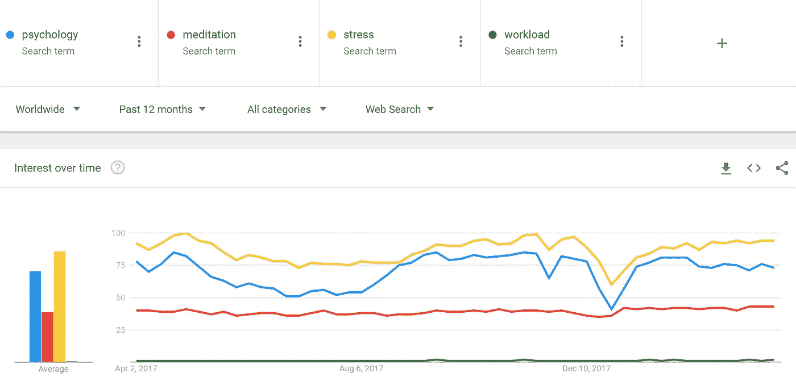

# 如何让更多的读者阅读你的内容

> 原文：<https://medium.com/swlh/how-to-get-more-readers-on-your-content-d7f1f70c66ef>

> “一个好老师，就像一个好的表演者一样，首先必须抓住听众的注意力，然后他才能讲课”(约翰·亨里克·克拉克)。

这是我的第 50 篇博客，我想做些特别的事情，分享一下我是如何获得为数不多但看得见的读者的。

当然，有更多的人在很短的时间内获得了更大的成功，但对于像我这样甚至不知道如何开始让*吸引观众的人来说，我发现这些技巧为我的帖子带来了一些活跃的读者。*

我的目标从来不是 100%拥有一个观众，但为了好玩而试图培养一个观众，最终实际上教会了我一些保持观众的事情，不管观众有多少。

对于那些已经在这里呆了一段时间并跟随我的人，感谢你们给了我继续前进的动力。

# 提高搜索引擎优化

正如大多数博客和所有媒体分享者所知，SEO 代表搜索引擎优化，但搜索引擎并不是它影响的唯一事物。

SEO 能够让那些没有选择在某个平台上关注你，而是通过其他方式偶然发现你的内容的人更容易访问你在网上发布的内容。

尽管名称中有搜索引擎*的名字，但 SEO 的方方面面受到的影响并不仅限于谷歌。*

以博客为例，你可以给你的文章起一个更接近人们搜索的标题。无论发布在什么网站上，它都会出现在更高的位置，即使在谷歌搜索时没有出现。

关键词在其中发挥了作用，因为使用人们正在搜索的词有助于让读者看到它，如果关键词与搜索相符，它所在的平台会将它放在更高的位置。

我的意思是，如果你要给某个东西命名为“使用冥想和蜡烛让你的工作量感觉更小”，这可能很难被搜索到，如果总的来说人们不搜索调解或工作量的话。在这种情况下，他们不会在搜索栏中输入这些词。

然而，如果有人键入“压力”或“如何消除压力”，像“如何在 5 个步骤中消除压力”这样的内容更有可能被搜索到。在这种情况下，他们更愿意点击你的帖子，看看你有什么要说的。

Google Trends 也是一个很好的方法来查看搜索时哪些词胜过其他词。这并不一定意味着如果你使用 Google Trends，你会努力成为 Google 上的首要搜索结果，但是你可以看到当你搜索某个东西时，什么词会更快地出现在人们的脑海中。

这里有一个使用我提到的一些单词的例子。

你可以看到，即使你可能在*谈论*解决你的工作量，这可能不是在试图吸引人们的注意力时使用的最佳词汇。人们一直在寻找调解方法，但却被更简单的词如压力打败了。

尽管这些词可能彼此不一致，并且根据上下文可能完全不同，但你可以理解我的观点，即使用 Google Trends 来找出对我们来说最好的词。

想出几个标题，在谷歌趋势中试试，看看什么更有可能吸引一些观众。

# 出版物

这种类型的分享更严格地说是指 Medium，但是如果你还没有把你的内容交叉发布到 Medium，我会强烈推荐它。

Medium 拥有一些出版物，可以邀请作者在其出版物上发布内容。或者，如果你认为你的内容足够好，你可以给他们发送一份你的内容，并申请成为特定出版物的作者。

出版物有利于增加受众的原因是，那些不追随你或不确切寻找你的内容的人仍然可以通过这种方式发现你的内容。

订阅了出版物的读者会获得各种各样的内容，这些内容会显示在他们的订阅源上，这意味着他们是那种不会因为内容而严格追随受欢迎的个人的读者。

出版物也可以专门针对某些类型的书面作品进行营销，使关注这些出版物的人更有可能看到并点击您的内容。

创建您自己的出版物并不总是最佳途径，因为与允许您的内容通过现有出版物共享相比，发展出版物的竞争更难进入。

出版物已经建立了读者群，所以进入其中是获得部分读者的好方法。

最好的一点是，你不局限于某个特定的出版物。如果一个出版物拒绝了您的内容，您可以随时将它提交给另一个愿意接受的出版物。因为这个原因，成为多个出版物的一部分是完美的，你可以在大多数时候总是期望其中一个接受你。

# 更多平台共享

就像我说的，如果你还没有跨媒体，你应该好好考虑一下。尽管如此，在其他平台上分享总会让你和你的内容受益。

从别人那里获得一个分享，或者在另一个平台如 Twitter 或脸书上分享你自己，几乎就像重新发布一样，根据发布的位置，人们看到它的机会会增加一倍。

如果你想一想，其他平台有忠实的受众，他们可能会坚持使用那个平台，但是如果你在两个或更多的平台上发帖，你可以从所有这些平台上获得受众，从而获得频繁的读者。

每个人都是在线的，所以增加你的内容覆盖的区域和出现的位置将会大大增加点击它的人数。

观众和读者的比例总是存在的，但是如果这个比例接近于常数，那么增加一个数字(观众)就会增加另一个数字(读者)。

如果你不确定在哪里交叉发布或分享你的内容，你总是可以看看人们在哪里分享类似的东西。

如果你找到一两个迎合这类内容的子网站，并且会接受你的帖子，Reddit 是一个很好的曝光方式。这方面的一个例子是交叉发布一个名为“亚里士多德被忽视的哲学”的故事给[www.reddit.com/r/philosophy.](http://www.reddit.com/r/philosophy.)

总有一些观众在寻找与你相似的内容，所以让他们了解你所提供的内容是一条可行之路。

很多人经常害怕对他们所提供的东西的批评或拒绝，但是接受和赞扬他们所写的东西的人数远远超过了这个数字。

你的内容可能很棒，但是把它展示给那些会发现它有用的人才是真正会产生你想要看到的影响的。

## 这篇文章发表在[《创业](https://medium.com/swlh)》上，这是 Medium 最大的创业刊物，有 312，043+人关注。

## 订阅接收[我们的头条新闻](http://growthsupply.com/the-startup-newsletter/)。

