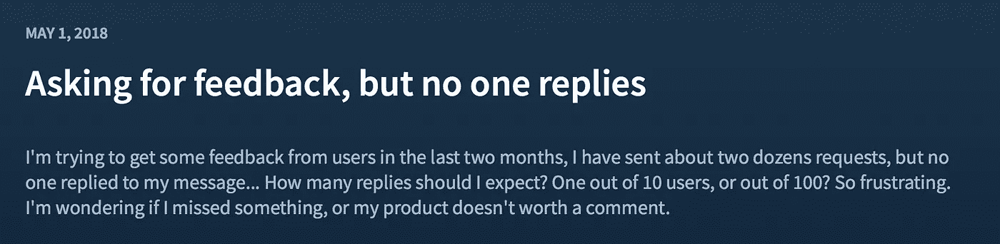
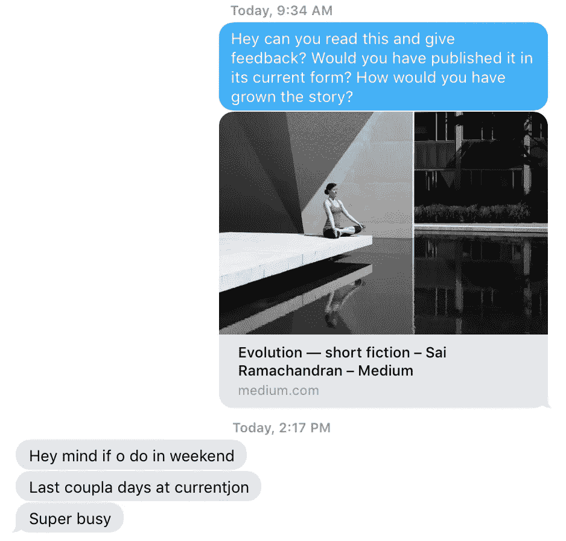

# 如何回复你的邮件

> 原文：<https://medium.com/swlh/how-to-get-responses-to-your-emails-e22b913ba910>

## 虽然生活中没有确定的赌注，但你发给客户的征求反馈的电子邮件被忽视的可能性非常接近。

Did you get the message? (Courtesy [Pexels](https://www.pexels.com/photo/business-communication-computer-connection-261706/))

不相信我？你是那些邮件得到回复的幸运儿之一吗？

> 人们喜欢自己的声音

好吧，我的朋友，这次你是孤军奋战了。我们其余的人和这个家伙在 indie hacker 上。

Personal Archive (Courtesy [me](/@ssr233). Is joke. No Mad.)

# 我们能做得更好吗？

如果我不相信我们可以做得更好，这个帖子就没有意义。就像我最近在《T2》上发表的另一篇关于黑掉 Twitter 以获得优质受众的文章一样，我愿意进行实验来验证我将要告诉你的策略是否真的有效。只需[发推特@我](https://twitter.com/psilive)来设置一些东西！#科学。

## 一些初步证据

> 诀窍是使用让他人处于驾驶位置的语言。

这是这个建议有效的初步证据。我问一个正在换工作的人，他们是否愿意评论我写的一些小说，并给出反馈。大多数时候，这样的信息消失在空气中(*也许我只是一个糟糕的作家*🤔)但这次不是。耶！

Personal Archive (Courtesy [me](/@ssr233). Is joke. No Mad.)

我的朋友说她周末会去看一下，因为她最近几天忙于工作。

我会在一周的任何一天通过无线电静默来接受这个回答。

> *【打开】对话空间*

# 那么有什么不同呢？

诀窍是使用让他人处于驾驶位置的语言。你给他们一个为你解决问题的机会，因为你犯了愚蠢的错误而给你当头一棒，通常是给你提建议的聪明的老教师。

所以，我的建议很简单。把方向盘让给你正在交谈的人，让他们*告诉*你如何做事。

不要问——“*我怎样才能做得更好？*“提问”*你会如何做得更好？*

这个更微妙一些——“*你喜欢这个功能吗？*“提问”*对于这项功能，你会采取什么不同的做法？*”。你打开了与这个人对话的空间。

# 结论

尽管这篇文章语气轻率，但我相信它揭示了日常生活中经常被掩盖的关于沟通的一个非常突出的事实。

人们喜欢自己的声音，即使是在电子邮件或短信中，或者是在 Reddit 帖子上投赞成票或反对票。让人们说话不仅仅是问问题。你必须提出问题，邀请人们来填补沉默。

*原载于 2018 年 5 月 3 日*[*ramachandr . in*](https://ramachandr.in/2018/05/03/how-to-ask-to-get-a-response/)*。*

## 这篇文章发表在 [The Startup](https://medium.com/swlh) 上，这是 Medium 最大的创业刊物，有 322，555+人关注。

## 在这里订阅接收[我们的头条新闻](http://growthsupply.com/the-startup-newsletter/)。

