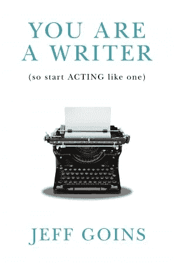

# 如何开始成为一名付费作家

> 原文：<https://medium.com/swlh/how-to-get-started-as-a-paid-writer-86317ceb8993>

汤姆·法尔

许多作家希望从他们的写作中获得收入，因为谁不想在做他们最喜欢的事情时获得报酬呢？

幸运的是，自由写作是一个作家赚钱的好方法。许多作家从事自由写作是除了日常工作之外赚取额外收入的一种方式，而其他人则把它作为他们的全职职业。

无论哪种方式，自由写作可以是一个令人愉快的职业，它提供了无数学习新事物的机会，并赢得了职业作家的声誉。

# 1.获得一些初步经验

任何你想为之写作的杂志编辑或潜在客户都想知道你有能力为他们创作高质量的内容。但是当你第一次开始写作时，你可能还没有发表任何东西给潜在的客户看，以证明你是一个可靠的作家。

那么，你如何获得经验来向人们展示你知道如何写作呢？作为一名作家，你通过免费写作获得经验，至少在一开始是这样。

你这样做的方法是决定你想为谁写作，写一些符合他们标准的东西作为样本，然后自己发表。你可以在自己的个人博客上这样做，如果你有一个专注于某个特定领域的博客，这样做效果会很好。另一个选择是在 [**媒体**](/) 上发表你的作品。

> 专注于写一些引人入胜、写得好的东西，你应该有一些东西给编辑看，以展示你的写作能力。

也可以在 [**Elance**](http://elance.com/) 或 [**Upwork**](http://upwork.com/) 上注册账号，寻找愿意雇佣新写手的客户。工资不是很高，但如果你刚开始工作，这是个不错的选择。

# 2.不断产生想法

作为一名自由作家，如果你想有一份稳定的工作，你必须不断产生新的想法。拥有源源不断的想法可能是一个挑战。

为自由撰稿人的工作产生想法的关键是选择一个特定的领域，阅读在那个领域已经写了什么，并找出在那个领域还没有覆盖的或者可以扩展的。你甚至可以想出一些主题，你可以从一个创造性的和独特的角度来看，别人从来没有过。

# 3.学习如何投好球

获得自由写作的机会很大程度上取决于你能否很好地推销你的想法。你必须能够写出一篇和你希望在被接受后写的文章一样有思想和组织的文章。你想把你的想法包装成一种方式，让编辑想要阅读完成的文章，并相信读者也会想要阅读它。

当你写一个推销词时，你要确保你…

*   用吸引人的方式包装你的想法
*   展示你对这个主题的了解或者你已经做了研究
*   强调为什么你的想法对你要推销的出版物很重要
*   指出为什么读者会关注你的想法
*   举例说明你有资格写这篇文章(相关的例子)

# 4.树立你作为伟大作家的声誉

对于你完成的每一份自由写作工作，你都想确保你能写出扎实的文章。编辑们往往彼此关系良好，如果你工作表现平平，这种名声可能会传播开来，毁掉未来的机会。但是如果你工作出色，情况也是如此。

> 你完成的每一份自由写作工作都是一个建立坚实作品的机会。

大多数自由作家都会在网上保存他们最好的作品，这样潜在的客户就可以看到你过去做过什么。

一个构建你的投资组合的伟大平台是**。我已经心满意足地使用了几年，设置非常快速简单。你作品的布局看起来也很不错。**

# **一些对自由撰稿人新手有用的资源**

****

**我遇到的建立自由写作生涯的最好资源之一是由 [**内森·穆尼尔**](http://nathanmeunier.com/) 写的电子书，名为 [***小众自由作家***](http://www.amazon.com/gp/product/B010QT2QXI/ref=as_li_qf_sp_asin_il_tl?ie=UTF8&camp=1789&creative=9325&creativeASIN=B010QT2QXI&linkCode=as2&tag=tofa01-20&linkId=6WGYXFWSNZZEKY4H) 。这本书在亚马逊上仅售 2.99 美元，它包含了关于如何选择合适的写作领域、如何发展营销理念、如何编排营销格式以及你可以撰写的不同类型文章的信息。Meunier 还有其他几本书，也就如何建立一个稳固的自由作家职业生涯提供了坚实的见解，包括…**

*   **[*自由撰稿人*](http://www.amazon.com/gp/product/B00K0JQU1E/ref=as_li_qf_sp_asin_il_tl?ie=UTF8&camp=1789&creative=9325&creativeASIN=B00K0JQU1E&linkCode=as2&tag=tofa01-20&linkId=IZ52D5UPLC2OB5JT)**
*   **[*上上下下左写:电子游戏新闻自由职业者指南*](http://www.amazon.com/gp/product/0989533506/ref=as_li_qf_sp_asin_il_tl?ie=UTF8&camp=1789&creative=9325&creativeASIN=0989533506&linkCode=as2&tag=tofa01-20&linkId=I3ID2Q3QUR7WECXX)**
*   **[*采访傅:*](http://www.amazon.com/gp/product/0989533514/ref=as_li_qf_sp_asin_il_tl?ie=UTF8&camp=1789&creative=9325&creativeASIN=0989533514&linkCode=as2&tag=tofa01-20&linkId=36UWZ3M5H3VN5PN5)采访**

****

**我也强烈推荐杰夫·戈因斯的书 [***【你是个作家(所以开始行动吧)***](http://www.amazon.com/gp/product/0990378500/ref=as_li_qf_sp_asin_il_tl?ie=UTF8&camp=1789&creative=9325&creativeASIN=0990378500&linkCode=as2&tag=tofa01-20&linkId=VOPAOSYRYRJVKSBR) 。戈因斯的书向你展示了作为一名作家，如何聪明地工作并为自己创造机会。**

*****有没有想过自由写作？如果你可以为任何出版物写作，你会写什么？请在下面的回答中分享。*****

## **这篇文章的[版本](http://whisperproject.net/2015/08/freelance-writing.html)最初出现在 [The Whisper Project](http://whisperproject.net) 上，这是一个面向作家、创作者和故事讲述者的博客。**

> **如果你喜欢这篇文章，请考虑向下滚动 ***推荐*** *到这里。访问*[***The Whisper Project***](http://whisperproject.net)*获取更多写作技巧。也可以在这里* *报名我的作者简讯* [***。***](http://eepurl.com/bq2hX9)**

********

**[***汤姆·法尔***](http://whisperproject.net) *是一位给高中生教授英语语言艺术的博客作者、讲故事者和编剧。他喜欢创作，喜欢与妻子和三个孩子共度时光。他定期在* [***写关于写作和讲故事的博客，还有《私语计划》***](http://whisperproject.net) *。***

****

***发表于*[**# SWLH**](https://medium.com/swlh)**(**创业、流浪癖、生活黑客 **)****

************

**-**