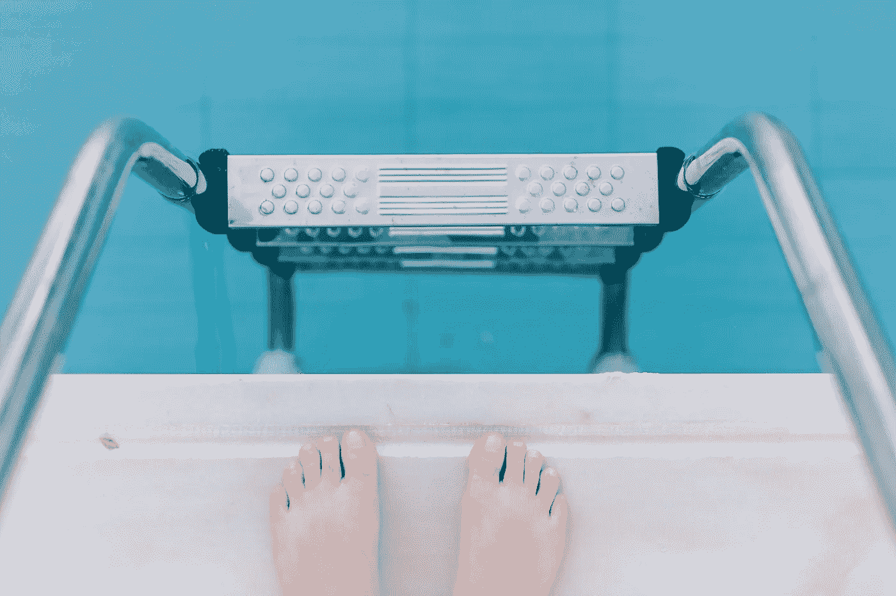

# 当你感到不知所措时，如何开始

> 原文：<https://medium.com/swlh/how-to-get-started-when-you-are-feeling-overwhelmed-32f7b6f424b1>

## 现在要采取的五个步骤

Photo by [Angelo Pantazis](https://unsplash.com/photos/t7sosxqMEFA?utm_source=unsplash&utm_medium=referral&utm_content=creditCopyText) on [Unsplash](https://unsplash.com/search/photos/step-foot?utm_source=unsplash&utm_medium=referral&utm_content=creditCopyText)

经常觉得不知所措。

现在，我正在考虑接下来的两个星期。

我的孩子回到学校。

在这段时间里，会有一系列的活动。

很多返校会议。买学习用品。新的足球和棒球时间表。报名坐公交车。协调拼车。与其他父母的社交互动。

这是生活中最平常的部分。当前的咨询项目与网络活动相平衡。这样我会有稳定的工作流。

还有，写作。建立一个网站，创办一份时事通讯。我以前从来没有做过这样的事，我在黑暗中摸索。

所以，我坐在这里，心跳加速。感觉神经质和多云。感觉被压倒了。

但是我知道我今天会完成一些事情。我将完成这篇文章。我今天就发表。我不会让压倒，嗯，压倒我。

怎么会？

因为当我有这种感觉时，我学会了走几步。穿越的方法。我不会把所有事情都做完。差远了。但是我会进步的。今天，我会控制自己的情绪，取得一些进展。这是我将要做的。

## 1)问自己，是什么思想压倒了我？

这是每个人不同的想法。

通常我压倒一切想法是

> **我没有足够的时间**。

当我试图平衡许多工作任务时，我会有这种想法。同时也腾出时间来建立关系网和展望新的业务。

当我认为我没有足够的时间时，我告诉自己，**我有足够的时间做** ***某事*。我不必事事亲力亲为。但是我今天有时间做一些事情。**

但通常，有一种不同的想法让我不知所措。多到无从下手。这是一个完美主义者的想法。它的想法是

> **我不知道该怎么做，人们会评判结果**。

这就是我现在关于编辑时事通讯的想法。并不是说每周写一封邮件真的要花那么多时间。我不知道我在做什么。所以活动感觉很大。

在这种情况下，我有不同的对话。我告诉自己，**除了我自己，没有人会期待我的简讯是完美的。此外，对我来说，最好的学习方法，变得更好，是完成第一次尝试。**

还有一件事。我知道一开始我永远不会停止害怕。塞思·戈丁几年前有一句名言。他说:

> …正确的问题是，“我如何与恐惧共舞？”

一旦我确定了这个想法，事情就会变得简单一些。不管想法是什么，我可以就此谈一谈。然后，我的思想在正确的地方，我可以继续下一步。

## 2)列一个清单/头脑风暴

我一直这么说，但我认为把所有的事情都写出来非常重要。有时候，在我脑海中感觉巨大的清单实际上很短。有时有很多任务，但它们只占用几分钟时间(比如预约)。

通常，我会在列出清单/清空大脑后计划一整天。我的大脑喜欢计划。我已经谈过我如何计划在这里的一天:

 [## 这就是如何计划一天。

### 在忙碌的日子里消除焦虑和压力

medium.com](/swlh/this-is-how-to-plan-a-day-94dc24135e1f) 

但有时，即使花时间制定一个完整的计划也会让人感到力不从心。或者有时候，我看到我的待办事项清单上有那么多事情，我所能想到的就是，我永远不会做完所有的事情。我被困住了。

## 3)选一样东西——任何东西

在我觉得制定一个完整的时间表很重要的日子里，我制定了以下计划:

> **我打算先做一件事**。

一件事。这就是计划。我会完成它，然后我会解决剩下的。

例如，现在，我要写这个故事。

当我写这篇文章的时候，我正收到大量的电子邮件和短信。每次听到通知，我的心都会跳一下。(是的，我需要把它们关掉。但我不知所措。思考关闭 3 个电子邮件帐户、Slack、text 和 my phone 需要多少时间)。我暂时忽略他们。我需要完成这件事。一切都可以等待。

## 4)设置一个定时器

在我担心“时间不够用”的时候，这是一个很棒的动作。

一旦你选择了一件事情开始，设置一个计时器。

那段时间，你妈妈打电话也没关系。如果是计划外的谈话，甚至你的老板也可以等 20 分钟才收到你的回复。

大多数关于计时器的研究表明，专注时间越短效果越好。流行的[番茄工作法](https://francescocirillo.com/pages/pomodoro-technique)称 25 分钟是专注工作的最佳时间。

所以，承诺 25 分钟。

> 承诺花 25 分钟做一件事。

当你把它分解开来，它看起来并没有那么大。不要担心你清单上的其他事情。你都写下来了。在这一小段时间里，你可以专注于这件事。

## 5)奖励自己

一旦你完成了一件事或度过了一段时间，花点时间。为自己感到骄傲。给自己一个奖励。

我认为强化积极的行为是至关重要的。对你来说，它可以是一杯咖啡。或者 5 分钟的 Instagram(最好也设置一个计时器)。

正如查尔斯·杜希格在他杰出的著作《习惯的力量》中指出的那样，

> 例如，对那些已经成功创造了新的锻炼习惯的人的研究表明，如果他们选择…一个明确的奖励，比如一杯啤酒或一个无罪恶感的电视之夜，他们更有可能坚持锻炼计划。

换句话说，如果你奖励自己的进步，随着时间的推移，你会获得更多的成就。

完成后，我会带我的狗罗西去散步。

Not totally relevant, but this is Rosie. She deserves a walk. Photo by Mariah Ehlert.

## 根据需要重复步骤 1-4

从这里开始，重复这个过程。找出是什么想法让你感到不知所措。然后一次做一件事，持续一小段时间。

有时候，当我做完第一件事后，我可以喘口气来安排剩下的事情。不过这并不重要。

战胜压倒性优势不是一个放之四海而皆准的活动。我们都有不同的触发思维，我们都有不同的事情需要在一天中完成。任何适合你的过程都是正确的。

有了正确的框架和正确的心态，一切皆有可能。

*我每周都会在我的个人通讯中提供关于生产力和焦虑管理的现实、具体的见解，以及新书推荐。***。**

**

## *这篇文章发表在 [The Startup](https://medium.com/swlh) 上，这是 Medium 最大的创业刊物，拥有 358，974+人关注。*

## *在此订阅接收[我们的头条新闻](http://growthsupply.com/the-startup-newsletter/)。*

**