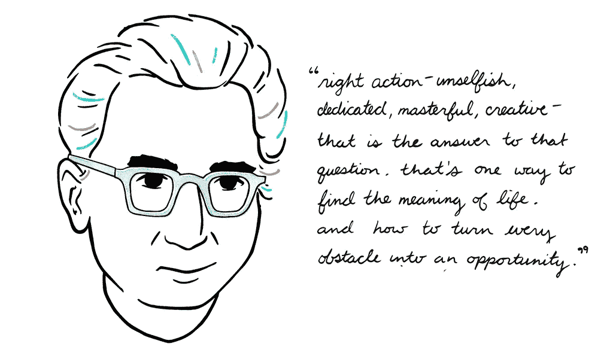

# 如何充分利用每一刻来过充实的生活

> 原文：<https://medium.com/swlh/how-to-get-the-most-from-every-moment-to-live-a-full-life-688b067f92ce>

Photo by [GREG KANTRA](https://unsplash.com/photos/0NJJObGdDuo?utm_source=unsplash&utm_medium=referral&utm_content=creditCopyText) on [Unsplash](https://unsplash.com/?utm_source=unsplash&utm_medium=referral&utm_content=creditCopyText)

> “在死亡之前你真的不需要更多的时间；你需要的是在给你的时间里获得更多深度的经验。”—迈克尔·辛格

诀窍是[让时间感觉缓慢](https://www.amazon.com/Slipstream-Time-Hacking-Enhance-Happiness-ebook/dp/B019MZ6BRO)——这样你就可以充分利用你的生活。

## 如何让时间慢下来并充分利用时间

> “我的问题是，会有多少最好的部分，你会用多少年的时间快进？你的年龄可能很小，但你比你想象的更接近死亡。”— [本杰明·p·哈迪](https://medium.com/u/5153880ce2ee?source=post_page-----688b067f92ce--------------------------------)，博士

你经历你的时刻有多慢？

你的时间有多有意义？

你的一天过得飞快，却不知道时间去了哪里，还是你认为下午 5 点离早上 9 点很遥远？

最近，我亲爱的朋友去纽约出差时来看我。有这个朋友过来是件大事，我真的很期待。

然而，一整天都感觉那么遥远。从一大早到他们到达的时候——我沉浸在我的时刻里，因为我的时间过得很慢。

直到他们到达的那一刻，我才想到他们会来。并不是说我没有计划和准备，尽管从我知道他们要来的那一天到他们晚上 7 点到达的这段经历，感觉好像很遥远——不管怎么说都不是很长的时间，因为这一切都发生在一天之内。

你觉得你的约会有多远？

## 有意义的黑客时间

> "时间的压缩不是复合活动的问题，而是意义的复合."[本杰明·p·哈迪](https://medium.com/u/5153880ce2ee?source=post_page-----688b067f92ce--------------------------------)，博士

你有多“深入”每一刻？

你对时间的消耗有多认真？

这种严肃性是衡量你的生活有多充实的标准——你分配给自己时刻的目的、意义和动力决定了你体验时间的速度有多慢。

这是主观的，在你的控制范围内，所以你可以达到目的。

你是怀着感激和欣赏的心情渴望拥有的每一刻——还是因为无意识而盲目浪费？

一个很好的测试就是你有多期待每天醒来，有多享受独处、独处和思考的时光。

时间慢的人喜欢独处和思考(这并不意味着他们不喜欢相反的情况，你也不应该这样)。

我带着对第二天的渴望和兴奋上床睡觉——不管今天是什么日子，也不管我在做什么——我享受每一天，不浪费每一分钟——品尝每一次呼吸。

因此，我从简单的事情中获得了如此多的价值——并且知道事情带给我的满足感和感受——并且真的不需要太多其他东西来过“充实的生活”或“得到满足”。

对旅程的追求成为充实生活本身的礼物。

你有多喜欢追寻你的旅程？你是优雅地迎接挑战，还是沮丧地面对压力？

在读完维克多·弗兰克尔的传奇性著作《T2:人类对意义的追寻》后，我完全接受了这样一种态度:无论在什么情况下，我们都可以选择让每一刻变得无意义或有意义。

维克多·弗兰克是一名大屠杀幸存者，他生动地讲述了他如何使自己在集中营的时光变得有意义和积极——因为他在任何时刻或情况下的行动和态度。

如果弗兰克尔可以在集中营做到这一点，并寻找好时机——通过决定他将有尊严地行动来赢得胜利，我们就有能力做到这一点，无论我们的环境如何。

弗兰克尔甚至报告说，过了一段时间后，在营地的经历变得不那么糟糕了。显然不是说这不可怕，但他的感知和代理允许他的礼物。

Viktor Frankl by Emily May Rose

# 通过掌握这 4 件(困难的)事情让你的时间慢下来:

## 1.拥抱和主人独自坐着

> "人类所有的问题都源于人类无法独自安静地坐在房间里."—布莱士·帕斯卡

独自坐着而不感到孤独将成为我们这个时代的技能。

它需要理解我们的情绪是如何工作的，以及什么样的需求和感觉来自于我们心中的每一个期望或[目标。](/swlh/if-you-do-these-7-things-youll-be-able-to-achieve-any-goal-you-set-ebe50250647b)

## 2.沉迷于冥想

> "我有这么多事要做，我得祈祷三个小时才能做完。"小马丁·路德·金博士

我只能用上瘾这个词，因为如果这个时代有什么东西让人上瘾的话，那就是冥想和/或祈祷——因为我们对其他任何东西都上瘾。

无论你是[用重复的歌曲带给你宁静，](/the-mission/this-5-minute-daily-habit-will-get-people-to-treat-you-how-you-want-to-be-treated-be5cf1a52828)去散步或跑步，冥想给你一种[深刻的内省敏感性](/the-mission/this-is-the-game-changing-daily-habit-that-separates-the-best-from-the-rest-23870a566aa)。

当你进入它的时候你会感觉到它。

每天做 5 分钟，直到你对每天都做上瘾。

然后每天做 10 分钟，直到你对每天都做上瘾。

然后 15 分钟，累积到一小时。如果你每天做一个小时的冥想，你不太可能无法处理日常压力和反应的陷阱。

## 3.极度爱自己

> “最有资格的人赢了，这是他们应得的。但不要做一个混蛋”——我

[在自己身上投入时间](/the-mission/you-dont-deserve-what-you-want-until-you-make-these-7-investments-in-yourself-841c716a0dcf)。

[给自己投资爱](/the-mission/this-5-minute-daily-habit-will-get-people-to-treat-you-how-you-want-to-be-treated-be5cf1a52828)。

给自己投资奢侈品。

放下罪恶感，永远不再内疚。

罪恶感会滋生恐惧，这是你永远也不想看到的。

当你确实感到内疚和恐惧时，不要抗拒，让它去吧。

## 4.努力在某方面做到最好——无论是工作、娱乐还是运动

> “为了精通一个领域，你必须热爱这个主题，并且有一种近乎宗教的深厚联系”——罗伯特·格林

当[追求一个目标的时候，你过得很慢，](/swlh/if-you-do-these-7-things-youll-be-able-to-achieve-any-goal-you-set-ebe50250647b)你[掌握了](/the-mission/this-is-the-game-changing-daily-habit-that-separates-the-best-from-the-rest-23870a566aa)并且有能力[重写一个领域的规则。](/the-mission/this-is-the-game-changing-daily-habit-that-separates-the-best-from-the-rest-23870a566aa)

[你看到别人看不到的东西](/the-mission/this-is-the-game-changing-daily-habit-that-separates-the-best-from-the-rest-23870a566aa)。

你应用其他角度。

当你走在自己的道路上，看到向顶峰前进时，你会迸发出贪婪的热情，这种状态会不断激发你最大化自己的潜力。

## 结论

充实的生活来自于从中获得最大的收获。

从中获得最大收益不是来自于你做了什么，而是你如何去做。

如果你掌握了“如何”,“什么”会很好地发生，并且会自己发现——而“如何”是免费的，现在就可以实践。

这是充分享受生活的简单方法。

你能做些什么来从你的生活中获得最大的收获？

## [每周一次点击接收我保证是你在互联网其他地方找不到的改变游戏规则的文章。你还会收到我的指导，告诉你如何在你所做的事情上成为世界上最好的。你不会后悔的。](https://betreatedhowyouwanttobetreated.com/optin-main)

## 这个故事发表在 [The Startup](https://medium.com/swlh) 上，这是 Medium 最大的创业刊物，拥有 303，461+人关注。

## 在这里订阅接收[我们的头条新闻](http://growthsupply.com/the-startup-newsletter/)。

