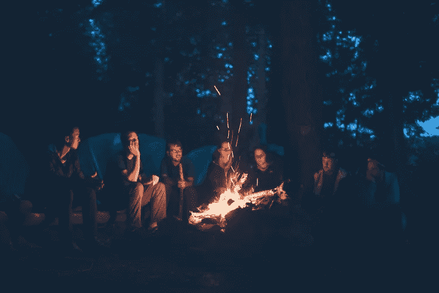

# 如何充分利用脸书或 Linkedin 群组

> 原文：<https://medium.com/swlh/how-to-get-the-most-from-facebook-or-linkedin-groups-effa5b40b06c>

> ***“帮助别人就是我们帮助自己”——奥普拉·温弗瑞***

**当一个新的商业园区在剑桥开张时，园区的管理公司决定举办一个“认识邻居”的联谊活动，让园区的居民看到谁住在他们周围，他们在做什么。活动当晚，除了业务部门之外，似乎有 80%的与会者来自其他地方**