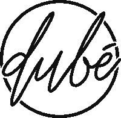

# 如何获得你的 MVP 建立你的突破性创业

> 原文：<https://medium.com/swlh/how-to-get-your-mvp-right-building-your-breakthrough-startup-620fcaa22082>

Photo by [Christopher Burns](https://unsplash.com/photos/8KfCR12oeUM?utm_source=unsplash&utm_medium=referral&utm_content=creditCopyText) on [Unsplash](https://unsplash.com/search/photos/construction?utm_source=unsplash&utm_medium=referral&utm_content=creditCopyText)

人类的思维是不可思议的。我们可以想到任何东西，只要一点点努力，我们就能建造它。名言:

> 想象力是可能性的极限

在我看来这是真的。当然，有些想法真的不可能融入我们的物理世界(想想隔空取物)，或者它们只是需要更多的时间来实现——埃隆·马斯克的 [Neuralink](https://www.neuralink.com/) 实际上正在研究一个大脑接口系统，它与当前现有的无线技术相结合，将使隔空取物成为现实。

这种心态推动了今天的许多创新和业务，尤其是在技术领域。在硅谷、伦敦、柏林或上海等科技中心，我们看到聪明人为了一个目标紧密合作，可以产生巨大的创新和伟大的产品。我们也看到人们对不同职业的看法发生了转变。没有人想再朝九晚五地工作了。企业家是 21 世纪的新摇滚明星(除了社交媒体巨头)。每个人都有自己伟大的想法，都想创业，建立一个伟大的创业公司，然后变得富有。

踏上那段旅程是一个伟大的决定，我认为更多的人应该努力把他们的梦想变成现实。但是从哪里开始呢？MVP 是一个你以前可能听说过的术语。它代表 **M** 最小 **V** 可变 **P** 产品。这意味着你试图把你的想法变成一些有形的东西，这些东西仅仅比什么都没有强，但仍然代表了你的想法的关键方面。

然后用它向全世界发布你的产品，并获得重要的反馈。如果您的初始实现是成功的，您可以继续。如果不是，您可以更改(您可能希望在这两种情况下更改某些方面)或停止执行。过一段时间后，你将拥有一个稳定的产品，希望有一个团队，并扩大你的商业风险。

Photo by [Yoann Siloine](https://unsplash.com/photos/dyaxQ-aoGWY?utm_source=unsplash&utm_medium=referral&utm_content=creditCopyText) on [Unsplash](https://unsplash.com/search/photos/pencil?utm_source=unsplash&utm_medium=referral&utm_content=creditCopyText)

# 80/20

我相信你以前听过这句话。百分之二十的工作产生百分之八十的成果，反之亦然。这被称为帕累托原则，可以应用于生活和商业中的许多其他情况。

为什么这对你的 MVP 很重要？开始一项新业务或开发一个新项目肯定会有风险。你可能会冒着金钱、时间或名誉的风险来制造产品。为了将风险最小化，您希望尽可能地降低工作量，但又不至于损坏您产品。如果你真的考虑你的产品，并仔细检查你的 MVP 的所有特性，你可能会删除那些不重要的特性，或者把它们推迟到以后实现。如果你彻底地做到了这一点，你将会节省大量的时间(同时降低你的风险)，因为这些特性中的大部分都在 80%的工作部分，而这些工作部分只贡献了 20%的产出部分。

# 不在市场上花费的时间等于浪费的时间

另一个尽可能减少你的 MVP 的原因是，你目前对你的想法只有**一个观点**，如果你和其他人一起工作，可能会有几个。你的好主意可能很棒，但是人们会通过你的产品理解你的想法吗？该产品是代表你想法的最佳方式吗？或者另一个功能集可能更好地将其他人与你的想法联系起来？

拥有来自市场的反馈是无价的。也许你在一个封闭的测试组中用原型做了一些早期测试。这会给你一个客户反应的估计，但市场仍然可能有不同的反应，简而言之:你是盲目的。所以请确保你的产品能尽快提供给公众。请记住，产品仍然需要是**可行的**，这意味着它应该是可用的和可理解的。

话虽如此，我想强调这一点，分享我的一些经验。我曾经和一家资金雄厚的初创公司的创始人一起工作过。我们非常兴奋能制造出这种产品，并用我们的产品征服市场。在建立 MVP 一段时间后，创始人决定改变产品的方向，重新评估一些功能。这样的情况发生了 4 到 5 次，差不多一年过去了。在我们最终走向市场后，我们的客户给了我们反馈，说他们更喜欢一个类似于早期迭代的解决方案。早点上市会给你**正确的方向**。

Photo by [Paweł Czerwiński](https://unsplash.com/photos/B_GEOp9u8h8?utm_source=unsplash&utm_medium=referral&utm_content=creditCopyText) on [Unsplash](https://unsplash.com/search/photos/direction?utm_source=unsplash&utm_medium=referral&utm_content=creditCopyText)

# 完美是敌人

完美听起来像是一种令人向往的品质，这在程序员和设计师中非常普遍——设计师显然必须留意任何明显的缺陷。然而在现实中，完美恰恰是你不想要的，最明显的是因为你无论如何也达不到它。你将会花费无数的时间来调整微小的事情，在迭代中来来回回，尝试新的实现，却总是得不到满足。与此同时，竞争对手可能会出现，推出比你想象的“更差”的产品，但如果背后的想法是好的，并且减轻了一些痛苦或满足了一种需求，市场会采纳它。事实上，顾客——尤其是早期采用者——对新产品非常宽容。记住上面的帕累托原则，从 95%到 100%可能会花费你从 0%到 95%的时间。

# 一个好的(技术)MVP 需要什么

我不知道你需要什么来将你的想法转化为产品。这个看你的想法了。为蜜蜂开发一种针对瓦螨的治疗方法肯定与构建人工智能支持的云软件有着不同的要求。然而，就科技产品(软件)而言，你需要考虑 3 个不同的方面。

## 设计/ UX /用户界面

这不是让你的产品如此美丽，以至于张诗钟·伊夫会在广告视频中配音。不，这是定义产品中可能的关键特性和交互所必需的。这一部分也有助于你建立一个清晰的结构，并为你节省时间，以防你需要改变什么。在原型工具中实现更改肯定比在以后的阶段中实现更容易。

## 编程；编排

代码无处不在，运行一切。即使你推出一个基于硬件的产品，你也需要代码来运行你的产品，收集数据或者提供一个配套的应用程序。尽量保持代码库尽可能的精简。节省时间和精力的一个好方法是使用现有的服务，而不是从头开始构建一切。您可以使用[条](https://stripe.com/de)进行支付处理和开具发票。您可以从 AWS 的各种服务中进行选择，例如用于图像中文本识别的 [AWS Rekognition](https://aws.amazon.com/rekognition/?nc1=f_ls) 。您可以使用 Heroku 及其极其简单的设置，而不是高度可扩展的、但更耗时的 AWS 或谷歌云平台解决方案。您可以使用 Sendgrid 实现电子邮件自动化。如果你想让我提供一个更深入的我经常使用的资源列表，请在评论中告诉我。

## 商业

这不一定与你的产品有关，但是你必须确定你想要遵循什么策略来为你的产品赢得吸引力，并且该产品是合法的——参见下面的更多信息。

# 计划会节省你的时间

你会连续四个晚上躺在床上不怎么睡觉，想着刚刚冒出来的那个想法。然后你会和你的朋友交谈，让他们相信这个想法有多棒，有多疯狂，因为从来没有人做过这样的事情——或者以你想象的方式。最后，你决定迈出这一步，将你的想法付诸实践，打造你的 MVP。

你会想要立即开始建设。但是等等。等等？你不想等，你想开始建设！但你必须等待，并计划你将建立什么。这是一个非常重要的步骤，可以让你不至于迷失自己最初的计划，并且明确什么是重要的，什么是不重要的。如果你有一个计划，坚持下去，直到你推出你的 MVP。

Photo by [Harry Sandhu](https://unsplash.com/photos/FpYoDqGGI4A?utm_source=unsplash&utm_medium=referral&utm_content=creditCopyText) on [Unsplash](https://unsplash.com/search/photos/time?utm_source=unsplash&utm_medium=referral&utm_content=creditCopyText)

# 最低可行企业

我不确定这个术语是否存在，但是我猜 MVP 这个术语在过去的某个时候也不存在，所以我要用它。这是你推出你的产品并真正用它做生意所需要的。有些人决定构建一些东西并免费提供，这完全没问题。然而，大多数人确实希望过上企业家梦寐以求的摇滚明星式的生活，并在 Instagram 个人资料中写上“创业创始人”。这里有一些注意事项，将有助于你的方式。

## 自己做这项工作

根据自己的专长，尽量自己做。如果你是一个优秀的营销人员，并且知道如何绘制草图，那么试着自己来构建用户界面。不要试图花 1 年半的时间学习编码，然后建立你的 MVP，到那时市场和你的心态很可能已经改变了。如果由于缺乏专业知识，你自己很难完成足够的工作，那就为你的项目找一个能与你互补的伙伴。自己动手会大大降低你的风险，保持你的自由。你将节省开支，你的企业将存活更长时间，最重要的是，你将**学到更多**，这将为你的企业起飞做好准备。

## 法律结构

建立尽可能精简的法律结构。对于我的第一个更大的项目，一个艺术市场，我自己完成了大部分工作。我刚刚付钱给一个律师，一个会计和当局来建立我的生意。我必须在以个人身份(也是个人责任)创业和创建法人实体之间做出选择。我选择了后者，这涉及到很多费用、与公证人的约会、更多的法律规定以及大量研究的必要性，因为我对这些事情一无所知。相反，我应该选择保持精简，以个人的身份启动 MVP，如果成功的话，以后再将业务转移到公司。直到今天，我还在处理解散公司的事情。

## 资产

关于这个话题有不同的观点。有些人说你不应该投资自己的钱。我认为只有当你已经在生意上取得成功，并且想再创业的时候，这才是真的。在我看来，你应该首先尝试用你的私人资金为你的企业融资。这将防止你不得不与投资者分享决策权，也让你避免欠别人钱的压力，以防你在朋友和家人之间筹集资金。

除了资金，你应该自己做现金流规划，不管是什么。对于你的成功来说，知道钱去了哪里以及你能在财务上维持多久是至关重要的。即使你的事业成功了，你以后也会需要这种技能。

## 法律环境

不(不小心)做非法生意。有必要对竞争对手、法律和可能的法律陷阱进行一些研究。我曾经和我哥一起创业做电商，很顺利，但是只维持了 6 个月左右。因为商标侵权，我们不得不停下来。如果有必要，咨询一下律师你的情况，这里的钱花得值。

# 我们启动你的 MVP / MVB

正如我之前所写的，如果可以的话，最好是自己构建一切。不幸的是，很多人有很好的想法，但缺乏将它们付诸实践的专业知识。我们可以帮助你在极短的时间内建立你的 MVP 或 MVB。我们的核心专长是应用程序(web / mobile / desktop)开发，但我们也知道如何进行在线营销、开发社交媒体和 PPC 活动、构建用户界面或帮助制定战略。只需向我们发送电子邮件至 [hello@dube.io](mailto:hello@dube.io) 或访问我们的 [dube.io](https://dube.io) ，我们很高兴听到您的想法。

*关于作者:Lukas Gisder-Dubé作为首席技术官共同创立并领导了一家初创公司 1 年半，建立了技术团队和架构。离开创业公司后，他在*[*iron hack*](https://medium.com/u/1ff093a3da32?source=post_page-----620fcaa22082--------------------------------)*担任首席讲师教授编码，现在正在柏林建立一家创业机构&咨询公司。查看*[*Dube . io*](https://dube.io)*了解更多。*

## 这篇文章发表在 [The Startup](https://medium.com/swlh) 上，这是 Medium 最大的创业刊物，拥有+396，714 名读者。

## 在这里订阅接收[我们的头条新闻](http://growthsupply.com/the-startup-newsletter/)。

